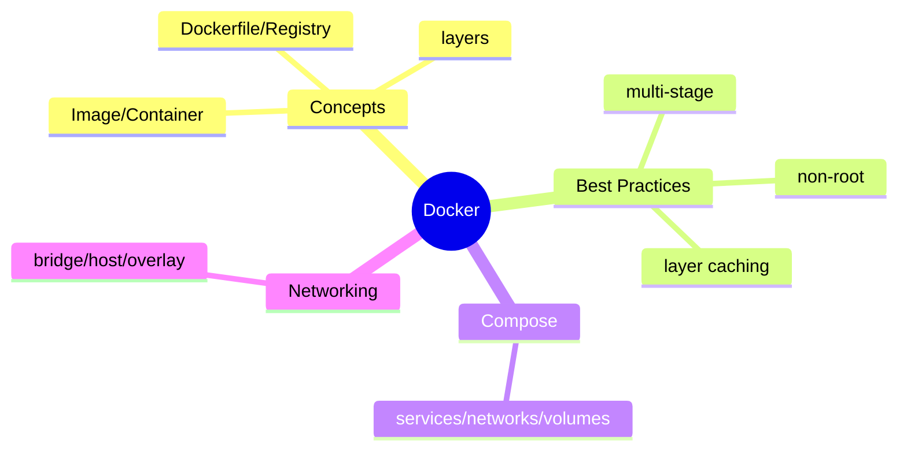
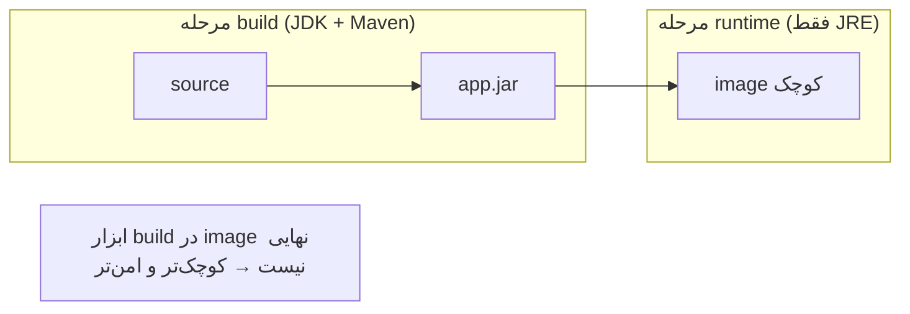

# Docker — Images، Dockerfile، Compose، Networking

> Docker پایه‌ی containerization مدرن است. multi-stage build و best practices برای Java مهم‌اند. این فایل با دیاگرام و مثال‌های متعدد گسترش یافته.

## فهرست
- [نقشه‌ی ذهنی](#نقشه‌ی-ذهنی)
- [📖 مفاهیم](#-مفاهیم)
- [🎯 سوالات مصاحبه](#-سوالات-مصاحبه)
- [⚠️ اشتباهات رایج](#️-اشتباهات-رایج)
- [🔗 ارتباط با سایر مفاهیم](#-ارتباط-با-سایر-مفاهیم)

---

## نقشه‌ی ذهنی



---

## Multi-stage Build



---

## 📖 مفاهیم

### مفاهیم پایه

**توضیح:**

**Image** قالب read-only لایه‌ای. **Container** نمونه‌ی در حال اجرا (process ایزوله با namespace/cgroups). **Dockerfile** دستورالعمل. **Registry** مخزن. container kernel میزبان را share می‌کند (سبک). هر دستور یک layer (cache).

**نکات کلیدی:**

- container kernel را share می‌کند (سبک‌تر از VM).
- layerها cache می‌شوند → ترتیب دستورات مهم.

---

### Dockerfile Best Practices (Java)

**توضیح:**

multi-stage (build جدا از runtime)، non-root user، layer caching (dependency قبل از source)، `.dockerignore`، base کوچک (Alpine/distroless).

**مثال کد:**

```dockerfile
FROM eclipse-temurin:21-jdk-alpine AS builder
WORKDIR /app
COPY pom.xml .
RUN mvn dependency:go-offline   # cache وابستگی (لایه‌ی جدا)
COPY src ./src
RUN mvn package -DskipTests

FROM eclipse-temurin:21-jre-alpine
WORKDIR /app
COPY --from=builder /app/target/*.jar app.jar
RUN addgroup -S app && adduser -S app -G app
USER app
EXPOSE 8080
ENTRYPOINT ["java", "-jar", "app.jar"]
```

**نکات کلیدی:**

- multi-stage → image کوچک.
- copy pom قبل از src برای cache.
- non-root برای امنیت.

---

### Docker Compose & Networking

**توضیح:**

Compose برای چند container (`services`, `networks`, `volumes`). `depends_on` + `healthcheck`. named volume برای persistence. Networking: Bridge (پیش‌فرض)، Host، Overlay. service name به‌عنوان hostname (DNS).

**مثال کد:**

```yaml
services:
  app:
    build: .
    ports: ["8080:8080"]
    depends_on: { db: { condition: service_healthy } }
    environment: { DB_URL: jdbc:postgresql://db:5432/mydb } # db = service name
  db:
    image: postgres:17
    healthcheck: { test: ["CMD-SHELL", "pg_isready -U postgres"], interval: 5s }
    volumes: ["pgdata:/var/lib/postgresql/data"]
volumes:
  pgdata:
```

**نکات کلیدی:**

- service name به‌عنوان hostname.
- healthcheck + depends_on برای ترتیب.
- named volume برای persistence.

---

## 🎯 سوالات مصاحبه

### سوال ۱: multi-stage build چه مزیتی دارد؟

**سطح:** Senior
**تکرار:** زیاد

**جواب کامل:**

چند `FROM`: build (JDK/Maven) و نهایی فقط jar روی base کوچک. مزایا: (۱) image کوچک‌تر (بدون ابزار build). (۲) امنیت (attack surface کمتر). (۳) deploy سریع‌تر. image را از ~۷۰۰MB به ~۲۰۰MB می‌رساند.

**نکته مصاحبه:**

Senior به attack surface اشاره می‌کند. Follow-up: «distroless؟»

---

### سوال ۲: layer caching را چطور بهینه می‌کنی؟

**سطح:** Senior
**تکرار:** زیاد

**جواب کامل:**

هر دستور یک layer (cache)؛ تغییر یک layer → rebuild بعدی‌ها. چیزهای کم‌تغییر را زودتر. برای Java: pom + `mvn dependency:go-offline` اول (فقط با تغییر dependency invalidate)، سپس src. اگر با هم کپی کنید، هر تغییر کد دانلود وابستگی را دوباره اجرا می‌کند.

**نکته مصاحبه:**

Senior ترتیب «کم‌تغییر زودتر» را توضیح می‌دهد.

---

### سوال ۳: container در برابر VM؟

**سطح:** Mid / Senior
**تکرار:** متوسط

**جواب کامل:**

VM kernel/OS کامل مجزا (ایزولاسیون قوی، سنگین). container kernel میزبان را share و فقط process را با namespace/cgroups ایزوله (سبک، startup سریع). trade-off: ایزولاسیون ضعیف‌تر (kernel مشترک)؛ برای multi-tenancy سخت‌گیرانه VM/microVM (Firecracker).

**نکته مصاحبه:**

Senior به kernel مشترک اشاره می‌کند.

---

## ⚠️ اشتباهات رایج

### اشتباه ۱: container روت

```dockerfile
# ❌
ENTRYPOINT ["java", "-jar", "app.jar"]
```

```dockerfile
# ✅
RUN adduser -S app && USER app
```

**توضیح:** روت = خطر escape به host.

---

### اشتباه ۲: کپی همه قبل از build

```dockerfile
# ❌
COPY . . && RUN mvn package
```

```dockerfile
# ✅
COPY pom.xml . && RUN mvn dependency:go-offline
COPY src ./src && RUN mvn package
```

**توضیح:** cache وابستگی با ترتیب درست حفظ می‌شود.

---

### اشتباه ۳: image بزرگ

```dockerfile
# ❌
FROM maven:3-eclipse-temurin-21
```

```dockerfile
# ✅ multi-stage با JRE
```

**توضیح:** image بزرگ = pull کند و attack surface زیاد.

---

## 🔗 ارتباط با سایر مفاهیم

- پایه‌ی **Kubernetes (10.2)** و **CI/CD (10.3)**.
- non-root/scanning با **DevSecOps (16.5)**.
- jlink با **Java Modules (1.3)**.
- Compose با **Testcontainers (12.5)**.
