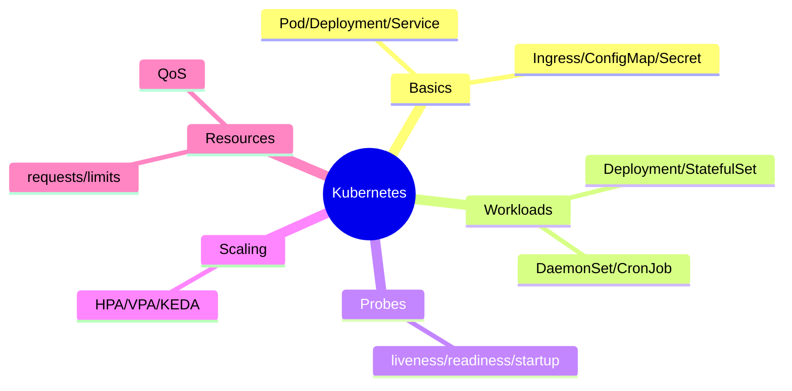
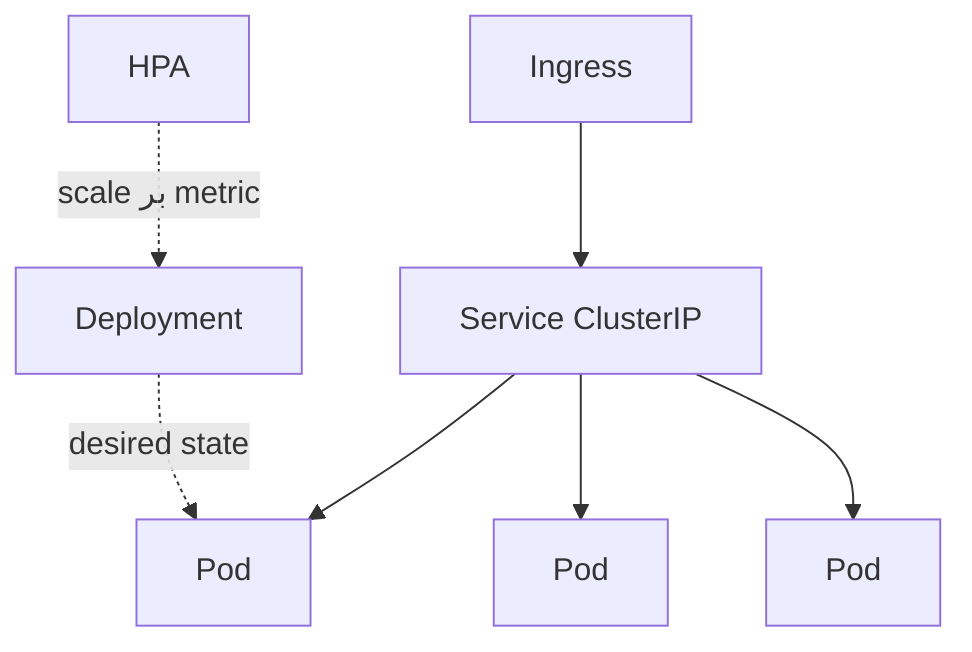
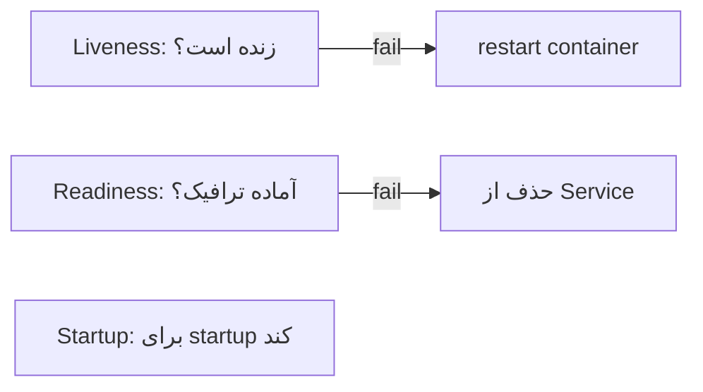

# Kubernetes — Pod، Deployment، Service، Scaling، Health Checks

> Kubernetes استاندارد orchestration است. probes، scaling و resource management موضوعات کلیدی Senior/Lead هستند. این فایل با دیاگرام و مثال‌های متعدد گسترش یافته.

## فهرست
- [نقشه‌ی ذهنی](#نقشه‌ی-ذهنی)
- [📖 مفاهیم](#-مفاهیم)
- [🎯 سوالات مصاحبه](#-سوالات-مصاحبه)
- [⚠️ اشتباهات رایج](#️-اشتباهات-رایج)
- [🔗 ارتباط با سایر مفاهیم](#-ارتباط-با-سایر-مفاهیم)

---

## نقشه‌ی ذهنی



---

## معماری



---

## 📖 مفاهیم

### مفاهیم پایه

**توضیح:**

**Pod** (کوچک‌ترین واحد)، **Deployment** (desired state، rolling update، stateless)، **Service** (آدرس پایدار: ClusterIP/NodePort/LoadBalancer)، **Ingress** (L7، SSL)، **ConfigMap/Secret**، **Namespace**، **Control Plane** (API Server، etcd، Scheduler، Controller Manager). declarative: state مطلوب، K8s reconcile.

**نکات کلیدی:**

- Deployment برای stateless، StatefulSet برای stateful.
- Service آدرس پایدار روی podهای متغیر.

---

### Workloads

**توضیح:**

Deployment (stateless)، StatefulSet (DB/Kafka، هویت/storage پایدار)، DaemonSet (هر node)، Job/CronJob، ReplicaSet.

**نکات کلیدی:**

- DB با StatefulSet نه Deployment.
- CronJob برای کارهای دوره‌ای.

---

### Health Checks (Probes)

**توضیح:**



**liveness نباید به DB وابسته باشد** (قطع DB → restart مکرر)؛ readiness می‌تواند.

**مثال کد:**

```yaml
livenessProbe:
  httpGet: { path: /actuator/health/liveness, port: 8080 }
  initialDelaySeconds: 30
readinessProbe:
  httpGet: { path: /actuator/health/readiness, port: 8080 }
```

**نکات کلیدی:**

- liveness = restart، readiness = حذف از ترافیک.
- liveness را به DB وابسته نکنید.

---

### Scaling

**توضیح:**

**HPA** (CPU/Memory/custom metric)، **VPA** (منابع pod)، **KEDA** (event-driven، Kafka lag، scale to zero).

**نکات کلیدی:**

- HPA به metrics server و resource request نیاز دارد.
- KEDA برای scale بر event (lag) بهتر از CPU.

---

### Resource Management

**توضیح:**

`requests` (تضمین، scheduling)، `limits` (سقف). QoS: Guaranteed/Burstable/BestEffort. memory > limit → **OOMKilled**. JVM باید container-aware باشد (`-XX:MaxRAMPercentage`).

**مثال کد:**

```yaml
resources:
  requests: { memory: "256Mi", cpu: "250m" }
  limits: { memory: "512Mi", cpu: "500m" }
```

**نکات کلیدی:**

- بدون request، scheduling/HPA کار نمی‌کند.
- memory limit کم → OOMKilled.
- JVM باید container-aware باشد.

---

## 🎯 سوالات مصاحبه

### سوال ۱: تفاوت liveness و readiness probe؟

**سطح:** Senior / Lead
**تکرار:** خیلی زیاد

**جواب کامل:**

**liveness**: «باید restart شود؟» — fail → kill/restart (deadlock). **readiness**: «آماده‌ی ترافیک؟» — fail → حذف از Service (بدون restart؛ warmup یا وابستگی موقت). تله: liveness را به DB وابسته نکنید — قطع DB → همه restart → طوفان. وابستگی‌ها را در readiness.

**نکته مصاحبه:**

Lead به تله‌ی DB در liveness اشاره می‌کند.

---

### سوال ۲: requests در برابر limits؟

**سطح:** Senior / Lead
**تکرار:** زیاد

**جواب کامل:**

`requests` تضمین‌شده (scheduling). `limits` سقف. CPU > limit → throttling؛ memory > limit → OOMKilled. QoS: request=limit → Guaranteed. limit کم → OOMKill؛ request زیاد → هدر. JVM باید container limit را respect کند (`-XX:MaxRAMPercentage=75`).

**نکته مصاحبه:**

Lead به QoS، OOMKill، JVM container-awareness اشاره می‌کند.

---

### سوال ۳: rolling update و rollback؟

**سطح:** Senior
**تکرار:** متوسط

**جواب کامل:**

Deployment تدریجی podها را جایگزین می‌کند (`maxSurge`/`maxUnavailable`) با downtime صفر؛ قبل از routing، readiness چک می‌شود. اگر نسخه‌ی جدید fail کند، rollout متوقف. rollback با `kubectl rollout undo`. برای امن‌تر، canary/blue-green با Argo Rollouts.

**نکته مصاحبه:**

Senior به نقش readiness و `rollout undo` اشاره می‌کند.

---

### سوال ۴: HPA چطور کار می‌کند و KEDA چه اضافه می‌کند؟

**سطح:** Lead
**تکرار:** متوسط

**جواب کامل:**

HPA metric (CPU/Memory) را با target مقایسه و replica را تنظیم می‌کند (نیاز metrics server + request). محدودیت: CPU همیشه معیار خوبی نیست (consumer با lag، CPU پایین). **KEDA** scale بر event source (Kafka lag، queue) و **scale to zero**.

**نکته مصاحبه:**

Lead محدودیت CPU-based و مزیت KEDA را می‌داند.

---

## ⚠️ اشتباهات رایج

### اشتباه ۱: liveness وابسته به DB

```yaml
# ❌ قطع DB → restart همه
livenessProbe: { httpGet: { path: /health-with-db } }
```

```yaml
# ✅
livenessProbe: { httpGet: { path: /actuator/health/liveness } }
```

**توضیح:** وابسته کردن liveness به DB طوفان restart می‌سازد.

---

### اشتباه ۲: بدون resource requests

```yaml
# ❌
containers: [{ name: app }]
```

```yaml
# ✅
resources: { requests: { cpu: 250m, memory: 256Mi } }
```

**توضیح:** بدون request، scheduler/HPA معیار ندارند.

---

### اشتباه ۳: JVM بدون container-awareness

```text
❌ heap بزرگ‌تر از limit → OOMKilled
✅ -XX:MaxRAMPercentage=75
```

**توضیح:** JVM قدیمی container limit را نمی‌دید.

---

### اشتباه ۴: DB با Deployment

```text
❌ Deployment برای DB → هویت/storage ناپایدار
✅ StatefulSet با PersistentVolume
```

**توضیح:** stateful به هویت/storage پایدار نیاز دارد.

---

## 🔗 ارتباط با سایر مفاهیم

- probes با **Spring Boot Actuator (2.2)**.
- HPA/scaling با **System Design (6.2)** و **Kafka lag (8.1)**.
- Secret با **Vault/External Secrets (16.5)**.
- StatefulSet با **PostgreSQL/Kafka**.
- resource management با **JVM tuning (12.6)**.
