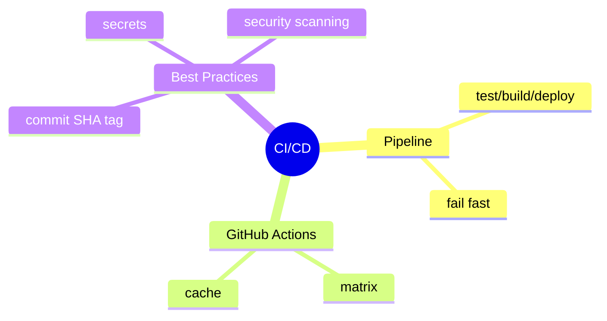
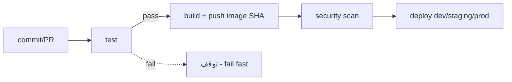

# CI/CD — GitLab CI، GitHub Actions، Pipeline Best Practices

> اتوماسیون build/test/deploy. درک pipeline و امنیت در آن برای Senior لازم است. این فایل با دیاگرام گسترش یافته.

## فهرست
- [نقشه‌ی ذهنی](#نقشه‌ی-ذهنی)
- [📖 مفاهیم](#-مفاهیم)
- [🎯 سوالات مصاحبه](#-سوالات-مصاحبه)
- [⚠️ اشتباهات رایج](#️-اشتباهات-رایج)
- [🔗 ارتباط با سایر مفاهیم](#-ارتباط-با-سایر-مفاهیم)

---

## نقشه‌ی ذهنی



---

## جریان Pipeline



---

## 📖 مفاهیم

### مفاهیم CI/CD

**توضیح:**

CI: ادغام مکرر + build/test خودکار. CD: آماده‌سازی/استقرار خودکار. pipeline دنباله‌ی stage. ابزار: GitLab CI، GitHub Actions، Jenkins.

**مثال کد:**

```yaml
# GitLab CI
stages: [test, build, deploy]
test: { stage: test, script: [mvn test] }
build:
  stage: build
  script:
    - docker build -t myapp:$CI_COMMIT_SHA .
    - docker push myapp:$CI_COMMIT_SHA
deploy:
  stage: deploy
  script: [kubectl set image deployment/myapp app=myapp:$CI_COMMIT_SHA]
  only: [main]
```

**نکات کلیدی:**

- از commit SHA (نه `latest`) برای tag.
- اسرار در CI variables.

---

### GitHub Actions

**توضیح:**

workflow با event (`push`, `pull_request`, ...). Jobs، Steps، Actions. **matrix** برای تست موازی.

**مثال کد:**

```yaml
name: CI
on: [push, pull_request]
jobs:
  test:
    runs-on: ubuntu-latest
    strategy: { matrix: { java: [17, 21] } }
    steps:
      - uses: actions/checkout@v4
      - uses: actions/setup-java@v4
        with: { java-version: '${{ matrix.java }}', distribution: temurin, cache: maven }
      - run: mvn verify
```

**نکات کلیدی:**

- matrix برای چند نسخه/OS.
- cache dependency برای سرعت.

---

### Pipeline Best Practices

**توضیح:**

fail fast، cache (`~/.m2`)، parallel jobs، environment-specific، rollback، security scanning (SAST/DAST/dependency/container).

**نکات کلیدی:**

- fail fast و cache برای feedback سریع.
- security scanning (shift-left).

---

## 🎯 سوالات مصاحبه

### سوال ۱: چرا commit SHA به‌جای `latest`؟

**سطح:** Senior
**تکرار:** متوسط

**جواب کامل:**

`latest` متغیر/مبهم: نمی‌دانید کدام کد، rollback سخت، race در push، و K8s ممکن re-pull نکند (نسخه‌ی قدیمی). با SHA هر deploy قابل‌ردیابی، rollback = deploy SHA قبلی. best practice: SHA/version + `imagePullPolicy: IfNotPresent`.

**نکته مصاحبه:**

Senior به traceability، rollback، cache K8s اشاره می‌کند.

---

### سوال ۲: اسرار را در CI/CD چطور امن نگه می‌داری؟

**سطح:** Senior / Lead
**تکرار:** متوسط

**جواب کامل:**

secret store ابزار (GitLab variables masked/protected، GitHub Secrets). masked (در لاگ نه)، protected (branch محافظت‌شده)، حداقل دسترسی. برای production بهتر CI به Vault با short-lived token. خطرات: echo در لاگ، PR از fork، artifact. scanning برای جلوگیری از commit.

**نکته مصاحبه:**

Lead به masked/protected، Vault، PR از fork اشاره می‌کند.

---

### سوال ۳: انواع security scanning؟

**سطح:** Senior
**تکرار:** متوسط

**جواب کامل:**

**SAST** (source، SonarQube)، **DAST** (runtime، OWASP ZAP)، **SCA/Dependency** (CVE، Snyk، Dependabot)، **Container** (Trivy، Grype)، **SBOM** (CycloneDX). shift-left: زود در pipeline؛ fail بر HIGH/CRITICAL.

**نکته مصاحبه:**

Senior انواع را تفکیک و shift-left را می‌فهمد.

---

## ⚠️ اشتباهات رایج

### اشتباه ۱: `latest` tag

```yaml
# ❌
docker build -t myapp:latest .
```

```yaml
# ✅
docker build -t myapp:$CI_COMMIT_SHA .
```

**توضیح:** `latest` traceability/rollback را خراب می‌کند.

---

### اشتباه ۲: secret در لاگ

```yaml
# ❌
script: echo "deploying with $API_KEY"
```

```yaml
# ✅ masked، بدون echo
```

**توضیح:** echo کردن secret آن را در لاگ فاش می‌کند.

---

### اشتباه ۳: بدون cache

```yaml
# ❌ هر build دانلود مجدد
```

```yaml
# ✅
cache: { paths: [.m2/repository] }
```

**توضیح:** cache نکردن feedback را کند می‌کند.

---

## 🔗 ارتباط با سایر مفاهیم

- با **Docker (10.1)** و **Kubernetes (10.2)**.
- security scanning با **DevSecOps (16.5)**.
- GitOps با **ArgoCD (16.3)**.
- testing با **Testing (12.5)**.
