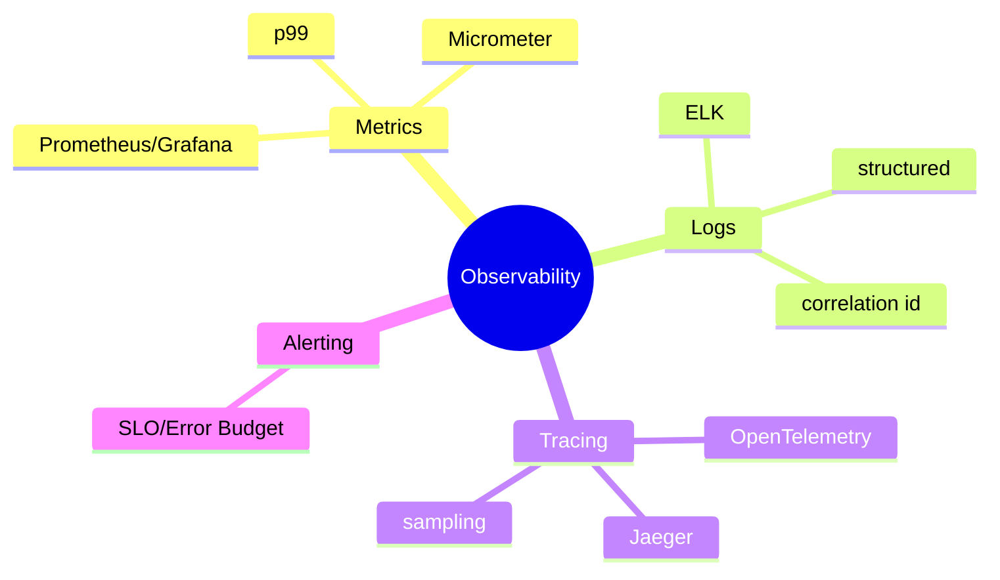
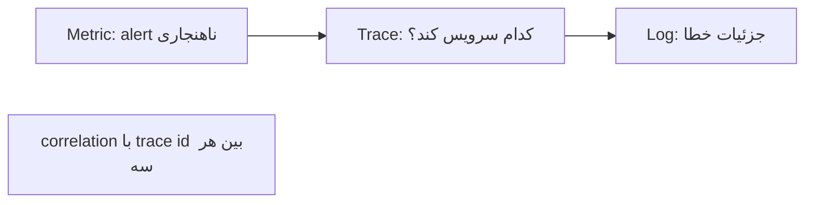

# Monitoring & Observability — Metrics، Logs، Tracing

> سه ستون observability پایه‌ی عملیات production است. SLO و correlation در سطح Lead پرسیده می‌شوند. این فایل با دیاگرام گسترش یافته.

## فهرست
- [نقشه‌ی ذهنی](#نقشه‌ی-ذهنی)
- [📖 مفاهیم](#-مفاهیم)
- [🎯 سوالات مصاحبه](#-سوالات-مصاحبه)
- [⚠️ اشتباهات رایج](#️-اشتباهات-رایج)
- [🔗 ارتباط با سایر مفاهیم](#-ارتباط-با-سایر-مفاهیم)

---

## نقشه‌ی ذهنی



---

## سه ستون و جریان کار



---

## 📖 مفاهیم

### Three Pillars

**توضیح:**

**Metrics** (اعداد در زمان)، **Logs** (رویداد گسسته)، **Traces** (مسیر request). monitoring «سالم است؟» (known-unknowns)؛ observability «چرا؟» (unknown-unknowns).

**نکات کلیدی:**

- metrics برای alerting/trend، logs برای جزئیات، traces برای latency.
- correlation با trace id قدرت واقعی.

---

### Metrics (Prometheus + Grafana)

**توضیح:**

Prometheus pull-based (`/actuator/prometheus`). types: Counter، Gauge، Histogram (percentile)، Summary. PromQL. Grafana dashboard/alert. Micrometer facade. مهم‌ترین: latency (p50/p95/p99 نه میانگین)، error rate، throughput، saturation (USE).

**مثال کد:**

```promql
rate(http_server_requests_seconds_count{status=~"5.."}[5m])
  / rate(http_server_requests_seconds_count[5m])
histogram_quantile(0.99, rate(http_server_requests_seconds_bucket[5m]))
```

**نکات کلیدی:**

- percentile (p99) به‌جای میانگین.
- Histogram برای percentile سمت سرور.

---

### Logs (ELK)

**توضیح:**

Elasticsearch + Logstash + Kibana. Filebeat/Fluent Bit. **Structured logging** (JSON). **Correlation/Trace ID** در هر log.

**نکات کلیدی:**

- structured (JSON) نه متن آزاد.
- trace id برای correlation.

---

### Tracing (Distributed)

**توضیح:**

**OpenTelemetry** استاندارد واحد. **Jaeger/Zipkin** backend. **Micrometer Tracing** (Boot 3+). **Sampling** (۱-۱۰٪).

**نکات کلیدی:**

- OTel vendor-neutral.
- sampling برای overhead.

---

## 🎯 سوالات مصاحبه

### سوال ۱: سه ستون observability و کِی کدام؟

**سطح:** Senior / Lead
**تکرار:** زیاد

**جواب کامل:**

Metrics اعداد تجمعی (ارزان، alerting/trend، اما بدون جزئیات). Logs رویداد با جزئیات (فهمیدن «چه شد»، اما حجیم). Traces مسیر request با زمان هر مرحله (گلوگاه latency). جریان: metric (alert) → trace (کدام سرویس) → log (جزئیات). correlation با trace id.

**نکته مصاحبه:**

Lead جریان «metric → trace → log» را می‌داند.

---

### سوال ۲: چرا p99 به‌جای میانگین؟

**سطح:** Senior / Lead
**تکرار:** زیاد

**جواب کامل:**

میانگین tail latency را پنهان می‌کند (۹۹٪ ۱۰ms، ۱٪ ۵s → میانگین خوب اما ۱٪ تجربه‌ی بد). p99 «بدترین تجربه‌ی ۹۹٪». در fan-out، tail amplification → p99/p99.9 حیاتی. Histogram برای percentile سمت سرور.

**نکته مصاحبه:**

Lead به tail amplification اشاره می‌کند.

---

### سوال ۳: SLI/SLO/Error Budget؟

**سطح:** Lead
**تکرار:** زیاد

**جواب کامل:**

SLI (معیار، مثل درصد request زیر ۲۰۰ms). SLO (هدف، «۹۹.۹٪»). Error Budget = ۱۰۰٪ − SLO (۰.۱٪ ≈ ۴۳ دقیقه/ماه). تا budget باقی است feature deploy؛ تمام شد → تمرکز reliability. burn rate alert.

**نکته مصاحبه:**

Lead به error budget در تصمیم feature/reliability اشاره می‌کند.

---

### سوال ۴: alert fatigue را چطور کم می‌کنی؟

**سطح:** Lead
**تکرار:** متوسط

**جواب کامل:**

(۱) alert بر **symptom** (تجربه‌ی کاربر) نه **cause** (CPU). (۲) SLO-based با burn rate. (۳) severity و فقط page actionable. (۴) حذف flaky/noisy. (۵) گروه‌بندی/dedup. هر alert باید actionable باشد.

**نکته مصاحبه:**

Lead «alert on symptoms not causes» را می‌داند.

---

## ⚠️ اشتباهات رایج

### اشتباه ۱: alert بر میانگین

```text
❌ avg latency → tail پنهان
✅ p99 و error rate
```

**توضیح:** میانگین مشکل tail را پنهان می‌کند.

---

### اشتباه ۲: log بدون correlation id

```text
❌ logهای پراکنده
✅ trace id در هر log (MDC)
```

**توضیح:** بدون correlation، دیباگ توزیع‌شده غیرممکن.

---

### اشتباه ۳: sampling 100% در production

```text
❌ overhead/storage بالا
✅ sampling 1-10%
```

**توضیح:** trace همه گران است.

---

### اشتباه ۴: DEBUG در production

```text
❌ حجم لاگ عظیم، نشت اطلاعات
✅ INFO؛ DEBUG موقت
```

**توضیح:** DEBUG دائمی حجم/هزینه را منفجر می‌کند.

---

## 🔗 ارتباط با سایر مفاهیم

- metrics با **Actuator/Micrometer (2.2)** و **K8s HPA (10.2)**.
- tracing با **Micrometer Tracing (2.6)** و **OpenTelemetry (16.4)**.
- SLO با **System Design availability (6.2)**.
- correlation id با **distributed tracing (19.3)** و **Scoped Values (1.6)**.
