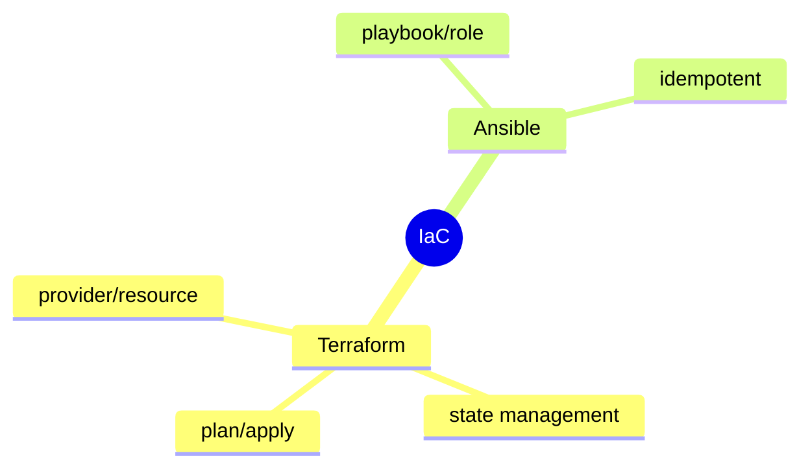
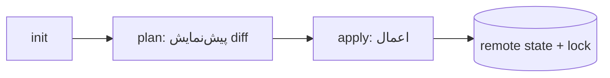

# Infrastructure as Code — Terraform، Ansible

> IaC زیرساخت را به کد تبدیل می‌کند: قابل‌بازتولید، نسخه‌دار، و قابل‌بازبینی. این فایل با دیاگرام گسترش یافته.

## فهرست
- [نقشه‌ی ذهنی](#نقشه‌ی-ذهنی)
- [📖 مفاهیم](#-مفاهیم)
- [🎯 سوالات مصاحبه](#-سوالات-مصاحبه)
- [⚠️ اشتباهات رایج](#️-اشتباهات-رایج)
- [🔗 ارتباط با سایر مفاهیم](#-ارتباط-با-سایر-مفاهیم)

---

## نقشه‌ی ذهنی



---

## جریان Terraform



---

## 📖 مفاهیم

### Terraform

**توضیح:**

declarative (HCL): state مطلوب را می‌نویسید، Terraform diff را اعمال می‌کند. `provider`, `resource`, `variable`, `output`, `module`. **State**: باید remote (S3) با locking (DynamoDB) باشد. `plan`/`apply`/`destroy`.

**مثال کد:**

```hcl
terraform {
  backend "s3" { bucket = "my-tf-state", key = "prod/terraform.tfstate", region = "eu-west-1" }
}
resource "aws_db_instance" "postgres" {
  engine = "postgres"; engine_version = "17"; instance_class = "db.t3.medium"; multi_az = true
}
```

**نکات کلیدی:**

- state را remote + locked نگه دارید.
- همیشه `plan` قبل از `apply`.
- secret را در state نگذارید (رمزنگاری).

---

### Ansible

**توضیح:**

configuration management با Playbook (YAML)، Roles، Inventory. **idempotent**: اجرای مکرر همان نتیجه. Terraform برای provisioning، Ansible برای configuration (مکمل).

**نکات کلیدی:**

- idempotency کلید Ansible.
- Terraform provisioning، Ansible configuration.

---

## 🎯 سوالات مصاحبه

### سوال ۱: چرا state management مهم است؟

**سطح:** Senior / Lead
**تکرار:** متوسط

**جواب کامل:**

Terraform برای diff به state نیاز دارد. مشکلات محلی: (۱) apply همزمان → corruption → **locking** (DynamoDB). (۲) share نمی‌شود → **remote state** (S3). (۳) **secret** در state → رمزنگاری و دسترسی محدود. (۴) **drift** (تغییر دستی) → با `plan` تشخیص. مدیریت state حیاتی‌ترین جنبه است.

**نکته مصاحبه:**

Lead به locking، secret، drift اشاره می‌کند.

---

### سوال ۲: idempotency در IaC؟

**سطح:** Senior
**تکرار:** متوسط

**جواب کامل:**

اجرای مکرر همان نتیجه؛ اگر وضعیت مطلوب برقرار است، تغییری اعمال نمی‌شود. در Ansible، «مطمئن شو package نصب است» — اگر هست کاری نمی‌کند. می‌توان بارها امن اجرا کرد (convergence). برخلاف اسکریپت imperative (bash که دوم بار error می‌دهد).

**نکته مصاحبه:**

Senior تفاوت declarative idempotent با imperative را می‌فهمد.

---

## ⚠️ اشتباهات رایج

### اشتباه ۱: state محلی بدون locking

```text
❌ corruption و تداخل
✅ remote state + locking
```

**توضیح:** apply همزمان روی state محلی خطرناک است.

---

### اشتباه ۲: secret در کد/state

```hcl
# ❌
password = "myProdPassword"
```

```hcl
# ✅
password = var.db_password  # از Vault/env
```

**توضیح:** state ممکن secret داشته باشد.

---

### اشتباه ۳: تغییر دستی (drift)

```text
❌ تغییر در console → drift
✅ همه از طریق Terraform
```

**توضیح:** drift state را با واقعیت ناسازگار می‌کند.

---

## 🔗 ارتباط با سایر مفاهیم

- IaC با **12-Factor (15.3)** (dev/prod parity).
- Terraform با **Kubernetes** و cloud provisioning.
- secret در state با **Vault (16.5)**.
- GitOps با **ArgoCD (16.3)**.
