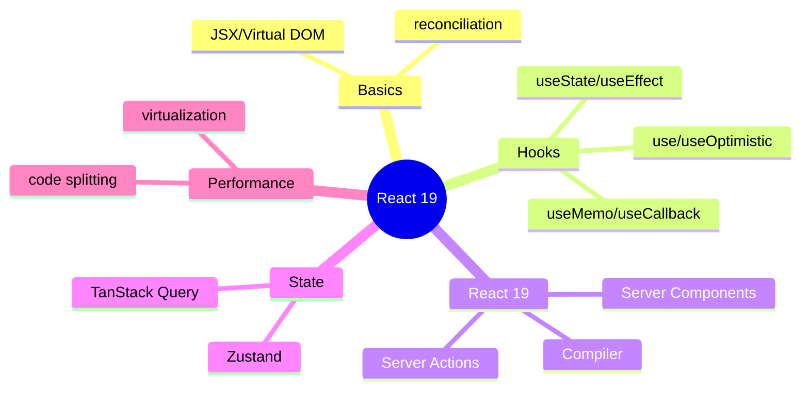
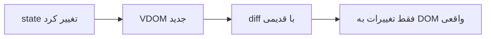

# React 19 — Hooks، Server Components، State Management، Performance

> برای نقش‌های full-stack، درک React مدرن لازم است. Hooks و React 19 features موضوعات کلیدی‌اند. این فایل با دیاگرام و مثال‌های بیشتر گسترش یافته.

## فهرست
- [نقشه‌ی ذهنی](#نقشه‌ی-ذهنی)
- [📖 مفاهیم](#-مفاهیم)
- [🎯 سوالات مصاحبه](#-سوالات-مصاحبه)
- [⚠️ اشتباهات رایج](#️-اشتباهات-رایج)
- [🔗 ارتباط با سایر مفاهیم](#-ارتباط-با-سایر-مفاهیم)

---

## نقشه‌ی ذهنی



---

## 📖 مفاهیم

### مبانی — JSX، Virtual DOM، Components

**توضیح:**

**JSX** سینتکس شبیه HTML در JS. **Virtual DOM** نمایش in-memory؛ تغییرات با **reconciliation** (diff) محاسبه و فقط بخش‌های تغییریافته به DOM واقعی اعمال می‌شوند. **Functional Components** + Hooks استاندارد. **Props** immutable؛ **State** با `useState`.



**نکات کلیدی:**

- functional + hooks استاندارد.
- props را تغییر ندهید؛ state با setter.

---

### Hooks

**توضیح:**

پایه: `useState`, `useEffect`, `useContext`, `useRef`, `useReducer`. Performance: `useMemo`, `useCallback` (با React Compiler کمتر). جدید (18/19): `useTransition`, `useDeferredValue`, `useId`, `use()`, `useOptimistic`, `useFormStatus`. قوانین: فقط سطح بالا، فقط functional component.

**مثال کد:**

```jsx
function UserProfile({ userId }) {
  const [user, setUser] = useState(null);
  useEffect(() => {
    let cancelled = false;
    fetchUser(userId).then(u => { if (!cancelled) setUser(u); });
    return () => { cancelled = true; }; // cleanup برای جلوگیری از race
  }, [userId]);
  return user ? <div>{user.name}</div> : <Loading />;
}
```

**نکات کلیدی:**

- dependency array را درست بدهید.
- cleanup برای جلوگیری از leak/race.
- Hooks فقط سطح بالا.

---

### React 19 Features

**توضیح:**

- **React Compiler:** auto-memoization (بدون `useMemo`/`useCallback` دستی).
- **Server Components (RSC):** render روی server، بدون JS به client.
- **Server Actions:** تابع server از client.
- **Actions API**, **Document Metadata**.

**نکات کلیدی:**

- Compiler memoization دستی را کم می‌کند.
- RSC حجم JS client را کاهش می‌دهد.

---

### State Management

**توضیح:**

Local (`useState`/`useReducer`)، Shared (Context — برای پرتغییر re-render زیاد)، Global (**Zustand**, Redux Toolkit, Jotai)، **Server State (TanStack Query)** — جدا از client state.

**نکات کلیدی:**

- Context برای state کم‌تغییر.
- server state با TanStack Query نه Redux.

---

### Performance

**توضیح:**

Code Splitting (`lazy`+`Suspense`)، `React.memo`، Virtualization (`react-window`)، Profiler.

**نکات کلیدی:**

- virtualization برای لیست بزرگ.
- با Compiler memoization دستی کمتر.

---

## 🎯 سوالات مصاحبه

### سوال ۱: Virtual DOM و reconciliation؟

**سطح:** Senior
**تکرار:** زیاد

**جواب کامل:**

VDOM نمایش سبک in-memory. هنگام تغییر state، VDOM جدید با قبلی **diff** می‌شود و فقط تفاوت‌ها به DOM واقعی اعمال می‌شوند. heuristic: type متفاوت → جایگزین کامل؛ لیست با **key** تشخیص جابه‌جایی. key درست (یکتا/پایدار، نه index) برای performance و درستی حیاتی.

**نکته مصاحبه:**

Senior به key (نه index) اشاره می‌کند.

---

### سوال ۲: مشکلات رایج `useEffect`؟

**سطح:** Senior
**تکرار:** زیاد

**جواب کامل:**

(۱) dependency اشتباه → stale closure یا loop. (۲) infinite loop (set state که dependency است). (۳) race condition (دو fetch) → cleanup/AbortController. (۴) memory leak (subscription بدون cleanup). (۵) استفاده‌ی بیش از حد. مدرن: fetch با TanStack Query.

**نکته مصاحبه:**

Senior به race و cleanup اشاره می‌کند.

---

### سوال ۳: client state در برابر server state؟

**سطح:** Senior
**تکرار:** متوسط

**جواب کامل:**

client state فقط مرورگر (UI). server state source of truth سرور (نیاز fetch/cache/sync/invalidate). اشتباه: server state با Redux. ابزار مخصوص: **TanStack Query** (caching، refetch، stale-while-revalidate، dedup، optimistic). client با useState/Zustand، server با TanStack Query.

**نکته مصاحبه:**

Senior جداسازی و ابزار درست را می‌داند.

---

### سوال ۴: React Server Components چه مزیتی؟

**سطح:** Senior / Lead
**تکرار:** متوسط

**جواب کامل:**

RSC روی server render و **هیچ JS به client** نمی‌فرستند (برخلاف SSR که hydrate می‌کند). مزایا: bundle کوچک‌تر، دسترسی مستقیم به server (DB)، initial load بهتر. RSC نمی‌توانند state/event داشته باشند؛ برای آن Client Components (`'use client'`). ترکیب RSC + Client بهینه. پایه‌ی App Router.

**نکته مصاحبه:**

Senior تفاوت RSC با SSR (no JS در برابر hydration) را می‌داند.

---

## ⚠️ اشتباهات رایج

### اشتباه ۱: index به‌عنوان key

```jsx
// ❌
{items.map((item, i) => <Item key={i} />)}
```

```jsx
// ✅
{items.map(item => <Item key={item.id} />)}
```

**توضیح:** index با تغییر ترتیب reconciliation را خراب می‌کند.

---

### اشتباه ۲: dependency array اشتباه

```jsx
// ❌
useEffect(() => { doSomething(value); }, []);
```

```jsx
// ✅
useEffect(() => { doSomething(value); }, [value]);
```

**توضیح:** dependency جاافتاده = مقدار قدیمی.

---

### اشتباه ۳: server state در Redux

```jsx
// ❌ مدیریت دستی fetch/cache
```

```jsx
// ✅
const { data } = useQuery({ queryKey: ['users'], queryFn: fetchUsers });
```

**توضیح:** server state ابزار مخصوص می‌خواهد.

---

## 🔗 ارتباط با سایر مفاهیم

- React با **Next.js (11.2)**.
- state با **TypeScript (18.1)** و **State Management (18.2)**.
- performance با **Web Vitals (18.3)**.
- Server Actions با **API design** و backend.
