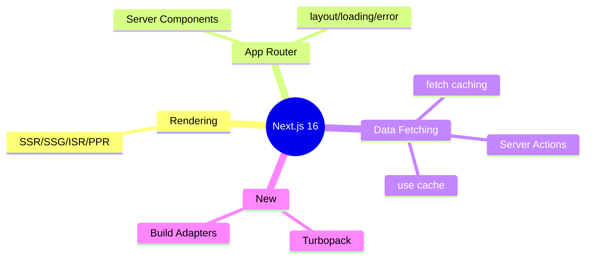
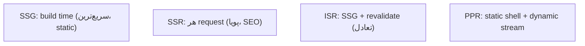

# Next.js 16 — Rendering Strategies، App Router، Data Fetching

> Next.js محبوب‌ترین فریم‌ورک React برای production است. درک رندرینگ‌ها و App Router کلیدی است. این فایل با دیاگرام گسترش یافته.

## فهرست
- [نقشه‌ی ذهنی](#نقشه‌ی-ذهنی)
- [📖 مفاهیم](#-مفاهیم)
- [🎯 سوالات مصاحبه](#-سوالات-مصاحبه)
- [⚠️ اشتباهات رایج](#️-اشتباهات-رایج)
- [🔗 ارتباط با سایر مفاهیم](#-ارتباط-با-سایر-مفاهیم)

---

## نقشه‌ی ذهنی



---

## استراتژی‌های رندرینگ



---

## 📖 مفاهیم

### Rendering Strategies

**توضیح:**

**SSR** (هر request)، **SSG** (build time، سریع‌ترین)، **ISR** (SSG + revalidate)، **PPR** (static shell + dynamic stream). انتخاب: ثابت → SSG، پویای کاربرمحور → SSR، نیمه‌پویا → ISR.

**نکات کلیدی:**

- SSG سریع‌ترین اما برای پویا نامناسب.
- ISR تعادل تازگی/performance.

---

### App Router

**توضیح:**

از Next.js 13، routing فایل‌محور (`app/users/[id]/page.tsx`). **Server Components پیش‌فرض**؛ `'use client'` برای تعامل. فایل‌های خاص: `layout`, `loading` (Suspense)، `error` (error boundary)، `route.ts` (API).

**مثال کد:**

```tsx
// app/users/[id]/page.tsx — Server Component
async function UserPage({ params }: { params: { id: string } }) {
  const user = await fetchUser(params.id); // مستقیماً روی server
  return <UserProfile user={user} />;
}
// app/users/[id]/loading.tsx
export default function Loading() { return <Spinner />; }
```

**نکات کلیدی:**

- Server Components پیش‌فرض؛ `'use client'` برای تعامل.
- `loading.tsx`/`error.tsx` خودکار Suspense/error boundary.

---

### Data Fetching & Caching

**توضیح:**

`fetch()` با caching: `force-cache` (static)، `next: { revalidate: 60 }` (ISR)، `no-store` (پویا). **Server Actions** (`'use server'`). **Cache Components** (16) با `use cache`.

**نکات کلیدی:**

- caching در fetch رفتار رندرینگ را تعیین می‌کند.
- Server Actions جایگزین API route برای mutation ساده.

---

### Next.js 16 جدیدها

**توضیح:**

Build Adapters API (هر platform)، Turbopack (سریع‌تر از Webpack)، PPR stable، `use cache`.

**نکات کلیدی:**

- Turbopack build/dev سریع‌تر.
- Build Adapters استقلال از Vercel.

---

## 🎯 سوالات مصاحبه

### سوال ۱: SSR، SSG، ISR را مقایسه کن.

**سطح:** Senior
**تکرار:** زیاد

**جواب کامل:**

SSG build time (سریع‌ترین، static، اما داده ثابت). SSR هر request (تازه، SEO پویا، اما کندتر/بار بیشتر). ISR ترکیب (static سرو + revalidate دوره‌ای، برای نیمه‌پویا). انتخاب بر اساس تازگی لازم در برابر performance.

**نکته مصاحبه:**

Senior trade-off هر کدام را می‌داند.

---

### سوال ۲: Server Components در App Router چه مزیتی؟

**سطح:** Senior
**تکرار:** متوسط

**جواب کامل:**

پیش‌فرض Server Component: روی server، async، مستقیم data fetch (حتی DB)، **کد به client نمی‌رود** (bundle کوچک‌تر). برای interactivity `'use client'`. الگو: data-heavy/static را Server، تعاملی را Client. مزیت: کاهش JS، امنیت، دسترسی مستقیم backend.

**نکته مصاحبه:**

Senior «server by default, client when needed» را می‌داند.

---

### سوال ۳: caching در `fetch` چطور؟

**سطح:** Senior
**تکرار:** متوسط

**جواب کامل:**

Next.js `fetch` را extend کرده: `force-cache` (static)، `revalidate` (ISR)، `no-store` (dynamic، هر request). استراتژی رندرینگ از caching تعیین می‌شود. در 16 با `use cache` کنترل ریزتر. مهم: caching پیش‌فرض می‌تواند stale نشان دهد اگر آگاهانه تنظیم نشود.

**نکته مصاحبه:**

Senior ربط caching به رندرینگ را می‌فهمد.

---

## ⚠️ اشتباهات رایج

### اشتباه ۱: `'use client'` روی همه‌چیز

```tsx
// ❌ از دست رفتن مزیت RSC
'use client';
```

```tsx
// ✅ فقط برگ‌های تعاملی
```

**توضیح:** فقط جایی که interactivity لازم است.

---

### اشتباه ۲: SSG برای داده‌ی کاربرمحور

```text
❌ SSG برای dashboard → stale/همه یکسان
✅ SSR یا client fetch
```

**توضیح:** SSG داده را در build ثابت می‌کند.

---

### اشتباه ۳: نادیده گرفتن caching پیش‌فرض fetch

```text
❌ انتظار تازه اما cache → stale
✅ cache: 'no-store' یا revalidate
```

**توضیح:** caching پیش‌فرض می‌تواند داده‌ی قدیمی نشان دهد.

---

## 🔗 ارتباط با سایر مفاهیم

- با **React 19 (11.1)** و Server Components.
- rendering با **Web Vitals (18.3)** و **caching (6.2)**.
- Server Actions با **API design (19.1)**.
- App Router با **TypeScript (18.1)**.
