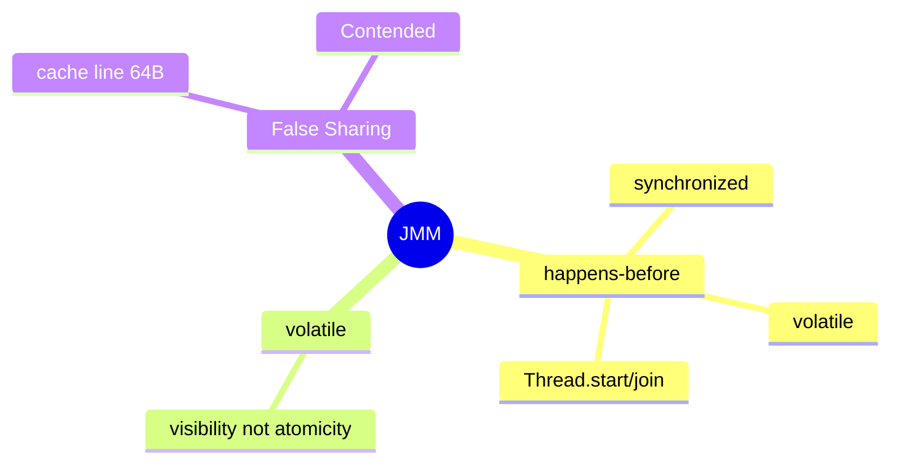
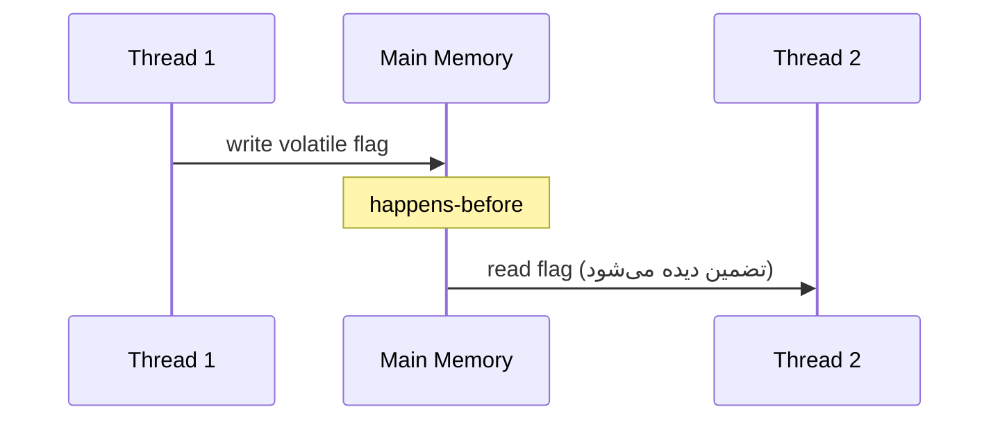
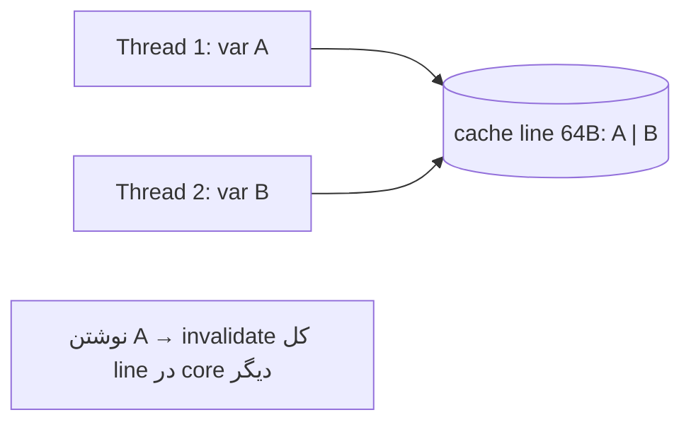

# Java Memory Model (JMM) — Visibility، Ordering، False Sharing

> JMM پایه‌ی هر استدلال درست درباره‌ی concurrency است. سوالات سطح Lead اینجا متمرکزند. این فایل با دیاگرام گسترش یافته.

## فهرست
- [نقشه‌ی ذهنی](#نقشه‌ی-ذهنی)
- [📖 مفاهیم](#-مفاهیم)
- [🎯 سوالات مصاحبه](#-سوالات-مصاحبه)
- [⚠️ اشتباهات رایج](#️-اشتباهات-رایج)
- [🔗 ارتباط با سایر مفاهیم](#-ارتباط-با-سایر-مفاهیم)

---

## نقشه‌ی ذهنی



---

## happens-before



---

## 📖 مفاهیم

### Visibility & Ordering — happens-before

**توضیح:**

JMM تعریف می‌کند تغییرات یک thread کِی برای دیگران **دیده** می‌شوند و با چه **ترتیبی**. رابطه‌ی محوری **happens-before**: اگر A happens-before B، اثرات A برای B تضماً دیده می‌شوند. منابع: unlock `synchronized` → lock بعدی، نوشتن `volatile` → خواندن بعدی، `Thread.start()`/`join()`، Atomic/Lock.

**مثال کد:**

```java
class Worker {
    private volatile boolean running = true; // volatile → visibility
    void stop() { running = false; }
    void run() { while (running) { /* کار */ } } // بدون volatile ممکن هرگز تمام نشود!
}
```

**نکات کلیدی:**

- happens-before پایه‌ی هر تضمین visibility.
- بدون synchronization، تغییرات ممکن هرگز دیده نشوند.
- reordering مجاز است مگر happens-before محدود کند.

---

### volatile — visibility نه atomicity

**توضیح:**

`volatile` visibility و جلوگیری از reordering؛ اما عملیات مرکب (`i++`) را atomic نمی‌کند. مناسب: flag، single-writer، DCL. نامناسب: counter، invariant چندمتغیره.

**مثال کد:**

```java
private volatile boolean shutdownRequested; // ✅ flag
private volatile int count; // ❌ count++ atomic نیست → AtomicInteger
```

**نکات کلیدی:**

- volatile = visibility + ordering، نه mutual exclusion.
- برای read-modify-write از Atomic/lock.

---

### False Sharing

**توضیح:**

cache line ~۶۴ بایت. دو thread روی **متغیرهای مختلف** اما **یک cache line** → رقابت کاذب (invalidate مکرر). راه‌حل: padding یا `@Contended`.



**مثال کد:**

```java
@jdk.internal.vm.annotation.Contended // padding → cache line جدا
static class Counter { volatile long value; }
```

**نکات کلیدی:**

- false sharing مشکل performance پنهان.
- `@Contended` متغیر را در cache line جدا قرار می‌دهد.

---

## 🎯 سوالات مصاحبه

### سوال ۱: happens-before چیست و چرا مهم؟

**سطح:** Lead
**تکرار:** زیاد

**جواب کامل:**

رابطه‌ی ترتیبی: اگر A happens-before B، اثرات حافظه‌ی A برای B قابل‌مشاهده و A قبل از B دیده می‌شود. مهم چون بدون آن compiler/CPU آزادند reorder و cache محلی کنند، پس thread ممکن تغییرات دیگری را نبیند. هر استدلال thread-safety باید بر زنجیره‌ی happens-before باشد نه شهود.

**نکته مصاحبه:**

Lead استدلال بر happens-before نه شهود. Follow-up: «بدون volatile چرا `while(flag)` تمام نشود؟»

---

### سوال ۲: DCL چرا به volatile نیاز دارد؟

**سطح:** Lead
**تکرار:** متوسط

**جواب کامل:**

`new Singleton()` سه مرحله (تخصیص، سازنده، انتساب reference). بدون volatile، reordering می‌تواند reference را **قبل از** اتمام سازنده منتشر کند → thread دیگر شیء **نیمه‌ساخته** می‌بیند. volatile reordering را ممنوع و happens-before تضمین می‌کند.

**نکته مصاحبه:**

Lead reordering و شیء نیمه‌ساخته را توضیح می‌دهد.

---

### سوال ۳: false sharing چیست؟

**سطح:** Lead
**تکرار:** متوسط

**جواب کامل:**

CPU در cache line (~۶۴B) cache می‌کند. دو thread روی دو متغیر مستقل در یک cache line → هر نوشتن کل line را در core دیگر invalidate می‌کند (coherence) → throughput کم، بدون داده‌ی مشترک منطقی. راه‌حل: padding یا `@Contended` (مثل LongAdder).

**نکته مصاحبه:**

Lead به LongAdder اشاره می‌کند.

---

## ⚠️ اشتباهات رایج

### اشتباه ۱: flag بدون volatile

```java
// ❌
private boolean running = true;
```

```java
// ✅
private volatile boolean running = true;
```

**توضیح:** بدون volatile تغییر ممکن دیده نشود.

---

### اشتباه ۲: volatile برای counter

```java
// ❌
private volatile int count;
```

```java
// ✅
private final AtomicInteger count = new AtomicInteger();
```

**توضیح:** volatile atomicity برای read-modify-write نمی‌دهد.

---

### اشتباه ۳: DCL بدون volatile

```java
// ❌
private static Config instance;
```

```java
// ✅
private static volatile Config instance;
```

**توضیح:** reordering مشکل‌ساز است.

---

## 🔗 ارتباط با سایر مفاهیم

- JMM با **Concurrency (1.6)** و volatile/synchronized.
- happens-before با **ConcurrentHashMap** و **Atomic**.
- false sharing با **performance (12.6)** و LongAdder.
- DCL با **Singleton (5.3)**.
