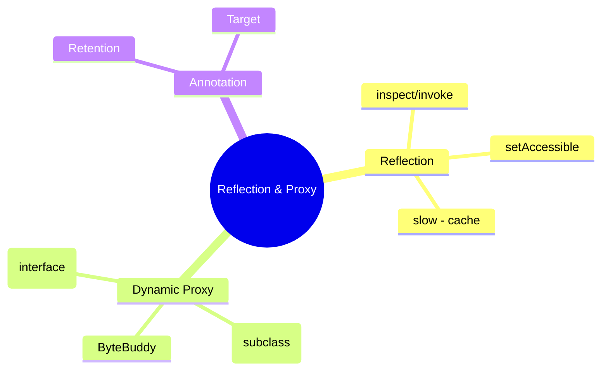
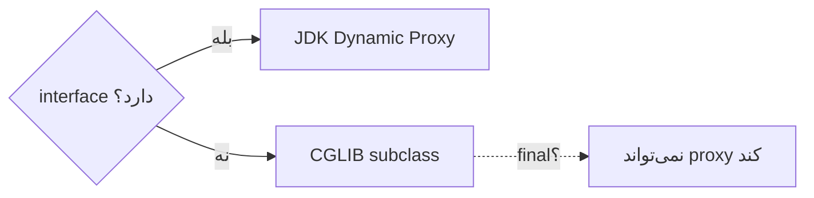

# Reflection & Dynamic Proxy & Annotation Processing

> پایه‌ی فریم‌ورک‌ها (Spring، Hibernate، Mockito). درک proxy برای فهم AOP و `@Transactional` لازم است. این فایل با دیاگرام گسترش یافته.

## فهرست
- [نقشه‌ی ذهنی](#نقشه‌ی-ذهنی)
- [📖 مفاهیم](#-مفاهیم)
- [🎯 سوالات مصاحبه](#-سوالات-مصاحبه)
- [⚠️ اشتباهات رایج](#️-اشتباهات-رایج)
- [🔗 ارتباط با سایر مفاهیم](#-ارتباط-با-سایر-مفاهیم)

---

## نقشه‌ی ذهنی



---

## 📖 مفاهیم

### Reflection API

**توضیح:**

بررسی/دستکاری runtime ساختار کلاس: field/method/annotation، فراخوانی، ساخت instance، دسترسی به private (`setAccessible`). پایه‌ی DI، serialization، ORM. کند است → cache کنید.

**مثال کد:**

```java
Class<?> clazz = Class.forName("com.example.MyService");
Method method = clazz.getDeclaredMethod("process", String.class);
method.setAccessible(true);
Object result = method.invoke(instance, "arg");
```

**نکات کلیدی:**

- reflection کند است؛ Method/Field را cache کنید.
- با ماژول (Java 9+) نیاز `opens` برای reflection.
- کاربرد: framework.

---

### Dynamic Proxy

**توضیح:**

**JDK Dynamic Proxy** فقط interface (`Proxy.newProxyInstance`). **CGLIB** subclassing (بدون interface، کلاس/متد نباید final). **ByteBuddy** (Mockito). پایه‌ی AOP.



**مثال کد:**

```java
MyService proxy = (MyService) Proxy.newProxyInstance(
    MyService.class.getClassLoader(), new Class[]{MyService.class},
    (proxyObj, method, args) -> {
        System.out.println("Before: " + method.getName());
        Object result = method.invoke(target, args);
        System.out.println("After: " + method.getName());
        return result;
    });
```

**نکات کلیدی:**

- JDK برای interface، CGLIB برای class.
- self-invocation از proxy عبور نمی‌کند (ریشه‌ی `@Transactional`).
- متد/کلاس final توسط CGLIB قابل proxy نیست.

---

### Annotation Processing

**توضیح:**

`@Retention`: `SOURCE` (فقط کد)، `CLASS` (bytecode)، `RUNTIME` (با reflection — framework). `@Target` محل. annotation + reflection (runtime) یا annotation processor (compile-time، Lombok، MapStruct).

**نکات کلیدی:**

- `RUNTIME` برای annotationهای framework.
- annotation processor کد تولید می‌کند بدون سربار runtime.

---

## 🎯 سوالات مصاحبه

### سوال ۱: JDK Dynamic Proxy در برابر CGLIB؟

**سطح:** Senior
**تکرار:** زیاد

**جواب کامل:**

JDK proxy یک interface را پیاده می‌کند (نیاز interface). CGLIB با subclassing (بدون interface، اما کلاس/متد نباید final). Spring Boot پیش‌فرض CGLIB. پیامد: متد `final` در bean با `@Transactional` کار نمی‌کند.

**نکته مصاحبه:**

Senior به final و `@Transactional` اشاره می‌کند.

---

### سوال ۲: چرا reflection کند است و چطور بهینه؟

**سطح:** Senior
**تکرار:** متوسط

**جواب کامل:**

lookup (جستجو با نام)، چک‌های امنیتی/type، عدم inline توسط JIT، autoboxing. بهینه: (۱) cache Method/Field. (۲) `setAccessible(true)`. (۳) `MethodHandle`/`LambdaMetafactory` برای فراخوانی مکرر. (۴) annotation processing (compile-time) به‌جای reflection runtime.

**نکته مصاحبه:**

Senior به cache و MethodHandle اشاره می‌کند.

---

### سوال ۳: تفاوت RetentionPolicy؟

**سطح:** Senior
**تکرار:** متوسط

**جواب کامل:**

`SOURCE` فقط کد (مثل `@Override`، در bytecode نیست). `CLASS` (پیش‌فرض) در bytecode اما runtime نه. `RUNTIME` با reflection (framework مثل `@Autowired`). framework باید RUNTIME باشد.

**نکته مصاحبه:**

Senior می‌داند framework باید RUNTIME باشد.

---

## ⚠️ اشتباهات رایج

### اشتباه ۱: reflection بدون cache

```java
// ❌
obj.getClass().getMethod("x").invoke(obj);
```

```java
// ✅ Method را cache کنید
```

**توضیح:** lookup مکرر کند است.

---

### اشتباه ۲: متد final با `@Transactional`

```java
// ❌
@Transactional public final void save() {}
```

```java
// ✅
@Transactional public void save() {}
```

**توضیح:** proxy نمی‌تواند متد final را intercept کند.

---

### اشتباه ۳: annotation با retention اشتباه

```java
// ❌
@Retention(RetentionPolicy.SOURCE) public @interface MyFrameworkAnnotation {}
```

```java
// ✅
@Retention(RetentionPolicy.RUNTIME)
```

**توضیح:** annotation framework باید RUNTIME باشد.

---

## 🔗 ارتباط با سایر مفاهیم

- proxy با **Spring AOP/`@Transactional` (2.1, 2.4)**.
- reflection با **Spring DI** و **Hibernate**.
- annotation با **custom annotation + AOP** و **MapStruct/Lombok**.
- MethodHandle با **performance (12.6)**.
