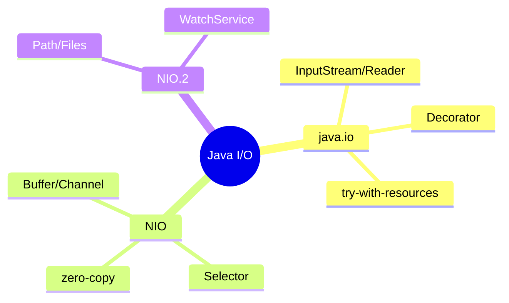
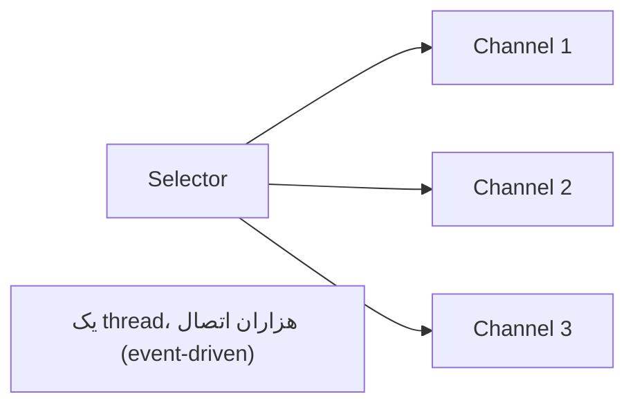

# Java I/O — Streams، NIO، NIO.2

> درک I/O و NIO برای performance و کار با فایل/شبکه لازم است. zero-copy و non-blocking I/O مفاهیم کلیدی‌اند. این فایل با دیاگرام گسترش یافته.

## فهرست
- [نقشه‌ی ذهنی](#نقشه‌ی-ذهنی)
- [📖 مفاهیم](#-مفاهیم)
- [🎯 سوالات مصاحبه](#-سوالات-مصاحبه)
- [⚠️ اشتباهات رایج](#️-اشتباهات-رایج)
- [🔗 ارتباط با سایر مفاهیم](#-ارتباط-با-سایر-مفاهیم)

---

## نقشه‌ی ذهنی



---

## 📖 مفاهیم

### I/O Streams (java.io)

**توضیح:**

blocking I/O. **InputStream/OutputStream** byte-based؛ **Reader/Writer** character-based (encoding). **Decorator pattern** (`BufferedReader(new FileReader())`). همیشه `try-with-resources`.

**مثال کد:**

```java
try (BufferedReader reader = Files.newBufferedReader(path, StandardCharsets.UTF_8)) {
    return reader.lines().collect(Collectors.toList());
}
```

**نکات کلیدی:**

- Reader/Writer برای متن (encoding صریح)؛ Stream برای byte.
- buffering برای کاهش system call.
- همیشه try-with-resources.

---

### NIO (java.nio)

**توضیح:**

- **Buffer** (`ByteBuffer`): `flip()`, `clear()`. Direct/Heap.
- **Channel** (`FileChannel`, `SocketChannel`): با buffer.
- **Selector**: multiplexing — یک thread چند channel (non-blocking، پایه‌ی Netty).
- **`transferTo()`**: zero-copy.



**نکات کلیدی:**

- Selector یک thread برای هزاران اتصال.
- zero-copy از کپی بین kernel/user space جلوگیری می‌کند.
- direct buffer برای I/O مکرر بزرگ.

---

### NIO.2 (java.nio.file — Java 7)

**توضیح:**

`Path`/`Files`. متدها: `readAllLines`, `walk` (Stream)، `WatchService` (نظارت تغییر).

**مثال کد:**

```java
try (Stream<Path> paths = Files.walk(Path.of("/dir"))) {
    paths.filter(Files::isRegularFile)
         .filter(p -> p.toString().endsWith(".java"))
         .forEach(System.out::println);
}
```

**نکات کلیدی:**

- `Files.walk`/`lines` Stream برمی‌گردانند → با try-with-resources ببندید.
- `WatchService` برای واکنش به تغییر فایل بدون polling.

---

## 🎯 سوالات مصاحبه

### سوال ۱: blocking در برابر non-blocking I/O (NIO)؟

**سطح:** Senior / Lead
**تکرار:** زیاد

**جواب کامل:**

blocking: هر thread روی اتصال block (thread-per-connection، مقیاس نمی‌گیرد). non-blocking (Selector): یک thread چند channel را با event مدیریت می‌کند → هزاران اتصال با thread کم (پایه‌ی Netty/WebFlux). کد NIO پیچیده‌تر. با virtual threads (21)، blocking ساده دوباره مقیاس‌پذیر شده.

**نکته مصاحبه:**

Lead به Selector و تأثیر virtual threads اشاره می‌کند.

---

### سوال ۲: zero-copy چیست؟

**سطح:** Senior / Lead
**تکرار:** متوسط

**جواب کامل:**

در کپی معمولی، داده چندبار کپی (disk → kernel → user → kernel socket → NIC). **zero-copy** (`transferTo`/`sendfile`) مستقیم از kernel buffer به socket buffer بدون user space → کپی/context switch کمتر → throughput بالاتر. Kafka از آن استفاده می‌کند.

**نکته مصاحبه:**

Senior به استفاده‌ی Kafka اشاره می‌کند.

---

### سوال ۳: Selector چطور کار می‌کند؟

**سطح:** Senior
**تکرار:** متوسط

**جواب کامل:**

multiplexer: چند channel non-blocking را با علاقه (OP_READ/WRITE/ACCEPT) register می‌کنید؛ `select()` block تا channel آماده شود، مجموعه‌ی آماده را برمی‌گرداند. یک thread در حلقه پردازش می‌کند. زیر کاپوت `epoll`/`kqueue`. پایه‌ی event-loop در Netty.

**نکته مصاحبه:**

Senior به epoll و event-loop اشاره می‌کند.

---

## ⚠️ اشتباهات رایج

### اشتباه ۱: عدم بستن Stream از Files.walk/lines

```java
// ❌ resource leak
Files.lines(path).forEach(...);
```

```java
// ✅
try (var lines = Files.lines(path)) { lines.forEach(...); }
```

**توضیح:** منبع باز نگه می‌دارند؛ باید بسته شوند.

---

### اشتباه ۲: خواندن بدون buffering

```java
// ❌
FileReader r = new FileReader(file);
```

```java
// ✅
BufferedReader r = new BufferedReader(new FileReader(file));
```

**توضیح:** بدون buffer، I/O کند است.

---

### اشتباه ۳: فراموشی encoding صریح

```java
// ❌
new FileReader(file);
```

```java
// ✅
Files.newBufferedReader(path, StandardCharsets.UTF_8);
```

**توضیح:** encoding صریح از باگ cross-platform جلوگیری می‌کند.

---

## 🔗 ارتباط با سایر مفاهیم

- NIO/Selector با **WebFlux/Netty (2.3)**.
- virtual threads (1.5) جایگزین ساده‌تر.
- zero-copy با **Kafka (8.1)**.
- try-with-resources با **Exceptions (1.1)**.
