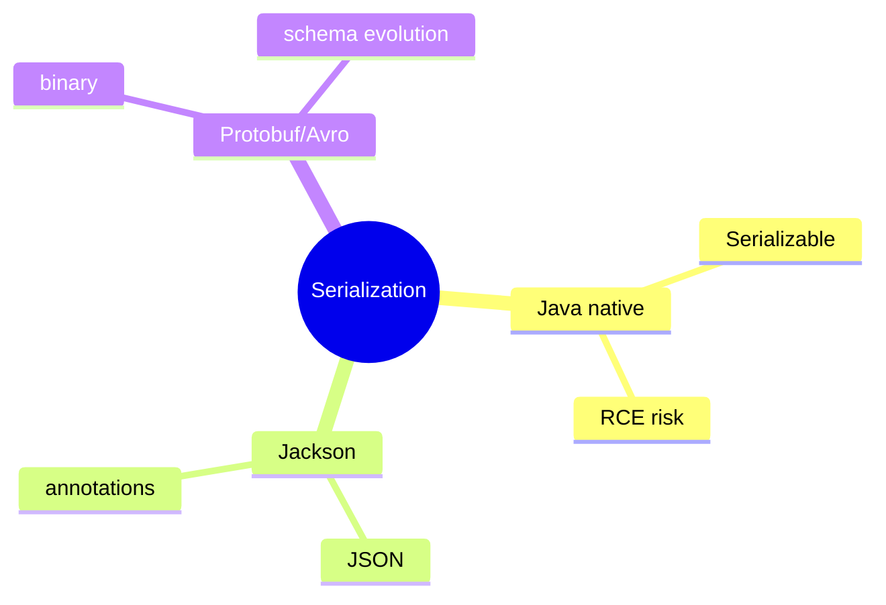
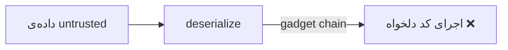

# Serialization — Java Serialization، Jackson، Protobuf، Avro

> serialization در API، messaging و persistence همه‌جا هست. Java serialization خطرناک است؛ مدرن‌ها امن‌ترند. این فایل با دیاگرام گسترش یافته.

## فهرست
- [نقشه‌ی ذهنی](#نقشه‌ی-ذهنی)
- [📖 مفاهیم](#-مفاهیم)
- [🎯 سوالات مصاحبه](#-سوالات-مصاحبه)
- [⚠️ اشتباهات رایج](#️-اشتباهات-رایج)
- [🔗 ارتباط با سایر مفاهیم](#-ارتباط-با-سایر-مفاهیم)

---

## نقشه‌ی ذهنی



---

## 📖 مفاهیم

### Java Serialization

**توضیح:**

`implements Serializable`. `serialVersionUID`، `transient`. **مشکلات جدی:** آسیب‌پذیری امنیتی (deserialization of untrusted → RCE)، performance ضعیف، coupling. در production کمتر استفاده کنید.



**نکات کلیدی:**

- Java serialization برای untrusted خطرناک (RCE).
- در سیستم مدرن JSON/Protobuf.
- `transient` برای حذف فیلد حساس.

---

### Jackson (JSON)

**توضیح:**

استاندارد JSON در Spring Boot. `ObjectMapper`. annotationها: `@JsonProperty`, `@JsonIgnore`, `@JsonFormat`, `@JsonInclude`. Jackson 3 در Boot 4.

**مثال کد:**

```java
public record UserDto(
    @JsonProperty("user_name") String name,
    @JsonIgnore String password,
    @JsonFormat(pattern = "yyyy-MM-dd") LocalDate birthDate) {}

ObjectMapper mapper = new ObjectMapper()
    .registerModule(new JavaTimeModule())
    .setSerializationInclusion(JsonInclude.Include.NON_NULL);
```

**نکات کلیدی:**

- `@JsonIgnore` برای فیلد حساس.
- `JavaTimeModule` برای java.time.
- `FAIL_ON_UNKNOWN_PROPERTIES` را برای backward compatibility مدیریت کنید.

---

### Protocol Buffers & Avro

**توضیح:**

**Protobuf:** باینری، فشرده، schema (`.proto`)، code generation (gRPC). **Avro:** schema-based، Kafka (Schema Registry). هر دو **schema evolution**.

**نکات کلیدی:**

- Protobuf/Avro فشرده‌تر از JSON برای داخلی.
- schema evolution امکان تغییر بدون شکستن مصرف‌کننده.
- JSON برای عمومی؛ Protobuf/Avro برای داخلی.

---

## 🎯 سوالات مصاحبه

### سوال ۱: چرا Java native serialization خطرناک است؟

**سطح:** Senior / Lead
**تکرار:** متوسط

**جواب کامل:**

**deserialization of untrusted data**: Java هر کلاسی در classpath را instantiate و `readObject` را اجرا می‌کند؛ مهاجم «gadget chain» می‌سازد → RCE (مثل Apache Commons Collections). به‌علاوه performance و coupling. به‌جای آن JSON/Protobuf (کد اجرا نمی‌کنند).

**نکته مصاحبه:**

Lead به gadget chain و RCE اشاره می‌کند.

---

### سوال ۲: JSON در برابر Protobuf؟

**سطح:** Senior
**تکرار:** متوسط

**جواب کامل:**

JSON متنی، خوانا، universal — برای API عمومی. Protobuf باینری، فشرده، typed، code generation — برای داخلی پرترافیک (gRPC). trade-off: JSON خوانا اما حجیم؛ Protobuf کارآمد اما نیاز schema/ابزار. عمومی → JSON؛ microservice داخلی → Protobuf.

**نکته مصاحبه:**

Senior trade-off را می‌داند.

---

### سوال ۳: schema evolution چیست؟

**سطح:** Senior / Lead
**تکرار:** متوسط

**جواب کامل:**

تغییر schema (افزودن/حذف فیلد) بدون شکستن producer/consumer با نسخه‌ی متفاوت — حیاتی در توزیع‌شده. backward (consumer جدید داده‌ی قدیمی) و forward (consumer قدیمی داده‌ی جدید). Protobuf با field number؛ Avro با Schema Registry. در Kafka برای deploy تدریجی ضروری.

**نکته مصاحبه:**

Senior backward/forward و Schema Registry را می‌داند.

---

## ⚠️ اشتباهات رایج

### اشتباه ۱: deserialize untrusted با Java serialization

```java
// ❌ RCE
new ObjectInputStream(untrusted).readObject();
```

```java
// ✅ JSON/Protobuf
```

**توضیح:** Java deserialization می‌تواند کد اجرا کند.

---

### اشتباه ۲: serialize کردن password

```java
// ❌
public record User(String name, String password) {}
```

```java
// ✅
public record User(String name, @JsonIgnore String password) {}
```

**توضیح:** فیلد حساس باید حذف شود.

---

### اشتباه ۳: reuse field number در Protobuf

```text
❌ حذف فیلد و reuse number → ناسازگاری
✅ reserved number
```

**توضیح:** field number قدیمی با داده‌ی قدیمی تداخل می‌کند.

---

## 🔗 ارتباط با سایر مفاهیم

- Java serialization با **Security (7.1)**.
- Jackson با **Spring MVC (2.3)** و **API design**.
- Protobuf با **gRPC (15.4)**؛ Avro با **Kafka (8.1)**.
- schema evolution با **microservices deploy (6.1)**.
