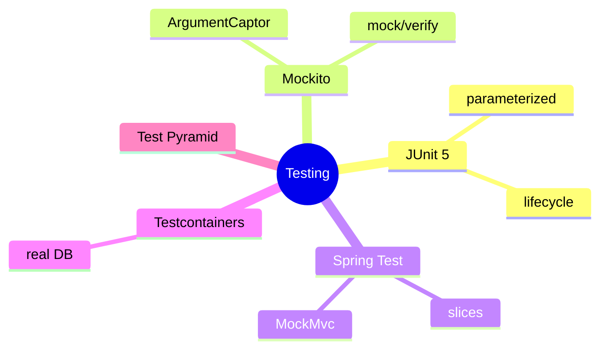
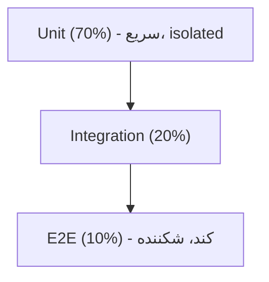

# Testing در Java — JUnit 5، Mockito، Spring Test، Testcontainers

> تست مهارت پایه‌ی Senior است. Test Pyramid و Testcontainers موضوعات کلیدی مصاحبه‌اند. این فایل با دیاگرام و مثال‌های متعدد گسترش یافته.

## فهرست
- [نقشه‌ی ذهنی](#نقشه‌ی-ذهنی)
- [📖 مفاهیم](#-مفاهیم)
- [🎯 سوالات مصاحبه](#-سوالات-مصاحبه)
- [⚠️ اشتباهات رایج](#️-اشتباهات-رایج)
- [🔗 ارتباط با سایر مفاهیم](#-ارتباط-با-سایر-مفاهیم)

---

## نقشه‌ی ذهنی



---

## Test Pyramid



---

## 📖 مفاهیم

### JUnit 5

**توضیح:**

`@Test`, lifecycle (`@BeforeEach`)، parameterized (`@ParameterizedTest` + `@ValueSource`/`@CsvSource`/`@MethodSource`)، `@ExtendWith`. الگوی **AAA** (Arrange-Act-Assert).

**مثال کد:**

```java
@Test
void shouldCalculateTotal() {
    var cart = new Cart(); cart.add(new Item("book", 1000), 2); // Arrange
    long total = cart.total();                                   // Act
    assertThat(total).isEqualTo(2000);                           // Assert
}

@ParameterizedTest
@CsvSource({"2, 3, 5", "10, 20, 30"})
void shouldAdd(int a, int b, int expected) { assertThat(calc.add(a, b)).isEqualTo(expected); }
```

**نکات کلیدی:**

- AAA برای ساختار خوانا.
- parameterized برای چند ورودی.
- نام تست رفتار را توصیف کند.

---

### Mockito

**توضیح:**

`@Mock`, `@InjectMocks`, `when().thenReturn()`, `verify()`, `ArgumentCaptor`. stub (رفتار) در برابر verify (تعامل).

**مثال کد:**

```java
@ExtendWith(MockitoExtension.class)
class UserServiceTest {
    @Mock UserRepository repository;
    @InjectMocks UserService service;

    @Test
    void shouldSaveUser() {
        when(repository.save(any())).thenReturn(new User(1L, "Ali"));
        service.create("Ali");
        ArgumentCaptor<User> captor = ArgumentCaptor.forClass(User.class);
        verify(repository).save(captor.capture());
        assertThat(captor.getValue().name()).isEqualTo("Ali");
    }
}
```

**نکات کلیدی:**

- فقط وابستگی خارجی را mock کنید.
- verify برای تعامل، assert برای نتیجه.
- از over-mocking بپرهیزید.

---

### Spring Boot Testing

**توضیح:**

**Test slices:** `@WebMvcTest` (web + MockMvc)، `@DataJpaTest` (JPA + DB)، `@JsonTest`. `@SpringBootTest` کل context (کند). `@MockitoBean` برای mock در context.

**مثال کد:**

```java
@WebMvcTest(UserController.class)
class UserControllerTest {
    @Autowired MockMvc mockMvc;
    @MockitoBean UserService userService;

    @Test
    void shouldReturnUser() throws Exception {
        when(userService.findById(1L)).thenReturn(new UserDto(1L, "Ali"));
        mockMvc.perform(get("/users/1"))
            .andExpect(status().isOk())
            .andExpect(jsonPath("$.name").value("Ali"));
    }
}
```

**نکات کلیدی:**

- test slice سریع‌تر از `@SpringBootTest` کامل.
- `@WebMvcTest` فقط web layer.

---

### Testcontainers

**توضیح:**

اجرای DB/سرویس واقعی در container — به‌جای H2 (رفتار متفاوت). `@Testcontainers` + `@Container` + `@DynamicPropertySource`.

**مثال کد:**

```java
@SpringBootTest
@Testcontainers
class OrderRepositoryTest {
    @Container
    static PostgreSQLContainer<?> postgres = new PostgreSQLContainer<>("postgres:17");

    @DynamicPropertySource
    static void props(DynamicPropertyRegistry registry) {
        registry.add("spring.datasource.url", postgres::getJdbcUrl);
        registry.add("spring.datasource.username", postgres::getUsername);
        registry.add("spring.datasource.password", postgres::getPassword);
    }
}
```

**نکات کلیدی:**

- Testcontainers DB واقعی (برخلاف H2).
- container را static کنید (reuse، سرعت).

---

### Test Pyramid

**توضیح:**

Unit (70%، سریع)، Integration (20%)، E2E (10%، کند، شکننده). نه ساعت‌شنی (ضدالگو). Contract tests (Pact).

**نکات کلیدی:**

- بیشتر unit، کمتر E2E.
- contract testing برای microservices.

---

## 🎯 سوالات مصاحبه

### سوال ۱: Test Pyramid و چرا E2E کم؟

**سطح:** Senior
**تکرار:** زیاد

**جواب کامل:**

unit (سریع، isolated، ارزان)، integration، E2E (کم). E2E کند، **شکننده** (محیط/شبکه/timing → flaky)، دیباگ سخت. unit feedback سریع و دقیق. ضدالگوی «ice cream cone» (E2E زیاد). استراتژی: منطق با unit، یکپارچگی با integration (Testcontainers)، مسیر حیاتی با E2E.

**نکته مصاحبه:**

Senior به flakiness و ice cream cone اشاره می‌کند.

---

### سوال ۲: چرا Testcontainers به‌جای H2؟

**سطح:** Senior
**تکرار:** زیاد

**جواب کامل:**

H2 رفتار متفاوت از production (PostgreSQL): dialect، عدم پشتیبانی feature (JSONB)، رفتار constraint/transaction → تست سبز اما production قرمز (false confidence). Testcontainers DB **واقعی** → اطمینان واقعی. هزینه: کندتر (Docker)، با reuse/parallel جبران.

**نکته مصاحبه:**

Senior به false confidence با H2 اشاره می‌کند.

---

### سوال ۳: `@WebMvcTest` در برابر `@SpringBootTest`؟

**سطح:** Senior
**تکرار:** متوسط

**جواب کامل:**

`@WebMvcTest` فقط web layer (controller/MockMvc)؛ service را mock کنید — سریع. `@SpringBootTest` کل context — integration کامل، اما کند. controller به‌تنهایی → `@WebMvcTest`؛ یکپارچه → `@SpringBootTest` (با Testcontainers).

**نکته مصاحبه:**

Senior test slice را برای سرعت ترجیح می‌دهد.

---

## ⚠️ اشتباهات رایج

### اشتباه ۱: `@SpringBootTest` برای همه‌چیز

```java
// ❌
@SpringBootTest class UserControllerTest {}
```

```java
// ✅
@WebMvcTest(UserController.class)
```

**توضیح:** test slice سریع‌تر.

---

### اشتباه ۲: over-mocking

```text
❌ mock همه‌چیز → تست شکننده
✅ فقط وابستگی خارجی
```

**توضیح:** mock زیاد تست را بی‌ارزش می‌کند.

---

### اشتباه ۳: تست با H2 برای کد PostgreSQL-specific

```text
❌ H2 سبز، production قرمز
✅ Testcontainers
```

**توضیح:** dialect متفاوت false confidence می‌دهد.

---

## 🔗 ارتباط با سایر مفاهیم

- testing با **CI/CD (10.3)**.
- Testcontainers با **Docker (10.1)** و **Spring Data (2.4)**.
- contract testing با **microservices (6.1)** و **Spring Test (13.5)**.
- mocking با **constructor injection (2.1)**.
