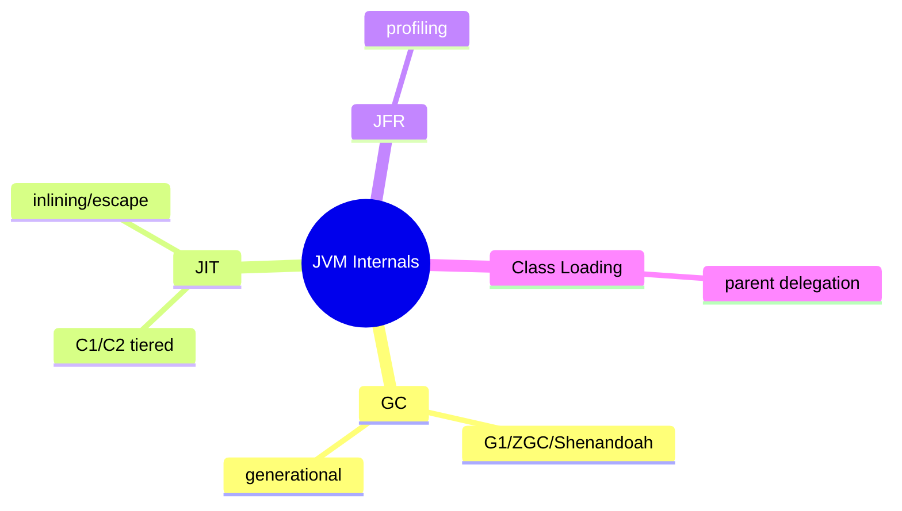
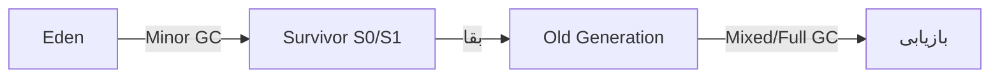
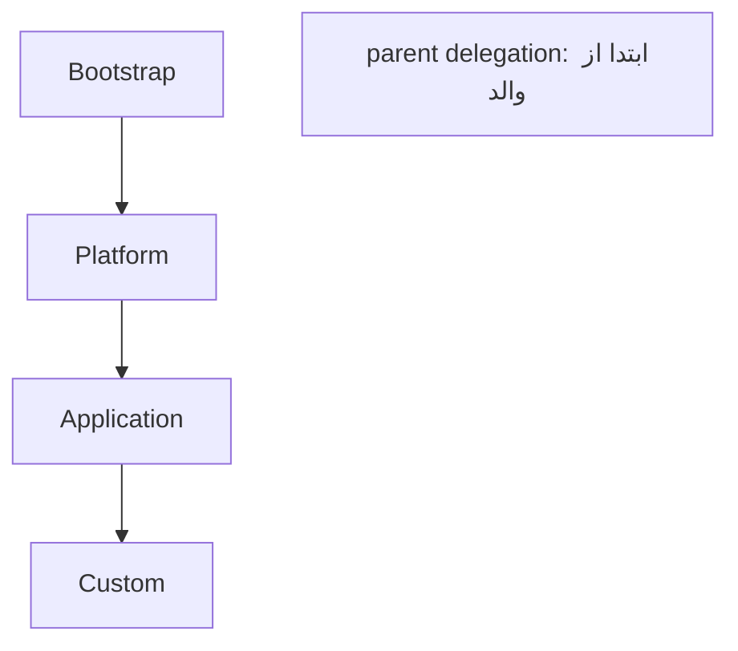

# JVM Internals عمیق — GC، JIT، JFR، Class Loading

> سوالات سطح Lead روی GC tuning، JIT و profiling تمرکز دارند. این بخش performance را تعیین می‌کند. این فایل با دیاگرام گسترش یافته.

## فهرست
- [نقشه‌ی ذهنی](#نقشه‌ی-ذهنی)
- [📖 مفاهیم](#-مفاهیم)
- [🎯 سوالات مصاحبه](#-سوالات-مصاحبه)
- [⚠️ اشتباهات رایج](#️-اشتباهات-رایج)
- [🔗 ارتباط با سایر مفاهیم](#-ارتباط-با-سایر-مفاهیم)

---

## نقشه‌ی ذهنی



---

## GC Generational (G1)



---

## 📖 مفاهیم

### Garbage Collection — G1، ZGC، Shenandoah

**توضیح:**

**G1GC** (پیش‌فرض از 9): region-based؛ Young (Eden+Survivor) و Old. Minor (سریع)، Mixed، Full (کند، avoid). هدف pause (`-XX:MaxGCPauseMillis`). **ZGC** (production از 15): concurrent، pause <1ms حتی heap بزرگ. **Shenandoah** (RedHat).

**مثال کد:**

```bash
java -XX:+UseG1GC -XX:MaxGCPauseMillis=200 -Xms2g -Xmx2g app.jar
java -XX:+UseZGC -Xms4g -Xmx4g app.jar
java -Xlog:gc*:file=gc.log:time app.jar
```

**نکات کلیدی:**

- `-Xms` = `-Xmx` تا resize نشود.
- G1 متعادل؛ ZGC برای latency بحرانی.
- Full GC مکرر = مشکل.

---

### JIT Compilation

**توضیح:**

interpret → C1 → C2 (Tiered). بهینه‌سازی: **inlining** (مهم‌ترین)، **escape analysis** (object روی stack/scalar replacement). GraalVM JIT جایگزین C2.

**نکات کلیدی:**

- warmup: کد ابتدا کند تا JIT کامپایل کند (در benchmark از JMH).
- escape analysis می‌تواند تخصیص heap را حذف کند.

---

### JFR (Java Flight Recorder)

**توضیح:**

profiling کم‌سربار داخلی (CPU، allocation، GC، lock). در production قابل فعال. JMC برای تحلیل.

**مثال کد:**

```bash
java -XX:StartFlightRecording=duration=60s,filename=rec.jfr app.jar
jcmd <pid> JFR.start duration=60s filename=rec.jfr
```

**نکات کلیدی:**

- JFR کم‌سربار، مناسب production.
- برای allocation hotspot و lock contention.

---

### Class Loading & Memory Leak

**توضیح:**

سه classloader (Bootstrap، Platform، Application) با **parent delegation**. memory leak: نگه‌داری ناخواسته‌ی ارجاع (static collection، listener، ThreadLocal در pool، classloader leak). تشخیص: heap dump + Eclipse MAT (dominator tree).



**نکات کلیدی:**

- memory leak = ارجاع نگه‌داشته‌شده، نه bug GC.
- heap dump + MAT برای یافتن منبع.

---

## 🎯 سوالات مصاحبه

### سوال ۱: G1 در برابر ZGC و کِی کدام؟

**سطح:** Lead
**تکرار:** زیاد

**جواب کامل:**

G1 متعادل region-based، throughput خوب با pause قابل‌تنظیم (ده‌ها تا صدها ms)؛ پیش‌فرض و برای اکثر. ZGC concurrent، pause <1ms حتی heap چند ترابایتی؛ برای latency-sensitive (trading، SLA سخت p99). trade-off: ZGC throughput کمی کمتر و CPU/memory بیشتر. latency بحرانی (heap بزرگ) → ZGC؛ throughput عمومی → G1. با اندازه‌گیری تصمیم بگیرید.

**نکته مصاحبه:**

Lead trade-off latency/throughput را می‌داند.

---

### سوال ۲: memory leak را چطور پیدا می‌کنی؟

**سطح:** Lead
**تکرار:** زیاد

**جواب کامل:**

اشیاء reachable می‌مانند در حالی که لازم نیستند → heap رشد، Full GC مکرر، نهایتاً OOM. فرایند: (۱) رصد metric (heap، GC). (۲) heap dump (jmap/JFR/`-XX:+HeapDumpOnOutOfMemoryError`). (۳) تحلیل با MAT (**dominator tree**، مسیر نگه‌داری). علل: static collection، cache بدون eviction، listener، ThreadLocal در pool.

**نکته مصاحبه:**

Lead فرایند سیستماتیک را شرح می‌دهد.

---

### سوال ۳: JIT warmup و چرا در benchmark مهم؟

**سطح:** Senior / Lead
**تکرار:** متوسط

**جواب کامل:**

کد ابتدا interpret (کند)؛ JIT بعد از hot شدن کامپایل می‌کند. در benchmark، بدون warmup نتایج بی‌معنا (زمان interpret). از **JMH** استفاده کنید (warmup iteration + جلوگیری از dead code elimination). در production startup کند با AOT/CDS/GraalVM Native بهبود می‌یابد.

**نکته مصاحبه:**

Senior به JMH اشاره می‌کند.

---

### سوال ۴: چرا `-Xms` و `-Xmx` برابر؟

**سطح:** Senior
**تکرار:** متوسط

**جواب کامل:**

اگر متفاوت، JVM heap را با رشد resize می‌کند (هزینه، pause، fragmentation). برابر → تخصیص کامل از ابتدا، بدون resize → performance پایدار. در کانتینر با memory limit ثابت هماهنگ می‌شود (`-XX:MaxRAMPercentage`).

**نکته مصاحبه:**

Senior به حذف resize و container limit اشاره می‌کند.

---

## ⚠️ اشتباهات رایج

### اشتباه ۱: benchmark بدون JMH/warmup

```java
// ❌
long start = System.nanoTime(); for (int i = 0; i < 1000; i++) doWork();
```

```java
// ✅ JMH با warmup
```

**توضیح:** بدون warmup نتیجه بی‌معناست.

---

### اشتباه ۲: `-Xms` خیلی کوچک

```bash
# ❌
java -Xms256m -Xmx4g
```

```bash
# ✅
java -Xms4g -Xmx4g
```

**توضیح:** اختلاف باعث resize پرهزینه می‌شود.

---

### اشتباه ۳: ThreadLocal بدون remove

```java
// ❌
threadLocal.set(bigObject);
```

```java
// ✅
try { threadLocal.set(bigObject); ... } finally { threadLocal.remove(); }
```

**توضیح:** thread در pool reuse می‌شود و مقدار نشت می‌کند.

---

## 🔗 ارتباط با سایر مفاهیم

- GC/JIT با **performance** و **Concurrency (1.6)**.
- JVM tuning با **K8s resource limits (10.2)** و **Docker (10.1)**.
- JFR با **observability/profiling (10.4)**.
- memory leak با **JMM (12.1)** و **ThreadLocal/ScopedValues (1.6)**.
