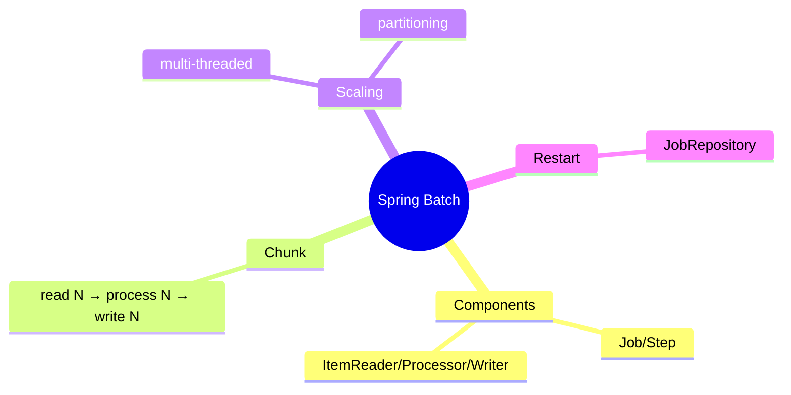
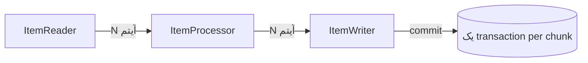

# Spring Batch — Job، Step، Chunk Processing، Scaling

> Spring Batch برای پردازش حجیم داده (ETL، گزارش، migration) استاندارد است. chunk processing و restart مفاهیم کلیدی‌اند. این فایل با دیاگرام گسترش یافته.

## فهرست
- [نقشه‌ی ذهنی](#نقشه‌ی-ذهنی)
- [📖 مفاهیم](#-مفاهیم)
- [🎯 سوالات مصاحبه](#-سوالات-مصاحبه)
- [⚠️ اشتباهات رایج](#️-اشتباهات-رایج)
- [🔗 ارتباط با سایر مفاهیم](#-ارتباط-با-سایر-مفاهیم)

---

## نقشه‌ی ذهنی



---

## Chunk Processing



---

## 📖 مفاهیم

### مفاهیم اصلی

**توضیح:**

**Job** (کل) → **Step** (مرحله) → **ItemReader/ItemProcessor/ItemWriter**. مدل **chunk-oriented**: Read N → Process N → Write N (در یک transaction). تعادل memory/performance و امکان commit دوره‌ای.

**مثال کد:**

```java
@Bean
public Step importStep(JobRepository jobRepository, PlatformTransactionManager txManager,
                       ItemReader<User> reader, ItemWriter<User> writer) {
    return new StepBuilder("importStep", jobRepository)
        .<User, User>chunk(100, txManager)
        .reader(reader).processor(userProcessor()).writer(writer)
        .faultTolerant().skipLimit(10).skip(ValidationException.class)
        .build();
}
```

**نکات کلیدی:**

- chunk size تعادل memory/performance.
- fault tolerance با skip/retry.

---

### Readers، Scaling، Restart

**توضیح:**

Readers: `FlatFileItemReader`, `JdbcPagingItemReader` (نه cursor برای بزرگ)، `JpaPagingItemReader`, `KafkaItemReader`. Scaling: Multi-threaded Step، Parallel Steps، **Partitioning**، Remote Chunking. **Restart:** `JobRepository` متادیتا را در DB ذخیره؛ از جای متوقف‌شده ادامه. `@StepScope`/`@JobScope`.

**نکات کلیدی:**

- `JdbcPagingItemReader` برای داده‌ی بزرگ.
- restart از JobRepository — برای job طولانی حیاتی.
- partitioning برای موازی‌سازی.

---

## 🎯 سوالات مصاحبه

### سوال ۱: chunk-oriented processing چه مزیتی؟

**سطح:** Senior
**تکرار:** زیاد

**جواب کامل:**

به‌جای کل داده در حافظه (OOM) یا یک transaction per رکورد (کند)، N رکورد می‌خواند/پردازش/می‌نویسد در یک transaction. مزایا: memory کنترل‌شده، performance، fault tolerance (chunk fail → فقط همان rollback + skip/retry)، restart. chunk size trade-off.

**نکته مصاحبه:**

Senior trade-off chunk size را می‌فهمد.

---

### سوال ۲: چطور job را restart-able می‌کنی؟

**سطح:** Senior
**تکرار:** متوسط

**جواب کامل:**

`JobRepository` وضعیت (JobExecution، StepExecution، offset) را در DB ذخیره می‌کند. با همان JobParameters (FAILED قبلی) از آخرین chunk موفق ادامه. شرایط: reader stateful/restartable (`JdbcPagingItemReader`)، JobParameters یکتا/یکسان. برای job طولانی حیاتی.

**نکته مصاحبه:**

Senior به JobRepository و reader stateful اشاره می‌کند.

---

## ⚠️ اشتباهات رایج

### اشتباه ۱: cursor reader برای داده‌ی بزرگ

```java
// ❌
JdbcCursorItemReader
```

```java
// ✅
JdbcPagingItemReader
```

**توضیح:** paging برای داده‌ی بزرگ مقیاس‌پذیرتر.

---

### اشتباه ۲: chunk size خیلی بزرگ

```java
// ❌
.chunk(1_000_000, txManager)
```

```java
// ✅
.chunk(100, txManager)
```

**توضیح:** chunk بزرگ memory و هزینه‌ی rollback را بالا می‌برد.

---

## 🔗 ارتباط با سایر مفاهیم

- با **transactions (2.4)** و **JPA**.
- partitioning با **concurrency** و scaling.
- KafkaItemReader با **Kafka (8.1)**.
- restart با **idempotency (19.2)**.
