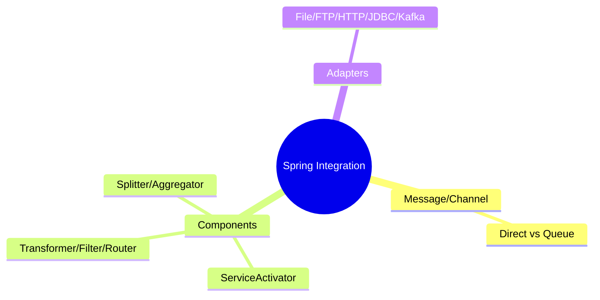
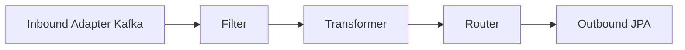

# Spring Integration — Enterprise Integration Patterns

> Spring Integration پیاده‌سازی EIP را برای ادغام سیستم‌ها فراهم می‌کند. این فایل با دیاگرام گسترش یافته.

## فهرست
- [نقشه‌ی ذهنی](#نقشه‌ی-ذهنی)
- [📖 مفاهیم](#-مفاهیم)
- [🎯 سوالات مصاحبه](#-سوالات-مصاحبه)
- [⚠️ اشتباهات رایج](#️-اشتباهات-رایج)
- [🔗 ارتباط با سایر مفاهیم](#-ارتباط-با-سایر-مفاهیم)

---

## نقشه‌ی ذهنی



---

## جریان Integration



---

## 📖 مفاهیم

### Enterprise Integration Patterns

**توضیح:**

پیاده‌سازی EIP: ارتباط از طریق **Message** (payload + headers) روی **MessageChannel**. componentها: ServiceActivator، Transformer، Filter، Router، Splitter/Aggregator، Gateway. Channel: DirectChannel (sync) یا QueueChannel (async). Adapters: File، FTP، HTTP، JDBC، Kafka، RabbitMQ.

**مثال کد:**

```java
@Bean
public IntegrationFlow orderFlow() {
    return IntegrationFlow
        .from(Kafka.messageDrivenChannelAdapter(consumerFactory(), "orders"))
        .filter(Order.class, o -> o.amount() > 100)
        .transform(orderTransformer())
        .route(Order.class, o -> o.type())
        .handle(Jpa.outboundAdapter(entityManagerFactory))
        .get();
}
```

**نکات کلیدی:**

- DirectChannel sync، QueueChannel async.
- Gateway interface POJO تمیز.
- برای ادغام پیچیده؛ برای ساده over-engineering.

---

## 🎯 سوالات مصاحبه

### سوال ۱: Spring Integration کِی؟

**سطح:** Senior / Lead
**تکرار:** کم

**جواب کامل:**

برای EIP: یکپارچه‌سازی چند سیستم با pipeline پیچیده (تبدیل، routing، split/aggregate، پروتکل‌های مختلف). برای ETL، legacy، message-driven. برای ساده over-engineering (یک `@KafkaListener` بهتر). رقیب: Apache Camel.

**نکته مصاحبه:**

Senior می‌داند برای ساده over-engineering است و Camel را می‌شناسد.

---

### سوال ۲: DirectChannel در برابر QueueChannel؟

**سطح:** Senior
**تکرار:** کم

**جواب کامل:**

DirectChannel sync، همان thread (transaction حفظ، بدون decoupling). QueueChannel buffer + thread جدا (async، decoupling، اما transaction قطع، نیاز poller). ساده/sync → Direct؛ decoupling/async → Queue.

**نکته مصاحبه:**

Senior به حفظ/قطع transaction اشاره می‌کند.

---

## ⚠️ اشتباهات رایج

### اشتباه ۱: Spring Integration برای موارد ساده

```text
❌ EIP برای یک consumer ساده
✅ @KafkaListener
```

**توضیح:** برای ساده over-engineering است.

---

### اشتباه ۲: فرض async برای DirectChannel

```text
❌ انتظار decoupling از DirectChannel
✅ QueueChannel برای async
```

**توضیح:** DirectChannel sync است.

---

## 🔗 ارتباط با سایر مفاهیم

- EIP با **Architecture (6.1)** و **messaging (8)**.
- adapters با **Kafka/RabbitMQ (8)**.
- جایگزین: Apache Camel.
