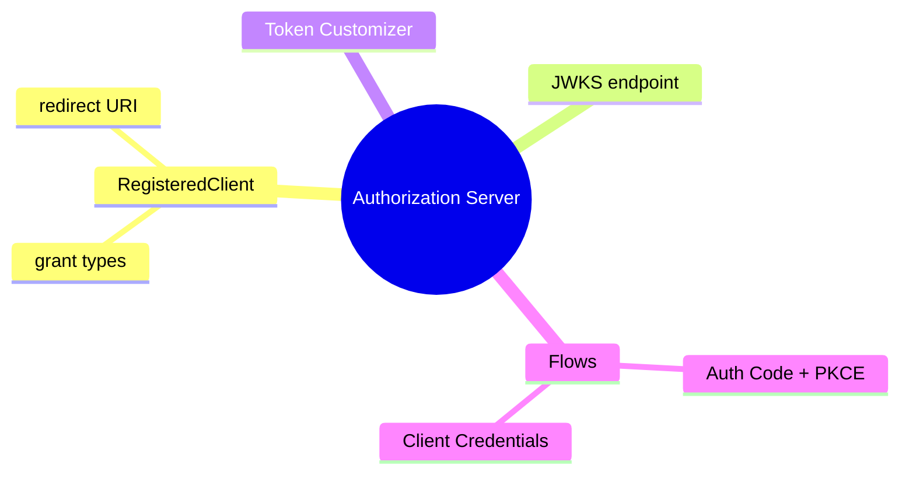

# Spring Authorization Server

> برای ساخت OAuth2/OIDC Authorization Server اختصاصی با Spring. این فایل با دیاگرام گسترش یافته.

## فهرست
- [نقشه‌ی ذهنی](#نقشه‌ی-ذهنی)
- [📖 مفاهیم](#-مفاهیم)
- [🎯 سوالات مصاحبه](#-سوالات-مصاحبه)
- [⚠️ اشتباهات رایج](#️-اشتباهات-رایج)
- [🔗 ارتباط با سایر مفاهیم](#-ارتباط-با-سایر-مفاهیم)

---

## نقشه‌ی ذهنی



---

## 📖 مفاهیم

### مفاهیم اصلی

**توضیح:**

ساخت OAuth2/OIDC provider اختصاصی (جایگزین Keycloak با کنترل کامل). **RegisteredClient** (grant types، redirect URI، scopes)، **JWKS endpoint** (کلید عمومی)، **OAuth2TokenCustomizer** (claim سفارشی).

**مثال کد:**

```java
@Bean
public RegisteredClientRepository registeredClientRepository(PasswordEncoder encoder) {
    RegisteredClient client = RegisteredClient.withId(UUID.randomUUID().toString())
        .clientId("my-client").clientSecret(encoder.encode("secret"))
        .authorizationGrantType(AuthorizationGrantType.AUTHORIZATION_CODE)
        .authorizationGrantType(AuthorizationGrantType.REFRESH_TOKEN)
        .redirectUri("http://localhost:8080/login/oauth2/code/my-client")
        .scope(OidcScopes.OPENID).scope("read").build();
    return new InMemoryRegisteredClientRepository(client);
}

@Bean
public OAuth2TokenCustomizer<JwtEncodingContext> tokenCustomizer() {
    return context -> context.getClaims().claim("tenant", "acme");
}
```

**نکات کلیدی:**

- Auth Code + PKCE برای user-facing؛ Client Credentials برای M2M.
- JWKS کلید عمومی برای Resource Serverها.
- token customizer برای claim دامنه‌ای.

---

## 🎯 سوالات مصاحبه

### سوال ۱: کِی auth server اختصاصی به‌جای Keycloak؟

**سطح:** Lead
**تکرار:** کم

**جواب کامل:**

Keycloak محصول کامل آماده (UI، federation، social) — برای اکثر درست. Spring Authorization Server وقتی کنترل کامل/سفارشی‌سازی عمیق token/flow، نگه‌داری در همان codebase، یا الزام خاص. trade-off: خودتان مسئول امنیت، نگهداری، UI، feature (MFA). مگر دلیل قوی، Keycloak/managed را ترجیح دهید (auth حساس).

**نکته مصاحبه:**

Lead به مسئولیت امنیتی ساخت اختصاصی اشاره می‌کند.

---

## ⚠️ اشتباهات رایج

### اشتباه ۱: in-memory client برای production

```java
// ❌
new InMemoryRegisteredClientRepository(client);
```

```java
// ✅
JdbcRegisteredClientRepository
```

**توضیح:** in-memory فقط dev/test.

---

### اشتباه ۲: client secret بدون encode

```java
// ❌
.clientSecret("secret")
```

```java
// ✅
.clientSecret(encoder.encode("secret"))
```

**توضیح:** secret باید hash شود.

---

## 🔗 ارتباط با سایر مفاهیم

- با **OAuth/OIDC/JWT (7.2)** و **Spring Security (2.5)**.
- token customizer با multi-tenancy و **Keycloak (مقایسه)**.
- JWKS با Resource Server validation.
