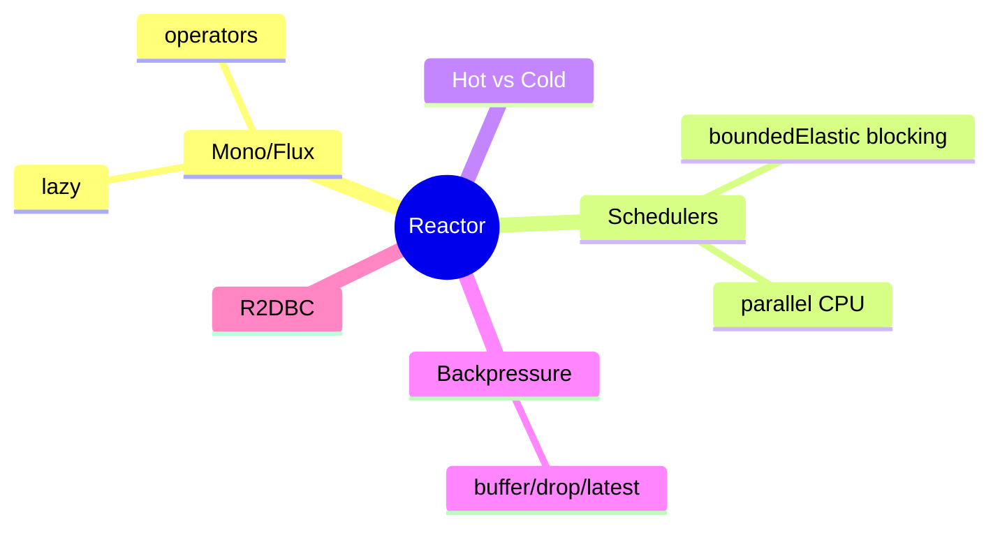
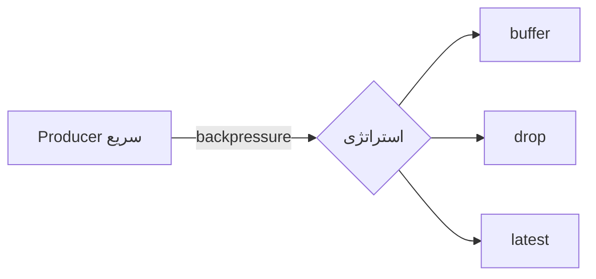

# Reactive Programming عمیق‌تر — Reactor، Schedulers، Backpressure، R2DBC

> برنامه‌نویسی reactive با Project Reactor. درک backpressure و schedulers برای WebFlux ضروری است. این فایل با دیاگرام گسترش یافته.

## فهرست
- [نقشه‌ی ذهنی](#نقشه‌ی-ذهنی)
- [📖 مفاهیم](#-مفاهیم)
- [🎯 سوالات مصاحبه](#-سوالات-مصاحبه)
- [⚠️ اشتباهات رایج](#️-اشتباهات-رایج)
- [🔗 ارتباط با سایر مفاهیم](#-ارتباط-با-سایر-مفاهیم)

---

## نقشه‌ی ذهنی



---

## 📖 مفاهیم

### Reactor — Mono، Flux، Operators

**توضیح:**

`Mono<T>` (0/1)، `Flux<T>` (0..N). operatorها (مثل Stream + async/خطا). **lazy**: تا قبل از `subscribe` هیچ.

**مثال کد:**

```java
Flux.range(1, 10)
    .filter(n -> n % 2 == 0)
    .flatMap(n -> Mono.fromCallable(() -> fetchFromDb(n)).subscribeOn(Schedulers.boundedElastic()))
    .onErrorResume(e -> Flux.empty())
    .retryWhen(Retry.backoff(3, Duration.ofSeconds(1)))
    .timeout(Duration.ofSeconds(5))
    .subscribe(System.out::println);
```

**نکات کلیدی:**

- nothing happens until subscribe.
- `flatMap` برای async؛ `map` برای sync.
- خطا سیگنال است (`onErrorResume`/`retryWhen`).

---

### Schedulers

**توضیح:**

`immediate()`، `single()`، `boundedElastic()` (blocking I/O)، `parallel()` (CPU-bound). `subscribeOn` کل زنجیره؛ `publishOn` از آن نقطه.

**نکات کلیدی:**

- کار blocking را با `boundedElastic` ایزوله کنید.
- `parallel` برای CPU-bound نه I/O.

---

### Hot vs Cold & Backpressure

**توضیح:**

**Cold** برای هر subscriber از ابتدا (`Flux.fromIterable`). **Hot** stream مشترک (`Sinks`، `ConnectableFlux`). **Backpressure:** `onBackpressureBuffer/Drop/Latest/Error`.



**نکات کلیدی:**

- cold برای per-subscriber؛ hot برای رویداد مشترک.
- backpressure از overwhelm جلوگیری می‌کند.

---

### R2DBC

**توضیح:**

`DatabaseClient`/`R2dbcRepository` — reactive SQL. فقط وقتی کل stack reactive. کمتر بالغ از JPA. با virtual threads، اغلب JDBC + MVC ساده‌تر.

**نکات کلیدی:**

- R2DBC فقط برای stack کاملاً reactive.
- virtual threads جایگزین ساده‌تر.

---

## 🎯 سوالات مصاحبه

### سوال ۱: backpressure چیست و چطور مدیریت؟

**سطح:** Senior / Lead
**تکرار:** زیاد

**جواب کامل:**

consumer نرخ producer را کنترل می‌کند تا overwhelm نشود. با `request(n)` (pull-push hybrid). وقتی producer نمی‌تواند کند شود: `onBackpressureBuffer` (خطر OOM اگر نامحدود)، `Drop`، `Latest`، `Error`. انتخاب بر اساس tolerance به loss.

**نکته مصاحبه:**

Lead به `request(n)` و trade-off اشاره می‌کند.

---

### سوال ۲: چرا blocking با boundedElastic ایزوله؟

**سطح:** Senior
**تکرار:** زیاد

**جواب کامل:**

WebFlux چند event-loop thread دارد. blocking روی آن‌ها throughput را سقوط می‌دهد. `subscribeOn(boundedElastic())` به pool جدا منتقل می‌کند. اما workaround است؛ stack باید reactive (R2DBC). virtual threads مشکل را برای blocking حل کرده.

**نکته مصاحبه:**

Senior می‌داند boundedElastic فقط workaround است.

---

### سوال ۳: hot در برابر cold publisher؟

**سطح:** Senior
**تکرار:** متوسط

**جواب کامل:**

cold برای هر subscriber از ابتدا مستقل (DB query). hot stream مشترک مستقل از subscriber؛ رویدادهای قبل از subscribe گم می‌شوند (real-time). برای multicast از `share()`/`publish().refCount()`.

**نکته مصاحبه:**

Senior به `share()` اشاره می‌کند.

---

## ⚠️ اشتباهات رایج

### اشتباه ۱: blocking در event-loop

```java
// ❌
flux.map(id -> jdbcRepo.findById(id));
```

```java
// ✅
flux.flatMap(id -> Mono.fromCallable(() -> jdbcRepo.findById(id)).subscribeOn(Schedulers.boundedElastic()));
```

**توضیح:** blocking throughput را نابود می‌کند.

---

### اشتباه ۲: فراموشی subscribe

```java
// ❌
Mono.fromCallable(() -> doWork());
```

```java
// ✅
mono.subscribe(); // در WebFlux، framework subscribe می‌کند
```

**توضیح:** بدون subscriber، publisher فقط blueprint است.

---

### اشتباه ۳: onBackpressureBuffer نامحدود

```java
// ❌
.onBackpressureBuffer()
```

```java
// ✅
.onBackpressureBuffer(1000, BufferOverflowStrategy.DROP_OLDEST)
```

**توضیح:** buffer نامحدود می‌تواند memory را پر کند.

---

## 🔗 ارتباط با سایر مفاهیم

- Reactor با **WebFlux (2.3)**.
- backpressure با **System Design (6.2)** و **Kafka**.
- virtual threads (1.5) جایگزین ساده‌تر.
- R2DBC با **Spring Data (2.4)**.
