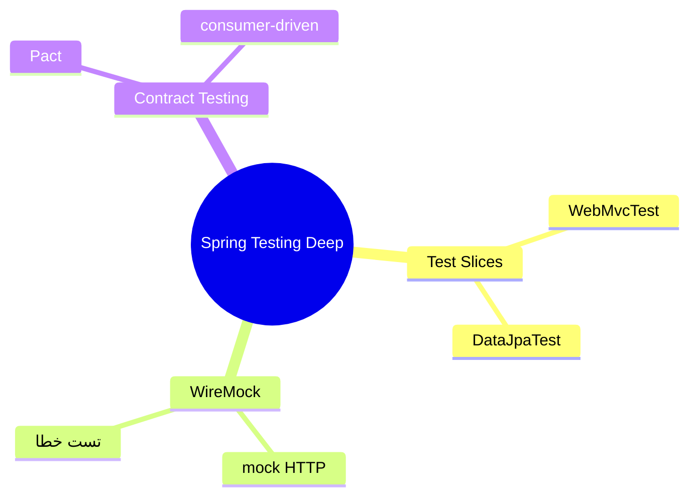
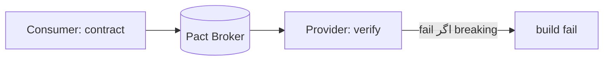

# Spring Boot Testing عمیق — Test Slices، WireMock، Contract Testing

> تست پیشرفته‌ی Spring Boot: test slices برای سرعت، WireMock برای mock کردن HTTP خارجی، Pact برای contract. این فایل با دیاگرام گسترش یافته.

## فهرست
- [نقشه‌ی ذهنی](#نقشه‌ی-ذهنی)
- [📖 مفاهیم](#-مفاهیم)
- [🎯 سوالات مصاحبه](#-سوالات-مصاحبه)
- [⚠️ اشتباهات رایج](#️-اشتباهات-رایج)
- [🔗 ارتباط با سایر مفاهیم](#-ارتباط-با-سایر-مفاهیم)

---

## نقشه‌ی ذهنی



---

## 📖 مفاهیم

### Test Slices

**توضیح:**

| Annotation | چه load می‌شود |
|-----------|---------------|
| `@WebMvcTest` | فقط web |
| `@DataJpaTest` | JPA + DB |
| `@DataMongoTest` | MongoDB |
| `@JsonTest` | Jackson |
| `@SpringBootTest` | کل context |

**نکات کلیدی:**

- test slice سریع‌تر و متمرکزتر.
- `@DataJpaTest` پیش‌فرض rollback.

---

### WireMock

**توضیح:**

mock کردن HTTP خارجی. به‌جای فراخوانی واقعی، server محلی با پاسخ stub. برای تست resilience (timeout، 500).

**مثال کد:**

```java
@WireMockTest
class PaymentServiceTest {
    @Test
    void shouldHandleSuccess(WireMockRuntimeInfo wm) {
        stubFor(post("/charge").willReturn(ok().withBody("{\"status\":\"success\"}")));
    }
    @Test
    void shouldHandleTimeout(WireMockRuntimeInfo wm) {
        stubFor(post("/charge").willReturn(aResponse().withFixedDelay(5000))); // تست circuit breaker
    }
}
```

**نکات کلیدی:**

- WireMock تست را از سرویس خارجی مستقل می‌کند.
- برای تست سناریوهای خطا عالی.

---

### Contract Testing با Pact

**توضیح:**

**Consumer-driven contracts**: consumer انتظاراتش را به‌صورت contract تعریف می‌کند؛ provider در تست خود verify می‌کند. breaking change را قبل از deploy می‌گیرد بدون E2E کامل.



**نکات کلیدی:**

- contract testing breaking change را زود می‌گیرد.
- سبک‌تر از E2E.

---

## 🎯 سوالات مصاحبه

### سوال ۱: چرا WireMock به‌جای فراخوانی واقعی؟

**سطح:** Senior
**تکرار:** متوسط

**جواب کامل:**

فراخوانی واقعی کند، flaky (سرویس down/کند)، وابسته به شبکه/credential، و تست سناریوی خطا سخت. WireMock server محلی با stub → سریع، قطعی، مستقل، و امکان شبیه‌سازی timeout/500 برای تست resilience. trade-off: رفتار واقعی API را تضمین نمی‌کند (برای آن contract testing).

**نکته مصاحبه:**

Senior به تست خطا و محدودیت اشاره می‌کند.

---

### سوال ۲: contract testing چه مشکلی حل می‌کند؟

**سطح:** Senior / Lead
**تکرار:** متوسط

**جواب کامل:**

در microservices، تغییر API سرویس B می‌تواند consumer A را بشکند؛ unit جداگانه نمی‌گیرد، E2E کند/شکننده. contract testing (Pact): consumer انتظارات را مستند می‌کند، provider در pipeline verify می‌کند. breaking change قبل از deploy گرفته می‌شود بدون بالا آوردن همه. تعادل بین unit و E2E.

**نکته مصاحبه:**

Lead به جایگاه بین unit و E2E اشاره می‌کند.

---

## ⚠️ اشتباهات رایج

### اشتباه ۱: فراخوانی واقعی API خارجی

```text
❌ تست flaky و وابسته
✅ WireMock
```

**توضیح:** API واقعی تست را شکننده می‌کند.

---

### اشتباه ۲: تکیه‌ی کامل بر E2E

```text
❌ E2E برای همه‌ی سناریوها
✅ contract testing + unit
```

**توضیح:** E2E گران است.

---

## 🔗 ارتباط با سایر مفاهیم

- test slices با **Testing (12.5)** و **CI/CD (10.3)**.
- WireMock با **resilience4j (2.6)**.
- contract testing با **microservices (6.1)** و **API versioning**.
