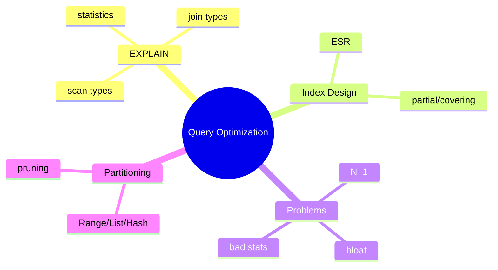
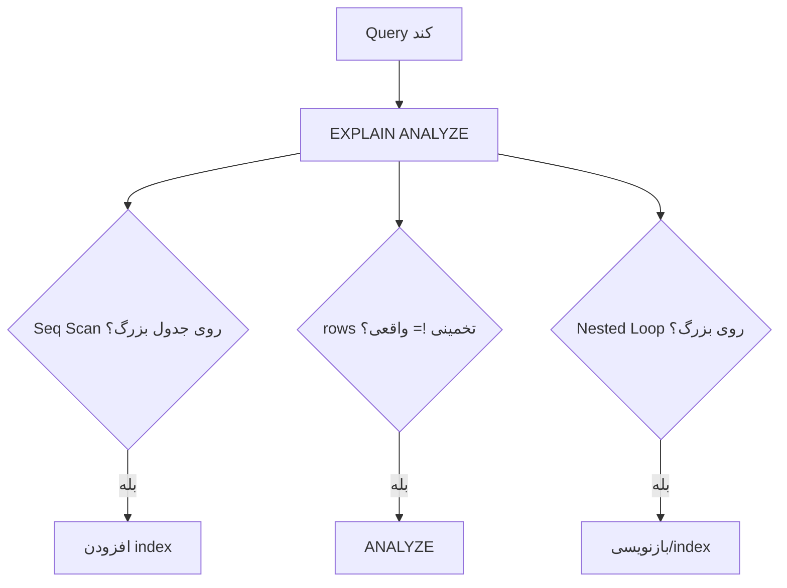

# Query Optimization عمیق — EXPLAIN، Plan Nodes، Index Design، Partitioning

> تحلیل عمیق query plan و طراحی index پیشرفته. مهارت کلیدی برای حل مشکلات performance واقعی. این فایل با دیاگرام گسترش یافته.

## فهرست
- [نقشه‌ی ذهنی](#نقشه‌ی-ذهنی)
- [📖 مفاهیم](#-مفاهیم)
- [🎯 سوالات مصاحبه](#-سوالات-مصاحبه)
- [⚠️ اشتباهات رایج](#️-اشتباهات-رایج)
- [🔗 ارتباط با سایر مفاهیم](#-ارتباط-با-سایر-مفاهیم)

---

## نقشه‌ی ذهنی



---

## فرایند دیباگ query کند



---

## 📖 مفاهیم

### EXPLAIN و خواندن Plan Nodes

**توضیح:**

`EXPLAIN (ANALYZE, BUFFERS)`. node: **Seq Scan** (بد)، **Index Scan**، **Index Only Scan** (بهترین)، **Bitmap Scan**، Nested Loop (small)، Hash Join (large)، Merge Join (sorted). `cost=X..Y`، `actual time=...rows=...`. اختلاف rows تخمینی/واقعی = آمار قدیمی.

**مثال کد:**

```sql
EXPLAIN (ANALYZE, BUFFERS)
SELECT u.name, COUNT(o.id) FROM users u LEFT JOIN orders o ON o.user_id = u.id
WHERE u.created_at > '2024-01-01' GROUP BY u.name;
```

**نکات کلیدی:**

- `BUFFERS` مقدار I/O را نشان می‌دهد.
- Nested Loop روی نتیجه‌ی بزرگ = مشکل.
- اختلاف rows → `ANALYZE`.

---

### Index Design پیشرفته

**توضیح:**

Composite (**ESR**: Equality, Sort, Range)، Partial، Covering (`INCLUDE`)، Expression.

**مثال کد:**

```sql
CREATE INDEX idx_orders ON orders(status, created_at DESC); -- equality، range
CREATE INDEX idx_active ON users(email) WHERE active = true; -- partial
CREATE INDEX idx_cover ON orders(user_id) INCLUDE (amount, status); -- covering
CREATE INDEX idx_lower ON users(LOWER(email)); -- expression
```

**نکات کلیدی:**

- ESR برای ترتیب composite.
- partial برای فیلتر ثابت.
- expression برای function در WHERE.

---

### Common Performance Problems & Partitioning

**توضیح:**

N+1، Missing Index، Over-indexing، Bloat (VACUUM)، Lock Contention، Bad Statistics. **Partitioning** (Range/List/Hash) → **partition pruning** (فقط partition مرتبط)، drop partition آسان، VACUUM سریع‌تر.

**مثال کد:**

```sql
CREATE TABLE orders (id BIGINT, created_at TIMESTAMP, amount DECIMAL)
    PARTITION BY RANGE (created_at);
CREATE TABLE orders_2024 PARTITION OF orders FOR VALUES FROM ('2024-01-01') TO ('2025-01-01');
```

**نکات کلیدی:**

- partition pruning فقط partition مرتبط را اسکن می‌کند.
- drop partition برای حذف داده‌ی قدیمی سریع‌تر از DELETE.

---

## 🎯 سوالات مصاحبه

### سوال ۱: یک query کند را چطور دیباگ می‌کنی؟

**سطح:** Senior / Lead
**تکرار:** خیلی زیاد

**جواب کامل:**

(۱) `EXPLAIN (ANALYZE, BUFFERS)`. (۲) Seq Scan روی بزرگ → index. (۳) اختلاف rows تخمینی/واقعی → `ANALYZE`. (۴) Nested Loop روی بزرگ → بد. (۵) BUFFERS (read بالا = cache نیست). (۶) چرا index استفاده نمی‌شود (function، type mismatch، selectivity). (۷) N+1 با p6spy/pg_stat_statements. قبل/بعد با EXPLAIN مقایسه کنید.

**نکته مصاحبه:**

Lead فرایند سیستماتیک دارد. Follow-up: «چرا index استفاده نمی‌شود؟»

---

### سوال ۲: partition pruning چیست؟

**سطح:** Senior / Lead
**تکرار:** متوسط

**جواب کامل:**

planner فقط partitionهای مرتبط با شرط را اسکن می‌کند. مزایا: داده‌ی کمتر، index هر partition کوچک‌تر، drop partition آسان. شرط: query روی partition key وگرنه همه اسکن می‌شوند.

**نکته مصاحبه:**

Senior به شرط «query روی partition key» اشاره می‌کند.

---

### سوال ۳: bloat چیست و چطور مقابله؟

**سطح:** Senior
**تکرار:** متوسط

**جواب کامل:**

dead tupleها (UPDATE/DELETE با MVCC) فضا اشغال می‌کنند → جدول/index بزرگ و کند. مقابله: autovacuum tuning، `VACUUM` (reuse، نه به OS)، `VACUUM FULL` (به OS اما قفل → `pg_repack`)، رصد با `pg_stat_user_tables`. پیشگیری: کاهش UPDATE غیرضروری.

**نکته مصاحبه:**

Senior به pg_repack اشاره می‌کند.

---

## ⚠️ اشتباهات رایج

### اشتباه ۱: index بدون ESR

```sql
-- ❌
CREATE INDEX ON orders(created_at, status);
```

```sql
-- ✅
CREATE INDEX ON orders(status, created_at);
```

**توضیح:** ESR: Equality، Sort، Range.

---

### اشتباه ۲: query روی غیر partition key

```sql
-- ❌ pruning نمی‌شود
SELECT * FROM orders WHERE customer_id = 5;
```

```sql
-- ✅
SELECT * FROM orders WHERE created_at >= '2024-06-01' AND customer_id = 5;
```

**توضیح:** بدون partition key در شرط، pruning کار نمی‌کند.

---

### اشتباه ۳: VACUUM FULL در production

```sql
-- ❌ قفل جدول
VACUUM FULL orders;
```

```text
✅ pg_repack
```

**توضیح:** `VACUUM FULL` exclusive lock می‌گیرد.

---

## 🔗 ارتباط با سایر مفاهیم

- با **Indexing (3.2)** و **PostgreSQL MVCC (3.3)**.
- N+1 با **Spring Data JPA (2.4)**.
- partitioning با **scaling (6.2)** و **MongoDB sharding (مقایسه)**.
- bloat با **MVCC/VACUUM (3.3)**.
