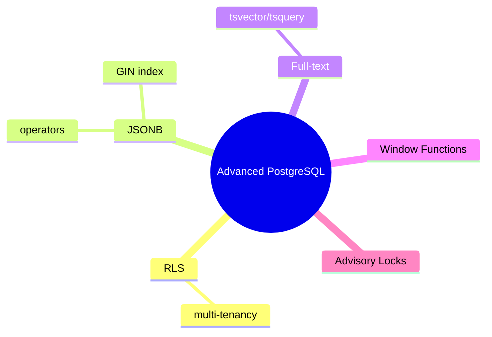
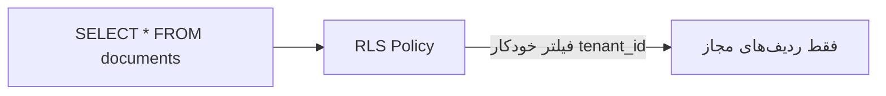

# Advanced PostgreSQL — RLS، JSONB، Full-Text، Window Functions، Advisory Locks

> ویژگی‌های پیشرفته‌ی PostgreSQL که آن را از سایر RDBMSها متمایز می‌کند. این فایل با دیاگرام گسترش یافته.

## فهرست
- [نقشه‌ی ذهنی](#نقشه‌ی-ذهنی)
- [📖 مفاهیم](#-مفاهیم)
- [🎯 سوالات مصاحبه](#-سوالات-مصاحبه)
- [⚠️ اشتباهات رایج](#️-اشتباهات-رایج)
- [🔗 ارتباط با سایر مفاهیم](#-ارتباط-با-سایر-مفاهیم)

---

## نقشه‌ی ذهنی



---

## 📖 مفاهیم

### Row-Level Security (RLS)

**توضیح:**

کنترل دسترسی سطح **ردیف** در خود DB. با `CREATE POLICY` و شرط (`owner_id = current_setting('app.user_id')`). برای multi-tenancy (shared schema) و دفاع در عمق.



**مثال کد:**

```sql
ALTER TABLE documents ENABLE ROW LEVEL SECURITY;
CREATE POLICY tenant_isolation ON documents
    USING (tenant_id = current_setting('app.tenant_id')::BIGINT);
-- اپ: SET app.tenant_id = '5';
```

**نکات کلیدی:**

- RLS امنیت را در DB enforce می‌کند.
- اپ باید context را در session set کند.

---

### JSONB Operations & Indexing

**توضیح:**

`@>` (containment)، `->`/`->>`، `#>>`، `?`، `||`. index با GIN.

**مثال کد:**

```sql
CREATE INDEX idx_meta ON products USING GIN (metadata);
SELECT * FROM products WHERE metadata @> '{"category": "electronics"}';
UPDATE products SET metadata = metadata || '{"discount": 10}';
```

**نکات کلیدی:**

- `@>` از GIN استفاده می‌کند.
- برای کلید خاص پرquery، expression index.

---

### Full-Text Search & Window Functions

**توضیح:**

`tsvector`/`tsquery`/`@@`/`ts_rank` با ستون generated + GIN. window functions پیشرفته (running total، LAG، RANK، NTILE).

**مثال کد:**

```sql
ALTER TABLE articles ADD COLUMN tsv tsvector
    GENERATED ALWAYS AS (to_tsvector('english', title || ' ' || body)) STORED;
CREATE INDEX idx_fts ON articles USING GIN (tsv);
SELECT * FROM articles WHERE tsv @@ to_tsquery('english', 'spring & java')
    ORDER BY ts_rank(tsv, to_tsquery('english', 'spring & java')) DESC;
```

**نکات کلیدی:**

- full-text داخلی برای search ساده کافی (نیاز Elasticsearch نیست).
- برای پیچیده/مقیاس بالا، Elasticsearch.

---

### Advisory Locks

**توضیح:**

قفل application-level (نه گره به ردیف). `pg_advisory_lock` (session)، `pg_advisory_xact_lock` (transaction)، `pg_try_advisory_lock` (non-blocking).

**مثال کد:**

```sql
SELECT pg_try_advisory_lock(hashtext('nightly-report')); -- اجرای تک‌نمونه‌ای job
```

**نکات کلیدی:**

- برای هماهنگی توزیع‌شده‌ی سبک (scheduler، leader election).
- transaction-level خودکار آزاد می‌شود.

---

## 🎯 سوالات مصاحبه

### سوال ۱: RLS چیست و کجا؟

**سطح:** Senior / Lead
**تکرار:** متوسط

**جواب کامل:**

کنترل دسترسی سطح ردیف در PostgreSQL؛ هر query خودکار فقط ردیف‌های مجاز را برمی‌گرداند. کاربرد: **multi-tenancy shared schema** — حتی اگر کد فراموش کند فیلتر کند (دفاع در عمق برابر IDOR). اپ context را set می‌کند. trade-off: پیچیدگی و تله‌ی context در connection pool (خطر نشت بین requestها).

**نکته مصاحبه:**

Lead به تله‌ی pool اشاره می‌کند.

---

### سوال ۲: PostgreSQL full-text در برابر Elasticsearch؟

**سطح:** Senior / Lead
**تکرار:** متوسط

**جواب کامل:**

PG full-text برای ساده تا متوسط کافی (بدون زیرساخت جدا، consistency با داده). Elasticsearch برای حجم/query بالا، relevance پیشرفته، fuzzy، faceted، چندزبانه. trade-off: ES زیرساخت جدا، sync (CDC)، eventual consistency. با PG شروع کنید، در صورت نیاز ES.

**نکته مصاحبه:**

Lead «با PG شروع کن» را توصیه می‌کند.

---

### سوال ۳: advisory lock کجا مفید؟

**سطح:** Senior
**تکرار:** کم

**جواب کامل:**

قفل application-level. کاربرد: اطمینان از اجرای تک‌نمونه‌ای scheduled job (همه trigger می‌کنند، فقط آن‌که lock می‌گیرد اجرا می‌کند)، leader election ساده. مزیت بر Redis lock: اگر PostgreSQL دارید، بدون زیرساخت اضافه. transaction-level خودکار آزاد می‌شود.

**نکته مصاحبه:**

Senior به single-instance job اشاره می‌کند.

---

## ⚠️ اشتباهات رایج

### اشتباه ۱: RLS context در pool reset نشود

```text
❌ tenant_id از request قبلی در pooled connection
✅ context را در ابتدای هر transaction set/reset کنید
```

**توضیح:** pooled connection reuse می‌شود.

---

### اشتباه ۲: full-text بدون GIN

```sql
-- ❌
WHERE to_tsvector('english', body) @@ to_tsquery('java');
```

```sql
-- ✅ ستون generated + GIN
```

**توضیح:** بدون index/precompute کند است.

---

### اشتباه ۳: فراموشی unlock در session advisory lock

```sql
-- ❌
SELECT pg_advisory_lock(1);
```

```sql
-- ✅
SELECT pg_advisory_xact_lock(1);
```

**توضیح:** session lock تا disconnect می‌ماند.

---

## 🔗 ارتباط با سایر مفاهیم

- RLS با **multi-tenancy (14.3)** و **IDOR (7.1)**.
- JSONB با **MongoDB (4)**.
- full-text با **Elasticsearch (17)**.
- advisory lock با **Redis lock (9.1)**.
