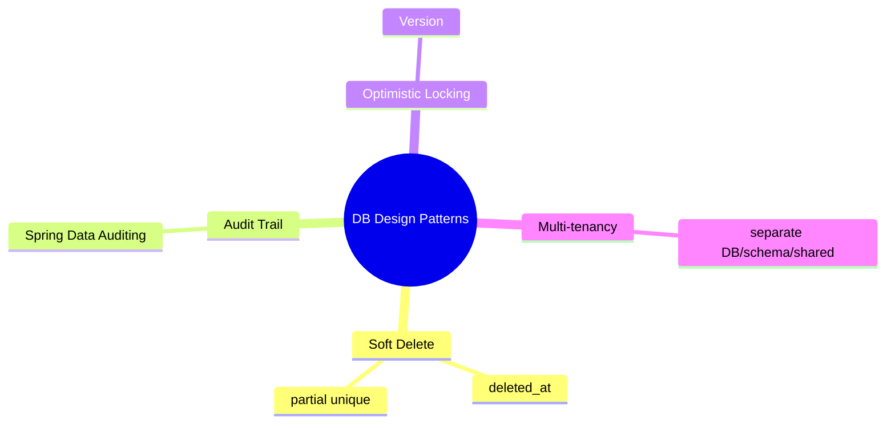
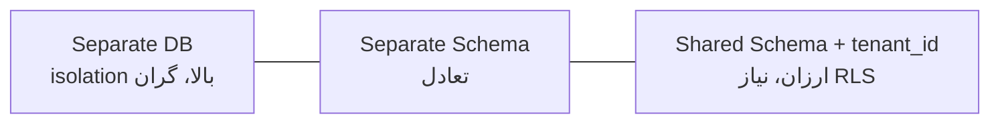

# Database Design Patterns — Soft Delete، Audit، Optimistic Locking، Multi-tenancy

> الگوهای طراحی DB که در هر سیستم enterprise تکرار می‌شوند. این فایل با دیاگرام گسترش یافته.

## فهرست
- [نقشه‌ی ذهنی](#نقشه‌ی-ذهنی)
- [📖 مفاهیم](#-مفاهیم)
- [🎯 سوالات مصاحبه](#-سوالات-مصاحبه)
- [⚠️ اشتباهات رایج](#️-اشتباهات-رایج)
- [🔗 ارتباط با سایر مفاهیم](#-ارتباط-با-سایر-مفاهیم)

---

## نقشه‌ی ذهنی



---

## Multi-tenancy patterns (طیف isolation/cost)



---

## 📖 مفاهیم

### Soft Delete

**توضیح:**

به‌جای حذف فیزیکی، `deleted_at`. مزیت: بازیابی، audit. عیب: پیچیدگی query، رشد، مشکل unique.

**مثال کد:**

```sql
ALTER TABLE users ADD COLUMN deleted_at TIMESTAMP;
CREATE UNIQUE INDEX uq_email ON users(email) WHERE deleted_at IS NULL; -- partial unique
-- Hibernate: @SQLRestriction("deleted_at IS NULL")
```

**نکات کلیدی:**

- partial unique برای حل تداخل unique.
- همه‌ی queryها باید فیلتر کنند (Hibernate filter خودکار).

---

### Audit Trail

**توضیح:**

تاریخچه‌ی تغییرات. ستون‌های audit (Spring Data Auditing)، جدول audit_log (با JSONB)، یا temporal tables.

**مثال کد:**

```java
@EntityListeners(AuditingEntityListener.class)
class Order {
    @CreatedDate Instant createdAt;
    @LastModifiedDate Instant updatedAt;
    @CreatedBy String createdBy;
}
// @EnableJpaAuditing
```

**نکات کلیدی:**

- Spring Data Auditing برای ستون‌های ساده.
- audit_log جدا (با JSONB) برای تاریخچه‌ی کامل.

---

### Optimistic Locking

**توضیح:**

ستون `version`؛ update فقط اگر version مطابق. در JPA `@Version`. برای جلوگیری از lost update.

**مثال کد:**

```sql
UPDATE products SET name='new', version=version+1 WHERE id=1 AND version=5;
-- اگر 0 row → conflict
```

**نکات کلیدی:**

- optimistic برای تداخل کم؛ نیاز retry.
- `@Version` خودکار.

---

### Multi-tenancy Patterns

**توضیح:**

(۱) Separate DB (isolation بالا، گران). (۲) Separate Schema (تعادل). (۳) Shared Schema + `tenant_id` (ارزان، نیاز RLS، خطر نشت).

**نکات کلیدی:**

- shared schema ارزان اما نیاز RLS/فیلتر دقیق.
- separate DB برای isolation/compliance بالا.

---

## 🎯 سوالات مصاحبه

### سوال ۱: soft delete چه مشکلاتی دارد و حل؟

**سطح:** Senior
**تکرار:** متوسط

**جواب کامل:**

(۱) همه‌ی queryها باید فیلتر → Hibernate `@SQLRestriction`. (۲) unique constraint (رکورد حذف‌شده email را اشغال) → partial unique index. (۳) رشد جدول → archiving. (۴) foreign key/cascade پیچیده. (۵) گزارش‌ها باید آگاه باشند. گاهی فقط برای جداول خاص.

**نکته مصاحبه:**

Senior به partial unique اشاره می‌کند.

---

### سوال ۲: multi-tenancy patterns را مقایسه کن.

**سطح:** Lead
**تکرار:** متوسط

**جواب کامل:**

Separate DB: isolation بالا (backup/compliance per-tenant، blast radius محدود)، گران. Separate Schema: تعادل، اما migration روی همه. Shared Schema: ارزان/مقیاس‌پذیر برای tenant زیاد کوچک، اما isolation ضعیف (RLS، خطر نشت، noisy neighbor). بر اساس تعداد/اندازه، compliance، بودجه.

**نکته مصاحبه:**

Lead trade-off هر سه را می‌داند.

---

### سوال ۳: optimistic locking چطور lost update را حل می‌کند؟

**سطح:** Senior
**تکرار:** متوسط

**جواب کامل:**

lost update: دو تراکنش همزمان می‌خوانند/تغییر/می‌نویسند؛ دومی اولی را پاک می‌کند. optimistic با `WHERE version=<خوانده‌شده>` و افزایش version؛ اگر کسی تغییر داده، 0 row → conflict (`OptimisticLockException`) → retry. مزیت بر pessimistic: بدون قفل، concurrency بالا، read-heavy.

**نکته مصاحبه:**

Senior به نیاز retry اشاره می‌کند.

---

## ⚠️ اشتباهات رایج

### اشتباه ۱: soft delete بدون partial unique

```sql
-- ❌
UNIQUE (email)
```

```sql
-- ✅
CREATE UNIQUE INDEX ON users(email) WHERE deleted_at IS NULL;
```

**توضیح:** رکورد soft-deleted unique را اشغال می‌کند.

---

### اشتباه ۲: shared schema بدون RLS

```text
❌ تکیه بر فیلتر app → یک باگ = نشت
✅ RLS دفاع در عمق
```

**توضیح:** isolation نباید فقط به کد تکیه کند.

---

### اشتباه ۳: optimistic بدون retry

```text
❌ OptimisticLockException مستقیم به کاربر
✅ retry محدود
```

**توضیح:** conflict گذرا را با retry مدیریت کنید.

---

## 🔗 ارتباط با سایر مفاهیم

- optimistic locking با **Spring Data locking (2.4)**.
- multi-tenancy با **RLS (14.2)** و **Keycloak realm (7.2)**.
- audit با **Spring Data Auditing** و **Event Sourcing (6.1)**.
- soft delete با Hibernate filters.
