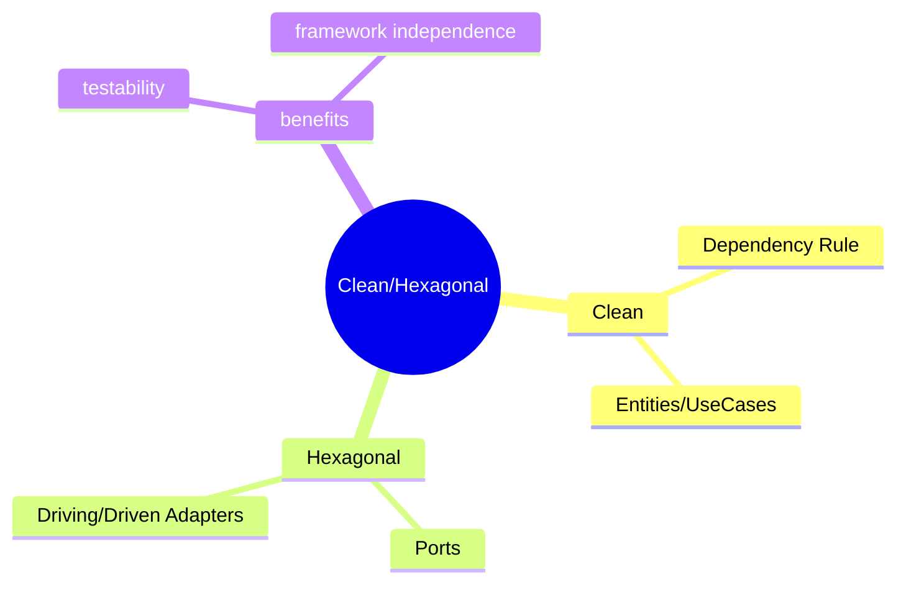
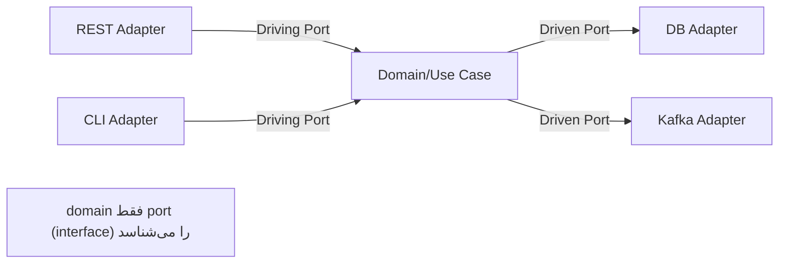

# Clean Architecture / Hexagonal (Ports & Adapters)

> معماری لایه‌ای که domain را از framework جدا می‌کند. سوال محبوب مصاحبه‌های Lead. این فایل با دیاگرام گسترش یافته.

## فهرست
- [نقشه‌ی ذهنی](#نقشه‌ی-ذهنی)
- [📖 مفاهیم](#-مفاهیم)
- [🎯 سوالات مصاحبه](#-سوالات-مصاحبه)
- [⚠️ اشتباهات رایج](#️-اشتباهات-رایج)
- [🔗 ارتباط با سایر مفاهیم](#-ارتباط-با-سایر-مفاهیم)

---

## نقشه‌ی ذهنی



---

## معماری Hexagonal



---

## 📖 مفاهیم

### Clean Architecture

**توضیح:**

لایه‌های متحدالمرکز با **Dependency Rule**: وابستگی همیشه به **داخل**. Frameworks → Interface Adapters → Use Cases → Entities. Entities بدون وابستگی خارجی؛ framework بیرونی‌ترین.

**نکات کلیدی:**

- Dependency Rule: وابستگی فقط به داخل.
- Entities/Use Cases نباید به framework وابسته باشند.

---

### Hexagonal Architecture (Ports & Adapters)

**توضیح:**

domain در مرکز با **Ports** (interface در domain) و **Adapters** (پیاده‌سازی بیرون). **Driving Adapters** (REST، CLI) و **Driven Adapters** (DB، Broker). domain فقط port را می‌شناسد — DIP.

**مثال کد:**

```java
// domain/port/out
public interface OrderRepository { void save(Order order); }

// domain/usecase
public class PlaceOrderUseCase {
    private final OrderRepository repository; // port، نه JPA
    public PlaceOrderUseCase(OrderRepository repository) { this.repository = repository; }
    public void execute(Order order) { order.validate(); repository.save(order); }
}

// adapter/out/persistence
@Component
class JpaOrderRepository implements OrderRepository { public void save(Order order) { /* JPA */ } }
```

**نکات کلیدی:**

- port در domain، adapter بیرون (DIP).
- domain به Spring/JPA وابسته نیست → تست خالص.
- structure: domain/port/in,out؛ application/usecase؛ adapter/in,out.

---

## 🎯 سوالات مصاحبه

### سوال ۱: Hexagonal چه مزیتی و trade-off؟

**سطح:** Lead
**تکرار:** زیاد

**جواب کامل:**

جدا کردن business logic از framework. مزایا: (۱) تست خالص (mock port، بدون Spring/DB). (۲) adapter قابل‌تعویض (JPA→MongoDB بدون لمس domain). (۳) مقاومت در برابر lock-in. trade-off: **boilerplate** (interface، mapping)، پیچیدگی، برای CRUD ساده over-engineering. برای domain پیچیده‌ی core ارزش دارد.

**نکته مصاحبه:**

Lead به boilerplate و over-engineering اشاره می‌کند.

---

### سوال ۲: Dependency Rule و رابطه با DIP؟

**سطح:** Senior / Lead
**تکرار:** متوسط

**جواب کامل:**

وابستگی‌ها به **داخل**. اما Use Case چطور persist می‌کند بدون وابستگی به DB؟ با **Dependency Inversion**: Use Case یک **port** تعریف می‌کند و adapter بیرونی آن را implement می‌کند. جهت وابستگی source-code از بیرون به داخل (adapter به port) در حالی که جریان کنترل از بیرون می‌آید. این DIP است که Spring DI پیاده می‌کند.

**نکته مصاحبه:**

Lead تفاوت جهت وابستگی با جریان کنترل را می‌فهمد.

---

## ⚠️ اشتباهات رایج

### اشتباه ۱: نشت JPA entity به domain

```java
// ❌
class UseCase { JpaUserRepository repo; }
```

```java
// ✅
class UseCase { UserRepository repo; } // interface + mapping در adapter
```

**توضیح:** نشت framework کل مزیت را خنثی می‌کند.

---

### اشتباه ۲: Hexagonal برای CRUD ساده

```text
❌ لایه‌های زیاد برای CRUD ساده
✅ معماری سبک‌تر
```

**توضیح:** پیچیدگی باید با ارزش دامنه متناسب باشد.

---

## 🔗 ارتباط با سایر مفاهیم

- با **SOLID/DIP (1.1)** و **Spring DI (2.1)**.
- ports با **DDD repository (6.1)**.
- domain model با **records/Value Object (1.4)**.
- مقاومت در برابر framework با **testing (12.5)**.
