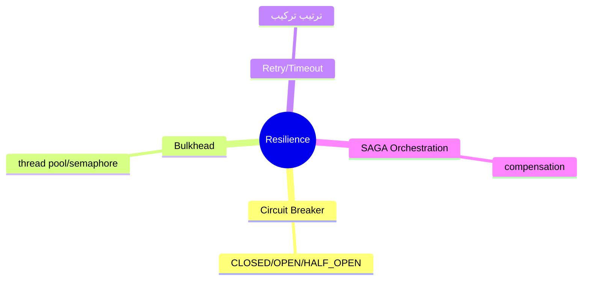
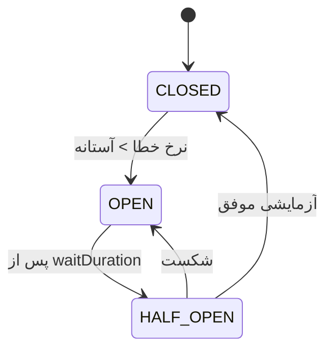
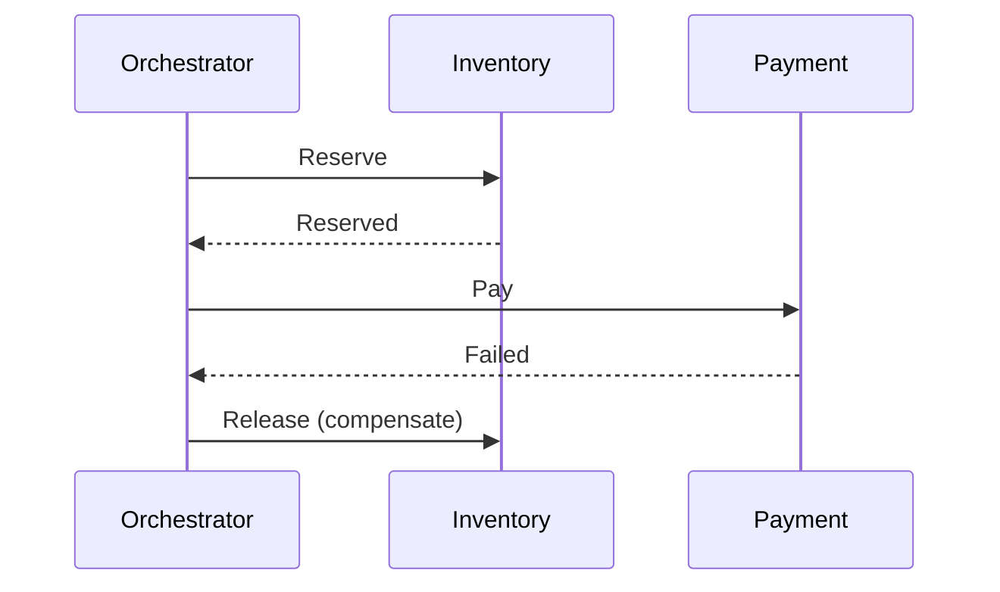

# Resilience Patterns عمیق — Circuit Breaker، Bulkhead، Retry، SAGA Orchestration

> الگوهای مقاومت در سیستم توزیع‌شده. ترتیب ترکیب و طراحی fallback در سطح Lead پرسیده می‌شود. این فایل با دیاگرام گسترش یافته.

## فهرست
- [نقشه‌ی ذهنی](#نقشه‌ی-ذهنی)
- [📖 مفاهیم](#-مفاهیم)
- [🎯 سوالات مصاحبه](#-سوالات-مصاحبه)
- [⚠️ اشتباهات رایج](#️-اشتباهات-رایج)
- [🔗 ارتباط با سایر مفاهیم](#-ارتباط-با-سایر-مفاهیم)

---

## نقشه‌ی ذهنی



---

## Circuit Breaker State Machine



---

## 📖 مفاهیم

### Circuit Breaker States

**توضیح:**

CLOSED → OPEN (نرخ خطا)، OPEN → HALF_OPEN (waitDuration)، HALF_OPEN → CLOSED/OPEN. پیکربندی: `failureRateThreshold`, `slowCallRateThreshold`, `waitDurationInOpenState`, `slidingWindowSize`, `ignoreExceptions`.

**مثال کد:**

```java
CircuitBreakerConfig.custom()
    .failureRateThreshold(50).slowCallRateThreshold(80)
    .waitDurationInOpenState(Duration.ofSeconds(30))
    .slidingWindowSize(10)
    .ignoreExceptions(BusinessException.class) // خطای کسب‌وکار نباید باز کند
    .build();
```

**نکات کلیدی:**

- `ignoreExceptions` برای خطای کسب‌وکار.
- sliding window count-based یا time-based.

---

### Bulkhead & ترتیب ترکیب

**توضیح:**

**Bulkhead** ایزولاسیون منابع (Thread Pool یا Semaphore). **ترتیب ترکیب**: `Retry(CircuitBreaker(RateLimiter(TimeLimiter(call))))`.

**مثال کد:**

```java
@CircuitBreaker(name = "payment", fallbackMethod = "fallback")
@Retry(name = "payment")
@Bulkhead(name = "payment")
@TimeLimiter(name = "payment")
public CompletableFuture<Result> charge(Request req) { return null; }

public CompletableFuture<Result> fallback(Request req, Throwable t) {
    return CompletableFuture.completedFuture(Result.degraded());
}
```

**نکات کلیدی:**

- Bulkhead از starvation/cascade جلوگیری می‌کند.
- fallback باید degradation بدهد.

---

### SAGA Orchestration

**توضیح:**

orchestrator مرکزی مراحل را هدایت و compensation اجرا می‌کند. visibility بهتر، اما single point.



**نکات کلیدی:**

- orchestration visibility؛ choreography decoupling.
- compensation idempotent و قابل‌اعتماد.

---

## 🎯 سوالات مصاحبه

### سوال ۱: ترتیب ترکیب resilience annotationها چرا مهم؟

**سطح:** Lead
**تکرار:** متوسط

**جواب کامل:**

هر کدام aspect جدا. معمول: `Retry → CircuitBreaker → RateLimiter → TimeLimiter → call`. TimeLimiter داخلی‌ترین (هر تلاش timeout). Retry بیرونی‌تر تا کل چرخه دوباره — اما retry می‌تواند circuit را زودتر باز کند. تصمیم آگاهانه نه پیش‌فرض.

**نکته مصاحبه:**

Lead نشان می‌دهد تصمیم با trade-off است.

---

### سوال ۲: یک fallback خوب چه ویژگی‌هایی دارد؟

**سطح:** Senior / Lead
**تکرار:** متوسط

**جواب کامل:**

(۱) قطعی و سریع (نه وابسته به سرویس خارجی دیگر). (۲) معنادار (cached/default/queue، نه فقط خطا). (۳) context-aware (پرداخت → pending نه failed). (۴) بدون side-effect خطرناک. مثال خوب: سرویس توصیه down → پرفروش‌های عمومی.

**نکته مصاحبه:**

Senior به «fallback نباید به سرویس خارجی وابسته باشد» اشاره می‌کند.

---

### سوال ۳: orchestration در برابر choreography SAGA؟

**سطح:** Lead
**تکرار:** زیاد

**جواب کامل:**

choreography: هر سرویس به رویداد واکنش می‌دهد (decoupling، اما flow پراکنده، debugging سخت، خطر چرخه). orchestration: orchestrator مرکزی (visibility/کنترل، اما coupling/bottleneck). flow ساده → choreography؛ پیچیده با monitoring → orchestration.

**نکته مصاحبه:**

Lead trade-off visibility/coupling را می‌فهمد.

---

## ⚠️ اشتباهات رایج

### اشتباه ۱: circuit breaker باز با خطای کسب‌وکار

```java
// ❌
.recordExceptions(Exception.class)
```

```java
// ✅
.ignoreExceptions(BusinessException.class)
```

**توضیح:** فقط خطای زیرساختی باید باز کند.

---

### اشتباه ۲: fallback وابسته به سرویس خارجی

```java
// ❌
Result fallback(Req r, Throwable t) { return anotherRemoteCall(); }
```

```java
// ✅
Result fallback(Req r, Throwable t) { return Result.cachedOrDefault(); }
```

**توضیح:** fallback باید مستقل و قطعی باشد.

---

## 🔗 ارتباط با سایر مفاهیم

- با **Spring Cloud (2.6)** و **microservices (6.1)**.
- SAGA با **transactions** و **Outbox/Kafka (8.1)**.
- bulkhead با **concurrency**.
- circuit breaker با **System Design cascade failure (6.2)**.
