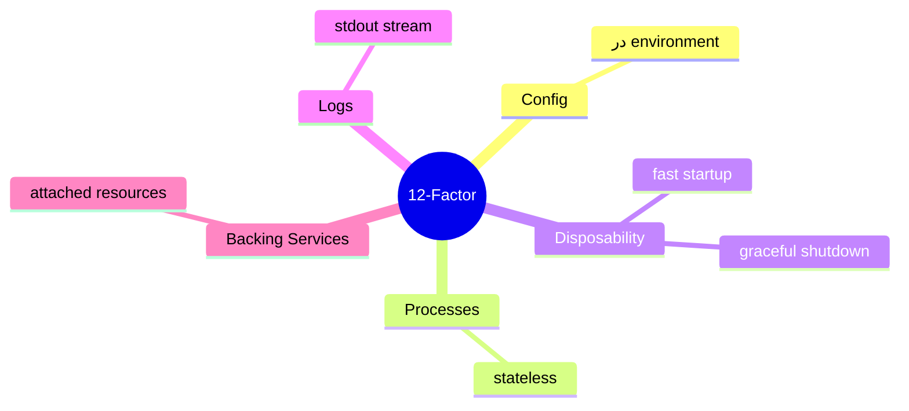

# 12-Factor App

> متدولوژی ساخت اپ‌های cloud-native و مقیاس‌پذیر. اصول کلیدی برای deploy مدرن. این فایل با دیاگرام گسترش یافته.

## فهرست
- [نقشه‌ی ذهنی](#نقشه‌ی-ذهنی)
- [📖 مفاهیم](#-مفاهیم)
- [🎯 سوالات مصاحبه](#-سوالات-مصاحبه)
- [⚠️ اشتباهات رایج](#️-اشتباهات-رایج)
- [🔗 ارتباط با سایر مفاهیم](#-ارتباط-با-سایر-مفاهیم)

---

## نقشه‌ی ذهنی



---

## 📖 مفاهیم

### دوازده اصل

**توضیح:**

1. Codebase (یک repo، چند deploy). 2. Dependencies (صریح، isolate). 3. **Config** (environment). 4. Backing Services (attached). 5. Build/Release/Run (جدا). 6. **Processes** (stateless). 7. Port Binding. 8. Concurrency (process model). 9. **Disposability** (fast startup، graceful shutdown). 10. Dev/Prod Parity. 11. **Logs** (stdout stream). 12. Admin Processes.

**نکات کلیدی:**

- stateless (6) پیش‌نیاز horizontal scaling.
- config در environment (3).
- logs به stdout (11).

---

## 🎯 سوالات مصاحبه

### سوال ۱: کدام اصول برای K8s حیاتی‌ترند؟

**سطح:** Senior / Lead
**تکرار:** متوسط

**جواب کامل:**

(۳) **Config در environment** (ConfigMap/Secret). (۶) **Stateless** (پیش‌نیاز scaling/rolling). (۹) **Disposability** (startup سریع، graceful shutdown با SIGTERM). (۱۱) **Logs به stdout** (Fluent Bit). (۴) **Backing services** (URL قابل‌تعویض). نقض هر کدام با K8s تضاد دارد.

**نکته مصاحبه:**

Lead به stateless، graceful shutdown، logs اشاره می‌کند.

---

### سوال ۲: چرا stateless و چطور state را مدیریت می‌کنی؟

**سطح:** Senior
**تکرار:** متوسط

**جواب کامل:**

در محیط چند instance، load balancer هر request را به یکی می‌فرستد؛ state در حافظه‌ی یک instance دیده نمی‌شود، و instanceها هر لحظه kill می‌شوند. state در backing service خارجی (session در Redis، داده در DB، فایل در S3). sticky session workaround ضعیف.

**نکته مصاحبه:**

Senior به session در Redis و مشکل sticky session اشاره می‌کند.

---

## ⚠️ اشتباهات رایج

### اشتباه ۱: state در حافظه‌ی process

```text
❌ session/cache در حافظه
✅ Redis/DB خارجی
```

**توضیح:** state محلی scaling را می‌شکند.

---

### اشتباه ۲: config در کد

```text
❌ hardcode URL/credential
✅ environment/ConfigMap
```

**توضیح:** config باید per-environment باشد.

---

### اشتباه ۳: log به فایل در container

```text
❌ فایل در container (با kill pod گم می‌شود)
✅ stdout، Fluent Bit
```

**توضیح:** فایل در container ephemeral است.

---

## 🔗 ارتباط با سایر مفاهیم

- با **Kubernetes (10.2)** و **Docker (10.1)**.
- config با **Spring Boot (2.2)** و **Vault (16.5)**.
- stateless با **scaling (6.2)** و **Redis session (9.1)**.
- logs با **observability (10.4)**.
