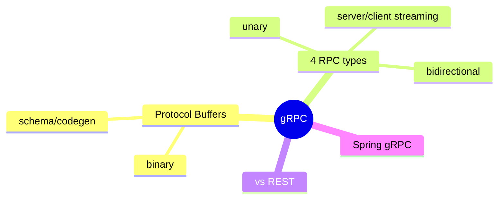
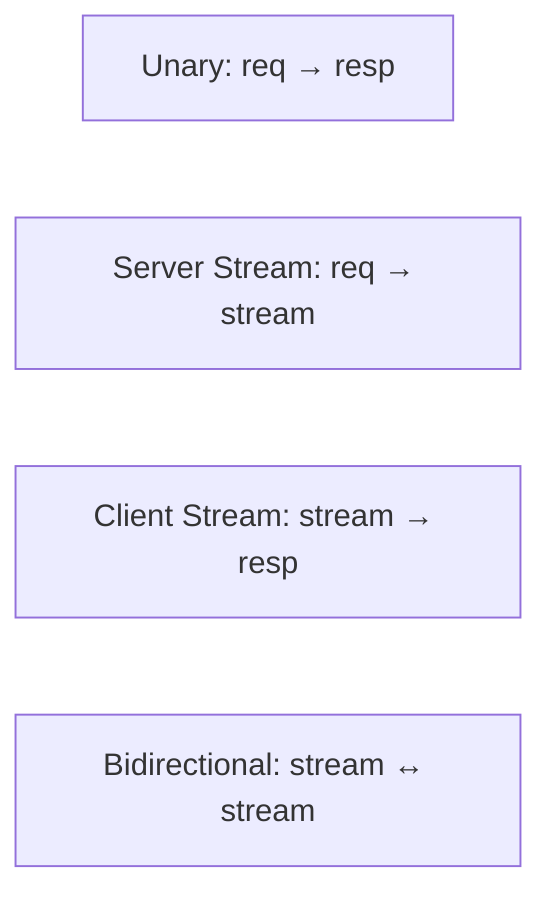

# gRPC — Protocol Buffers، Streaming، vs REST

> gRPC برای ارتباط پرکارایی بین‌سرویسی. درک مزایا بر REST و انواع streaming مهم است. این فایل با دیاگرام گسترش یافته.

## فهرست
- [نقشه‌ی ذهنی](#نقشه‌ی-ذهنی)
- [📖 مفاهیم](#-مفاهیم)
- [🎯 سوالات مصاحبه](#-سوالات-مصاحبه)
- [⚠️ اشتباهات رایج](#️-اشتباهات-رایج)
- [🔗 ارتباط با سایر مفاهیم](#-ارتباط-با-سایر-مفاهیم)

---

## نقشه‌ی ذهنی



---

## انواع RPC



---

## 📖 مفاهیم

### مفاهیم gRPC

**توضیح:**

RPC پرکارایی با **Protocol Buffers** (باینری، schema) روی **HTTP/2**. سرویس در `.proto`، code generation. strongly-typed.

**مثال کد:**

```protobuf
syntax = "proto3";
service UserService {
    rpc GetUser (GetUserRequest) returns (User);              // unary
    rpc ListUsers (ListUsersRequest) returns (stream User);   // server streaming
    rpc CreateUsers (stream CreateUserRequest) returns (Summary); // client streaming
    rpc Chat (stream ChatMessage) returns (stream ChatMessage);   // bidirectional
}
message User { int64 id = 1; string name = 2; }
```

**نکات کلیدی:**

- field number برای schema evolution (reuse نکنید).
- code generation از contract.

---

### 4 نوع RPC

**توضیح:**

Unary، Server Streaming (لیست بزرگ/feed)، Client Streaming (upload)، Bidirectional (chat، real-time). همه روی HTTP/2 با multiplexing.

**نکات کلیدی:**

- streaming روی HTTP/2 بدون connection جدید.
- bidirectional برای real-time.

---

### مزایا vs REST & Spring gRPC

**توضیح:**

مزایا: باینری (سریع/فشرده)، typed (contract)، HTTP/2 (multiplexing/streaming)، codegen. عیب: غیرخوانا، نیاز tooling، مرورگر محدود (gRPC-Web). در Spring `@GrpcService`/`@GrpcClient`.

**نکات کلیدی:**

- gRPC برای داخلی پرترافیک؛ REST برای عمومی.
- مرورگر gRPC خام را پشتیبانی نمی‌کند.

---

## 🎯 سوالات مصاحبه

### سوال ۱: gRPC در برابر REST؟

**سطح:** Senior / Lead
**تکرار:** زیاد

**جواب کامل:**

gRPC برای **داخلی پرترافیک**: باینری سریع، typed با contract، HTTP/2 multiplexing/streaming، codegen. REST برای **عمومی**: خوانا، universal، cache، debug آسان، مرورگر. trade-off: gRPC tooling/یادگیری، gRPC-Web در مرورگر، غیرخوانا. microservice داخلی → gRPC؛ عمومی → REST. اغلب هر دو (gRPC داخلی، REST در gateway).

**نکته مصاحبه:**

Lead «gRPC داخلی، REST عمومی» را با دلیل می‌گوید.

---

### سوال ۲: چهار نوع RPC را توضیح بده.

**سطح:** Senior
**تکرار:** متوسط

**جواب کامل:**

Unary (req→resp، CRUD). Server Streaming (req→stream، feed/داده‌ی بزرگ). Client Streaming (stream→resp، upload/batch). Bidirectional (هر دو stream، chat/real-time). همه روی HTTP/2 multiplexing — مزیت بر REST که برای streaming به SSE/WebSocket نیاز دارد.

**نکته مصاحبه:**

Senior هر چهار را با مثال می‌دهد.

---

## ⚠️ اشتباهات رایج

### اشتباه ۱: gRPC برای API عمومی مرورگری

```text
❌ gRPC مستقیم از مرورگر
✅ REST/GraphQL یا gRPC-Web با proxy
```

**توضیح:** مرورگر gRPC خام را پشتیبانی نمی‌کند.

---

### اشتباه ۲: reuse field number در proto

```protobuf
// ❌ reuse number → ناسازگاری
// ✅ reserved 3;
```

**توضیح:** field number قدیمی با داده‌ی قدیمی تداخل می‌کند.

---

## 🔗 ارتباط با سایر مفاهیم

- با **Protocol Buffers (12.4)** و **microservices (6.1)**.
- streaming با **WebSocket/SSE (6.2)**.
- contract با **schema evolution (12.4)** و **contract testing (13.5)**.
- REST مقایسه با **API design (19.1)**.
