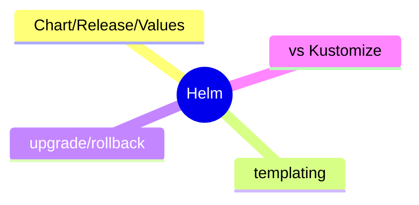
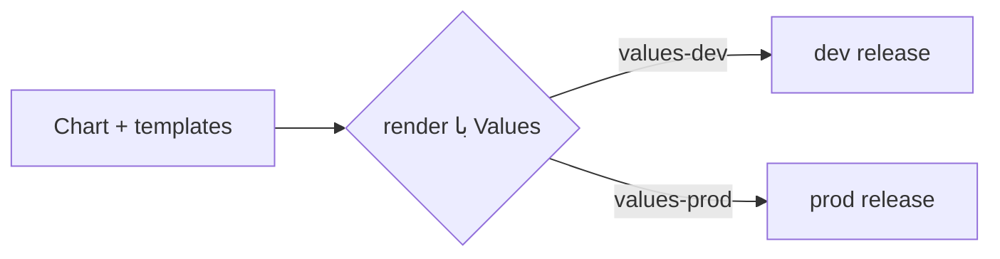

# Helm — Package Manager برای Kubernetes

> Helm استقرار اپ‌های K8s را با templating و versioning مدیریت می‌کند. این فایل با دیاگرام گسترش یافته.

## فهرست
- [نقشه‌ی ذهنی](#نقشه‌ی-ذهنی)
- [📖 مفاهیم](#-مفاهیم)
- [🎯 سوالات مصاحبه](#-سوالات-مصاحبه)
- [⚠️ اشتباهات رایج](#️-اشتباهات-رایج)
- [🔗 ارتباط با سایر مفاهیم](#-ارتباط-با-سایر-مفاهیم)

---

## نقشه‌ی ذهنی



---

## 📖 مفاهیم

### مفاهیم اصلی

**توضیح:**

«package manager» برای K8s. **Chart** (بسته‌ی manifest template)، **Release** (نمونه‌ی نصب‌شده)، **Values** (پیکربندی). یک chart با valueهای متفاوت برای هر محیط.



**مثال کد:**

```bash
helm install myapp ./chart -f values-prod.yaml
helm upgrade myapp ./chart --set image.tag=1.2.1
helm rollback myapp 1
helm template myapp ./chart  # render بدون install
```

**نکات کلیدی:**

- یک chart، چند environment.
- `helm rollback` به revision قبلی.
- `helm template`/`--dry-run` برای بررسی.

---

## 🎯 سوالات مصاحبه

### سوال ۱: Helm چه مشکلی حل می‌کند؟

**سطح:** Senior
**تکرار:** متوسط

**جواب کامل:**

بدون Helm، manifest جداگانه برای هر محیط (تکراری). Helm با **templating** یک chart با valueهای متفاوت → DRY. **release management** (نصب، upgrade، rollback، history)، packaging/versioning، dependency. جایگزین: Kustomize (overlay، بدون templating).

**نکته مصاحبه:**

Senior به templating، rollback، Kustomize اشاره می‌کند.

---

### سوال ۲: Helm در برابر Kustomize؟

**سطح:** Senior / Lead
**تکرار:** کم

**جواب کامل:**

Helm templating + package management (قدرتمند، اما template پیچیده). Kustomize overlay (base + patch، declarative خالص، بخشی از kubectl). Helm برای packaging/توزیع و logic پیچیده؛ Kustomize برای customization ساده. می‌توان ترکیب کرد.

**نکته مصاحبه:**

Lead trade-off templating/overlay را می‌فهمد.

---

## ⚠️ اشتباهات رایج

### اشتباه ۱: hardcode value در template

```text
❌ مقدار ثابت در template
✅ همه‌ی متغیرها در values.yaml
```

**توضیح:** hardcode مزیت templating را از بین می‌برد.

---

### اشتباه ۲: عدم dry-run قبل از apply

```bash
# ❌
helm install ...
# ✅
helm install --dry-run
```

**توضیح:** dry-run خطاهای render را نشان می‌دهد.

---

## 🔗 ارتباط با سایر مفاهیم

- با **Kubernetes (10.2)** و **GitOps/ArgoCD (16.3)**.
- values با **12-Factor config (15.3)**.
- جایگزین: Kustomize.
