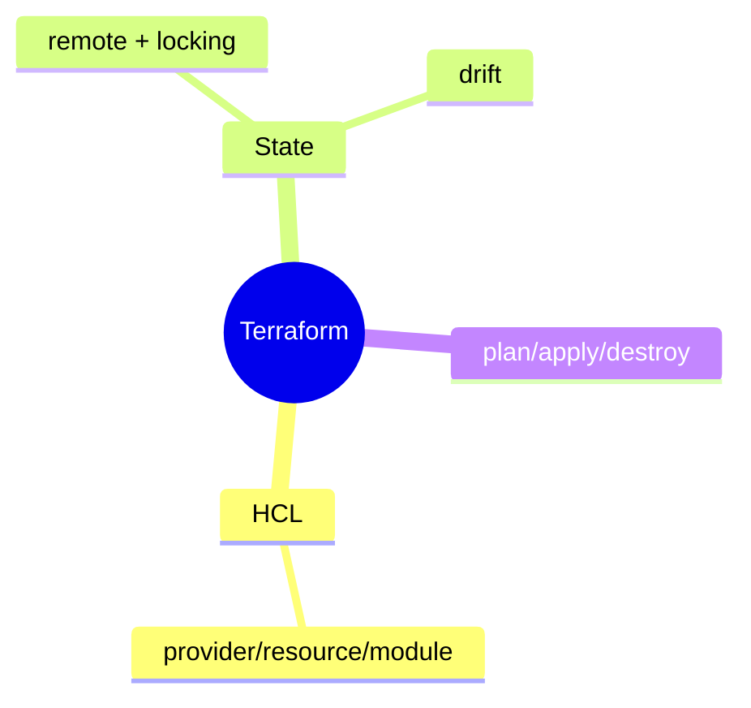
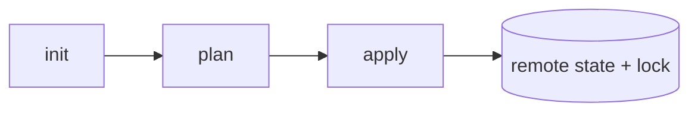

# Terraform عمیق — Providers، State، Modules، Workspaces

> Terraform استاندارد IaC برای provisioning زیرساخت cloud است. state management مهم‌ترین جنبه است. این فایل با دیاگرام گسترش یافته.

## فهرست
- [نقشه‌ی ذهنی](#نقشه‌ی-ذهنی)
- [📖 مفاهیم](#-مفاهیم)
- [🎯 سوالات مصاحبه](#-سوالات-مصاحبه)
- [⚠️ اشتباهات رایج](#️-اشتباهات-رایج)
- [🔗 ارتباط با سایر مفاهیم](#-ارتباط-با-سایر-مفاهیم)

---

## نقشه‌ی ذهنی



---

## 📖 مفاهیم

### مفاهیم اصلی

**توضیح:**

declarative (HCL). `provider`, `resource`, `variable`, `output`, `module`. `init → plan → apply → destroy`. **State** باید remote (S3) با locking (DynamoDB).



**مثال کد:**

```hcl
terraform {
  backend "s3" { bucket = "tf-state"; key = "prod/terraform.tfstate"; dynamodb_table = "tf-lock" }
}
resource "aws_db_instance" "postgres" { engine = "postgres"; engine_version = "17"; multi_az = true }
```

**نکات کلیدی:**

- همیشه `plan` قبل از `apply`.
- module برای reuse.
- Workspaces برای محیط‌های مختلف.

---

### State Management عمیق

**توضیح:**

state حیاتی‌ترین. **remote** (اشتراک)، **locking** (جلوگیری از apply همزمان)، **secret** (رمزنگاری)، **drift** (تغییر دستی → با `plan` تشخیص). `terraform import`.

**نکات کلیدی:**

- remote + locked.
- state ممکن secret داشته باشد.
- drift را با plan تشخیص دهید.

---

## 🎯 سوالات مصاحبه

### سوال ۱: چرا remote state با locking؟

**سطح:** Senior / Lead
**تکرار:** متوسط

**جواب کامل:**

state محلی در تیم: (۱) apply همزمان → corruption → **locking** (DynamoDB). (۲) share نمی‌شود → **remote** (S3). (۳) secret در state → رمزنگاری. corruption state می‌تواند زیرساخت را در وضعیت ناشناخته بگذارد.

**نکته مصاحبه:**

Lead به corruption و secret اشاره می‌کند.

---

### سوال ۲: drift چیست و مدیریت؟

**سطح:** Senior
**تکرار:** متوسط

**جواب کامل:**

تفاوت وضعیت واقعی با state (تغییر دستی). مشکل: apply بعدی undo/رفتار غیرمنتظره. مدیریت: `plan` (تشخیص)، سیاست «همه از طریق Terraform»، `refresh`/import، plan منظم در CI. پیشگیری: محدود کردن دسترسی دستی.

**نکته مصاحبه:**

Senior به «no manual change» اشاره می‌کند.

---

## ⚠️ اشتباهات رایج

### اشتباه ۱: state محلی در تیم

```text
❌ corruption
✅ remote + locking
```

**توضیح:** apply همزمان خطرناک است.

---

### اشتباه ۲: secret در کد/state

```hcl
# ❌
password = "myProdPassword"
# ✅
password = var.db_password
```

**توضیح:** state ممکن secret داشته باشد.

---

## 🔗 ارتباط با سایر مفاهیم

- با **IaC (10.5)** و **12-Factor (15.3)**.
- state secret با **Vault (16.5)**.
- module با reuse.
