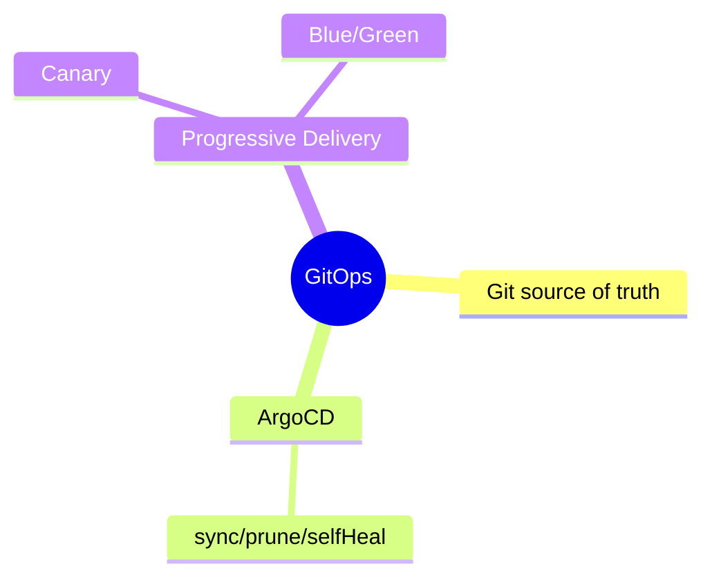
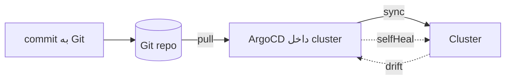

# GitOps با ArgoCD

> GitOps: Git به‌عنوان منبع حقیقت برای وضعیت cluster. ArgoCD آن را sync می‌کند. این فایل با دیاگرام گسترش یافته.

## فهرست
- [نقشه‌ی ذهنی](#نقشه‌ی-ذهنی)
- [📖 مفاهیم](#-مفاهیم)
- [🎯 سوالات مصاحبه](#-سوالات-مصاحبه)
- [⚠️ اشتباهات رایج](#️-اشتباهات-رایج)
- [🔗 ارتباط با سایر مفاهیم](#-ارتباط-با-سایر-مفاهیم)

---

## نقشه‌ی ذهنی



---

## جریان GitOps (pull-based)



---

## 📖 مفاهیم

### مفاهیم GitOps

**توضیح:**

وضعیت مطلوب در Git؛ ابزار (ArgoCD/Flux) cluster را با Git sync می‌کند. مزایا: Git منبع حقیقت، audit، rollback (revert commit)، declarative.

**مثال کد:**

```yaml
apiVersion: argoproj.io/v1alpha1
kind: Application
spec:
  source: { repoURL: https://github.com/myorg/myapp, targetRevision: main, path: k8s/overlays/prod }
  destination: { server: https://kubernetes.default.svc, namespace: production }
  syncPolicy:
    automated: { prune: true, selfHeal: true } # revert تغییر دستی
```

**نکات کلیدی:**

- Git منبع حقیقت؛ selfHeal تغییر دستی را revert می‌کند.
- rollback = revert commit.
- audit از Git history.

---

### Sync Strategies & Progressive Delivery

**توضیح:**

Manual/Automated. **Progressive Delivery** با Argo Rollouts: **Canary** (10%→25%→100% با metric)، **Blue/Green** (switch فوری).

**نکات کلیدی:**

- Canary برای کاهش ریسک.
- Blue/Green برای switch/rollback فوری.

---

## 🎯 سوالات مصاحبه

### سوال ۱: GitOps چه مزایایی بر deploy سنتی دارد؟

**سطح:** Senior / Lead
**تکرار:** متوسط

**جواب کامل:**

deploy سنتی (push از CI): CI نیاز cluster credential، drift، rollback دستی. GitOps (pull): Git منبع حقیقت (selfHeal)، audit، rollback آسان (revert)، امنیت (ArgoCD داخل cluster pull می‌کند، CI به credential نیاز ندارد)، declarative. trade-off: ابزار اضافه و secret نیاز External Secrets/Sealed Secrets.

**نکته مصاحبه:**

Lead به pull-based، selfHeal، امنیت credential اشاره می‌کند.

---

### سوال ۲: Canary در برابر Blue/Green؟

**سطح:** Lead
**تکرار:** متوسط

**جواب کامل:**

Blue/Green دو محیط، switch یکجا، rollback فوری؛ اما دو برابر منابع و همه‌ی کاربران یکجا. Canary تدریجی به درصد کم با metric؛ blast radius کوچک، تشخیص زود؛ اما کندتر، نیاز automation. Canary برای ریسک‌گریزی؛ Blue/Green برای switch سریع.

**نکته مصاحبه:**

Lead به blast radius اشاره می‌کند.

---

## ⚠️ اشتباهات رایج

### اشتباه ۱: secret plaintext در Git

```text
❌ Secret در Git → نشت
✅ Sealed Secrets / External Secrets
```

**توضیح:** Git history secret خام را برای همیشه نگه می‌دارد.

---

### اشتباه ۲: تغییر دستی cluster با GitOps فعال

```text
❌ kubectl edit → selfHeal revert می‌کند
✅ همه از طریق Git
```

**توضیح:** با GitOps تغییر باید در Git باشد.

---

## 🔗 ارتباط با سایر مفاهیم

- با **Kubernetes (10.2)** و **CI/CD (10.3)**.
- secret با **External/Sealed Secrets (16.5)**.
- Helm/Kustomize (16.1) منبع manifest.
- progressive delivery با **resilience (15.2)**.
