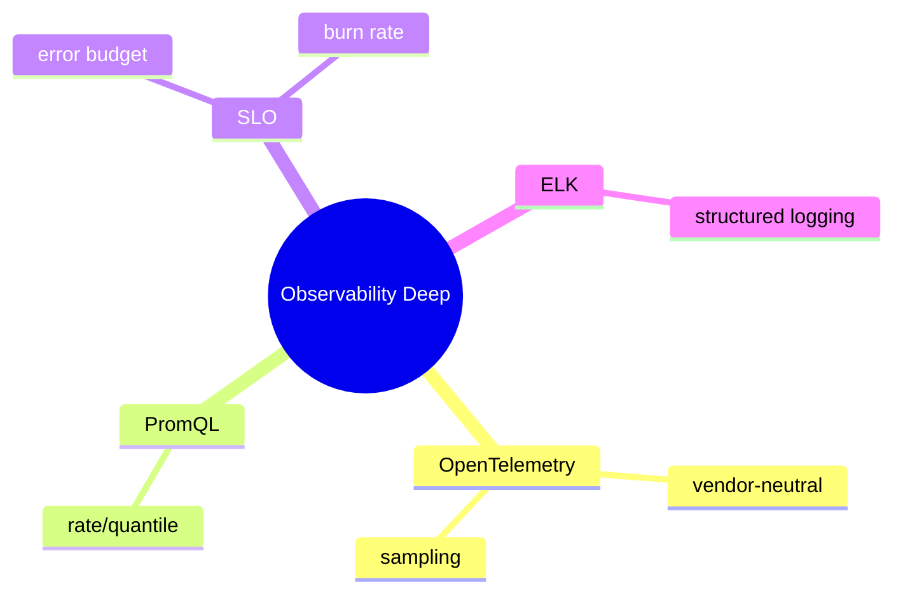

# Observability عمیق — OpenTelemetry، PromQL، SLO، ELK

> پیاده‌سازی عملی observability: OTel در Spring، PromQL، error budget، و structured logging. این فایل با دیاگرام گسترش یافته.

## فهرست
- [نقشه‌ی ذهنی](#نقشه‌ی-ذهنی)
- [📖 مفاهیم](#-مفاهیم)
- [🎯 سوالات مصاحبه](#-سوالات-مصاحبه)
- [⚠️ اشتباهات رایج](#️-اشتباهات-رایج)
- [🔗 ارتباط با سایر مفاهیم](#-ارتباط-با-سایر-مفاهیم)

---

## نقشه‌ی ذهنی



---

## 📖 مفاهیم

### OpenTelemetry در Spring Boot

**توضیح:**

OTel استاندارد vendor-neutral. در Boot 3+ با Micrometer Tracing خودکار؛ context (traceId) propagate (W3C `traceparent`). `@Observed` برای span. sampling برای overhead.

**مثال کد:**

```yaml
management:
  tracing: { sampling: { probability: 0.1 } }
  otlp: { tracing: { endpoint: http://jaeger:4317 } }
```

**نکات کلیدی:**

- OTel → vendor lock-in کمتر.
- sampling پایین در production.

---

### PromQL & SLO

**توضیح:**

queryهای کلیدی. **SLO/Error Budget/Burn Rate**.

**مثال کد:**

```promql
rate(http_server_requests_seconds_count{status=~"5.."}[5m]) / rate(http_server_requests_seconds_count[5m])
histogram_quantile(0.99, rate(http_server_requests_seconds_bucket[5m]))
( rate(http_requests_total{status=~"5.."}[1h]) / rate(http_requests_total[1h]) ) / (1 - 0.999) # burn rate
```

**نکات کلیدی:**

- alert بر SLO/burn rate نه CPU خام.
- p99 نه میانگین.

---

### ELK & Structured Logging

**توضیح:**

ELK. **Structured logging** (JSON) با key-value. trace id در هر log.

**مثال کد:**

```java
log.info("Order processed", kv("orderId", order.getId()), kv("userId", order.getUserId()));
```

**نکات کلیدی:**

- structured (JSON) برای query.
- trace id برای correlation.

---

## 🎯 سوالات مصاحبه

### سوال ۱: چرا OpenTelemetry به‌جای vendor خاص؟

**سطح:** Senior / Lead
**تکرار:** متوسط

**جواب کامل:**

قبلاً هر vendor SDK خودش → lock-in. OTel استاندارد واحد (API+SDK+OTLP) برای metrics/logs/traces؛ کد را یک‌بار instrument و به هر backend export کنید. auto-instrumentation. در Boot 3+ یکپارچه. انعطاف در انتخاب/تغییر ابزار.

**نکته مصاحبه:**

Lead به vendor lock-in و OTLP اشاره می‌کند.

---

### سوال ۲: burn rate alert چیست؟

**سطح:** Lead
**تکرار:** متوسط

**جواب کامل:**

نرخ مصرف error budget. burn rate=1 یعنی budget دقیقاً در پایان دوره تمام؛ burn rate=10 یعنی ۱۰× سریع‌تر. **burn rate alert** هشدار می‌دهد اگر مصرف سریع باشد. multi-window multi-burn-rate (fast → page، slow → ticket). کاهش alert fatigue.

**نکته مصاحبه:**

Lead به multi-window اشاره می‌کند.

---

## ⚠️ اشتباهات رایج

### اشتباه ۱: log غیرstructured

```java
// ❌
log.info("Order " + id + " processed for " + userId);
```

```java
// ✅
log.info("Order processed", kv("orderId", id), kv("userId", userId));
```

**توضیح:** structured logging query را ممکن می‌کند.

---

### اشتباه ۲: alert بر منابع خام

```text
❌ alert روی CPU > 80%
✅ alert بر error rate/latency و burn rate
```

**توضیح:** alert روی symptom نه cause.

---

## 🔗 ارتباط با سایر مفاهیم

- با **Monitoring (10.4)** و **Actuator (2.2)**.
- tracing با **Micrometer/Spring Cloud (2.6)** و **Scoped Values (1.6)**.
- SLO با **System Design availability (6.2)**.
