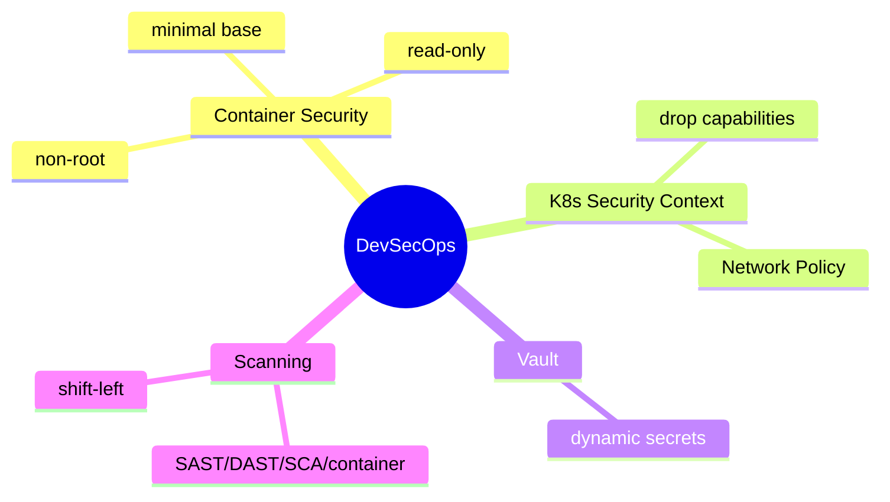
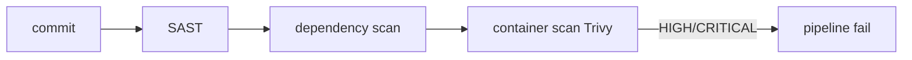

# DevSecOps — Container Security، K8s Security Context، Vault، Scanning

> امنیت در خط لوله و runtime. shift-left security و least privilege اصول کلیدی‌اند. این فایل با دیاگرام گسترش یافته.

## فهرست
- [نقشه‌ی ذهنی](#نقشه‌ی-ذهنی)
- [📖 مفاهیم](#-مفاهیم)
- [🎯 سوالات مصاحبه](#-سوالات-مصاحبه)
- [⚠️ اشتباهات رایج](#️-اشتباهات-رایج)
- [🔗 ارتباط با سایر مفاهیم](#-ارتباط-با-سایر-مفاهیم)

---

## نقشه‌ی ذهنی



---

## 📖 مفاهیم

### Container Security

**توضیح:**

non-root user، read-only filesystem، minimal base (distroless)، no privilege escalation.

**مثال کد:**

```dockerfile
FROM eclipse-temurin:21-jre-alpine
RUN addgroup -S app && adduser -S app -G app
USER app
```

**نکات کلیدی:**

- non-root + read-only + minimal = دفاع پایه.

---

### K8s Security Context

**توضیح:**

`runAsNonRoot`, `readOnlyRootFilesystem`, `allowPrivilegeEscalation: false`, drop capabilities. **Network Policy** (firewall بین pod). Pod Security Standards.

**مثال کد:**

```yaml
securityContext:
  runAsNonRoot: true
  runAsUser: 1000
  containers:
  - securityContext:
      allowPrivilegeEscalation: false
      readOnlyRootFilesystem: true
      capabilities: { drop: ["ALL"] }
```

**نکات کلیدی:**

- drop همه و فقط لازم را اضافه (least privilege).
- Network Policy (پیش‌فرض K8s همه باز).

---

### Secret Management (Vault) & Scanning

**توضیح:**

**Vault** (Spring Cloud Vault) با rotation، audit، **dynamic secrets** (credential کوتاه‌عمر DB). در K8s External Secrets/Sealed Secrets. **Scanning:** SAST، DAST، dependency، container (Trivy)، SBOM. **shift-left**.



**مثال کد:**

```yaml
security-scan:
  script:
    - trivy image --exit-code 1 --severity HIGH,CRITICAL myapp:$CI_COMMIT_SHA
    - mvn org.owasp:dependency-check-maven:check
```

**نکات کلیدی:**

- Vault dynamic secrets امن‌تر از static.
- scanning در pipeline؛ fail بر HIGH/CRITICAL.

---

## 🎯 سوالات مصاحبه

### سوال ۱: چرا container non-root و read-only؟

**سطح:** Senior / Lead
**تکرار:** متوسط

**جواب کامل:**

container kernel را با host share می‌کند؛ اگر روت باشد، escape به host محتمل‌تر. non-root سطح دسترسی را محدود می‌کند. read-only از نوشتن malware جلوگیری می‌کند. با `allowPrivilegeEscalation: false` و drop capabilities، attack surface کم. defense in depth.

**نکته مصاحبه:**

Lead به container escape و defense in depth اشاره می‌کند.

---

### سوال ۲: dynamic secrets در Vault چه مزیتی؟

**سطح:** Lead
**تکرار:** کم

**جواب کامل:**

static secret: اگر لو برود تا rotation دستی معتبر. **dynamic secrets**: Vault on-demand credential کوتاه‌عمر و یکتا می‌سازد و خودکار revoke. مزایا: پنجره‌ی سوءاستفاده کوتاه، audit دقیق، بدون rotation دستی. با K8s service account auth.

**نکته مصاحبه:**

Lead به credential کوتاه‌عمر اشاره می‌کند.

---

### سوال ۳: shift-left security یعنی چه؟

**سطح:** Senior
**تکرار:** متوسط

**جواب کامل:**

بررسی امنیتی **زود** در pipeline (نه بعد از deploy): SAST در commit، dependency scan، container scan قبل از push، IaC scan. هرچه زودتر، ارزان‌تر. می‌توان pipeline را بر آسیب‌پذیری بحرانی fail کرد. امنیت مسئولیت همه (DevSecOps).

**نکته مصاحبه:**

Senior به «هرچه زودتر، ارزان‌تر» اشاره می‌کند.

---

## ⚠️ اشتباهات رایج

### اشتباه ۱: container روت

```dockerfile
# ❌
USER root
```

```dockerfile
# ✅
USER app
```

**توضیح:** روت ریسک escape را بالا می‌برد.

---

### اشتباه ۲: secret در ConfigMap

```text
❌ ConfigMap (plaintext)
✅ Secret + External Secrets/Vault
```

**توضیح:** ConfigMap رمزنگاری ندارد.

---

### اشتباه ۳: Network Policy پیش‌فرض باز

```text
❌ همه podها به هم وصل (پیش‌فرض)
✅ default deny + اجازه‌ی صریح
```

**توضیح:** بدون Network Policy، lateral movement آسان است.

---

## 🔗 ارتباط با سایر مفاهیم

- با **Security (7)** و **CI/CD (10.3)**.
- Vault با **Secrets Management (7.1)** و **12-Factor**.
- security context با **Kubernetes (10.2)**.
- scanning با supply chain security و SBOM.
