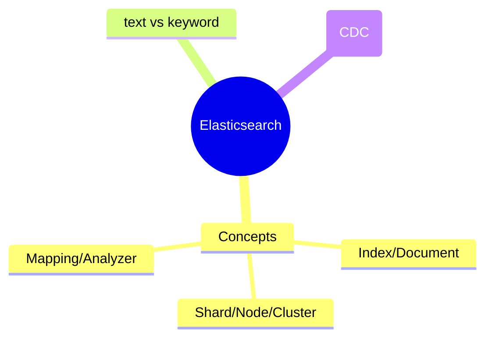
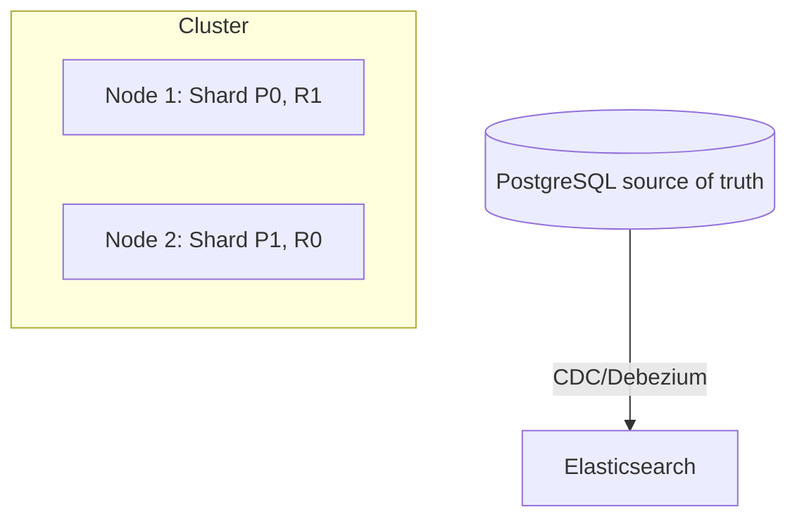

# Elasticsearch — مفاهیم پایه

> Elasticsearch موتور جستجو و تحلیل توزیع‌شده مبتنی بر Lucene است. این فایل با دیاگرام گسترش یافته.

## فهرست
- [نقشه‌ی ذهنی](#نقشه‌ی-ذهنی)
- [📖 مفاهیم](#-مفاهیم)
- [🎯 سوالات مصاحبه](#-سوالات-مصاحبه)
- [⚠️ اشتباهات رایج](#️-اشتباهات-رایج)
- [🔗 ارتباط با سایر مفاهیم](#-ارتباط-با-سایر-مفاهیم)

---

## نقشه‌ی ذهنی



---

## معماری



---

## 📖 مفاهیم

### مفاهیم پایه

**توضیح:**

**Index** (≈ table)، **Document** (≈ row، JSON)، **Shard** (primary + replica)، **Node**، **Cluster**، **Mapping** (schema)، **Analyzer** (tokenization + normalization). ES برای full-text/analytics — نه source of truth اصلی (sync از DB).

**نکات کلیدی:**

- ES معمولاً source of truth نیست؛ از DB sync (CDC).
- تعداد shard بعد از ساخت ثابت است.
- analyzer روی index/search اثر می‌گذارد.

---

### Text vs Keyword & Analyzer

**توضیح:**

**text** (تحلیل، tokenize، برای full-text `match`) در برابر **keyword** (exact، برای فیلتر/sort/aggregation `term`). Analyzer: tokenizer + filter. multi-field (`field` و `field.keyword`).

**نکات کلیدی:**

- `text` برای search، `keyword` برای exact/aggregation/sort.
- `term` روی text نتیجه‌ی غیرمنتظره (analysis).

---

## 🎯 سوالات مصاحبه

### سوال ۱: تفاوت text و keyword؟

**سطح:** Senior
**تکرار:** زیاد

**جواب کامل:**

`text` تحلیل می‌شود (token، lowercase، stem) برای full-text `match` با relevance. `keyword` تحلیل نمی‌شود برای exact `term`، sort، aggregation. تله: `term` روی text نتیجه نمی‌دهد (مقدار با token تحلیل‌شده مطابقت نمی‌کند). راه‌حل: multi-field. aggregation/sort فقط روی keyword.

**نکته مصاحبه:**

Senior به تله‌ی term روی text اشاره می‌کند.

---

### سوال ۲: ES کِی به‌جای DB یا به‌علاوه؟

**سطح:** Senior / Lead
**تکرار:** متوسط

**جواب کامل:**

ES معمولاً **به‌علاوه‌ی** DB. DB source of truth (transaction، consistency)؛ ES برای full-text پیشرفته، fuzzy، faceted، log/metric analytics. الگو: DB → sync به ES (CDC/Debezium/Outbox). نباید source of truth کرد (durability/consistency). trade-off: sync و eventual consistency.

**نکته مصاحبه:**

Lead به CDC و ES نبودن source of truth اشاره می‌کند.

---

## ⚠️ اشتباهات رایج

### اشتباه ۱: term روی فیلد text

```json
// ❌
{ "term": { "title": "New York" } }
```

```json
// ✅
{ "match": { "title": "New York" } }
{ "term": { "title.keyword": "New York" } }
```

**توضیح:** term با token تحلیل‌شده مطابقت نمی‌کند.

---

### اشتباه ۲: ES به‌عنوان source of truth

```text
❌ نوشتن فقط در ES
✅ DB source of truth، ES برای search
```

**توضیح:** ES تضمین durability/consistency ندارد.

---

## 🔗 ارتباط با سایر مفاهیم

- با **PostgreSQL full-text (14.2)** و **MongoDB Atlas Search (4.5)**.
- sync با **Kafka/CDC/Debezium (8.1)**.
- shard با **sharding (4.4)** و scaling.
