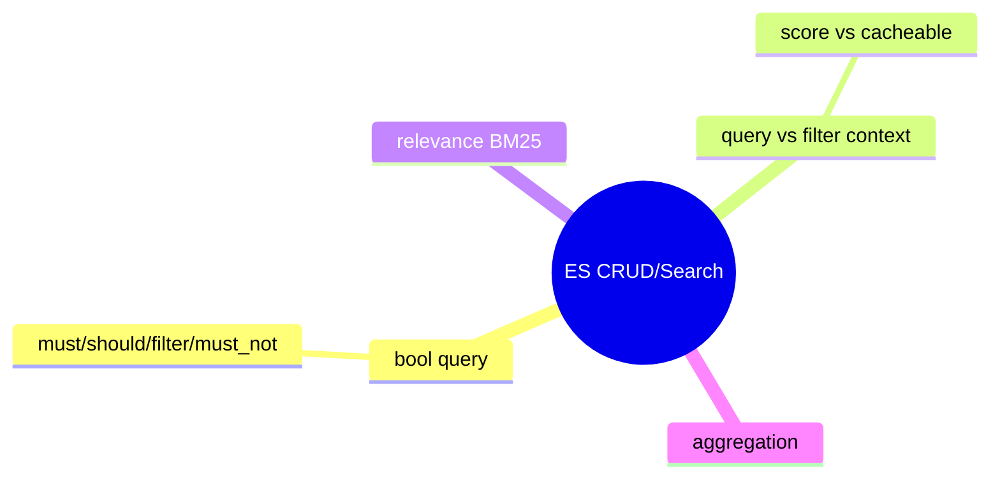

# Elasticsearch — CRUD و Search

> Query DSL قلب جستجو در ES است. درک bool query و تفاوت query/filter context مهم است. این فایل با دیاگرام گسترش یافته.

## فهرست
- [نقشه‌ی ذهنی](#نقشه‌ی-ذهنی)
- [📖 مفاهیم](#-مفاهیم)
- [🎯 سوالات مصاحبه](#-سوالات-مصاحبه)
- [⚠️ اشتباهات رایج](#️-اشتباهات-رایج)
- [🔗 ارتباط با سایر مفاهیم](#-ارتباط-با-سایر-مفاهیم)

---

## نقشه‌ی ذهنی



---

## 📖 مفاهیم

### CRUD و Query DSL

**توضیح:**

index با `PUT`. **bool query**: `must` (AND، score)، `should` (OR، boost)، `must_not` (NOT)، `filter` (AND، بدون score، cacheable). **query context** (relevance) در برابر **filter context** (yes/no، cache).

**مثال کد:**

```json
GET /products/_search
{
  "query": {
    "bool": {
      "must": [{ "match": { "name": "iphone" } }],
      "filter": [{ "range": { "price": { "gte": 500, "lte": 2000 } } }],
      "must_not": [{ "term": { "discontinued": true } }]
    }
  },
  "aggs": { "by_category": { "terms": { "field": "category.keyword" } } }
}
```

**نکات کلیدی:**

- شرط‌های exact/range را در `filter` (cacheable، سریع).
- `must` برای full-text با relevance.
- aggregation روی keyword.

---

## 🎯 سوالات مصاحبه

### سوال ۱: تفاوت query context و filter context؟

**سطح:** Senior
**تکرار:** زیاد

**جواب کامل:**

query context (`must`/`should`): **relevance score** محاسبه می‌شود (full-text). filter context (`filter`/`must_not`): فقط yes/no، بدون score، **cacheable**. best practice: exact/range/boolean در filter (سریع، cache)، full-text در query. performance را بهبود می‌دهد.

**نکته مصاحبه:**

Senior به cacheable بودن filter اشاره می‌کند.

---

### سوال ۲: relevance scoring چطور کار می‌کند؟

**سطح:** Senior
**تکرار:** متوسط

**جواب کامل:**

**BM25** (پیش‌فرض، بهبود TF-IDF). عوامل: TF (term frequency با saturation)، IDF (term نادر ارزش بیشتر)، field length normalization. tuning با `boost`/`function_score`. برای exact از filter context (بدون score).

**نکته مصاحبه:**

Senior BM25 و TF/IDF را می‌شناسد.

---

## ⚠️ اشتباهات رایج

### اشتباه ۱: range/exact در must

```json
// ❌
"must": [{ "range": { "price": { "gte": 100 } } }]
```

```json
// ✅
"filter": [{ "range": { "price": { "gte": 100 } } }]
```

**توضیح:** range/exact در filter سریع‌تر و cacheable.

---

### اشتباه ۲: aggregation روی text

```json
// ❌
"terms": { "field": "category" }
```

```json
// ✅
"terms": { "field": "category.keyword" }
```

**توضیح:** aggregation روی keyword.

---

## 🔗 ارتباط با سایر مفاهیم

- با **Spring Data Elasticsearch (17.3)**.
- filter cache با **caching (9)**.
- aggregation با **MongoDB aggregation (4.2)**.
