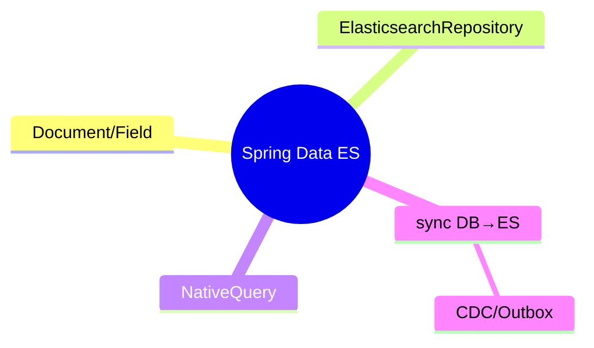

# Spring Data Elasticsearch

> یکپارچگی ES با Spring برای جستجو در اپ‌های Java. این فایل با دیاگرام گسترش یافته.

## فهرست
- [نقشه‌ی ذهنی](#نقشه‌ی-ذهنی)
- [📖 مفاهیم](#-مفاهیم)
- [🎯 سوالات مصاحبه](#-سوالات-مصاحبه)
- [⚠️ اشتباهات رایج](#️-اشتباهات-رایج)
- [🔗 ارتباط با سایر مفاهیم](#-ارتباط-با-سایر-مفاهیم)

---

## نقشه‌ی ذهنی



---

## 📖 مفاهیم

### مفاهیم اصلی

**توضیح:**

`@Document(indexName=...)`, `@Field(type=...)`. `ElasticsearchRepository` (CRUD/query derivation). برای پیچیده `ElasticsearchOperations`/`NativeQuery`.

**مثال کد:**

```java
@Document(indexName = "products")
public class Product {
    @Id private String id;
    @Field(type = FieldType.Text, analyzer = "standard") private String name;
    @Field(type = FieldType.Keyword) private String category;
    @Field(type = FieldType.Double) private Double price;
}

public interface ProductRepository extends ElasticsearchRepository<Product, String> {
    List<Product> findByCategory(String category);
}

NativeQuery query = NativeQuery.builder()
    .withQuery(q -> q.match(m -> m.field("name").query("iphone"))).build();
SearchHits<Product> hits = operations.search(query, Product.class);
```

**نکات کلیدی:**

- `@Field(type=Text/Keyword)` بر اساس استفاده.
- repository برای ساده؛ NativeQuery برای پیچیده.

---

## 🎯 سوالات مصاحبه

### سوال ۱: داده را بین DB و ES چطور sync نگه می‌داری؟

**سطح:** Senior / Lead
**تکرار:** متوسط

**جواب کامل:**

(۱) dual write (ساده اما غیراتمیک → Outbox). (۲) **CDC** (Debezium از WAL → Kafka → ES) — قابل‌اعتماد، decoupled. (۳) Outbox. (۴) scheduled reindex. بهترین: CDC/Outbox (اتمیک). sync همیشه eventual consistency.

**نکته مصاحبه:**

Lead به CDC/Outbox و eventual consistency اشاره می‌کند.

---

## ⚠️ اشتباهات رایج

### اشتباه ۱: dual write بدون Outbox

```text
❌ نوشتن همزمان DB و ES → ناسازگاری
✅ Outbox/CDC
```

**توضیح:** dual write می‌تواند یکی موفق و دیگری ناموفق شود.

---

### اشتباه ۲: blocking ES call در WebFlux

```java
// ❌
repository.findByCategory(c);
```

```java
// ✅
ReactiveElasticsearchOperations
```

**توضیح:** در reactive stack از reactive client.

---

## 🔗 ارتباط با سایر مفاهیم

- با **Spring Data (2.4)**.
- sync با **CDC/Debezium (8.1)** و **Outbox (6.1)**.
- mapping با **text/keyword (17.1)**.
