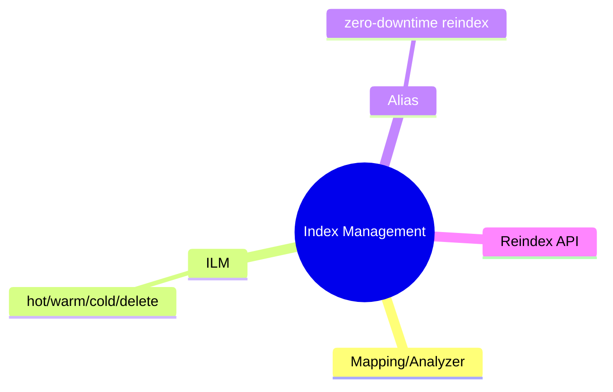
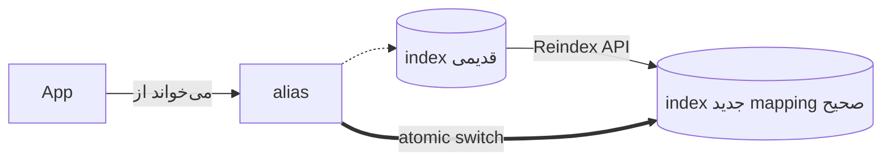

# Elasticsearch — Index Management (ILM، Alias، Reindex)

> مدیریت چرخه‌ی حیات index برای production: ILM، alias برای zero-downtime، و reindex. این فایل با دیاگرام گسترش یافته.

## فهرست
- [نقشه‌ی ذهنی](#نقشه‌ی-ذهنی)
- [📖 مفاهیم](#-مفاهیم)
- [🎯 سوالات مصاحبه](#-سوالات-مصاحبه)
- [⚠️ اشتباهات رایج](#️-اشتباهات-رایج)
- [🔗 ارتباط با سایر مفاهیم](#-ارتباط-با-سایر-مفاهیم)

---

## نقشه‌ی ذهنی



---

## Zero-downtime reindex با Alias



---

## 📖 مفاهیم

### Mapping، Analyzer، Settings

**توضیح:**

settings (shard/replica، analyzer سفارشی) و mapping (نوع فیلد). analyzer سفارشی برای زبان (فارسی با normalization).

**مثال کد:**

```json
PUT /articles
{
  "settings": {
    "number_of_shards": 3, "number_of_replicas": 1,
    "analysis": { "analyzer": { "persian_custom": { "type": "custom",
      "tokenizer": "standard", "filter": ["lowercase", "persian_normalization"] } } }
  }
}
```

**نکات کلیدی:**

- تعداد shard بعد از ساخت قابل‌تغییر نیست.
- analyzer روی index/search اثر می‌گذارد.

---

### ILM، Alias، Reindex

**توضیح:**

**ILM**: hot → warm → cold → delete (time-series/log). **Index Template**. **Alias**: zero-downtime reindex (switch atomic). **Reindex API**: کپی بین indexها.

**نکات کلیدی:**

- alias برای zero-downtime reindex.
- ILM برای logهای time-series.

---

## 🎯 سوالات مصاحبه

### سوال ۱: mapping را بدون downtime چطور تغییر می‌دهی؟

**سطح:** Senior / Lead
**تکرار:** متوسط

**جواب کامل:**

برخی mapping بعد از ساخت تغییرناپذیر. **alias + reindex**: (۱) index جدید با mapping درست. (۲) Reindex API. (۳) با **alias** (اپ از آن می‌خواند) به‌صورت **atomic** switch. (۴) حذف قدیمی. کلید: اپ از ابتدا با alias کار کند.

**نکته مصاحبه:**

Senior به alias atomic switch اشاره می‌کند.

---

### سوال ۲: ILM چه مشکلی حل می‌کند؟

**سطح:** Senior
**تکرار:** کم

**جواب کامل:**

برای time-series (log) با ارزش کاهنده، نگه‌داری همه روی hot گران. ILM چرخه‌ی خودکار: hot (سریع) → warm (read-only، ارزان) → cold → delete (بعد از retention). کاهش هزینه، performance hot بهتر، حذف خودکار. با rollover ترکیب می‌شود.

**نکته مصاحبه:**

Senior به hot/warm/cold/delete اشاره می‌کند.

---

## ⚠️ اشتباهات رایج

### اشتباه ۱: نام مستقیم index به‌جای alias

```text
❌ اپ به index مستقیم → reindex بدون downtime ممکن نیست
✅ اپ به alias
```

**توضیح:** alias برای switch بدون downtime لازم است.

---

### اشتباه ۲: shard بیش از حد (oversharding)

```text
❌ shard زیاد برای داده‌ی کم → overhead
✅ shard متناسب با حجم
```

**توضیح:** هر shard overhead دارد.

---

## 🔗 ارتباط با سایر مفاهیم

- ILM با **log retention (ELK 10.4)**.
- alias/reindex با zero-downtime migration.
- shard با **sharding (4.4)**.
