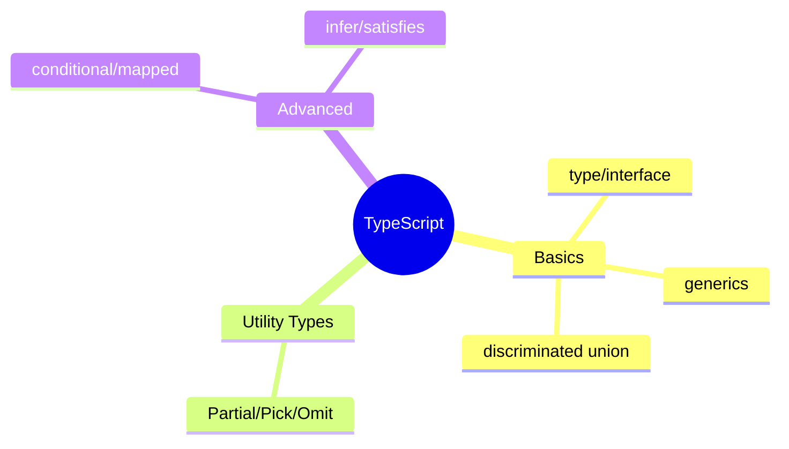

# TypeScript — Types، Generics، Utility Types، Advanced

> TypeScript استاندارد frontend مدرن است. type system قوی آن باگ‌ها را در زمان کامپایل می‌گیرد. این فایل با دیاگرام گسترش یافته.

## فهرست
- [نقشه‌ی ذهنی](#نقشه‌ی-ذهنی)
- [📖 مفاهیم](#-مفاهیم)
- [🎯 سوالات مصاحبه](#-سوالات-مصاحبه)
- [⚠️ اشتباهات رایج](#️-اشتباهات-رایج)
- [🔗 ارتباط با سایر مفاهیم](#-ارتباط-با-سایر-مفاهیم)

---

## نقشه‌ی ذهنی



---

## 📖 مفاهیم

### مبانی Type System

**توضیح:**

superset با static typing. `type`/`interface`. **Generics**. **Discriminated Union** (با `kind` برای exhaustiveness — مثل sealed types).

**مثال کد:**

```typescript
type User = { id: number; name: string; email?: string };
interface Order extends User { amount: number }
function first<T>(arr: T[]): T | undefined { return arr[0]; }

type Shape =
  | { kind: 'circle'; radius: number }
  | { kind: 'rectangle'; width: number; height: number };
function area(shape: Shape): number {
  switch (shape.kind) {
    case 'circle': return Math.PI * shape.radius ** 2;
    case 'rectangle': return shape.width * shape.height;
  }
}
```

**نکات کلیدی:**

- discriminated union معادل sealed types + pattern matching.
- `strict` mode را فعال کنید.

---

### Utility Types & Advanced

**توضیح:**

`Partial<T>`, `Required<T>`, `Pick<T,K>`, `Omit<T,K>`, `Record<K,V>`. Advanced: Conditional Types، Mapped Types، Template Literal، `infer`، `as const`، `satisfies`.

**مثال کد:**

```typescript
type PartialUser = Partial<User>;
type UserName = Pick<User, 'name'>;
type UserNoId = Omit<User, 'id'>;
const config = { port: 8080, host: 'localhost' } satisfies Record<string, unknown>;
```

**نکات کلیدی:**

- utility types از تکرار جلوگیری می‌کنند.
- `satisfies` چک بدون widening.

---

## 🎯 سوالات مصاحبه

### سوال ۱: type در برابر interface؟

**سطح:** Senior
**تکرار:** زیاد

**جواب کامل:**

`interface` declaration merging و extends طبیعی. `type` قدرتمندتر (union، intersection، tuple، mapped، conditional). interface برای object/public API؛ type برای union/utility/پیچیده. هر دو با strict بهترین ایمنی.

**نکته مصاحبه:**

Senior به declaration merging و قدرت type اشاره می‌کند.

---

### سوال ۲: discriminated union چه مزیتی؟

**سطح:** Senior
**تکرار:** متوسط

**جواب کامل:**

چند نوع با discriminant مشترک (`kind`). TS **type narrowing** می‌کند (در هر شاخه type دقیق). با `never`، **exhaustiveness check**. معادل sealed types + pattern matching در Java. برای state machine، نتیجه‌ی API، حالت UI. حالت نامعتبر غیرقابل‌بیان.

**نکته مصاحبه:**

Senior به narrowing و exhaustiveness با never اشاره می‌کند.

---

## ⚠️ اشتباهات رایج

### اشتباه ۱: `any`

```typescript
// ❌
function process(data: any) { return data.foo.bar; }
```

```typescript
// ✅
function process(data: unknown) { if (isValid(data)) {...} }
```

**توضیح:** `any` type safety را خاموش می‌کند.

---

### اشتباه ۲: strict mode غیرفعال

```text
❌ strict: false
✅ strict: true
```

**توضیح:** strict بیشترین ایمنی (strictNullChecks).

---

## 🔗 ارتباط با سایر مفاهیم

- با **React/Next.js (11)** و **State Management (18.2)**.
- discriminated union با **sealed types (1.4, 1.5)**.
- generics با **Java generics (1.1)**.
