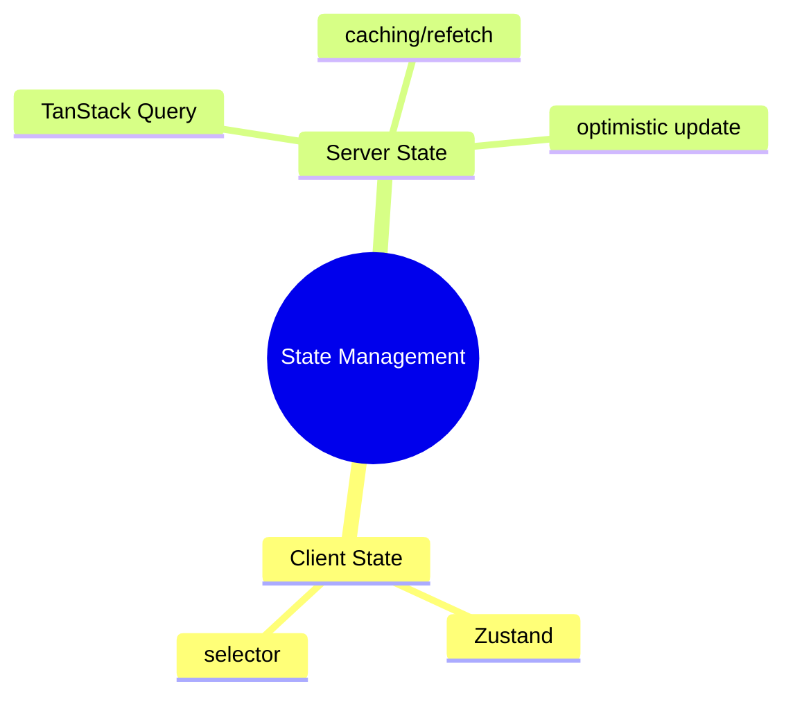
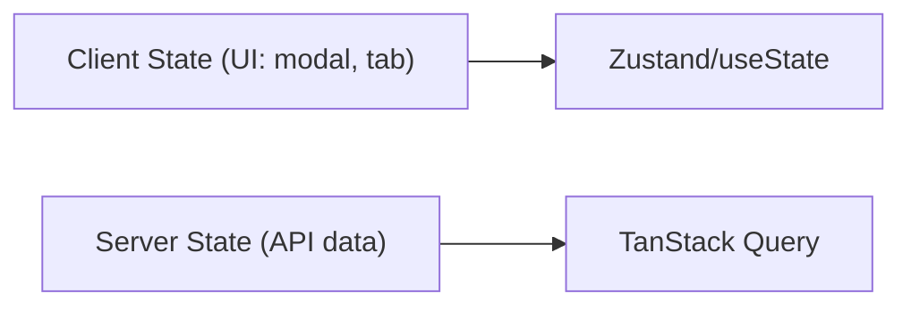

# State Management عمیق — Zustand، TanStack Query

> مدیریت state در React: client state با Zustand، server state با TanStack Query. این فایل با دیاگرام گسترش یافته.

## فهرست
- [نقشه‌ی ذهنی](#نقشه‌ی-ذهنی)
- [📖 مفاهیم](#-مفاهیم)
- [🎯 سوالات مصاحبه](#-سوالات-مصاحبه)
- [⚠️ اشتباهات رایج](#️-اشتباهات-رایج)
- [🔗 ارتباط با سایر مفاهیم](#-ارتباط-با-سایر-مفاهیم)

---

## نقشه‌ی ذهنی



---

## client در برابر server state



---

## 📖 مفاهیم

### Zustand (Client State)

**توضیح:**

state management ساده (جایگزین سبک Redux). با `create`، subscribe با hook + selective subscription.

**مثال کد:**

```typescript
const useUserStore = create<UserStore>((set, get) => ({
  users: [], loading: false,
  fetchUsers: async () => { set({ loading: true }); const users = await api.getUsers(); set({ users, loading: false }); },
  addUser: (user) => set(state => ({ users: [...state.users, user] })),
}));
const users = useUserStore(state => state.users); // selector
```

**نکات کلیدی:**

- selective subscription از re-render بی‌مورد جلوگیری می‌کند.
- Zustand برای client/UI state.

---

### TanStack Query (Server State)

**توضیح:**

برای server state: caching، background refetch، stale-while-revalidate، dedup، retry، optimistic — خودکار.

**مثال کد:**

```typescript
const { data, isLoading } = useQuery({
  queryKey: ['users', userId], queryFn: () => api.getUser(userId), staleTime: 5 * 60 * 1000
});
const mutation = useMutation({
  mutationFn: api.createUser,
  onSuccess: () => queryClient.invalidateQueries({ queryKey: ['users'] }),
});
```

**نکات کلیدی:**

- `queryKey` کلید cache/invalidation.
- mutation + invalidateQueries برای sync.

---

## 🎯 سوالات مصاحبه

### سوال ۱: چرا server state با TanStack Query نه Redux؟

**سطح:** Senior
**تکرار:** زیاد

**جواب کامل:**

server state async، می‌تواند stale شود، نیاز caching/refetch/sync. با Redux باید action loading/success/error، caching، invalidation دستی بنویسید. TanStack Query همه را خودکار می‌دهد (caching، background refetch، stale-while-revalidate، dedup، optimistic). Redux/Zustand برای client state.

**نکته مصاحبه:**

Senior جداسازی و ابزار درست را می‌داند.

---

### سوال ۲: optimistic update چیست؟

**سطح:** Senior
**تکرار:** متوسط

**جواب کامل:**

UI را **فوراً** (قبل از تأیید سرور) به‌روز کنید (مثل like). موفق → می‌ماند؛ fail → **rollback** + خطا. در TanStack Query با `onMutate` (اعمال + snapshot)، `onError` (rollback)، `onSettled` (refetch). UX بهتر؛ ریسک: rollback درست. برای عملیات کم‌ریسک.

**نکته مصاحبه:**

Senior به rollback در onError اشاره می‌کند.

---

## ⚠️ اشتباهات رایج

### اشتباه ۱: server state در Redux

```text
❌ مدیریت دستی fetch/cache
✅ TanStack Query
```

**توضیح:** server state ابزار مخصوص می‌خواهد.

---

### اشتباه ۲: subscribe بدون selector

```typescript
// ❌
const store = useUserStore();
```

```typescript
// ✅
const users = useUserStore(s => s.users);
```

**توضیح:** بدون selector، با هر تغییر store re-render.

---

## 🔗 ارتباط با سایر مفاهیم

- با **React (11.1)** و **TypeScript (18.1)**.
- server state با **API design (19.1)** و caching.
- optimistic با **useOptimistic (React 19)**.
