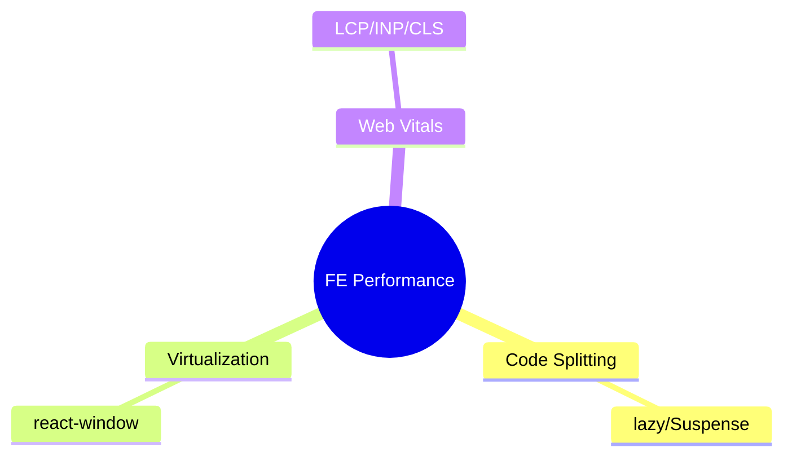
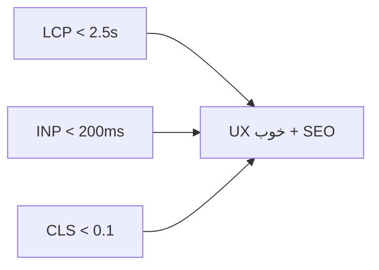

# Frontend Performance Patterns — Code Splitting، Virtualization، Web Vitals

> performance frontend مستقیماً روی UX و SEO اثر دارد. Web Vitals معیار استاندارد است. این فایل با دیاگرام گسترش یافته.

## فهرست
- [نقشه‌ی ذهنی](#نقشه‌ی-ذهنی)
- [📖 مفاهیم](#-مفاهیم)
- [🎯 سوالات مصاحبه](#-سوالات-مصاحبه)
- [⚠️ اشتباهات رایج](#️-اشتباهات-رایج)
- [🔗 ارتباط با سایر مفاهیم](#-ارتباط-با-سایر-مفاهیم)

---

## نقشه‌ی ذهنی



---

## 📖 مفاهیم

### Code Splitting & Virtualization

**توضیح:**

**Code Splitting** (`lazy`+`Suspense`): chunkهای lazy → initial load سریع‌تر. **Virtualization** (`react-window`): فقط آیتم‌های visible render.

**مثال کد:**

```typescript
const Dashboard = lazy(() => import('./Dashboard'));
<Suspense fallback={<Loading />}><Dashboard /></Suspense>

const rowVirtualizer = useVirtualizer({ count: 100000, getScrollElement: () => parentRef.current, estimateSize: () => 50 });
```

**نکات کلیدی:**

- code splitting initial bundle را کوچک می‌کند.
- virtualization برای لیست بزرگ.

---

### Web Vitals

**توضیح:**

- **LCP** < 2.5s (نمایش محتوای اصلی).
- **INP** < 200ms (پاسخ‌دهی، جایگزین FID).
- **CLS** < 0.1 (ثبات layout).
- **TTFB** < 800ms.

بهبود: SSR/SSG، image optimization، code splitting، CDN، font optimization.



**نکات کلیدی:**

- Web Vitals روی SEO اثر دارد.
- CLS با ابعاد image و font preload بهبود می‌یابد.

---

## 🎯 سوالات مصاحبه

### سوال ۱: Web Vitals و بهبود؟

**سطح:** Senior
**تکرار:** متوسط

**جواب کامل:**

**LCP** (نمایش بزرگ‌ترین محتوا) → SSR/SSG، CDN، image opt. **INP** (پاسخ‌دهی) → کاهش کار main thread (code splitting، web worker). **CLS** (پایداری) → ابعاد صریح image/ad، font preload. روی UX و SEO اثر. اندازه‌گیری با Lighthouse، RUM.

**نکته مصاحبه:**

Senior هر سه و راه بهبود را می‌داند.

---

### سوال ۲: چرا virtualization برای لیست بزرگ؟

**سطح:** Senior
**تکرار:** متوسط

**جواب کامل:**

render هزاران آیتم → هزاران DOM node (حافظه، render کند، scroll lag). virtualization فقط visible (مثلاً ۲۰) را render؛ هنگام scroll، آیتم جدید mount/قدیمی unmount. DOM ثابت مستقل از تعداد. trade-go: پیچیدگی، ارتفاع متغیر.

**نکته مصاحبه:**

Senior به DOM ثابت اشاره می‌کند.

---

## ⚠️ اشتباهات رایج

### اشتباه ۱: render کل لیست بزرگ

```text
❌ map روی 10k آیتم → lag
✅ virtualization
```

**توضیح:** DOM بزرگ performance را نابود می‌کند.

---

### اشتباه ۲: image بدون ابعاد → CLS

```html
<!-- ❌ -->

```

```html
<!-- ✅ -->

```

**توضیح:** بدون ابعاد، محتوا هنگام load جابه‌جا می‌شود.

---

## 🔗 ارتباط با سایر مفاهیم

- با **React (11.1)** و **Next.js rendering (11.2)**.
- Web Vitals با **SSR/SSG** و **CDN/caching (6.2)**.
- code splitting با bundle optimization.
