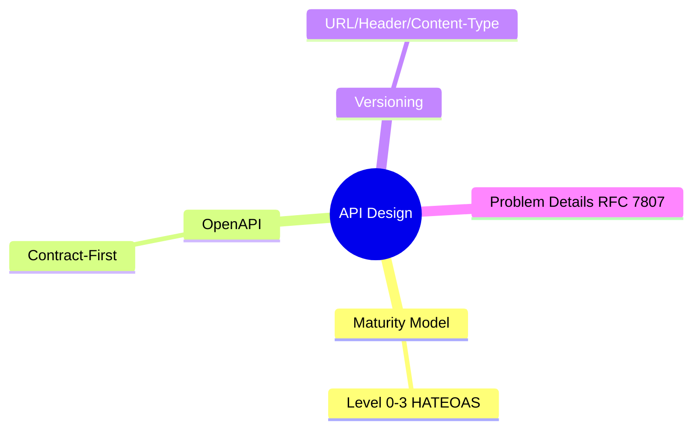
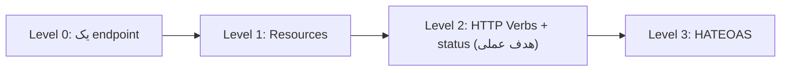

# API Design عمیق — REST Maturity، OpenAPI، Versioning، Problem Details

> طراحی API خوب پایه‌ی سیستم قابل‌نگهداری است. versioning و error standardization موضوعات کلیدی‌اند. این فایل با دیاگرام گسترش یافته.

## فهرست
- [نقشه‌ی ذهنی](#نقشه‌ی-ذهنی)
- [📖 مفاهیم](#-مفاهیم)
- [🎯 سوالات مصاحبه](#-سوالات-مصاحبه)
- [⚠️ اشتباهات رایج](#️-اشتباهات-رایج)
- [🔗 ارتباط با سایر مفاهیم](#-ارتباط-با-سایر-مفاهیم)

---

## نقشه‌ی ذهنی



---

## Richardson Maturity Model



---

## 📖 مفاهیم

### Richardson Maturity Model & OpenAPI

**توضیح:**

Level 0 (یک endpoint) → 1 (resources) → 2 (verb/status صحیح، هدف عملی) → 3 (HATEOAS). **OpenAPI**: Contract-First (spec اول، codegen) یا Code-First (Springdoc).

**نکات کلیدی:**

- اکثر APIها Level 2؛ HATEOAS به‌ندرت ارزش دارد.
- Contract-First برای هماهنگی تیم‌ها.

---

### API Versioning & Problem Details

**توضیح:**

Versioning: URL/Header/Content-Type. **Problem Details (RFC 7807)**: `type`, `title`, `status`, `detail`. Spring 6+ `ProblemDetail`.

**مثال کد:**

```java
@ExceptionHandler(ValidationException.class)
ProblemDetail handle(ValidationException ex) {
    ProblemDetail pd = ProblemDetail.forStatusAndDetail(HttpStatus.BAD_REQUEST, ex.getMessage());
    pd.setType(URI.create("https://api.example.com/errors/validation"));
    pd.setProperty("violations", ex.getViolations());
    return pd;
}
```

**نکات کلیدی:**

- Problem Details فرمت قابل‌پیش‌بینی خطا.
- versioning را از ابتدا با deprecation policy.

---

## 🎯 سوالات مصاحبه

### سوال ۱: API versioning strategies و کدام بهتر؟

**سطح:** Senior / Lead
**تکرار:** زیاد

**جواب کامل:**

URL (`/v1/`، ساده، cache-friendly، رایج‌ترین). Header (تمیز، اما کمتر شفاف). Content-Type (اصیل، پیچیده). مهم‌تر: **backward compatibility و deprecation** — additive (افزودن فیلد) breaking نیست؛ فقط breaking (حذف/تغییر) version می‌خواهد. دوره‌ی deprecation. Spring 7 versioning داخلی.

**نکته مصاحبه:**

Lead به additive vs breaking و deprecation اشاره می‌کند.

---

### سوال ۲: یک API خوب چه ویژگی‌هایی دارد؟

**سطح:** Senior
**تکرار:** متوسط

**جواب کامل:**

(۱) consistency. (۲) HTTP semantics صحیح (verb، status). (۳) error standardization. (۴) pagination/filter/sort. (۵) versioning. (۶) idempotency. (۷) مستندسازی (OpenAPI). (۸) امنیت. (۹) predictability. هدف: توسعه‌دهنده بتواند رفتار را حدس بزند.

**نکته مصاحبه:**

Senior consistency و HTTP semantics را برجسته می‌کند.

---

## ⚠️ اشتباهات رایج

### اشتباه ۱: status code اشتباه

```text
❌ همه‌چیز 200
✅ 201 ساخت، 400 ورودی بد، 404، 409، 422، 500
```

**توضیح:** status code صحیح برای client/ابزار مهم.

---

### اشتباه ۲: breaking change بدون versioning

```text
❌ حذف فیلد در v فعلی
✅ نسخه‌ی جدید + deprecation
```

**توضیح:** breaking change باید با version باشد.

---

## 🔗 ارتباط با سایر مفاهیم

- با **Spring MVC (2.3)**.
- Problem Details با **exception handling (2.3)**.
- versioning با **API Gateway (2.6)**.
- idempotency با **Idempotency (19.2)**.
