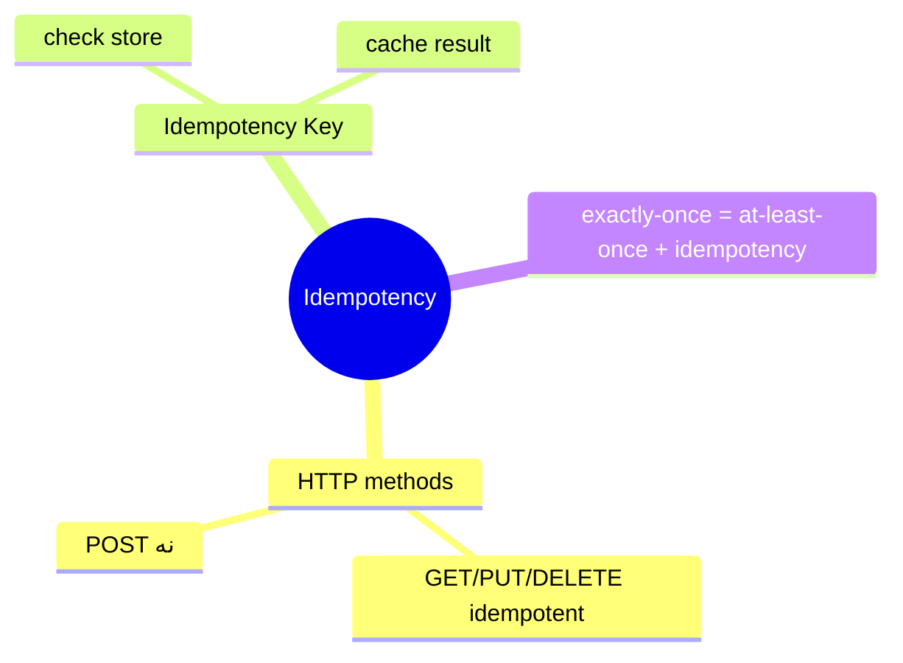
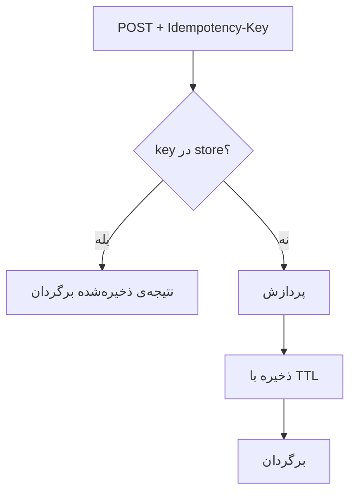

# Idempotency

> idempotency برای سیستم‌های قابل‌اعتماد (پرداخت، retry) حیاتی است. درک پیاده‌سازی با idempotency key لازم است. این فایل با دیاگرام گسترش یافته.

## فهرست
- [نقشه‌ی ذهنی](#نقشه‌ی-ذهنی)
- [📖 مفاهیم](#-مفاهیم)
- [🎯 سوالات مصاحبه](#-سوالات-مصاحبه)
- [⚠️ اشتباهات رایج](#️-اشتباهات-رایج)
- [🔗 ارتباط با سایر مفاهیم](#-ارتباط-با-سایر-مفاهیم)

---

## نقشه‌ی ذهنی



---

## جریان Idempotency Key



---

## 📖 مفاهیم

### مفهوم & پیاده‌سازی

**توضیح:**

idempotent: درخواست تکراری همان نتیجه بدون side-effect اضافه. GET/PUT/DELETE طبیعتاً؛ POST نه. برای امن کردن POST از **Idempotency Key**: client key یکتا می‌فرستد؛ سرور قبل از پردازش چک می‌کند.

**مثال کد:**

```java
@PostMapping("/payments")
public ResponseEntity<Payment> pay(@RequestHeader("Idempotency-Key") String key,
                                   @RequestBody PaymentRequest request) {
    String cached = redis.get("idem:" + key);
    if (cached != null) return ResponseEntity.ok(parse(cached));
    Payment payment = paymentService.process(request);
    redis.setex("idem:" + key, 86400, serialize(payment));
    return ResponseEntity.ok(payment);
}
```

**نکات کلیدی:**

- idempotency key برای POSTهای حساس.
- نتیجه را cache کنید.
- unique constraint در DB دفاع نهایی.

---

## 🎯 سوالات مصاحبه

### سوال ۱: چطور endpoint پرداخت را idempotent می‌کنی؟

**سطح:** Senior / Lead
**تکرار:** زیاد

**جواب کامل:**

client **Idempotency Key** یکتا (در retry همان) می‌فرستد. سرور: (۱) key را در store چک. (۲) اگر پردازش‌شده، نتیجه را برگردان. (۳) اگر جدید، با «in-progress» ثبت (جلوگیری از race همزمان)، پردازش، ذخیره. نکات: TTL، lock/unique constraint برای race، دفاع DB. exactly-once effect با at-least-once.

**نکته مصاحبه:**

Lead به race و دفاع DB اشاره می‌کند.

---

### سوال ۲: چرا exactly-once = at-least-once + idempotency؟

**سطح:** Lead
**تکرار:** متوسط

**جواب کامل:**

exactly-once واقعی غیرممکن (crash بین پردازش و ack). at-least-once (حداقل یک‌بار) + idempotency (پردازش تکراری بدون side-effect) → اثر exactly-once. الگوی استاندارد Kafka/payment. با dedup key، unique constraint، یا upsert.

**نکته مصاحبه:**

Lead فرمول را می‌داند.

---

## ⚠️ اشتباهات رایج

### اشتباه ۱: POST بدون idempotency در retry

```text
❌ retry پرداخت → دوبار شارژ
✅ idempotency key
```

**توضیح:** POST طبیعتاً idempotent نیست.

---

### اشتباه ۲: نادیده گرفتن race همزمان

```text
❌ دو request همزمان با یک key → هر دو پردازش
✅ ثبت in-progress با lock/unique constraint
```

**توضیح:** بدون lock، race بین چک و ذخیره.

---

## 🔗 ارتباط با سایر مفاهیم

- با **Kafka delivery (8.1)** و **retry (2.6)**.
- با **Redis (9.1)** و distributed lock.
- با **Payment System (6.2)** و **SAGA (6.1)**.
