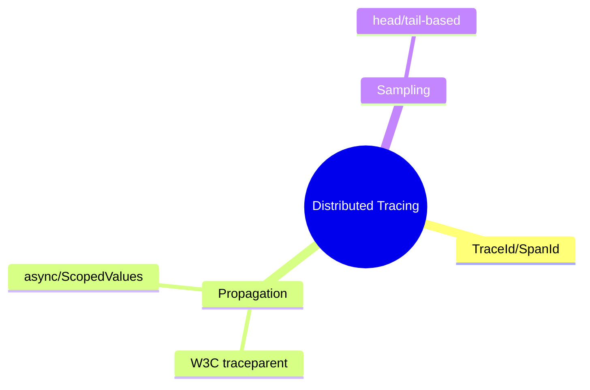
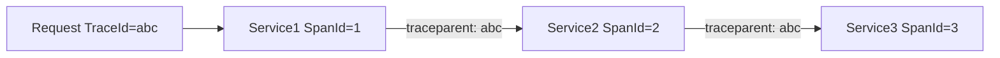

# Distributed Tracing عملی

> دنبال کردن یک request در سرویس‌های متعدد. پایه‌ی debugging و performance در میکروسرویس. این فایل با دیاگرام گسترش یافته.

## فهرست
- [نقشه‌ی ذهنی](#نقشه‌ی-ذهنی)
- [📖 مفاهیم](#-مفاهیم)
- [🎯 سوالات مصاحبه](#-سوالات-مصاحبه)
- [⚠️ اشتباهات رایج](#️-اشتباهات-رایج)
- [🔗 ارتباط با سایر مفاهیم](#-ارتباط-با-سایر-مفاهیم)

---

## نقشه‌ی ذهنی



---

## Propagation



---

## 📖 مفاهیم

### Propagation & Manual Span

**توضیح:**

**TraceId** (کل request)، **SpanId** (هر مرحله). context با header W3C (`traceparent`) propagate. در Boot 3+ با Micrometer Tracing خودکار. span سفارشی با Observation.

**مثال کد:**

```java
Observation.createNotStarted("order.processing", observationRegistry)
    .contextualName("Processing order")
    .lowCardinalityKeyValue("orderId", orderId.toString())
    .observe(() -> processOrder(orderId));
```

**نکات کلیدی:**

- context باید در همه‌ی hopها propagate شود.
- low cardinality برای tag.
- در async/thread جدید context را صریح propagate کنید.

---

## 🎯 سوالات مصاحبه

### سوال ۱: trace context در async چطور propagate می‌شود؟

**سطح:** Senior / Lead
**تکرار:** متوسط

**جواب کامل:**

context در ThreadLocal/MDC؛ هنگام انتقال به thread دیگر (`@Async`، CompletableFuture)، **خودکار منتقل نمی‌شود** → trace می‌شکند. راه‌حل: `ContextPropagatingTaskDecorator`، Micrometer Context Propagation، یا در Java 21 **ScopedValues**.

**نکته مصاحبه:**

Lead به شکستن context در async و ScopedValues اشاره می‌کند.

---

### سوال ۲: چرا sampling لازم است؟

**سطح:** Senior
**تکرار:** متوسط

**جواب کامل:**

trace هر request overhead دارد (حافظه، شبکه، storage). در پرترافیک غیرعملی. **sampling** درصدی (۱-۱۰٪). head-based (ابتدا، ساده) یا tail-based (بعد، فقط traceهای کند/خطادار — هوشمندتر). trade-off: ممکن trace یک مشکل خاص از دست برود.

**نکته مصاحبه:**

Senior به head/tail-based اشاره می‌کند.

---

## ⚠️ اشتباهات رایج

### اشتباه ۱: شکستن trace در async

```text
❌ @Async بدون propagation
✅ context propagation decorator
```

**توضیح:** context در ThreadLocal به thread جدید منتقل نمی‌شود.

---

### اشتباه ۲: tag با کاردینالیتی بالا

```text
❌ tag با userId/requestId (cardinality بالا) → انفجار metric
✅ low cardinality؛ شناسه‌ها در span attribute
```

**توضیح:** high cardinality در metric label فاجعه است.

---

## 🔗 ارتباط با سایر مفاهیم

- با **Spring Cloud/Micrometer (2.6)** و **observability (10.4, 16.4)**.
- propagation با **ScopedValues (1.6)** و async.
- با **OpenTelemetry (16.4)**.
