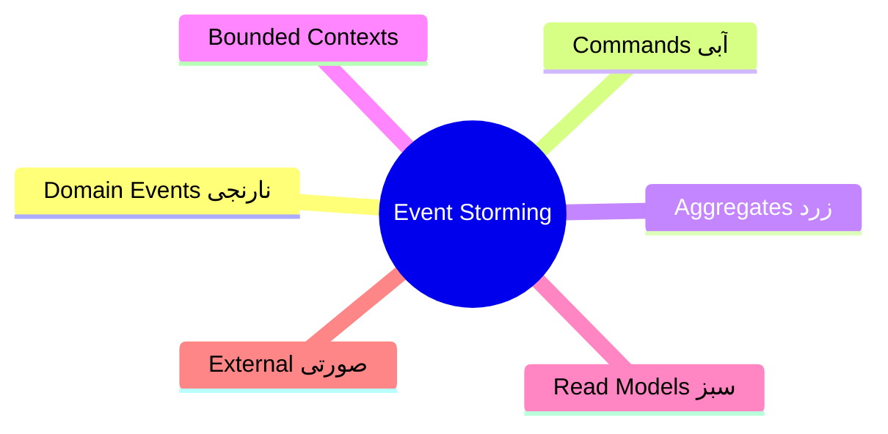
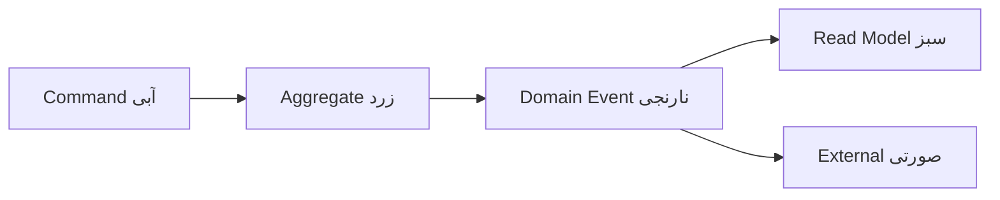

# Event Storming

> روش کشف domain با تیم — پل بین business و طراحی نرم‌افزار (DDD). این فایل با دیاگرام گسترش یافته.

## فهرست
- [نقشه‌ی ذهنی](#نقشه‌ی-ذهنی)
- [📖 مفاهیم](#-مفاهیم)
- [🎯 سوالات مصاحبه](#-سوالات-مصاحبه)
- [⚠️ اشتباهات رایج](#️-اشتباهات-رایج)
- [🔗 ارتباط با سایر مفاهیم](#-ارتباط-با-سایر-مفاهیم)

---

## نقشه‌ی ذهنی



---

## جریان



---

## 📖 مفاهیم

### روش Event Storming

**توضیح:**

workshop تعاملی با همه‌ی ذی‌نفعان (developer، domain expert، PM) با sticky note رنگی:
1. **Domain Events** (نارنجی، past tense: «OrderPlaced»).
2. **Commands** (آبی: «PlaceOrder»).
3. **Aggregates** (زرد).
4. **Bounded Contexts**.
5. **Read Models** (سبز).
6. **External Systems** (صورتی).

**نکات کلیدی:**

- event را past tense بنویسید.
- خروجی: bounded context و ubiquitous language.
- مشارکت domain expert حیاتی است.

---

## 🎯 سوالات مصاحبه

### سوال ۱: Event Storming چطور به طراحی microservice کمک می‌کند؟

**سطح:** Lead
**تکرار:** کم

**جواب کامل:**

با کشف domain events و commands به‌صورت مشترک، **bounded contextها** آشکار می‌شوند — کاندیدای مرز microservice (نه تجزیه‌ی فنی که distributed monolith می‌سازد). همچنین ubiquitous language و وابستگی‌ها بین contextها. فهم مشترک قبل از کد، از طراحی اشتباه پرهزینه جلوگیری می‌کند.

**نکته مصاحبه:**

Lead به bounded context و جلوگیری از distributed monolith اشاره می‌کند.

---

## ⚠️ اشتباهات رایج

### اشتباه ۱: فقط با developerها

```text
❌ بدون domain expert → کشف ناقص
✅ مشارکت همه‌ی ذی‌نفعان
```

**توضیح:** ارزش اصلی از دانش domain expert.

---

### اشتباه ۲: event به‌صورت command

```text
❌ "Place Order" (command)
✅ "Order Placed" (event، past tense)
```

**توضیح:** event اتفاق افتاده را توصیف می‌کند.

---

## 🔗 ارتباط با سایر مفاهیم

- با **DDD/bounded context (6.1)**.
- domain events با **Event-Driven (6.1)** و **Kafka (8.1)**.
- aggregate با DDD و transactions.
