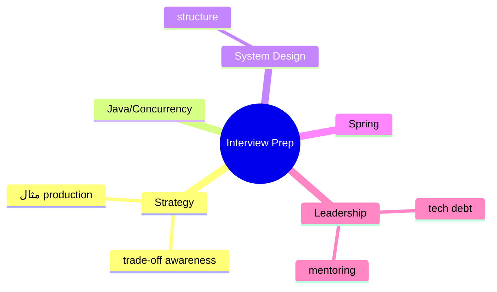
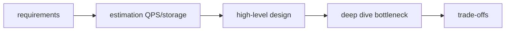

# Interview Preparation — Java، System Design، Spring، Leadership

> جمع‌بندی سوالات پرتکرار Senior/Lead و راهنمای پاسخ‌دهی. این فایل با دیاگرام گسترش یافته.

## فهرست
- [نقشه‌ی ذهنی](#نقشه‌ی-ذهنی)
- [📖 مفاهیم](#-مفاهیم)
- [🎯 سوالات مصاحبه](#-سوالات-مصاحبه)
- [⚠️ اشتباهات رایج (در مصاحبه)](#️-اشتباهات-رایج-در-مصاحبه)
- [🔗 ارتباط با سایر مفاهیم](#-ارتباط-با-سایر-مفاهیم)

---

## نقشه‌ی ذهنی



---

## ساختار پاسخ System Design



---

## 📖 مفاهیم

### استراتژی پاسخ‌دهی

**توضیح:**

تمایز Senior/Lead: عمق و **trade-off awareness**. اصول: (۱) مفهوم اصلی سپس جزئیات. (۲) trade-off صریح (هیچ پاسخ «همیشه درست»). (۳) مثال production. (۴) پیش‌بینی follow-up. (۵) system design با ساختار.

**نکات کلیدی:**

- trade-off awareness مهم‌ترین تمایز.
- مثال واقعی بهتر از تعریف کتابی.

---

### سوالات پرتکرار

**توضیح:**

**Java/Concurrency:** HashMap (Java 8 treeification)، volatile/synchronized، Virtual Threads، CompletableFuture/Reactive، GC/memory leak، ConcurrentHashMap. **System Design:** Notification، Rate Limiter، Cache، Payment، Leaderboard. **Spring:** `@Transactional`/self-invocation، bean lifecycle، CircuitBreaker، filter chain. **Leadership:** tech debt، monolith/microservice، حل اختلاف، mentoring.

**نکات کلیدی:**

- این‌ها در فایل‌های مربوطه با جواب کامل پوشش داده شده‌اند.
- Leadership روی تصمیم‌گیری/ارتباط/mentoring تمرکز دارد.

---

## 🎯 سوالات مصاحبه

### سوال ۱: چطور technical debt را مدیریت می‌کنی؟

**سطح:** Lead
**تکرار:** زیاد

**جواب کامل:**

(۱) شفاف‌سازی (مستند، tracking). (۲) اولویت بر اساس تأثیر. (۳) boy scout rule (refactor تدریجی). (۴) بودجه‌ی منظم. (۵) ارتباط با business (زبان ریسک/هزینه). (۶) جلوگیری از debt جدید (code review). تعادل تحویل/سلامت کد.

**نکته مصاحبه:**

Lead به boy scout rule، ارتباط با business اشاره می‌کند.

---

### سوال ۲: monolith یا microservice؟

**سطح:** Lead
**تکرار:** زیاد

**جواب کامل:**

با monolith (modular) شروع مگر دلیل قوی. عوامل microservice: تیم بزرگ، scale متفاوت، fault isolation، بلوغ domain. هزینه: پیچیدگی عملیاتی، DevOps. ضدالگو: زودهنگام. modular monolith + Strangler Fig تدریجی. تصمیم data-driven نه trend.

**نکته مصاحبه:**

Lead microservices را پیش‌فرض نمی‌داند.

---

### سوال ۳: وقتی اختلاف technical داری چه می‌کنی؟

**سطح:** Lead
**تکرار:** متوسط

**جواب کامل:**

(۱) گوش دادن. (۲) تمرکز بر داده/trade-off نه نظر شخصی. (۳) **disagree and commit** (اگر تصمیم خلاف نظر و برگشت‌پذیر، حمایت کامل). (۴) برای پرریسک، prototype/spike. (۵) اولویت با سلامت تیم/محصول نه برنده شدن. (۶) ADR.

**نکته مصاحبه:**

Lead به «disagree and commit» و ADR اشاره می‌کند.

---

### سوال ۴: چطور junior را mentor می‌کنی؟

**سطح:** Lead
**تکرار:** متوسط

**جواب کامل:**

(۱) چالش مناسب. (۲) «teach to fish» (سوال هدایت‌کننده). (۳) code review سازنده («چرا»). (۴) pair programming. (۵) blameless culture. (۶) مسیر رشد و feedback. (۷) الگو بودن. هدف: مهندس مستقل.

**نکته مصاحبه:**

Lead به «teach to fish» و blameless culture اشاره می‌کند.

---

## ⚠️ اشتباهات رایج (در مصاحبه)

### اشتباه ۱: پاسخ بدون trade-off

```text
❌ "همیشه microservice/NoSQL/reactive بهتر است"
✅ "بستگی دارد... trade-off این است..."
```

**توضیح:** پاسخ مطلق نشانه‌ی عدم بلوغ.

---

### اشتباه ۲: system design بدون ساختار

```text
❌ پریدن به جزئیات
✅ requirements → estimation → high-level → deep dive → trade-off
```

**توضیح:** ساختار نشان‌دهنده‌ی تفکر منظم.

---

### اشتباه ۳: نادیده گرفتن بُعد non-technical در Lead

```text
❌ پاسخ صرفاً فنی به سوال leadership
✅ ارتباط، تصمیم‌گیری، mentoring، business alignment
```

**توضیح:** Lead بودن فراتر از مهارت فنی است.

---

## 🔗 ارتباط با سایر مفاهیم

- جمع‌بندی همه‌ی فصل‌ها.
- Java questions → 1.x، 12.x.
- System Design → 6.x.
- Spring → 2.x.
- Leadership → تجربه‌ی عملی و این فایل.
