# مبانی زبان Java (Java 1–8)

> فایل آموزشی Senior/Lead — مفاهیم پایه‌ای زبان که سنگ بنای همه‌ی سوالات بعدی مصاحبه هستند. این فایل با عمق کتاب درسی، مثال‌های متعدد و دیاگرام نوشته شده است.

## فهرست

- [نقشه‌ی ذهنی فصل](#نقشه‌ی-ذهنی-فصل)
- [📖 مفاهیم](#-مفاهیم)
- [🎯 سوالات مصاحبه](#-سوالات-مصاحبه)
- [⚠️ اشتباهات رایج](#️-اشتباهات-رایج)
- [🔗 ارتباط با سایر مفاهیم](#-ارتباط-با-سایر-مفاهیم)

---

## نقشه‌ی ذهنی فصل

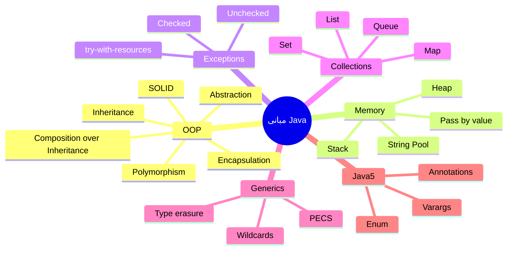

---

## 📖 مفاهیم

### Encapsulation (کپسوله‌سازی)

**توضیح:**

کپسوله‌سازی یعنی پنهان کردن وضعیت داخلی یک شیء و مجبور کردن دنیای بیرون به تعامل از طریق یک قرارداد (contract) مشخص. در Java این کار با `private` کردن فیلدها و ارائه‌ی متدهای `public` (یا متدهای دامنه‌محور) انجام می‌شود. اما کپسوله‌سازی فقط «getter/setter گذاشتن» نیست — این یک سوءتفاهم رایج Junior است. کپسوله‌سازی واقعی یعنی محافظت از **invariant** های شیء؛ یعنی شیء هیچ‌وقت نباید اجازه دهد به حالت نامعتبر برود.

برای مثال یک `BankAccount` که `setBalance(double)` عمومی دارد عملاً کپسوله نشده، چون هر کسی می‌تواند موجودی را منفی کند. کپسوله‌سازی درست یعنی متدهای رفتاری مثل `withdraw(amount)` و `deposit(amount)` که قوانین کسب‌وکار را داخل خود enforce می‌کنند.

سه سطح کپسوله‌سازی را در ذهن داشته باشید:
1. **پنهان‌سازی داده** (data hiding) — فیلدها private.
2. **محافظت از invariant** — متدها وضعیت معتبر را تضمین می‌کنند.
3. **پنهان‌سازی پیاده‌سازی** — می‌توان representation داخلی را عوض کرد بدون شکستن مصرف‌کننده.

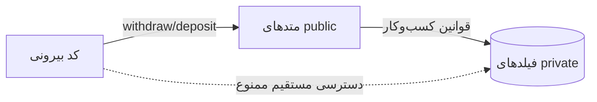

**چرا مهم است:**

در سیستم‌های production، کپسوله‌سازی مرز تغییرپذیری را مشخص می‌کند. وقتی فیلدها private هستند می‌توانید پیاده‌سازی داخلی را عوض کنید (مثلاً از `int` به `BigDecimal` یا از `long cents`) بدون اینکه کل codebase بشکند. در DDD این مفهوم به Aggregate و حفاظت از consistency boundary گره می‌خورد: یک Aggregate Root تنها نقطه‌ی ورود برای تغییر است و invariantها را حفظ می‌کند.

**مثال کد ۱ — شبه‌کپسوله‌سازی در برابر واقعی:**

```java
// ❌ شبه‌کپسوله‌سازی: getter/setter بی‌فایده، invariant محافظت نشده
public class WeakAccount {
    private double balance;
    public double getBalance() { return balance; }
    public void setBalance(double balance) { this.balance = balance; } // هر مقدار نامعتبر مجاز
}

// ✅ کپسوله‌سازی واقعی: محافظت از invariant
public class BankAccount {
    private long balanceCents; // واحد داخلی پنهان است (می‌توان بعداً عوض کرد)

    public BankAccount(long initialCents) {
        if (initialCents < 0) {
            throw new IllegalArgumentException("موجودی اولیه نمی‌تواند منفی باشد");
        }
        this.balanceCents = initialCents;
    }

    public void withdraw(long cents) {
        if (cents <= 0) throw new IllegalArgumentException("مبلغ باید مثبت باشد");
        if (cents > balanceCents) throw new IllegalStateException("موجودی کافی نیست");
        balanceCents -= cents; // invariant: همیشه >= 0 می‌ماند
    }

    public void deposit(long cents) {
        if (cents <= 0) throw new IllegalArgumentException("مبلغ باید مثبت باشد");
        balanceCents += cents;
    }

    public long balanceCents() { return balanceCents; } // فقط خواندن
}
```

**مثال کد ۲ — کپسوله‌سازی collection (دفاع در برابر نشت ارجاع):**

```java
public class Team {
    private final List<Player> players = new ArrayList<>();

    // ❌ نشت: caller می‌تواند لیست داخلی را تغییر دهد
    public List<Player> getPlayersLeaky() { return players; }

    // ✅ کپی دفاعی یا view غیرقابل‌تغییر
    public List<Player> getPlayers() { return List.copyOf(players); }

    public void addPlayer(Player p) {
        if (players.size() >= 11) throw new IllegalStateException("تیم پر است");
        players.add(p);
    }
}
```

**نکات کلیدی:**

- کپسوله‌سازی = حفاظت از invariant، نه صرفاً getter/setter اتوماتیک.
- اشتباه رایج: تولید خودکار همه‌ی setterها با IDE و شکستن immutability.
- نشت ارجاع (returning internal collection) کپسوله‌سازی را می‌شکند؛ از `List.copyOf` یا `Collections.unmodifiableList` استفاده کنید.
- best practice: تا جای ممکن شیء را immutable بسازید و به‌جای setter از متدهای رفتاری استفاده کنید.

---

### Inheritance (وراثت)

**توضیح:**

وراثت رابطه‌ی «is-a» را مدل می‌کند: `Dog extends Animal` یعنی سگ یک نوع حیوان است. با `extends` کلاس فرزند تمام اعضای غیرprivate والد را به ارث می‌برد و می‌تواند با override کردن متدها رفتار را تغییر دهد. کلیدواژه‌ی `super` برای فراخوانی سازنده یا متد والد استفاده می‌شود.

نکته‌ی مهم Senior: وراثت قوی‌ترین نوع coupling در OOP است. کلاس فرزند به جزئیات پیاده‌سازی والد وابسته می‌شود و این باعث شکنندگی (**fragile base class problem**) می‌شود — تغییر در والد می‌تواند فرزندان را به‌صورت غیرمنتظره بشکند. به همین دلیل اصل «Composition over Inheritance» مطرح است.

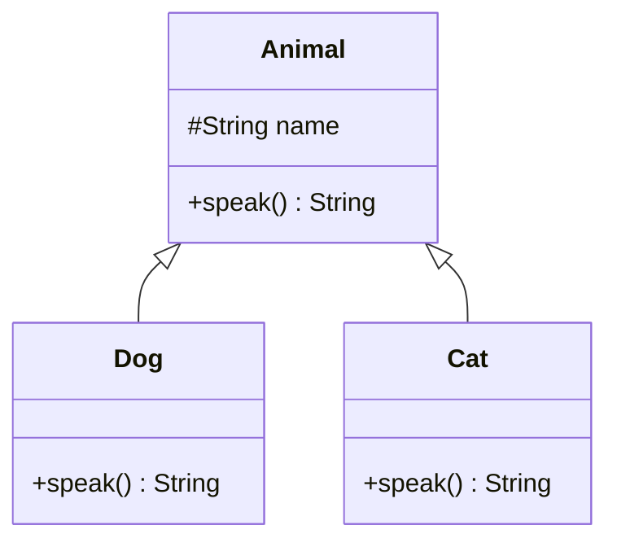

**چرا مهم است:**

در فریم‌ورک‌هایی مثل Spring، بسیاری از کلاس‌های پایه (مثل `OncePerRequestFilter`) با وراثت کار می‌کنند. درک درست override و `super` برای استفاده‌ی صحیح از این APIها لازم است. اما در کد دامنه‌ای، وراثت بی‌جا منبع باگ‌های زیاد است.

**مثال کد ۱ — override صحیح و super:**

```java
public class Animal {
    protected final String name;
    public Animal(String name) { this.name = name; }
    public String speak() { return "..."; }
    public String describe() { return name + " says " + speak(); }
}

public class Dog extends Animal {
    public Dog(String name) {
        super(name); // فراخوانی سازنده‌ی والد، باید اولین خط باشد
    }

    @Override // همیشه @Override بزنید تا اشتباه امضا کامپایل نشود
    public String speak() {
        return "Woof";
    }
}
// new Dog("Rex").describe() -> "Rex says Woof" (dynamic dispatch)
```

**مثال کد ۲ — field hiding (تله‌ی رایج):**

```java
class Parent {
    String type = "parent";
    String getType() { return type; }
}
class Child extends Parent {
    String type = "child"; // field را hide می‌کند، نه override
    @Override String getType() { return type; }
}

Parent p = new Child();
System.out.println(p.type);        // "parent" ← فیلد بر اساس نوع استاتیک!
System.out.println(p.getType());   // "child"  ← متد بر اساس نوع واقعی (override)
```

**نکات کلیدی:**

- همیشه `@Override` بگذارید؛ اگر امضای متد اشتباه باشد کامپایلر خطا می‌دهد به جای اینکه بی‌سروصدا متد جدیدی بسازد.
- `super()` اگر صدا زده نشود، کامپایلر خودش سازنده‌ی بدون آرگومان والد را صدا می‌زند — اگر چنین سازنده‌ای نباشد خطای کامپایل می‌گیرید.
- فیلدها override نمی‌شوند بلکه «hide» می‌شوند (field hiding) — منبع باگ‌های گیج‌کننده، چون فیلدها به نوع استاتیک و متدها به نوع واقعی resolve می‌شوند.
- `final` روی کلاس از وراثت و روی متد از override جلوگیری می‌کند.

---

### Polymorphism (چندریختی)

**توضیح:**

چندریختی دو نوع است:

1. **Compile-time (Overloading):** چند متد هم‌نام با امضای متفاوت. کامپایلر بر اساس **نوع استاتیک** آرگومان‌ها تصمیم می‌گیرد کدام را صدا بزند.
2. **Runtime (Overriding):** فرزند متد والد را بازنویسی می‌کند و JVM در زمان اجرا بر اساس **نوع واقعی** شیء (dynamic dispatch) متد درست را انتخاب می‌کند.

نکته‌ی ظریفی که Senior را از Junior جدا می‌کند: overload resolution در زمان کامپایل و بر اساس نوع اعلام‌شده انجام می‌شود، اما override در زمان اجرا. این تفاوت منشأ باگ‌های ظریف است.

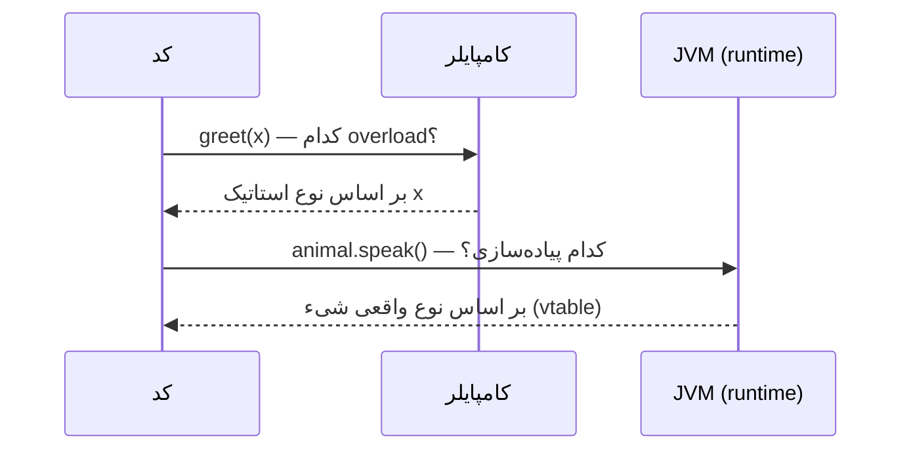

**چرا مهم است:**

کل مکانیزم Strategy pattern، dependency injection و برنامه‌نویسی به interface روی dynamic dispatch بنا شده. وقتی `List<String> list = new ArrayList<>()` می‌نویسید، فراخوانی `list.add()` در runtime به پیاده‌سازی `ArrayList` می‌رود.

**مثال کد ۱ — overload در compile-time:**

```java
public class Dispatch {
    static String greet(Object o) { return "object"; }
    static String greet(String s) { return "string"; } // overload

    public static void main(String[] args) {
        Object x = "hello";
        // نوع استاتیک x برابر Object است → overload resolution در compile-time
        System.out.println(greet(x)); // چاپ: object (نه string!)
        System.out.println(greet("hi")); // چاپ: string
    }
}
```

**مثال کد ۲ — override در runtime:**

```java
abstract class Shape { abstract double area(); }
class Circle extends Shape { double r; Circle(double r){this.r=r;} double area(){return Math.PI*r*r;} }
class Square extends Shape { double s; Square(double s){this.s=s;} double area(){return s*s;} }

List<Shape> shapes = List.of(new Circle(2), new Square(3));
double total = shapes.stream().mapToDouble(Shape::area).sum(); // dynamic dispatch برای هر کدام
```

**نکات کلیدی:**

- Overload در compile-time بر اساس نوع declared تصمیم می‌گیرد؛ مراقب `(Object)` casting باشید.
- Override در runtime؛ متدهای `private`, `static`, و `final` override نمی‌شوند.
- متدهای static را نمی‌توان override کرد فقط «hide» می‌شوند — این سوال مصاحبه‌ی پرتکرار است.
- covariant return type: متد override‌شده می‌تواند زیرنوع را برگرداند (مثلاً `clone()`).

---

### Abstraction — Abstract Class vs Interface

**توضیح:**

انتزاع یعنی تمرکز بر «چه کاری» به جای «چگونه». دو ابزار اصلی: کلاس انتزاعی و interface.

- **Abstract class:** می‌تواند state (فیلد)، سازنده، و متد پیاده‌سازی‌شده داشته باشد. یک کلاس فقط از یک abstract class می‌تواند ارث ببرد.
- **Interface:** قرارداد است. از Java 8 می‌تواند `default` و `static` method داشته باشد، اما state قابل تغییر ندارد (فقط `public static final` constant). یک کلاس می‌تواند چند interface را implement کند.

قانون عملی: اگر رابطه‌ی «is-a» با اشتراک state دارید abstract class؛ اگر «can-do» (قابلیت) دارید interface. در طراحی مدرن، interface را ترجیح بدهید چون انعطاف بیشتری می‌دهد و multiple inheritance رفتار را ممکن می‌کند.

| ویژگی | Abstract Class | Interface |
|-------|----------------|-----------|
| State (فیلد تغییرپذیر) | ✅ | ❌ (فقط constant) |
| سازنده | ✅ | ❌ |
| multiple inheritance | ❌ | ✅ |
| متد default | همه‌ی متدها | از Java 8 |
| رابطه | is-a (با state مشترک) | can-do (قابلیت) |

**چرا مهم است:**

Spring Data interface‌محور است (`JpaRepository`). تمام design pattern‌های مدرن روی interface بنا شده‌اند تا coupling کم شود و تست‌پذیری بالا برود.

**مثال کد:**

```java
// Interface = قابلیت (can-do)
public interface Payable {
    Money calculatePay();
    default boolean isHighEarner() { // متد default برای backward compatibility
        return calculatePay().isGreaterThan(Money.of(10_000));
    }
}

// Abstract class = اشتراک state و رفتار پایه
public abstract class Employee implements Payable {
    protected final String name;
    protected Employee(String name) { this.name = name; }
    public abstract String role(); // فرزند باید پیاده‌سازی کند
    public String badge() { return role() + ": " + name; } // رفتار مشترک
}

public final class Engineer extends Employee {
    private final Money salary;
    public Engineer(String name, Money salary) { super(name); this.salary = salary; }
    @Override public Money calculatePay() { return salary; }
    @Override public String role() { return "Engineer"; }
}
```

**نکات کلیدی:**

- Interface از Java 8 به بعد می‌تواند رفتار default داشته باشد، ولی نمی‌تواند state تغییرپذیر نگه دارد.
- اگر بین دو پیاده‌سازی state مشترک دارید abstract class مناسب است.
- best practice: «program to an interface» — متغیرها و پارامترها را با interface تعریف کنید.
- از Java 9، interface می‌تواند `private` method هم داشته باشد (برای reuse داخلی default methodها).

---

### SOLID Principles

**توضیح:**

پنج اصل طراحی شیءگرا که کد قابل‌نگهداری می‌سازند:

- **S — Single Responsibility:** هر کلاس فقط یک دلیل برای تغییر داشته باشد.
- **O — Open/Closed:** باز برای توسعه، بسته برای تغییر. رفتار جدید را با افزودن کلاس (نه ویرایش کلاس موجود) اضافه کنید.
- **L — Liskov Substitution:** هر زیرکلاس باید بدون شکستن رفتار، جایگزین والد شود. مثال نقض کلاسیک: `Square extends Rectangle`.
- **I — Interface Segregation:** interface‌های کوچک و متمرکز بهتر از یک interface بزرگ هستند.
- **D — Dependency Inversion:** به انتزاع وابسته شوید نه به پیاده‌سازی concrete. قلب DI در Spring.

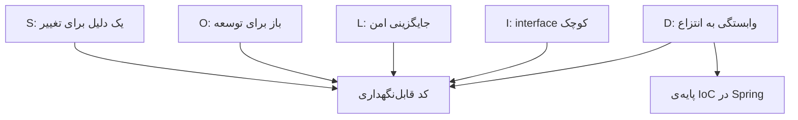

**چرا مهم است:**

این اصول معیار review کد در تیم‌های Senior هستند. نقض SOLID مستقیماً به افزایش هزینه‌ی نگهداری و باگ ترجمه می‌شود. مصاحبه‌گرها معمولاً مثال نقض می‌خواهند.

**مثال کد ۱ — نقض و رعایت SRP + DIP:**

```java
// ❌ نقض SRP: کلاس هم منطق هم persistence دارد
class OrderBad {
    void calculateTotal() { /* business */ }
    void saveToDb() { /* persistence */ } // مسئولیت دوم
}

// ✅ رعایت SRP + DIP
interface OrderRepository { void save(Order order); } // انتزاع

class OrderService {
    private final OrderRepository repository; // وابستگی به انتزاع
    OrderService(OrderRepository repository) { this.repository = repository; }

    void place(Order order) {
        order.validate();
        repository.save(order); // جزئیات persistence پنهان است
    }
}
```

**مثال کد ۲ — نقض LSP (Square/Rectangle):**

```java
class Rectangle {
    protected int w, h;
    void setWidth(int w) { this.w = w; }
    void setHeight(int h) { this.h = h; }
    int area() { return w * h; }
}
// ❌ نقض LSP: Square رفتار Rectangle را می‌شکند
class Square extends Rectangle {
    @Override void setWidth(int w) { this.w = w; this.h = w; }  // عوارض جانبی غیرمنتظره
    @Override void setHeight(int h) { this.w = h; this.h = h; }
}
// کدی که با Rectangle کار می‌کند با Square می‌شکند:
void test(Rectangle r) { r.setWidth(5); r.setHeight(4); assert r.area() == 20; } // برای Square fail می‌شود!
```

**نکات کلیدی:**

- SRP را با «یک دلیل برای تغییر» بسنجید نه «یک کار».
- نقض LSP معمولاً وقتی رخ می‌دهد که زیرکلاس استثنا پرتاب کند یا precondition را قوی‌تر کند.
- ISP: به‌جای یک interface بزرگ `Repository` با ۲۰ متد، interfaceهای کوچک بسازید.
- DIP پایه‌ی IoC container در Spring است.

---

### Composition over Inheritance

**توضیح:**

به‌جای ارث‌بری، رفتار را با نگهداری ارجاع به اشیاء دیگر بسازید. وراثت رابطه‌ی ایستا و در زمان کامپایل ایجاد می‌کند؛ ترکیب رابطه‌ی پویا و انعطاف‌پذیر. ترکیب از «fragile base class problem» جلوگیری می‌کند و امکان تغییر رفتار در runtime را می‌دهد.

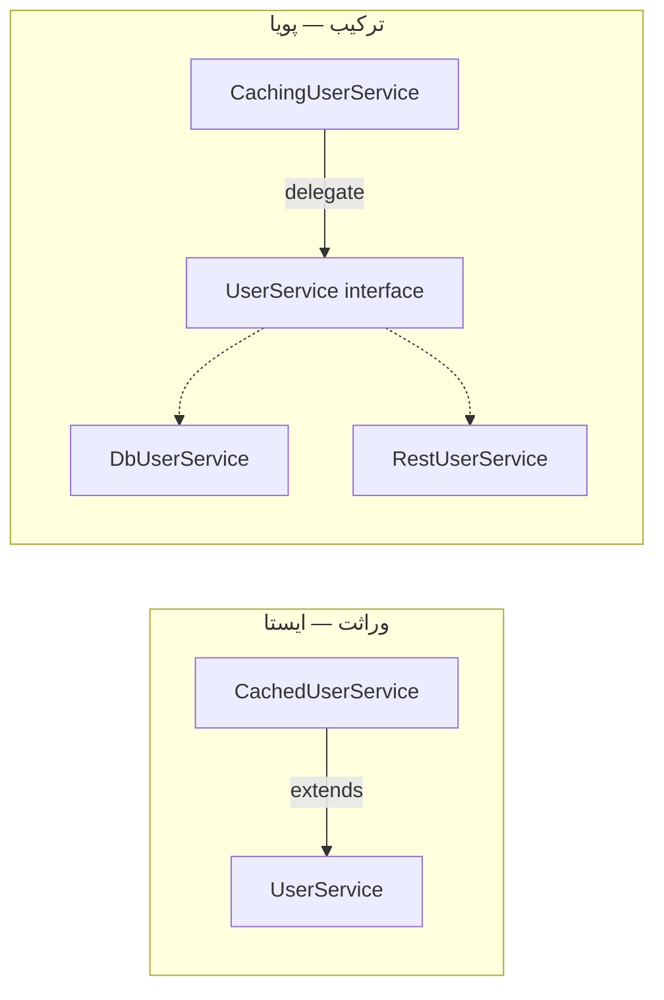

**چرا مهم است:**

اکثر فریم‌ورک‌های مدرن از ترکیب استفاده می‌کنند. مثلاً به‌جای ارث‌بری از یک `BaseService`، سرویس‌ها را با تزریق وابستگی می‌سازند. الگوهای Decorator و Strategy روی ترکیب بنا شده‌اند.

**مثال کد — Decorator با ترکیب:**

```java
// به‌جای: class CachedUserService extends UserService (وراثت شکننده)
interface UserService { User find(Long id); }

class DbUserService implements UserService {
    public User find(Long id) { return /* از DB */ null; }
}

class CachingUserService implements UserService { // رفتار را می‌چسباند
    private final UserService delegate;
    private final Map<Long, User> cache = new ConcurrentHashMap<>();
    CachingUserService(UserService delegate) { this.delegate = delegate; }

    public User find(Long id) {
        return cache.computeIfAbsent(id, delegate::find);
    }
}

// ترکیب چند رفتار به‌صورت لایه‌ای
UserService service = new CachingUserService(new LoggingUserService(new DbUserService()));
```

**نکات کلیدی:**

- ترکیب coupling کمتری دارد و در runtime قابل تعویض است.
- decorator و strategy روی ترکیب بنا شده‌اند.
- وراثت را فقط برای رابطه‌ی واقعی is-a و وقتی پایدار است استفاده کنید.

---

### Types & Memory — Stack vs Heap, Pass by Value

**توضیح:**

Java دو ناحیه‌ی اصلی حافظه دارد:

- **Stack:** برای متغیرهای محلی و فریم‌های فراخوانی متد. هر thread stack خودش را دارد. مقادیر primitive و **ارجاع‌ها** (reference) اینجا ذخیره می‌شوند.
- **Heap:** همه‌ی اشیاء (object) اینجا زندگی می‌کنند و توسط GC مدیریت می‌شوند؛ بین همه‌ی threadها مشترک است.

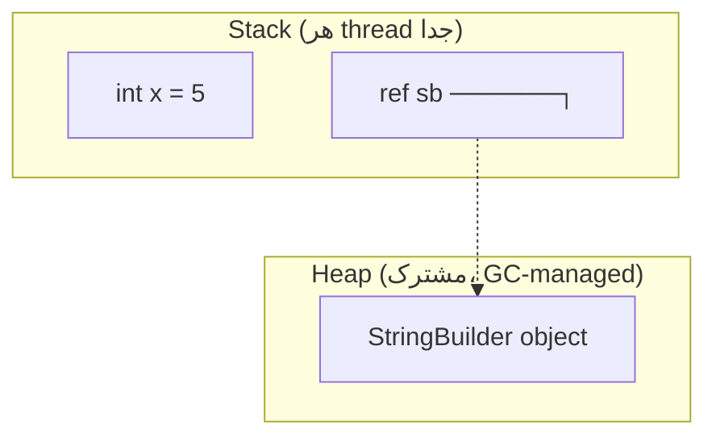

نکته‌ی بسیار مهم و سوال کلاسیک: **Java همیشه pass by value است** — حتی برای اشیاء. وقتی یک شیء را به متد پاس می‌دهید، **کپی ارجاع** پاس داده می‌شود، نه خود شیء و نه ارجاع اصلی. بنابراین می‌توانید state شیء را تغییر دهید (چون به همان شیء heap اشاره می‌کند) ولی نمی‌توانید ارجاع caller را به شیء دیگری منحرف کنید.

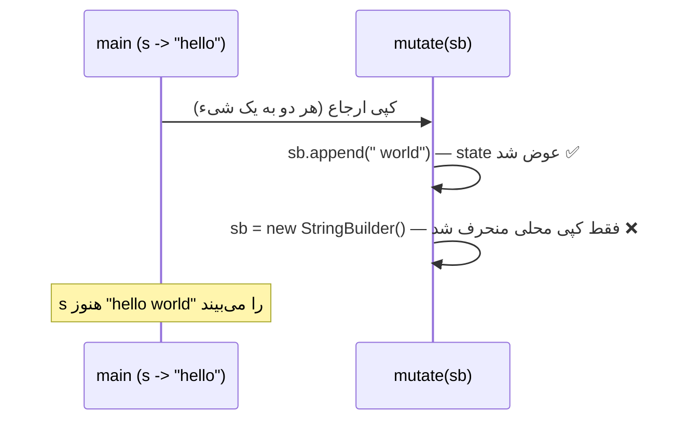

**چرا مهم است:**

سوء‌فهم pass-by-value منشأ باگ‌های واقعی است (مثلاً انتظار اینکه swap کردن دو متغیر داخل متد کار کند). همچنین درک stack/heap برای دیباگ `StackOverflowError` و `OutOfMemoryError` ضروری است.

**مثال کد ۱ — pass by value:**

```java
public class PassByValue {
    static void mutate(StringBuilder sb) {
        sb.append(" world");      // state شیء heap تغییر می‌کند → بیرون دیده می‌شود
        sb = new StringBuilder(); // فقط کپی محلی ارجاع عوض شد → بیرون اثری ندارد
    }

    static void swap(int a, int b) { int t = a; a = b; b = t; } // بی‌اثر بیرون

    public static void main(String[] args) {
        StringBuilder s = new StringBuilder("hello");
        mutate(s);
        System.out.println(s); // چاپ: hello world
    }
}
```

**مثال کد ۲ — تفاوت stack و heap در عمل:**

```java
// StackOverflowError: recursion بی‌انتها (stack پر می‌شود)
static int bad(int n) { return bad(n + 1); }

// OutOfMemoryError: heap پر می‌شود
List<byte[]> leak = new ArrayList<>();
while (true) leak.add(new byte[1_000_000]); // اشیاء روی heap انباشته می‌شوند
```

**نکات کلیدی:**

- Java فقط pass-by-value دارد؛ «کپی ارجاع» پاس می‌شود.
- StackOverflowError = recursion بی‌انتها؛ OutOfMemoryError: Java heap space = نشت یا داده‌ی زیاد.
- primitive روی stack، object همیشه روی heap (مگر escape analysis آن را روی stack بگذارد — scalar replacement).

---

### String Immutability, String Pool, StringBuilder vs StringBuffer

**توضیح:**

`String` در Java immutable است: هر «تغییر» یک شیء جدید می‌سازد. این طراحی عمدی است: امنیت thread، قابلیت cache کردن hashCode، و امکان String Pool. **String Pool** یک حافظه‌ی مشترک برای literalها است؛ دو literal یکسان به یک شیء اشاره می‌کنند.

```mermaid
flowchart TB
    subgraph Pool["String Pool (بخشی از Heap)"]
        P1["'java'"]
    end
    subgraph HeapArea["Heap"]
        H1["new String('java')"]
    end
    A["String a = 'java'"] --> P1
    B["String b = 'java'"] --> P1
    C["String c = new String('java')"] --> H1
    H1 -.->|intern()| P1
```

برای ساخت رشته‌ی پویا از `StringBuilder` (غیر thread-safe، سریع) یا `StringBuffer` (thread-safe با synchronized، کندتر) استفاده کنید. در ۹۹٪ موارد `StringBuilder` درست است چون معمولاً ساخت رشته محلی و تک‌ریسمانی است.

**چرا مهم است:**

الحاق رشته در حلقه با `+` فاجعه‌ی performance است (O(n²)). همچنین استفاده از `==` به‌جای `equals` برای String یکی از پرتکرارترین باگ‌هاست.

**مثال کد:**

```java
public class Strings {
    public static void main(String[] args) {
        String a = "java";
        String b = "java";
        System.out.println(a == b);        // true → هر دو از pool
        String c = new String("java");
        System.out.println(a == c);        // false → شیء جدید روی heap
        System.out.println(a.equals(c));   // true → مقایسه محتوا
        System.out.println(a == c.intern());// true → intern به pool می‌برد

        // ❌ بد: O(n²) و آشغال زیاد (هر += یک String جدید)
        String bad = "";
        for (int i = 0; i < 1000; i++) bad += i;

        // ✅ خوب: O(n)
        StringBuilder sb = new StringBuilder();
        for (int i = 0; i < 1000; i++) sb.append(i);
        String good = sb.toString();
    }
}
```

**نکات کلیدی:**

- برای مقایسه‌ی محتوای String همیشه `equals` (یا `Objects.equals` برای null-safety).
- در حلقه از StringBuilder استفاده کنید؛ کامپایلر `+` ساده را بهینه می‌کند ولی نه در حلقه.
- `intern()` با احتیاط؛ pool بخشی از heap است و سوءاستفاده می‌تواند فشار حافظه بیاورد.
- immutability باعث می‌شود String به‌صورت ذاتی thread-safe و مناسب کلید HashMap باشد.

---

### Wrapper Classes & Autoboxing

**توضیح:**

هر primitive یک کلاس wrapper دارد (`int → Integer`). Autoboxing تبدیل خودکار primitive به wrapper و unboxing برعکس آن است. اما این راحتی هزینه دارد: تخصیص حافظه، احتمال `NullPointerException` هنگام unboxing یک wrapper null، و کندی در حلقه‌های داغ.

نکته‌ی ظریف: `Integer` cache بین ‎-128 تا 127 وجود دارد. بنابراین `Integer.valueOf(100) == Integer.valueOf(100)` برابر true ولی برای 1000 برابر false است.

**چرا مهم است:**

NPE ناشی از unboxing یک wrapper null در کد production بسیار رایج است (مثلاً `int x = map.get(key)` وقتی key نیست).

**مثال کد:**

```java
public class Boxing {
    public static void main(String[] args) {
        Integer a = 127, b = 127;
        System.out.println(a == b); // true → از cache

        Integer c = 1000, d = 1000;
        System.out.println(c == d); // false → اشیاء جدا

        Map<String, Integer> counts = new HashMap<>();
        // ❌ اگر key نباشد get برمی‌گرداند null → unboxing → NPE
        // int n = counts.get("missing");
        int n = counts.getOrDefault("missing", 0); // ✅ ایمن

        // هزینه‌ی boxing در حلقه‌ی داغ:
        // ❌ Long به‌جای long → میلیون‌ها شیء Long
        Long sum = 0L;
        for (long i = 0; i < 1_000_000; i++) sum += i; // هر بار box/unbox!
        // ✅ از primitive استفاده کنید: long sum = 0L;
    }
}
```

**نکات کلیدی:**

- همیشه wrapperها را با `equals` مقایسه کنید نه `==`.
- مراقب unboxing مقدار null باشید؛ از `getOrDefault` استفاده کنید.
- در محاسبات سنگین از primitive استفاده کنید تا از سربار boxing فرار کنید.

---

### Exceptions — Checked vs Unchecked, try-with-resources

**توضیح:**

استثناها دو دسته‌اند:

- **Checked:** زیرکلاس `Exception` (نه `RuntimeException`). کامپایلر مجبور می‌کند یا catch یا declare شوند. برای خطاهای قابل‌بازیابی.
- **Unchecked:** زیرکلاس `RuntimeException`. کامپایلر اجباری ندارد. برای خطاهای برنامه‌نویسی (مثل `NullPointerException`, `IllegalArgumentException`).

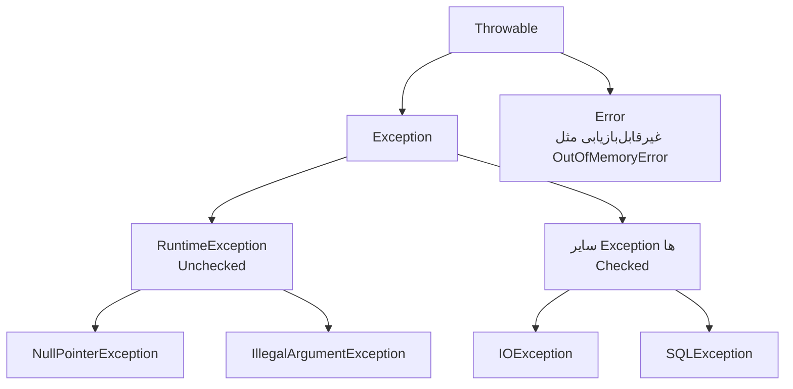

`try-with-resources` (Java 7) برای منابعی که `AutoCloseable` هستند، close را به‌صورت تضمینی و به ترتیب معکوس انجام می‌دهد — حتی هنگام استثنا. **Exception chaining** با `new XException("msg", cause)` علت ریشه‌ای را حفظ می‌کند.

**چرا مهم است:**

نشت منابع (connection، file handle) یکی از علل اصلی crash در production است. try-with-resources این را حل می‌کند. همچنین «swallow» کردن استثنا (catch خالی) باعث می‌شود باگ‌ها پنهان بمانند.

**مثال کد ۱ — try-with-resources و chaining:**

```java
public class Resources {
    static String readFirstLine(Path path) throws IOException {
        try (BufferedReader reader = Files.newBufferedReader(path)) {
            return reader.readLine();
        } // reader.close() خودکار صدا زده می‌شود، حتی هنگام exception
    }

    static class OrderNotFoundException extends RuntimeException {
        OrderNotFoundException(Long id, Throwable cause) {
            super("سفارش یافت نشد: " + id, cause); // حفظ علت ریشه‌ای
        }
    }
}
```

**مثال کد ۲ — چند منبع (ترتیب بسته شدن معکوس):**

```java
try (var conn = dataSource.getConnection();
     var stmt = conn.prepareStatement("SELECT * FROM users");
     var rs = stmt.executeQuery()) {
    while (rs.next()) { /* ... */ }
}
// ترتیب close: rs → stmt → conn (معکوس ساخت)
```

**نکات کلیدی:**

- هیچ‌وقت catch خالی ننویسید؛ حداقل log کنید یا دوباره پرتاب کنید.
- در try-with-resources منابع به ترتیب معکوس بسته می‌شوند.
- روند مدرن: استفاده از unchecked exception برای خطاهای کسب‌وکار + `@ControllerAdvice` در Spring.
- `Error` (مثل `OutOfMemoryError`) را catch نکنید؛ برای شرایط غیرقابل‌بازیابی JVM است.

---

### Collections Framework

**توضیح:**

ساختار اصلی مجموعه‌ها:

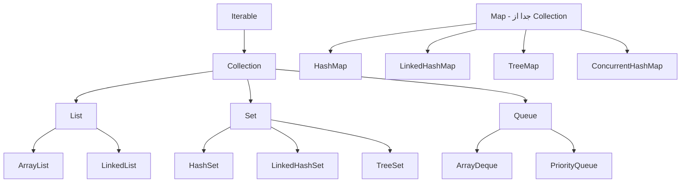

- **List:** ترتیب‌دار، تکراری مجاز. `ArrayList` (آرایه‌ی پویا، دسترسی تصادفی O(1)، درج وسط O(n)) در برابر `LinkedList` (لیست پیوندی دوطرفه).
- **Set:** بدون تکرار. `HashSet` (O(1) متوسط، بی‌ترتیب)، `LinkedHashSet` (حفظ ترتیب درج)، `TreeSet` (مرتب، O(log n)).
- **Map:** کلید→مقدار. `HashMap`, `LinkedHashMap`, `TreeMap`, `ConcurrentHashMap`.
- **Queue/Deque:** `ArrayDeque` (پیشنهادی)، `PriorityQueue` (heap)، `BlockingQueue` (هم‌زمانی).

جدول پیچیدگی زمانی:

| ساختار | get/contains | add | remove | ترتیب |
|--------|--------------|-----|--------|-------|
| ArrayList | O(1) index | O(1)* انتها | O(n) | درج |
| LinkedList | O(n) | O(1) سر | O(1) با iterator | درج |
| HashSet/HashMap | O(1)* | O(1)* | O(1)* | ندارد |
| TreeSet/TreeMap | O(log n) | O(log n) | O(log n) | مرتب |

`Comparable` ترتیب طبیعی تک‌گانه می‌دهد (`compareTo`)؛ `Comparator` ترتیب‌های خارجی متعدد. **Fail-fast** iteratorها هنگام تغییر ساختاری حین پیمایش `ConcurrentModificationException` می‌دهند؛ **fail-safe** (مثل `CopyOnWriteArrayList`) روی کپی کار می‌کنند.

**مثال کد:**

```java
public class CollectionsDemo {
    record Person(String name, int age) {}

    public static void main(String[] args) {
        List<Person> people = new ArrayList<>(List.of(
            new Person("Sara", 30), new Person("Ali", 25)));

        // Comparator با chaining
        people.sort(Comparator.comparingInt(Person::age)
                              .thenComparing(Person::name));

        // ❌ ConcurrentModificationException
        // for (Person p : people) if (p.age() < 26) people.remove(p);

        // ✅ حذف امن با removeIf
        people.removeIf(p -> p.age() < 26);

        Map<String, Integer> wordCount = new HashMap<>();
        for (String w : "a b a c a".split(" "))
            wordCount.merge(w, 1, Integer::sum); // الگوی شمارش
        System.out.println(wordCount); // {a=3, b=1, c=1}

        // گروه‌بندی با computeIfAbsent
        Map<Integer, List<Person>> byAge = new HashMap<>();
        people.forEach(p -> byAge.computeIfAbsent(p.age(), k -> new ArrayList<>()).add(p));
    }
}
```

**نکات کلیدی:**

- برای حذف حین پیمایش از `Iterator.remove()` یا `removeIf` استفاده کنید.
- `ArrayList` پیش‌فرض درست برای List است؛ `LinkedList` به‌ندرت برنده می‌شود.
- اگر کلید سفارشی در HashMap دارید، حتماً `equals` و `hashCode` را با هم override کنید.
- `EnumMap`/`EnumSet` برای کلید enum بسیار کارآمدترند.

---

### Generics & PECS

**توضیح:**

Generics ایمنی نوع را در زمان کامپایل می‌آورد و از cast دستی جلوگیری می‌کند. **Type erasure** یعنی اطلاعات نوع generic در زمان اجرا پاک می‌شود (`List<String>` و `List<Integer>` در runtime یکی هستند). به همین دلیل نمی‌توان `new T[]` ساخت یا `instanceof List<String>` نوشت.

**PECS** = Producer Extends, Consumer Super:
- `<? extends T>` وقتی از مجموعه فقط **می‌خوانید** (producer).
- `<? super T>` وقتی در مجموعه فقط **می‌نویسید** (consumer).

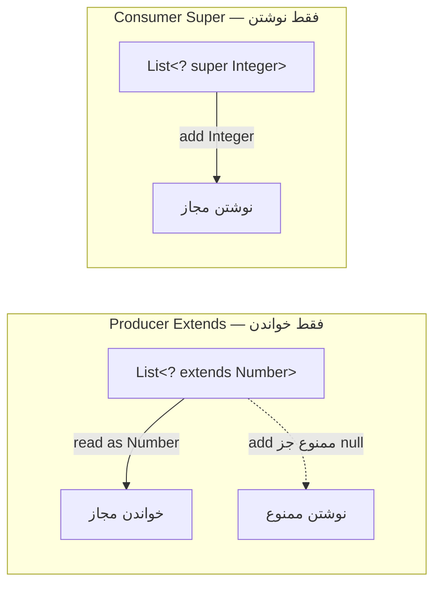

**چرا مهم است:**

API‌های انعطاف‌پذیر (مثل `Collections.copy`) با wildcardها طراحی می‌شوند. درک PECS برای نوشتن متدهای generic قابل‌استفاده‌ی مجدد لازم است.

**مثال کد:**

```java
public class Generics {
    // Producer: از src می‌خوانیم → extends؛ Consumer: در dest می‌نویسیم → super
    static <T> void copy(List<? super T> dest, List<? extends T> src) {
        for (T item : src) dest.add(item);
    }

    // bounded type parameter
    static <T extends Comparable<T>> T max(List<T> list) {
        return list.stream().max(Comparator.naturalOrder()).orElseThrow();
    }

    public static void main(String[] args) {
        List<Integer> ints = List.of(1, 2, 3);
        List<Number> nums = new ArrayList<>();
        copy(nums, ints); // Integer → Number مجاز
    }
}
```

**نکات کلیدی:**

- به‌خاطر type erasure نمی‌توان آرایه‌ی generic ساخت یا نوع generic را با instanceof چک کرد.
- PECS را به‌خاطر بسپارید: Producer-Extends, Consumer-Super.
- bounded type (`<T extends Comparable<T>>`) برای محدود کردن قابلیت‌ها.
- برای دور زدن erasure از type token (`Class<T>`) استفاده کنید.

---

### Java 5 Additions — Enum, Annotations, Varargs

**توضیح:**

Java 5 پایه‌ی Java مدرن را گذاشت: Generics، enhanced for، autoboxing، varargs، annotations و enum. `enum` در Java بسیار قدرتمند است — می‌تواند فیلد، متد و حتی پیاده‌سازی متفاوت برای هر مقدار داشته باشد (constant-specific body). enum بهترین راه پیاده‌سازی Singleton thread-safe است.

**چرا مهم است:**

enum برای مدل‌سازی state machine، strategy و config استفاده می‌شود. Annotations پایه‌ی کل Spring و JPA هستند.

**مثال کد ۱ — enum با رفتار:**

```java
public enum Operation {
    PLUS("+") { public int apply(int a, int b) { return a + b; } },
    MINUS("-") { public int apply(int a, int b) { return a - b; } },
    TIMES("*") { public int apply(int a, int b) { return a * b; } };

    private final String symbol;
    Operation(String symbol) { this.symbol = symbol; }
    public abstract int apply(int a, int b); // هر مقدار پیاده‌سازی خودش

    public static void main(String[] args) {
        for (Operation op : values())
            System.out.println("2 " + op.symbol + " 3 = " + op.apply(2, 3));
    }
}
```

**مثال کد ۲ — enum Singleton و EnumMap:**

```java
// بهترین Singleton (serialization-safe، reflection-safe)
public enum Config {
    INSTANCE;
    private final Map<String, String> settings = new HashMap<>();
    public void set(String k, String v) { settings.put(k, v); }
    public String get(String k) { return settings.get(k); }
}

// EnumMap بسیار کارآمد (آرایه‌محور)
EnumMap<Operation, String> descriptions = new EnumMap<>(Operation.class);
```

**نکات کلیدی:**

- enum برای Singleton بهترین انتخاب است (serialization-safe، reflection-safe).
- varargs آرایه می‌سازد؛ در حلقه‌ی داغ مراقب تخصیص باشید.
- enum را در `switch` و `EnumMap`/`EnumSet` (بسیار کارآمد) استفاده کنید.

---

## 🎯 سوالات مصاحبه

### سوال ۱: تفاوت `==` و `equals()` چیست و چرا برای String مهم است؟

**سطح:** Junior / Mid
**تکرار:** خیلی زیاد

**جواب کامل:**

`==` برای primitiveها مقدار را مقایسه می‌کند، اما برای اشیاء **هویت ارجاع** (آیا به یک شیء در heap اشاره می‌کنند) را می‌سنجد. `equals()` یک متد است که قرارداد **برابری منطقی** را تعریف می‌کند؛ پیاده‌سازی پیش‌فرض در `Object` همان `==` است، اما کلاس‌هایی مثل `String`, `Integer`, و recordها آن را override می‌کنند تا محتوا را مقایسه کنند.

برای String این تفاوت بحرانی است چون به‌خاطر String Pool، دو literal یکسان ممکن است به یک شیء اشاره کنند (`==` برابر true) ولی یک String ساخته‌شده با `new` شیء جداست (`==` برابر false). بنابراین تکیه بر `==` باگ‌های متناوب و سخت‌یاب می‌سازد.

نکته‌ی Senior: همیشه `Objects.equals(a, b)` را ترجیح دهید چون null-safe است.

**کد توضیحی:**

```java
String a = "x";
String b = new String("x");
System.out.println(a == b);              // false
System.out.println(a.equals(b));         // true
System.out.println(Objects.equals(a, b));// true و null-safe
```

**نکته مصاحبه:**

Junior معمولاً می‌گوید «`==` مقایسه می‌کند و `equals` هم مقایسه می‌کند». تمایز Senior در توضیح String Pool، قرارداد `equals/hashCode` و اشاره به `Objects.equals` است. Follow-up: «اگر `equals` را override کنی ولی `hashCode` را نه چه می‌شود؟»

---

### سوال ۲: قرارداد `equals()` و `hashCode()` چیست و چرا باید با هم override شوند؟

**سطح:** Senior
**تکرار:** خیلی زیاد

**جواب کامل:**

قرارداد می‌گوید: اگر `a.equals(b)` برابر true باشد، حتماً `a.hashCode() == b.hashCode()`. عکس آن لازم نیست (دو شیء نابرابر می‌توانند hashCode یکسان داشته باشند = collision). اگر فقط `equals` را override کنید و `hashCode` را نه، آن‌گاه استفاده از شیء به‌عنوان کلید در `HashMap` یا عضو `HashSet` می‌شکند: شیء را در bucket بر اساس hashCode قدیمی می‌گذارد و هنگام جستجو پیدایش نمی‌کند.

`equals` باید reflexive، symmetric، transitive، consistent باشد و `x.equals(null)` همیشه false. بهترین کار استفاده از `Objects.equals` و `Objects.hash` یا تعریف کلاس به‌صورت `record` است.

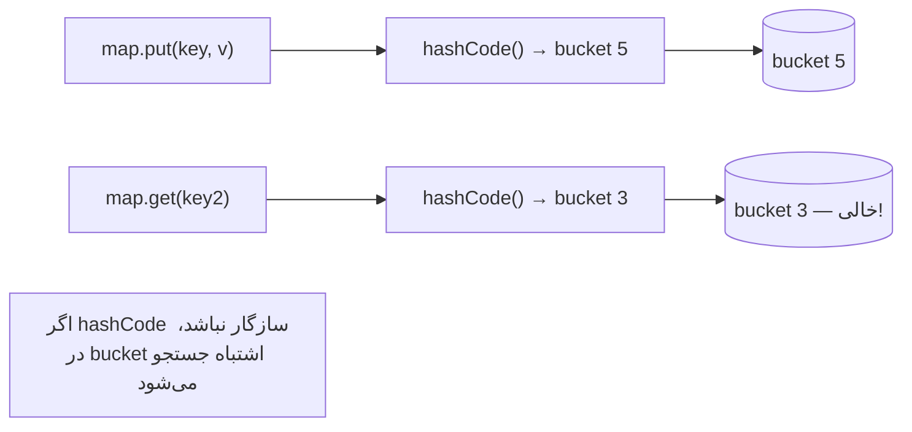

**کد توضیحی:**

```java
public final class Point {
    private final int x, y;
    public Point(int x, int y) { this.x = x; this.y = y; }

    @Override public boolean equals(Object o) {
        if (this == o) return true;
        if (!(o instanceof Point p)) return false;
        return x == p.x && y == p.y;
    }
    @Override public int hashCode() { return Objects.hash(x, y); }
}
// یا ساده‌تر: record Point(int x, int y) {}
```

**نکته مصاحبه:**

تمایز Senior: اشاره به اینکه hashCode باید با فیلدهایی محاسبه شود که در equals هم استفاده شده‌اند، و اینکه استفاده از فیلد mutable به‌عنوان کلید HashMap خطرناک است. Follow-up: «اگر فیلد کلید بعد از قرار گرفتن در HashSet تغییر کند چه می‌شود؟» (شیء گم می‌شود).

---

### سوال ۳: چرا Java «pass by value» است حتی برای اشیاء؟

**سطح:** Mid / Senior
**تکرار:** زیاد

**جواب کامل:**

Java همیشه value را کپی می‌کند. برای primitive، خود مقدار کپی می‌شود. برای اشیاء، **مقدار ارجاع** (آدرس) کپی می‌شود — نه خود شیء. بنابراین داخل متد یک کپی مستقل از ارجاع دارید که به همان شیء heap اشاره می‌کند. می‌توانید state آن شیء را تغییر دهید و این تغییر بیرون دیده می‌شود. اما اگر کپی محلی را به شیء دیگری منحرف کنید (reassign)، ارجاع caller دست‌نخورده می‌ماند.

این دقیقاً تفاوت با «pass by reference» در زبان‌هایی مثل C++ است.

**کد توضیحی:**

```java
static void reassign(int[] arr) {
    arr[0] = 99;            // state شیء عوض می‌شود → بیرون دیده می‌شود
    arr = new int[]{1, 2};  // فقط کپی محلی منحرف شد → بی‌اثر بیرون
}
int[] a = {0};
reassign(a);
System.out.println(a[0]); // 99
```

**نکته مصاحبه:**

سوءفهم رایج Junior: «اشیاء pass by reference هستند». Senior دقیق می‌گوید «کپی ارجاع پاس می‌شود». Follow-up: «پس چرا با swap داخل متد دو متغیر جابه‌جا نمی‌شوند؟»

---

### سوال ۴: ArrayList در برابر LinkedList — کِی کدام؟

**سطح:** Mid / Senior
**تکرار:** زیاد

**جواب کامل:**

`ArrayList` پشت‌صحنه آرایه‌ی پویاست: دسترسی تصادفی با index برابر O(1)، اما درج/حذف در وسط O(n). افزایش ظرفیت با ضریب ۱.۵ (amortized O(1) برای add در انتها).

`LinkedList` لیست پیوندی دوطرفه است: درج/حذف در سرها O(1)، اما دسترسی تصادفی O(n). همچنین سربار حافظه‌ی بیشتر (هر node دو pointer) و cache locality ضعیف دارد.

در عمل تقریباً همیشه `ArrayList` برنده است، حتی برای درج‌های مکرر، چون cache locality و کمبود سربار pointer غالب می‌شود. `LinkedList` فقط وقتی منطقی است که به‌عنوان Deque با درج/حذف زیاد در سرها استفاده شود — و حتی آن‌جا `ArrayDeque` بهتر است.

**کد توضیحی:**

```java
List<Integer> arrayList = new ArrayList<>();   // پیش‌فرض درست
Deque<Integer> deque = new ArrayDeque<>();      // بهتر از LinkedList برای صف/پشته
deque.addFirst(1); deque.addLast(2);
```

**نکته مصاحبه:**

Senior می‌داند که نظریه (LinkedList برای درج زیاد بهتر است) در عمل به‌خاطر cache و سربار pointer معمولاً غلط است. Follow-up: «ArrayList چطور resize می‌شود و amortized cost چیست؟»

---

### سوال ۵: تفاوت checked و unchecked exception و کِی کدام؟

**سطح:** Senior
**تکرار:** زیاد

**جواب کامل:**

Checked exception توسط کامپایلر اجباری می‌شود؛ متد باید آن را catch یا با `throws` اعلام کند. فلسفه‌اش این بود که برای خطاهای قابل‌بازیابی توسعه‌دهنده را مجبور کند به آن فکر کند. Unchecked اجباری ندارد و برای خطاهای برنامه‌نویسی است.

دیدگاه مدرن: checked exception معمولاً coupling و boilerplate زیاد می‌سازد و در عمل توسعه‌دهندگان آن را با catch خالی swallow می‌کنند. به همین دلیل بسیاری تیم‌ها برای خطاهای دامنه‌ای از unchecked exception استفاده می‌کنند و در یک لایه‌ی مرکزی (`@ControllerAdvice`) مدیریت‌شان می‌کنند.

**کد توضیحی:**

```java
class InsufficientFundsException extends RuntimeException {
    InsufficientFundsException(String msg) { super(msg); }
}

@RestControllerAdvice
class GlobalHandler {
    @ExceptionHandler(InsufficientFundsException.class)
    ProblemDetail handle(InsufficientFundsException ex) {
        return ProblemDetail.forStatusAndDetail(HttpStatus.CONFLICT, ex.getMessage());
    }
}
```

**نکته مصاحبه:**

تمایز Senior: داشتن موضع روشن درباره‌ی trade-off. Follow-up: «`Error` چه فرقی با `Exception` دارد؟»

---

### سوال ۶: type erasure چیست و چه محدودیت‌هایی ایجاد می‌کند؟

**سطح:** Senior
**تکرار:** متوسط

**جواب کامل:**

Generics در Java فقط یک ویژگی زمان‌کامپایل است. کامپایلر نوع‌ها را چک می‌کند و سپس آن‌ها را پاک می‌کند (erasure)؛ در bytecode `List<String>` به `List` تبدیل می‌شود. علت این طراحی backward compatibility با کد pre-generics بود.

پیامدها: نمی‌توان `new T()` یا `new T[]` ساخت، نمی‌توان `obj instanceof List<String>` نوشت، دو متد که فقط در پارامتر generic تفاوت دارند نمی‌توانند overload شوند، و نمی‌توان از primitive به‌عنوان type parameter استفاده کرد. برای دور زدن، الگوی «type token» (`Class<T>`) استفاده می‌شود.

**کد توضیحی:**

```java
class Repository<T> {
    private final Class<T> type; // type token برای دور زدن erasure
    Repository(Class<T> type) { this.type = type; }
    T create() throws Exception { return type.getDeclaredConstructor().newInstance(); }
}
```

**نکته مصاحبه:**

Senior به backward compatibility به‌عنوان دلیل تاریخی اشاره می‌کند. Follow-up: «چرا نمی‌توان `List<int>` داشت؟»

---

### سوال ۷: PECS را توضیح بده.

**سطح:** Senior
**تکرار:** متوسط

**جواب کامل:**

PECS مخفف Producer Extends, Consumer Super است. اگر یک ساختار generic فقط منبع داده است (از آن می‌خوانید) از `<? extends T>` استفاده کنید؛ می‌توانید هر عنصری را به‌عنوان T بخوانید اما نمی‌توانید چیزی اضافه کنید (جز null). اگر ساختار مقصد داده است (در آن می‌نویسید) از `<? super T>` استفاده کنید؛ می‌توانید مطمئن باشید T جا می‌شود.

این قاعده انعطاف API را به حداکثر می‌رساند بدون شکستن ایمنی نوع. نمونه: `Collections.copy(List<? super T> dest, List<? extends T> src)`.

**نکته مصاحبه:**

Follow-up: «از یک `List<? extends Number>` چه چیزی می‌توان add کرد؟» (فقط `null`).

---

### سوال ۸: تفاوت overloading و overriding چیست؟

**سطح:** Junior / Mid
**تکرار:** زیاد

**جواب کامل:**

overloading چند متد هم‌نام با امضای متفاوت (تعداد/نوع پارامتر) در یک کلاس است که در **compile-time** بر اساس نوع استاتیک آرگومان resolve می‌شود (static/compile-time polymorphism). overriding بازنویسی متد والد در زیرکلاس با امضای یکسان است که در **runtime** بر اساس نوع واقعی شیء resolve می‌شود (dynamic dispatch). تفاوت کلیدی: overload تصمیم کامپایلر، override تصمیم JVM. متدهای `static`, `private`, `final` override نمی‌شوند.

**نکته مصاحبه:**

Follow-up: «آیا می‌توان متد static را override کرد؟» (نه، فقط hide می‌شود).

---

### سوال ۹: چرا String immutable است و چه مزایایی دارد؟

**سطح:** Senior
**تکرار:** متوسط

**جواب کامل:**

immutability String تصمیم طراحی عمدی با چند مزیت: (۱) **thread-safety** ذاتی — چند thread می‌توانند بدون sync یک String را share کنند. (۲) **String Pool** — چون immutable، اشتراک literal امن است (کسی نمی‌تواند آن را عوض کند). (۳) **hashCode caching** — چون تغییر نمی‌کند، hashCode یک‌بار محاسبه و cache می‌شود (مهم برای کلید HashMap). (۴) **امنیت** — Stringها برای path، URL، credential استفاده می‌شوند؛ immutability از تغییر بعد از validation جلوگیری می‌کند. عیب: هر تغییر یک شیء جدید می‌سازد، پس برای ساخت پویا StringBuilder لازم است.

**نکته مصاحبه:**

Senior به hashCode caching و security اشاره می‌کند.

---

## ⚠️ اشتباهات رایج

### اشتباه ۱: مقایسه‌ی String با `==`

```java
// ❌ اشتباه
if (status == "ACTIVE") { ... } // ممکن است گاهی کار کند، گاهی نه
```

```java
// ✅ صحیح
if ("ACTIVE".equals(status)) { ... } // literal اول → null-safe هم هست
```

**توضیح:** `==` هویت ارجاع را می‌سنجد. به‌خاطر String Pool گاهی درست به‌نظر می‌رسد اما با Stringهای ساخته‌شده در runtime می‌شکند.

---

### اشتباه ۲: override کردن `equals` بدون `hashCode`

```java
// ❌ hashCode override نشده → در HashSet گم می‌شود
class User {
    String id;
    @Override public boolean equals(Object o) { /* مقایسه id */ return true; }
}
```

```java
// ✅ یا record استفاده کنید
record User(String id) {}
```

**توضیح:** بدون hashCode سازگار، شیء در bucket اشتباه می‌رود.

---

### اشتباه ۳: تغییر مجموعه حین پیمایش

```java
// ❌ ConcurrentModificationException
for (String s : list) {
    if (s.isBlank()) list.remove(s);
}
```

```java
// ✅ صحیح
list.removeIf(String::isBlank);
```

**توضیح:** iteratorهای fail-fast هنگام تغییر ساختاری حین پیمایش استثنا می‌دهند.

---

### اشتباه ۴: NPE ناشی از unboxing

```java
// ❌ اگر key نباشد → NPE
Map<String, Integer> m = new HashMap<>();
int count = m.get("x");
```

```java
// ✅ صحیح
int count = m.getOrDefault("x", 0);
```

**توضیح:** `get` برای کلید غایب null می‌دهد و unboxing خودکار null به NPE منجر می‌شود.

---

### اشتباه ۵: الحاق String در حلقه با `+`

```java
// ❌ O(n²)
String result = "";
for (String part : parts) result += part + ",";
```

```java
// ✅ O(n)
String result = String.join(",", parts);
```

**توضیح:** هر `+=` یک String جدید می‌سازد.

---

### اشتباه ۶: نشت ارجاع به collection داخلی

```java
// ❌ caller می‌تواند state داخلی را تغییر دهد
public List<Item> getItems() { return this.items; }
```

```java
// ✅ کپی دفاعی
public List<Item> getItems() { return List.copyOf(this.items); }
```

**توضیح:** برگرداندن مستقیم collection داخلی کپسوله‌سازی را می‌شکند.

---

### اشتباه ۷: استفاده از فیلد mutable به‌عنوان کلید HashMap

```java
// ❌ تغییر کلید بعد از put → شیء گم می‌شود
class Key { int id; public int hashCode(){return id;} }
Key k = new Key(); map.put(k, v); k.id = 99; // map.get(k) → null
```

```java
// ✅ کلید immutable
record Key(int id) {}
```

**توضیح:** تغییر کلید hashCode را عوض می‌کند و شیء در bucket اشتباه می‌ماند.

---

## 🔗 ارتباط با سایر مفاهیم

- این مفاهیم با **Collections و Concurrency (1.6)** ارتباط دارند چون `HashMap`, `equals/hashCode` و thread-safety همگی روی همین پایه بنا شده‌اند.
- در پروژه‌های واقعی معمولاً با **Spring (2.1)** ترکیب می‌شوند: DIP پایه‌ی IoC، interfaceها پایه‌ی Spring Data، و exception handling پایه‌ی `@ControllerAdvice`.
- وقتی **memory leak** یا `OutOfMemoryError` می‌بینید، احتمالاً درک stack/heap (**12.6**)، String Pool و چرخه‌ی حیات اشیاء درگیر است.
- SOLID و Composition over Inheritance مستقیماً به **Design Patterns (5.3)** (Strategy, Decorator) و **Clean Architecture (15.1)** متصل می‌شوند.
- درک generics و PECS پیش‌نیاز **Stream API (1.2)** و **Functional interfaces** است.
- HashMap internals در **Data Structures (5.1)** عمیق‌تر بررسی می‌شود.
