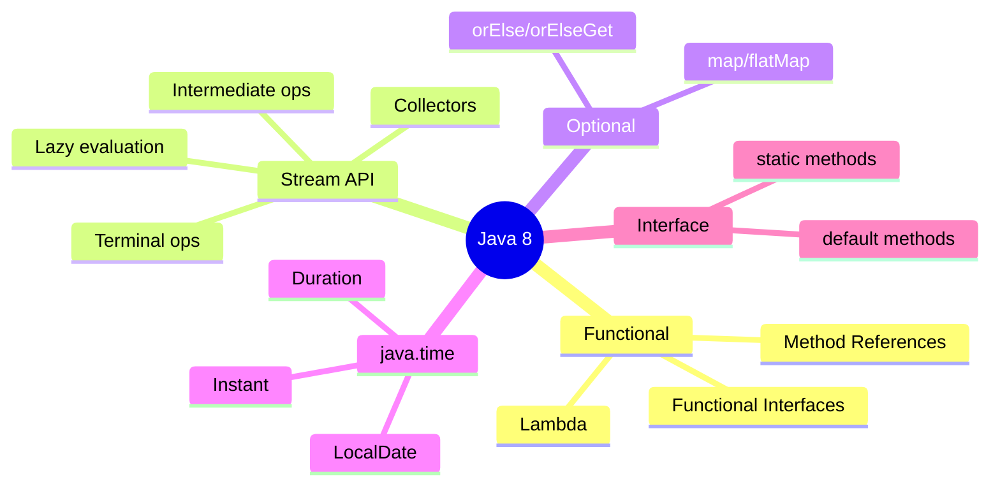
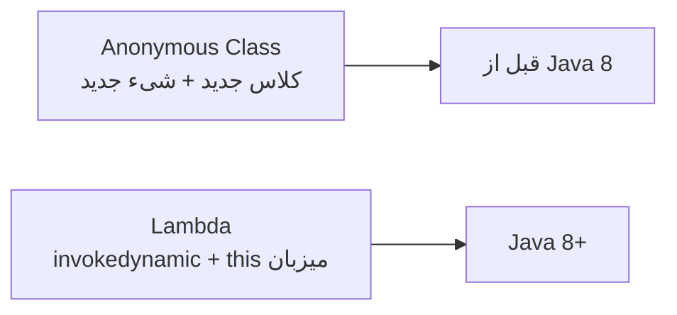
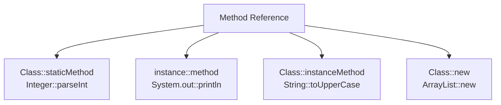
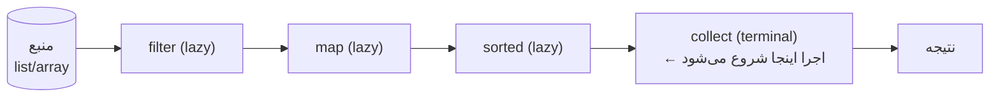
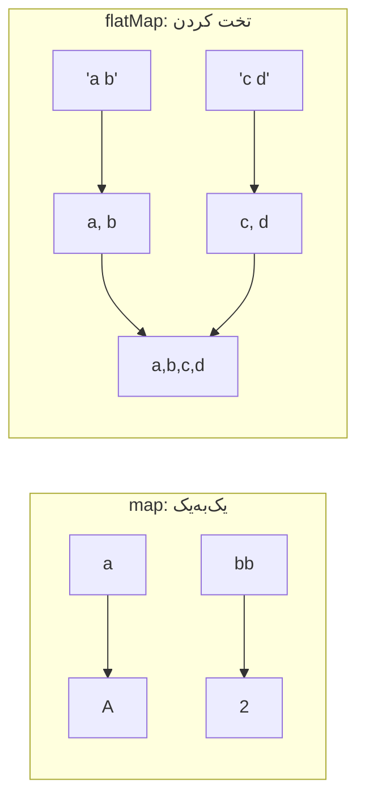
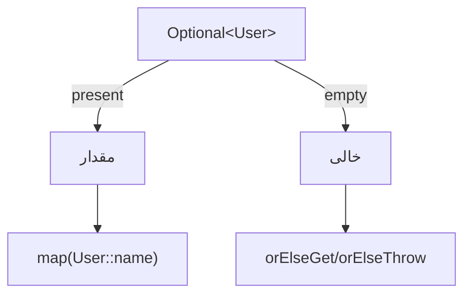
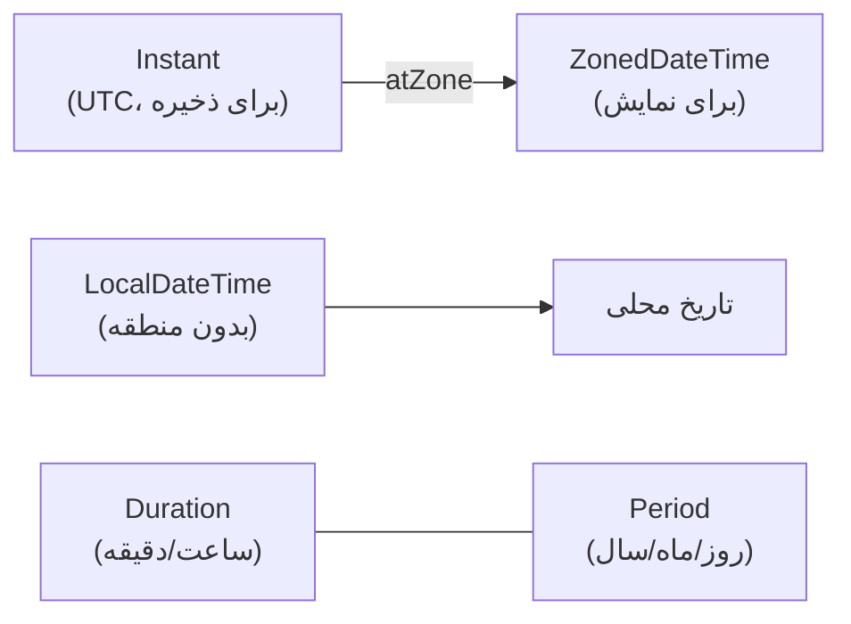
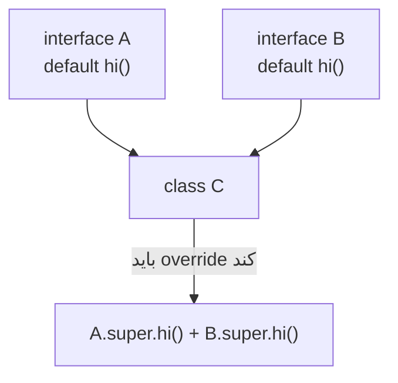

# Java 8 — نقطه عطف (Functional Programming, Streams, Optional)

> Java 8 مهم‌ترین نسخه‌ی تاریخ Java است. هر مصاحبه‌ی Senior حتماً Lambda، Stream و Optional را عمیق می‌پرسد. این فایل با دیاگرام، مثال‌های متعدد و عمق کامل نوشته شده.

## فهرست
- [نقشه‌ی ذهنی](#نقشه‌ی-ذهنی)
- [📖 مفاهیم](#-مفاهیم)
- [🎯 سوالات مصاحبه](#-سوالات-مصاحبه)
- [⚠️ اشتباهات رایج](#️-اشتباهات-رایج)
- [🔗 ارتباط با سایر مفاهیم](#-ارتباط-با-سایر-مفاهیم)

---

## نقشه‌ی ذهنی



---

## 📖 مفاهیم

### Lambda Expressions

**توضیح:**

Lambda یک تابع بی‌نام است که می‌توان آن را مثل داده پاس داد. پیش از Java 8، برای پاس دادن رفتار مجبور به ساخت anonymous class بودیم. Lambda این boilerplate را حذف می‌کند. از نظر فنی، lambda یک نمونه از یک **functional interface** (interface با دقیقاً یک متد abstract) می‌سازد.

نکته‌ی مهم Senior: lambda با anonymous class فرق دارد. lambda `this` را به کلاس میزبان bind می‌کند (نه به خودش)، شیء جدید برای هر فراخوانی نمی‌سازد (می‌تواند cache شود)، و در bytecode با `invokedynamic` پیاده می‌شود نه با کلاس مجزا.



**چرا مهم است:**

کل Stream API، callbackها، event handlerها و توابع functional روی lambda بنا شده‌اند. کد خواناتر و قابل‌ترکیب‌تر می‌شود.

**مثال کد ۱ — تبدیل anonymous به lambda:**

```java
// قبل: anonymous class پرحرف
Runnable r1 = new Runnable() {
    @Override public void run() { System.out.println("run"); }
};
// بعد: lambda
Runnable r2 = () -> System.out.println("run");

// lambda به‌عنوان رفتار قابل پاس
List<String> names = new ArrayList<>(List.of("Sara", "Ali", "Reza"));
names.sort((a, b) -> a.length() - b.length()); // مرتب‌سازی بر اساس طول
```

**مثال کد ۲ — capture و effectively final:**

```java
int factor = 10; // باید effectively final باشد
Function<Integer, Integer> multiply = x -> x * factor; // factor را capture می‌کند
// factor = 20; // ❌ اگر این خط باشد، lambda بالا کامپایل نمی‌شود

// this در lambda به کلاس میزبان اشاره می‌کند
class Widget {
    String name = "widget";
    Runnable printer() { return () -> System.out.println(this.name); } // this = Widget
}
```

**نکات کلیدی:**

- lambda فقط برای functional interface (تک‌متده) کار می‌کند.
- `this` در lambda به کلاس بیرونی اشاره می‌کند نه به خود lambda.
- متغیرهای محلی استفاده‌شده در lambda باید effectively final باشند (مقدار capture می‌شود).

---

### Functional Interfaces

**توضیح:**

interface با یک متد abstract که با `@FunctionalInterface` علامت می‌خورد. پکیج `java.util.function` چندین مورد آماده دارد:

| Interface | امضا | متد | کاربرد |
|-----------|------|-----|--------|
| `Function<T,R>` | T → R | `apply` | تبدیل |
| `Predicate<T>` | T → boolean | `test` | فیلتر/شرط |
| `Consumer<T>` | T → void | `accept` | side-effect |
| `Supplier<T>` | () → T | `get` | تولید/lazy |
| `BiFunction<T,U,R>` | (T,U) → R | `apply` | دو ورودی |
| `UnaryOperator<T>` | T → T | `apply` | تبدیل هم‌نوع |

این interfaceها قابل ترکیب‌اند (`andThen`, `compose`, `and`, `or`, `negate`).

**چرا مهم است:**

این‌ها زبان مشترک API‌های functional هستند. Stream، Optional و CompletableFuture همه از این interfaceها استفاده می‌کنند.

**مثال کد ۱ — ترکیب:**

```java
Function<Integer, Integer> doubler = x -> x * 2;
Function<Integer, Integer> increment = x -> x + 1;
System.out.println(doubler.andThen(increment).apply(5)); // 11 (اول double بعد increment)
System.out.println(doubler.compose(increment).apply(5)); // 12 (اول increment بعد double)

Predicate<String> notBlank = s -> !s.isBlank();
Predicate<String> shortStr = s -> s.length() < 5;
System.out.println(notBlank.and(shortStr).test("hi")); // true
System.out.println(notBlank.negate().test(""));        // true
```

**مثال کد ۲ — primitive specializations (جلوگیری از boxing):**

```java
// نسخه‌های primitive برای جلوگیری از boxing:
ToIntFunction<String> length = String::length;       // String → int (بدون boxing)
IntPredicate isEven = n -> n % 2 == 0;
IntUnaryOperator square = n -> n * n;
// به‌جای Function<Integer,Integer> که boxing دارد
```

**نکات کلیدی:**

- برای primitive از نسخه‌های تخصصی استفاده کنید (`IntFunction`, `ToIntFunction`) تا از boxing فرار کنید.
- `Function.identity()` گاهی در Collectors لازم می‌شود.
- ترکیب‌پذیری (`andThen`/`compose`) کد را تمیز نگه می‌دارد.

---

### Method References

**توضیح:**

میان‌بری برای lambda‌ای که فقط یک متد موجود را صدا می‌زند. چهار نوع:



**چرا مهم است:**

خوانایی را بالا می‌برد و قصد کد را شفاف می‌کند. در Stream pipelineها بسیار رایج است.

**مثال کد:**

```java
List<String> names = List.of("sara", "ali");
names.stream()
     .map(String::toUpperCase)   // Class::instanceMethod
     .forEach(System.out::println); // instance::method

Supplier<ArrayList<String>> listFactory = ArrayList::new; // constructor reference
Function<String, Integer> parse = Integer::parseInt;       // Class::staticMethod
```

**نکات کلیدی:**

- وقتی lambda فقط یک متد را صدا می‌زند، method reference تمیزتر است.
- مراقب ابهام بین `Class::instanceMethod` و `Class::staticMethod` باشید.

---

### Stream API

**توضیح:**

Stream یک خط لوله‌ی پردازش داده است که به سبک declarative نوشته می‌شود. سه بخش دارد: منبع، عملیات میانی (intermediate) که lazy هستند، و یک عملیات نهایی (terminal) که نتیجه تولید می‌کند و pipeline را اجرا می‌کند.



**Lazy evaluation** هسته‌ی Stream است: تا وقتی terminal operation صدا زده نشود، هیچ عملیات میانی اجرا نمی‌شود. عناصر «عمودی» از pipeline عبور می‌کنند (نه افقی)؛ این امکان short-circuit (مثل `findFirst`, `limit`) را می‌دهد.

عملیات میانی: `filter`, `map`, `flatMap`, `sorted`, `distinct`, `limit`, `peek`.
عملیات نهایی: `collect`, `forEach`, `reduce`, `count`, `findFirst`, `anyMatch`.

`parallelStream()` کار را روی `ForkJoinPool.commonPool()` پخش می‌کند — فقط برای حجم بالا و عملیات بدون side-effect و stateless مفید است.

**چرا مهم است:**

Stream کد پردازش داده را خواناتر می‌کند. اما استفاده‌ی نادرست (parallel بی‌جا یا side-effect) منشأ باگ است.

**مثال کد ۱ — groupingBy و summing:**

```java
record Order(String customer, String status, long amountCents) {}

List<Order> orders = List.of(
    new Order("Ali", "PAID", 5000),
    new Order("Sara", "PAID", 12000),
    new Order("Ali", "PENDING", 3000));

Map<String, Long> totals = orders.stream()
    .filter(o -> o.status().equals("PAID"))
    .collect(Collectors.groupingBy(
        Order::customer,
        Collectors.summingLong(Order::amountCents)));
System.out.println(totals); // {Ali=5000, Sara=12000}
```

**مثال کد ۲ — collectorهای متنوع:**

```java
List<String> names = List.of("Ali", "Sara", "Reza", "Ali");

// joining
String joined = names.stream().distinct().collect(Collectors.joining(", ", "[", "]"));

// partitioningBy (boolean)
Map<Boolean, List<String>> partitioned = names.stream()
    .collect(Collectors.partitioningBy(n -> n.length() > 3));

// toMap (مراقب کلید تکراری)
Map<String, Integer> lengths = names.stream().distinct()
    .collect(Collectors.toMap(n -> n, String::length));

// counting per group
Map<Integer, Long> byLength = names.stream()
    .collect(Collectors.groupingBy(String::length, Collectors.counting()));

// reduce
int totalLength = names.stream().mapToInt(String::length).sum();
```

**مثال کد ۳ — lazy و short-circuit:**

```java
// فقط تا یافتن اولین مورد اجرا می‌شود (peek نشان می‌دهد)
Optional<Integer> first = Stream.iterate(1, n -> n + 1)
    .peek(n -> System.out.println("check " + n))
    .filter(n -> n % 7 == 0)
    .findFirst(); // check 1..7، سپس متوقف
```

**نکات کلیدی:**

- عملیات میانی lazy است؛ بدون terminal هیچ اتفاقی نمی‌افتد.
- داخل stream از side-effect پرهیز کنید (به‌جز `forEach` در انتها).
- `parallelStream` فقط برای حجم بالا و عملیات stateless؛ وگرنه کندتر و خطرناک است.
- Stream یک‌بارمصرف است؛ پس از terminal بسته می‌شود.

---

### map vs flatMap

**توضیح:**

`map` هر عنصر را به یک عنصر تبدیل می‌کند (یک‌به‌یک). `flatMap` هر عنصر را به یک Stream تبدیل و سپس همه را در یک Stream واحد flatten می‌کند (یک‌به‌چند).



**مثال کد:**

```java
List<Integer> lengths = Stream.of("a", "bb", "ccc").map(String::length).toList(); // [1,2,3]

List<String> words = Stream.of("hello world", "java stream")
    .flatMap(s -> Arrays.stream(s.split(" ")))
    .toList(); // [hello, world, java, stream]
```

**نکات کلیدی:**

- اگر تبدیل شما `Stream<Stream<X>>` می‌سازد، احتمالاً به flatMap نیاز دارید.
- flatMap با Optional هم کار می‌کند (تخت کردن Optional تو در تو).

---

### Optional

**توضیح:**

`Optional<T>` یک ظرف برای «شاید مقدار، شاید هیچ» است و برای کاهش NPE طراحی شده. سازنده‌ها: `Optional.of(value)` (غیرnull)، `ofNullable(value)` (ممکن null)، `empty()`. عملیات: `map`, `flatMap`, `filter`, `orElse`, `orElseGet`, `orElseThrow`, `ifPresent`, `ifPresentOrElse`.

تفاوت کلیدی: `orElse(x)` همیشه `x` را ارزیابی می‌کند؛ `orElseGet(supplier)` فقط در صورت خالی بودن، supplier را اجرا می‌کند.



**چرا مهم است:**

به‌جای برگرداندن null، Optional قصد را شفاف می‌کند و caller را مجبور به مدیریت حالت خالی می‌کند.

**مثال کد:**

```java
Optional<User> user = repository.findById(id);

// زنجیره‌ای و null-safe
String city = user.map(User::address).map(Address::city).orElse("نامشخص");

// ❌ این کل هدف Optional را نقض می‌کند
if (user.isPresent()) { return user.get(); }

// ✅ idiomatic
return user.orElseThrow(() -> new UserNotFoundException(id));

// ifPresentOrElse
user.ifPresentOrElse(
    u -> System.out.println("سلام " + u.name()),
    () -> System.out.println("کاربر یافت نشد"));
```

**نکات کلیدی:**

- Optional را به‌عنوان field یا پارامتر متد استفاده نکنید؛ فقط به‌عنوان return type.
- `get()` بدون چک خطرناک است؛ `orElseThrow`/`orElse` را ترجیح دهید.
- `orElseGet` برای fallback پرهزینه؛ `orElse` برای ثابت ساده.

---

### Date/Time API (java.time)

**توضیح:**

API قدیمی `Date`/`Calendar` معیوب بود: mutable، thread-unsafe، ماه‌ها از صفر. `java.time` جایگزین immutable و thread-safe آورد:

- `LocalDate`, `LocalTime`, `LocalDateTime` (بدون منطقه)
- `ZonedDateTime` (با منطقه)، `Instant` (نقطه روی خط زمان UTC)
- `Duration` (مبتنی بر ثانیه)، `Period` (مبتنی بر تاریخ)
- `DateTimeFormatter`



**چرا مهم است:**

مدیریت اشتباه منطقه‌ی زمانی منبع باگ‌های جدی در سیستم‌های توزیع‌شده است. ذخیره‌ی زمان به‌صورت `Instant`/UTC و تبدیل در لایه‌ی نمایش best practice است.

**مثال کد:**

```java
LocalDate today = LocalDate.now();
LocalDate nextWeek = today.plusWeeks(1); // immutable → شیء جدید

Instant now = Instant.now(); // UTC، برای ذخیره در DB
ZonedDateTime tehran = now.atZone(ZoneId.of("Asia/Tehran"));

Duration between = Duration.between(LocalTime.of(9, 0), LocalTime.of(17, 30));
System.out.println(between.toHours()); // 8

Period age = Period.between(LocalDate.of(1990, 1, 1), today);
String formatted = today.format(DateTimeFormatter.ISO_DATE);
```

**نکات کلیدی:**

- همه‌ی کلاس‌های java.time immutable هستند → thread-safe.
- برای ذخیره‌سازی از `Instant`/UTC استفاده کنید، تبدیل منطقه را به لایه‌ی presentation بسپارید.
- `Period` برای تاریخ، `Duration` برای زمان.

---

### Default & Static Methods در Interface

**توضیح:**

از Java 8، interface می‌تواند متد `default` (با بدنه) و `static` داشته باشد. انگیزه‌ی اصلی **backward compatibility** بود: افزودن `stream()` به `Collection` بدون شکستن میلیون‌ها پیاده‌سازی.

این قابلیت یک شکل محدود از multiple inheritance رفتار می‌آورد و **diamond problem** ممکن می‌شود.



**مثال کد:**

```java
interface A { default String hi() { return "A"; } }
interface B { default String hi() { return "B"; } }

class C implements A, B {
    @Override public String hi() {
        return A.super.hi() + B.super.hi(); // رفع ابهام diamond
    }
}
```

**نکات کلیدی:**

- default method برای تکامل API بدون شکستن backward compatibility است.
- diamond problem را باید با override صریح حل کرد.
- اگر یک کلاس و یک interface متد هم‌نام داشته باشند، **کلاس برنده است** (class wins).

---

## 🎯 سوالات مصاحبه

### سوال ۱: تفاوت `orElse` و `orElseGet` چیست؟

**سطح:** Senior
**تکرار:** زیاد

**جواب کامل:**

هر دو مقدار fallback را وقتی Optional خالی است برمی‌گردانند، اما زمان ارزیابی فرق دارد. `orElse(value)` آرگومان را **همیشه** ارزیابی می‌کند — حتی اگر Optional مقدار داشته باشد. `orElseGet(supplier)` تنبل است: supplier فقط هنگام خالی بودن اجرا می‌شود. این تفاوت وقتی fallback پرهزینه است (مثلاً DB call) بحرانی می‌شود.

**کد توضیحی:**

```java
// ❌ getDefaultFromDb() همیشه اجرا می‌شود حتی اگر user موجود باشد
User u1 = findUser().orElse(getDefaultFromDb());
// ✅ فقط در صورت خالی بودن
User u2 = findUser().orElseGet(this::getDefaultFromDb);
```

**نکته مصاحبه:**

Senior به ارزیابی eager در برابر lazy اشاره می‌کند. Follow-up: «کِی `orElse` کافی است؟»

---

### سوال ۲: Stream lazy یعنی چه و چه فایده‌ای دارد؟

**سطح:** Senior
**تکرار:** زیاد

**جواب کامل:**

عملیات میانی Stream تا قبل از terminal اجرا نمی‌شوند. وقتی terminal صدا زده می‌شود، عناصر یکی‌یکی از منبع کشیده شده و از کل pipeline عبور می‌کنند (نه اینکه هر مرحله روی کل داده اجرا شود). دو مزیت: **short-circuit** (با `findFirst`/`limit`) و امکان کار با Streamهای بی‌نهایت.

**کد توضیحی:**

```java
Optional<Integer> first = Stream.iterate(1, n -> n + 1)
    .filter(n -> n % 7 == 0)
    .findFirst(); // فقط تا 7 ادامه می‌یابد
```

**نکته مصاحبه:**

Senior می‌داند عناصر «عمودی» از pipeline عبور می‌کنند. Follow-up: «چرا Stream را نمی‌توان دوبار مصرف کرد؟»

---

### سوال ۳: چرا نباید Optional را به‌عنوان field یا پارامتر استفاده کرد؟

**سطح:** Senior
**تکرار:** متوسط

**جواب کامل:**

Optional برای نمایش «نبود مقدار به‌عنوان خروجی متد» طراحی شده. به‌عنوان field: serializable نیست، indirection و تخصیص اضافه می‌آورد. به‌عنوان پارامتر: caller را مجبور به wrap می‌کند و سه حالت (null, empty, present) می‌سازد. best practice: field nullable + getter که Optional برمی‌گرداند.

**نکته مصاحبه:**

Follow-up: «پس برای فیلد nullable چه می‌کنی؟»

---

### سوال ۴: parallelStream کِی مفید و کِی خطرناک است؟

**سطح:** Senior / Lead
**تکرار:** متوسط

**جواب کامل:**

`parallelStream` کار را روی `ForkJoinPool.commonPool()` تقسیم می‌کند. مفید: حجم داده بزرگ، CPU-bound، stateless، splittable (آرایه/ArrayList). خطرناک: side-effect (race)، داده کم (سربار)، یا I/O بلاک‌کننده (اشغال commonPool و کند کردن کل برنامه). ترتیب نتایج هم ممکن تغییر کند.

**کد توضیحی:**

```java
long count = LongStream.rangeClosed(1, 10_000_000)
    .parallel().filter(PrimeUtil::isPrime).count(); // مناسب CPU-bound
```

**نکته مصاحبه:**

Lead به اشتراک commonPool و خطر بلاک کردن I/O اشاره می‌کند.

---

### سوال ۵: تفاوت lambda و anonymous class چیست؟

**سطح:** Senior
**تکرار:** متوسط

**جواب کامل:**

(۱) `this` در lambda به کلاس میزبان، در anonymous class به خود شیء. (۲) lambda فقط functional interface. (۳) anonymous class همیشه کلاس و شیء جدید؛ lambda با `invokedynamic`. (۴) anonymous class می‌تواند state و چند متد داشته باشد؛ lambda بدون state.

**نکته مصاحبه:**

Follow-up: «چرا متغیر محلی باید effectively final باشد؟» (capture مقدار + safety در concurrency).

---

### سوال ۶: چرا default method اضافه شد و diamond problem را چطور حل می‌کند؟

**سطح:** Senior
**تکرار:** متوسط

**جواب کامل:**

برای تکامل interface بدون شکستن پیاده‌سازی‌ها (مثل `Collection.stream()`). diamond problem وقتی دو interface متد default هم‌نام دارند رخ می‌دهد؛ Java کامپایل نمی‌شود و توسعه‌دهنده را مجبور به override صریح با `Interface.super.method()` می‌کند.

**نکته مصاحبه:**

Follow-up: «اگر کلاس و interface متد هم‌نام داشته باشند کدام برنده است؟» (کلاس).

---

### سوال ۷: reduce در Stream چطور کار می‌کند؟

**سطح:** Senior
**تکرار:** متوسط

**جواب کامل:**

`reduce` عناصر را به یک مقدار تجمیع می‌کند با یک identity و یک accumulator. سه شکل دارد: `reduce(BinaryOperator)`، `reduce(identity, BinaryOperator)`، و `reduce(identity, accumulator, combiner)` که سومی برای parallel است (combiner نتایج جزئی را ترکیب می‌کند). برای parallel، accumulator باید associative و stateless باشد. برای کارهای رایج، collectorهای آماده (`summingInt`, `counting`) خواناترند.

**کد توضیحی:**

```java
int sum = Stream.of(1, 2, 3, 4).reduce(0, Integer::sum); // 10
// parallel با combiner
int total = list.parallelStream().reduce(0, (acc, x) -> acc + x.length(), Integer::sum);
```

**نکته مصاحبه:**

Follow-up: «چرا combiner برای parallel لازم است؟»

---

## ⚠️ اشتباهات رایج

### اشتباه ۱: side-effect داخل Stream

```java
// ❌
List<String> result = new ArrayList<>();
items.stream().map(i -> { result.add(i); return i; }).count();
```

```java
// ✅
List<String> result = items.stream().collect(Collectors.toList());
```

**توضیح:** Streamها باید بدون side-effect باشند؛ در parallel race condition می‌سازد.

---

### اشتباه ۲: `get()` روی Optional بدون چک

```java
// ❌ NoSuchElementException
User u = repository.findById(id).get();
```

```java
// ✅
User u = repository.findById(id).orElseThrow(() -> new UserNotFoundException(id));
```

**توضیح:** `get()` هدف Optional را نقض می‌کند.

---

### اشتباه ۳: `Date` به‌جای `java.time`

```java
// ❌ mutable، ماه از صفر
Date d = new Date(2024 - 1900, 0, 15);
```

```java
// ✅
LocalDate d = LocalDate.of(2024, 1, 15);
```

**توضیح:** `Date`/`Calendar` معیوب‌اند.

---

### اشتباه ۴: `orElse` با fallback پرهزینه

```java
// ❌
Config c = findConfig().orElse(buildExpensiveDefault());
```

```java
// ✅
Config c = findConfig().orElseGet(this::buildExpensiveDefault);
```

**توضیح:** `orElse` آرگومان را eager ارزیابی می‌کند.

---

### اشتباه ۵: استفاده‌ی مجدد از یک Stream

```java
// ❌ IllegalStateException
Stream<String> s = list.stream();
s.filter(x -> true).count();
s.map(String::length).count(); // خطا
```

```java
// ✅ هر بار stream جدید
list.stream().filter(x -> true).count();
```

**توضیح:** Stream یک‌بارمصرف است.

---

### اشتباه ۶: `Collectors.toMap` با کلید تکراری

```java
// ❌ IllegalStateException: Duplicate key
names.stream().collect(Collectors.toMap(String::length, n -> n)); // طول تکراری
```

```java
// ✅ merge function
names.stream().collect(Collectors.toMap(String::length, n -> n, (a, b) -> a));
```

**توضیح:** `toMap` بدون merge function روی کلید تکراری استثنا می‌دهد.

---

## 🔗 ارتباط با سایر مفاهیم

- Functional interfaces پایه‌ی **CompletableFuture (1.6)** و **Reactive/Reactor (13.4)** هستند.
- Stream API با **Collections (1.1)** و در **Spring Data (2.4)** و پردازش داده استفاده می‌شود.
- Optional با الگوی **null-safety** و در Spring (return type ریپازیتوری) ترکیب می‌شود.
- درک lambda و effectively final پیش‌نیاز **Concurrency (1.6)** است.
- Stream Gatherers (**1.6**) عملیات میانی سفارشی به Stream اضافه می‌کند.
