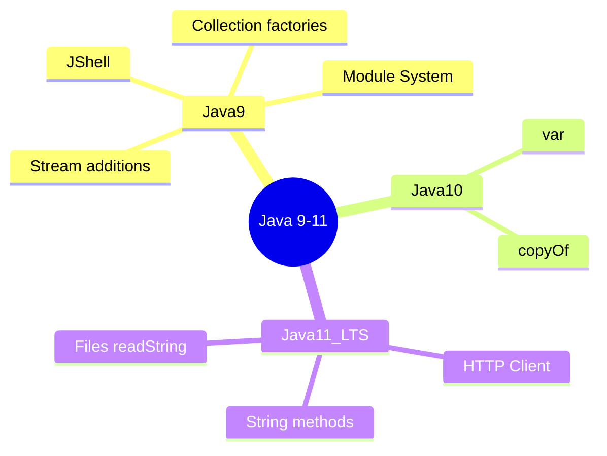
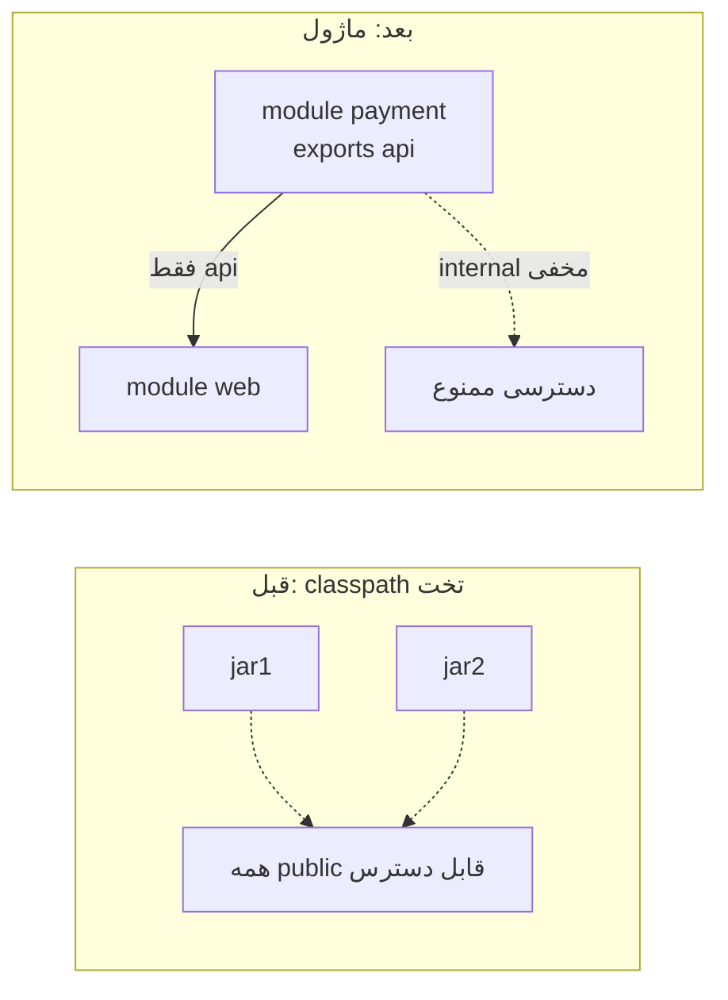
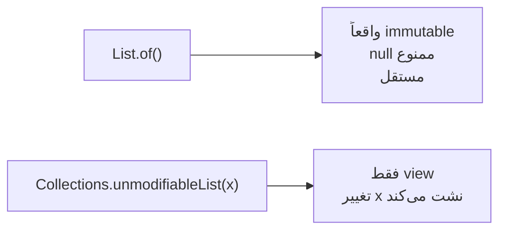
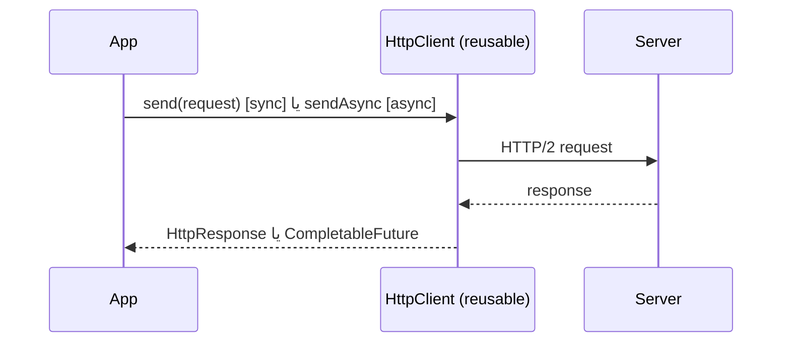

# Java 9–11 (Modules, var, HTTP Client)

> این نسخه‌ها زیرساخت Java مدرن را تثبیت کردند: ماژول‌ها، استنتاج نوع، و HTTP Client داخلی. Java 11 اولین LTS بعد از 8 است. این فایل با دیاگرام و مثال‌های متعدد گسترش یافته.

## فهرست
- [نقشه‌ی ذهنی](#نقشه‌ی-ذهنی)
- [📖 مفاهیم](#-مفاهیم)
- [🎯 سوالات مصاحبه](#-سوالات-مصاحبه)
- [⚠️ اشتباهات رایج](#️-اشتباهات-رایج)
- [🔗 ارتباط با سایر مفاهیم](#-ارتباط-با-سایر-مفاهیم)

---

## نقشه‌ی ذهنی



---

## 📖 مفاهیم

### Module System (Project Jigsaw — Java 9)

**توضیح:**

سیستم ماژول، JDK و برنامه‌ها را به واحدهای محصور با مرز صریح تقسیم می‌کند. هر ماژول یک `module-info.java` دارد که اعلام می‌کند چه چیزی نیاز دارد (`requires`)، چه پکیج‌هایی را در معرض دیگران می‌گذارد (`exports`)، و چه سرویس‌هایی ارائه/مصرف می‌کند.

انگیزه: قبل از ماژول، classpath یک «JAR hell» بزرگ و تخت بود؛ هر کلاس public از همه‌جا قابل دسترس بود و هیچ encapsulation در سطح jar وجود نداشت. ماژول‌ها **strong encapsulation** می‌آورند.



نکته‌ی واقعی: بسیاری از برنامه‌های Spring Boot هنوز روی classpath اجرا می‌شوند چون اکوسیستم به‌کندی مهاجرت کرده. اما خود JDK کاملاً ماژولار شده و این روی `jlink` و تصاویر کوچک تأثیر دارد.

**چرا مهم است:**

با `jlink` می‌توان runtime سفارشی و کوچک ساخت (فقط ماژول‌های لازم) که برای کانتینرها مفید است. همچنین strong encapsulation امنیت و نگهداری را بهبود می‌دهد.

**مثال کد:**

```java
// module-info.java
module com.example.payment {
    requires com.example.common;      // وابستگی صریح
    requires transitive java.sql;     // هر کس مرا requires کند java.sql را هم می‌گیرد
    exports com.example.payment.api;  // فقط این پکیج public است
    opens com.example.payment.entity; // برای reflection (مثل Hibernate/Jackson)
    provides PaymentGateway with StripeGateway; // ثبت سرویس
}
```

**نکات کلیدی:**

- پکیجی که export نشود، حتی public بودنش بیرون دیده نمی‌شود.
- `requires transitive` وابستگی را به مصرف‌کننده هم منتقل می‌کند.
- برای reflection (frameworkها) به `opens` نیاز دارید.

---

### Collection Factory Methods (Java 9)

**توضیح:**

`List.of()`, `Set.of()`, `Map.of()` راهی مختصر برای ساخت مجموعه‌های **immutable** می‌دهند. این‌ها با `Collections.unmodifiableList` فرق دارند: کاملاً immutable‌اند، null نمی‌پذیرند، و حافظه‌ی بهینه‌تری دارند.



**مثال کد:**

```java
List<String> roles = List.of("ADMIN", "USER");   // immutable
Map<String, Integer> limits = Map.of("free", 10, "pro", 1000);

// roles.add("X"); // ❌ UnsupportedOperationException
// List.of("a", null); // ❌ NullPointerException

// تفاوت با unmodifiable view:
List<String> base = new ArrayList<>(List.of("a"));
List<String> view = Collections.unmodifiableList(base);
base.add("b");
System.out.println(view); // [a, b] ← نشت!

List<String> safe = List.copyOf(base); // کپی مستقل immutable
```

**نکات کلیدی:**

- نتیجه واقعاً immutable است؛ هر تغییری استثنا می‌دهد.
- null مجاز نیست (برخلاف ArrayList).
- `List.copyOf` برای کپی دفاعی immutable.

---

### Stream & Optional Additions (Java 9)

**توضیح:**

- `Stream.takeWhile(pred)` — تا وقتی شرط برقرار است بردارد، سپس قطع کند.
- `Stream.dropWhile(pred)` — برعکس.
- `Stream.iterate(seed, hasNext, next)` — نسخه‌ی محدودشونده.
- `Optional.ifPresentOrElse`, `Optional.stream`, `Optional.or`.

**مثال کد:**

```java
List<Integer> nums = List.of(1, 2, 3, 10, 4, 5);
System.out.println(nums.stream().takeWhile(n -> n < 5).toList()); // [1, 2, 3]
System.out.println(nums.stream().dropWhile(n -> n < 5).toList()); // [10, 4, 5]

// Optional.stream برای تخت کردن لیست Optionalها
List<Optional<String>> opts = List.of(Optional.of("a"), Optional.empty(), Optional.of("b"));
List<String> present = opts.stream().flatMap(Optional::stream).toList(); // [a, b]

// iterate محدود
Stream.iterate(1, n -> n <= 100, n -> n * 2).forEach(System.out::println); // 1,2,4...64
```

**نکات کلیدی:**

- `takeWhile/dropWhile` روی stream مرتب معنا دارد (برخلاف filter).
- `Optional.stream()` برای تخت کردن لیست Optionalها عالی است.

---

### Local Variable Type Inference — var (Java 10)

**توضیح:**

`var` اجازه می‌دهد نوع متغیر محلی را کامپایلر استنتاج کند. این فقط syntactic sugar در زمان کامپایل است؛ Java همچنان static typed می‌ماند و `var` نوع را در زمان کامپایل قطعی می‌کند (نه dynamic typing).

محدودیت‌ها: فقط برای متغیر محلی با مقداردهی اولیه؛ نه برای field، پارامتر متد، یا return type. نباید با `null` یا lambda بدون target type استفاده شود.

**مثال کد:**

```java
var users = new ArrayList<User>();          // واضح: ArrayList<User>
var entry = Map.entry("k", 1);              // نوع طولانی پنهان می‌شود
for (var e : map.entrySet()) { /* ... */ }  // در حلقه خوانا

// ❌ خوانایی کم: نوع از سمت راست معلوم نیست
var result = service.process();
// var x = null; // ❌ کامپایل نمی‌شود
// var در lambda بدون target type مجاز نیست
```

**نکات کلیدی:**

- `var` نوع را در compile-time قطعی می‌کند؛ dynamic typing نیست.
- وقتی نوع از سمت راست واضح است استفاده کنید؛ وگرنه نوع صریح خواناتر است.
- فقط برای متغیر محلی.

---

### HTTP Client (Java 11)

**توضیح:**

`java.net.http.HttpClient` جایگزین مدرن `HttpURLConnection` قدیمی و وابستگی‌های خارجی مثل Apache HttpClient است. از HTTP/2 و WebSocket پشتیبانی می‌کند، API روان دارد و هم synchronous و هم asynchronous است.



**مثال کد:**

```java
HttpClient client = HttpClient.newBuilder()
    .version(HttpClient.Version.HTTP_2)
    .connectTimeout(Duration.ofSeconds(5))
    .build();

HttpRequest request = HttpRequest.newBuilder()
    .uri(URI.create("https://api.example.com/users/1"))
    .header("Accept", "application/json")
    .GET().build();

// همزمان
HttpResponse<String> response = client.send(request, HttpResponse.BodyHandlers.ofString());
System.out.println(response.statusCode());

// ناهمزمان
client.sendAsync(request, HttpResponse.BodyHandlers.ofString())
    .thenApply(HttpResponse::body)
    .thenAccept(System.out::println);
```

**نکات کلیدی:**

- `HttpClient` thread-safe است؛ یک نمونه را reuse کنید.
- از HTTP/2 و async داخلی پشتیبانی می‌کند.
- timeout را همیشه تنظیم کنید تا از hang جلوگیری شود.

---

### String & Files Methods (Java 11)

**توضیح:**

متدهای مفید String: `isBlank()`، `strip()`/`stripLeading()`/`stripTrailing()` (Unicode-aware برخلاف `trim`)، `lines()`، `repeat(n)`. همچنین `Files.readString()`/`Files.writeString()`.

**مثال کد:**

```java
String text = "  سلام دنیا  ";
System.out.println(text.strip());      // "سلام دنیا" (Unicode-aware)
System.out.println("ab".repeat(3));    // "ababab"
System.out.println("  ".isBlank());    // true

Path p = Path.of("notes.txt");
Files.writeString(p, "خط اول\nخط دوم");
Files.readString(p).lines().forEach(System.out::println);
```

**نکات کلیدی:**

- `strip` به‌جای `trim` برای متن Unicode (مثل فارسی).
- `isBlank` با `isEmpty` فرق دارد (whitespace را هم در نظر می‌گیرد).

---

## 🎯 سوالات مصاحبه

### سوال ۱: تفاوت `var` با dynamic typing چیست؟

**سطح:** Mid / Senior
**تکرار:** زیاد

**جواب کامل:**

`var` فقط استنتاج نوع در زمان کامپایل است؛ کامپایلر نوع را از مقداردهی اولیه قطعی می‌کند و آن نوع برای همیشه ثابت می‌ماند. کاملاً متفاوت با dynamic typing (JS) که نوع در runtime عوض می‌شود. بعد از `var x = "hi";` نمی‌توانید `x = 5;` بنویسید. هیچ سربار runtime وجود ندارد.

**کد توضیحی:**

```java
var name = "Ali"; // نوع: String، قطعی در compile-time
// name = 42;     // ❌ خطای کامپایل
```

**نکته مصاحبه:**

Junior ممکن فکر کند مثل JS است. Senior تأکید می‌کند static typing حفظ می‌شود.

---

### سوال ۲: Module System چه مشکلی را حل می‌کند و چرا کمتر استفاده می‌شود؟

**سطح:** Senior / Lead
**تکرار:** متوسط

**جواب کامل:**

سه مشکل: (۱) strong encapsulation در سطح jar. (۲) وابستگی صریح و قابل‌بررسی. (۳) runtime سفارشی کوچک با `jlink`. اما اکوسیستم به‌کندی مهاجرت کرد چون مهاجرت کتابخانه‌های قدیمی پرهزینه بود، reflection نیاز به `opens` دارد و ابزارها فرض classpath می‌کردند. اکثر برنامه‌ها هنوز روی classpath‌اند در حالی که JDK ماژولار است.

**نکته مصاحبه:**

Lead به trade-off عملی اشاره می‌کند. Follow-up: «`requires transitive` چه می‌کند؟»

---

### سوال ۳: تفاوت `List.of()` با `Collections.unmodifiableList()`؟

**سطح:** Mid / Senior
**تکرار:** متوسط

**جواب کامل:**

`List.of()` یک لیست واقعاً immutable و مستقل می‌سازد که null نمی‌پذیرد. `Collections.unmodifiableList(original)` فقط یک **view** روی لیست اصلی می‌سازد؛ اگر کسی لیست اصلی را تغییر دهد، view هم تغییر می‌کند (نشت تغییرپذیری). برای کپی دفاعی واقعی `List.copyOf` استفاده کنید.

**نکته مصاحبه:**

Follow-up: «چطور کپی دفاعی immutable بسازی؟» (`List.copyOf`).

---

### سوال ۴: HTTP Client داخلی Java 11 چه مزیتی دارد؟

**سطح:** Senior
**تکرار:** متوسط

**جواب کامل:**

`HttpURLConnection` قدیمی API دست‌وپاگیر، فقط HTTP/1.1، بدون async واقعی بود. `HttpClient` جدید: builder روان، HTTP/2 و WebSocket داخلی، async با `CompletableFuture`، thread-safe و reusable. بدون وابستگی خارجی. در اکوسیستم Spring معمولاً `RestClient`/`WebClient` ترجیح داده می‌شود.

**نکته مصاحبه:**

Senior به reuse کردن نمونه اشاره می‌کند.

---

### سوال ۵: `takeWhile` با `filter` چه فرقی دارد؟

**سطح:** Mid / Senior
**تکرار:** متوسط

**جواب کامل:**

`filter` کل stream را بررسی می‌کند. `takeWhile` به‌محض اولین عنصری که شرط را برآورده نکند **متوقف** می‌شود (short-circuit). روی stream مرتب رفتار متفاوت و کارآمدتر دارد.

**کد توضیحی:**

```java
List<Integer> nums = List.of(2, 4, 6, 7, 8);
nums.stream().filter(n -> n % 2 == 0).toList();    // [2, 4, 6, 8]
nums.stream().takeWhile(n -> n % 2 == 0).toList(); // [2, 4, 6] ← در 7 قطع
```

**نکته مصاحبه:**

Follow-up: «روی stream نامرتب چه می‌شود؟»

---

## ⚠️ اشتباهات رایج

### اشتباه ۱: تغییر مجموعه‌ی ساخته‌شده با `List.of`

```java
// ❌ UnsupportedOperationException
List<String> list = List.of("a", "b");
list.add("c");
```

```java
// ✅
List<String> list = new ArrayList<>(List.of("a", "b"));
list.add("c");
```

**توضیح:** `List.of` immutable است.

---

### اشتباه ۲: استفاده‌ی بیش از حد `var`

```java
// ❌ نوع نامشخص
var x = service.fetch();
```

```java
// ✅
PaymentResult x = service.fetch();
```

**توضیح:** `var` فقط وقتی نوع از سمت راست واضح است.

---

### اشتباه ۳: ساخت HttpClient جدید برای هر request

```java
// ❌
for (var url : urls) HttpClient.newHttpClient().send(...);
```

```java
// ✅
HttpClient client = HttpClient.newHttpClient();
for (var url : urls) client.send(...);
```

**توضیح:** `HttpClient` سنگین و reusable است.

---

### اشتباه ۴: `trim` برای متن Unicode

```java
// ❌ فضاهای Unicode باقی می‌مانند
"\u2009متن\u2009".trim();
```

```java
// ✅
"\u2009متن\u2009".strip();
```

**توضیح:** `strip` بر اساس `Character.isWhitespace` Unicode-aware است.

---

## 🔗 ارتباط با سایر مفاهیم

- Module System با **jlink** و تصاویر کوچک **Docker/K8s (10)**.
- HTTP Client با **microservices (6.1)** و در Spring با **WebClient/RestClient (2.3)**.
- `var` با **records (1.4)** و **lambda (1.2)** برای کد مختصرتر.
- متدهای Stream جدید مکمل **Stream API (1.2)**.
