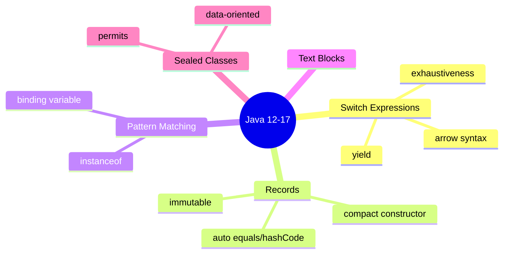
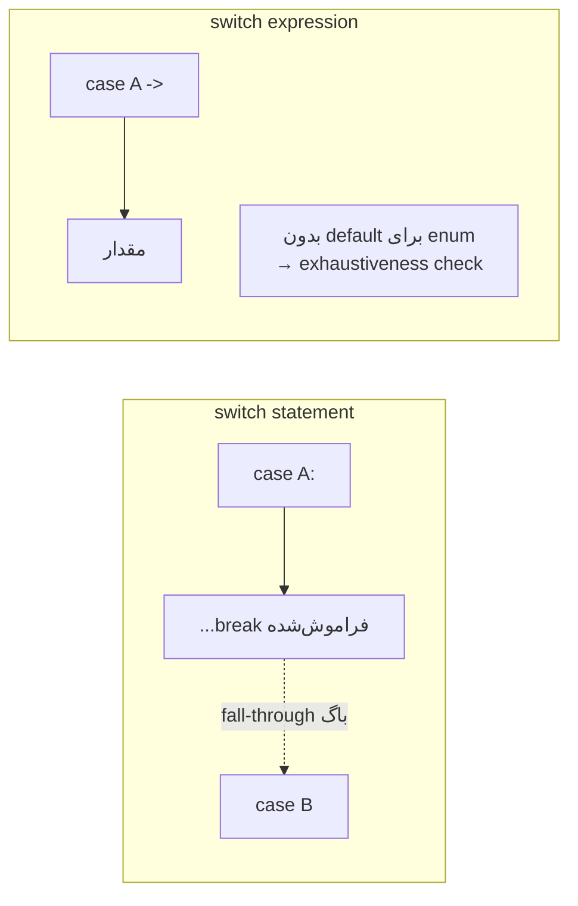
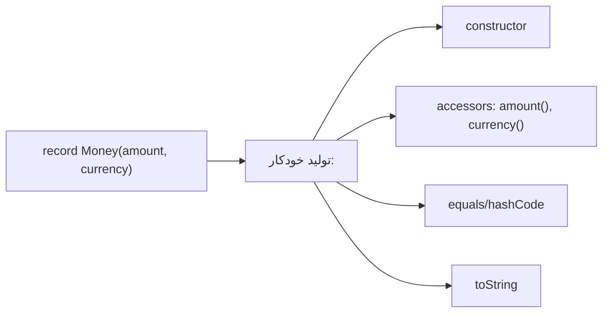
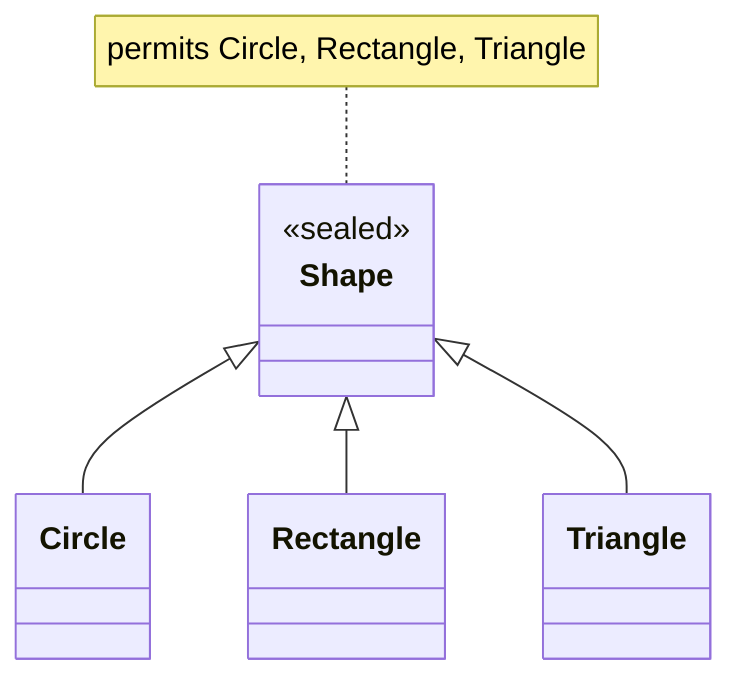

# Java 12–17 (LTS) — Records, Sealed, Pattern Matching

> Java 17 baseline جدید است: Spring Boot 3/4 حداقل به آن نیاز دارند. Records و Sealed Classes زبان را به‌سمت data-oriented programming بردند. این فایل با دیاگرام و مثال‌های متعدد گسترش یافته.

## فهرست
- [نقشه‌ی ذهنی](#نقشه‌ی-ذهنی)
- [📖 مفاهیم](#-مفاهیم)
- [🎯 سوالات مصاحبه](#-سوالات-مصاحبه)
- [⚠️ اشتباهات رایج](#️-اشتباهات-رایج)
- [🔗 ارتباط با سایر مفاهیم](#-ارتباط-با-سایر-مفاهیم)

---

## نقشه‌ی ذهنی



---

## 📖 مفاهیم

### Switch Expressions (Java 12–14)

**توضیح:**

`switch` کلاسیک یک statement بود با `break` فراموش‌شدنی و fall-through خطرناک. Switch Expression آن را به یک عبارت که مقدار برمی‌گرداند تبدیل می‌کند. با سینتکس arrow (`->`) دیگر fall-through و break وجود ندارد، و برای منطق چندخطی از `yield` استفاده می‌شود. کامپایلر **exhaustiveness** را برای enum چک می‌کند.



**مثال کد:**

```java
enum Day { MON, TUE, SAT, SUN }

static String type(Day day) {
    return switch (day) {
        case SAT, SUN -> "تعطیل";
        case MON, TUE -> "کاری";
        default -> "نامشخص";
    };
}

static int score(String grade) {
    return switch (grade) {
        case "A" -> 4;
        case "B" -> 3;
        default -> { int base = 0; yield base; } // منطق چندخطی با yield
    };
}
```

**نکات کلیدی:**

- arrow syntax بدون fall-through و break است.
- برای enum بدون default، کامپایلر پوشش کامل را اجبار می‌کند.
- از `yield` برای بلوک چندخطی.

---

### Records (Java 14 preview → 16/17 final)

**توضیح:**

`record` یک حامل داده‌ی immutable مختصر است. کامپایلر به‌طور خودکار سازنده‌ی canonical، accessorها (به نام فیلد)، `equals`, `hashCode`, و `toString` را تولید می‌کند. recordها به‌طور ضمنی `final` و فیلدهایشان `private final` هستند.

می‌توان **compact constructor** برای validation نوشت، متدهای اضافه تعریف کرد، و static factory ساخت.



**چرا مهم است:**

DTO، value object، event، و کلاس‌های داده‌ای را با کمترین boilerplate و درست می‌سازد. در DDD برای Value Object ایده‌آل است.

**مثال کد ۱ — record کامل:**

```java
public record Money(long amountCents, String currency) {
    public Money { // compact constructor برای validation
        if (amountCents < 0) throw new IllegalArgumentException("منفی نامجاز");
        Objects.requireNonNull(currency);
    }
    public Money plus(Money other) {
        if (!currency.equals(other.currency)) throw new IllegalArgumentException("واحد متفاوت");
        return new Money(amountCents + other.amountCents, currency);
    }
    public static Money usd(long cents) { return new Money(cents, "USD"); } // static factory
}
```

**مثال کد ۲ — record به‌عنوان کلید composite و nested:**

```java
// کلید composite immutable برای Map (equals/hashCode رایگان)
record CacheKey(String tenant, Long userId) {}
Map<CacheKey, User> cache = new HashMap<>();

// nested records برای ساختار داده
record Address(String city, String zip) {}
record Customer(String name, Address address) {}

// «with»-style: برای تغییر، نمونه‌ی جدید
Customer c = new Customer("Ali", new Address("Tehran", "111"));
Customer moved = new Customer(c.name(), new Address("Karaj", "222"));
```

**نکات کلیدی:**

- record به‌طور ضمنی final و immutable است.
- از compact constructor برای validation و normalization.
- برای JPA Entity مناسب نیست (DTO/projection بله).

---

### Pattern Matching for instanceof (Java 16)

**توضیح:**

`if (obj instanceof String s)` هم چک می‌کند و هم متغیر `s` را با نوع درست در scope می‌آورد (binding variable). این متغیر فقط در شاخه‌ای که شرط برقرار است در دسترس است (flow scoping).

**مثال کد:**

```java
// قبل
if (obj instanceof String) {
    String s = (String) obj; // cast تکراری
    return s.length();
}
// بعد
if (obj instanceof String s && !s.isBlank()) {
    return s.length(); // s در دسترس و type-safe
}
// negation با flow scoping
if (!(obj instanceof String s)) return 0;
return s.length(); // s اینجا در دسترس است
```

**نکات کلیدی:**

- متغیر binding فقط در scope معتبر در دسترس است.
- با `&&` می‌توان شرط ترکیبی روی متغیر binding گذاشت.

---

### Text Blocks (Java 15)

**توضیح:**

رشته‌ی چندخطی با `"""` که escape و الحاق دستی را حذف می‌کند. برای JSON، SQL، HTML عالی است.

**مثال کد:**

```java
String json = """
    {
      "name": "Ali",
      "active": true
    }
    """;

String sql = """
    SELECT id, name FROM users
    WHERE status = 'ACTIVE'
    ORDER BY created_at DESC
    """;

String html = """
    <div>
        <p>%s</p>
    </div>
    """.formatted(content);
```

**نکات کلیدی:**

- indentation نسبت به کمترین خط محاسبه می‌شود.
- `\` در انتهای خط از newline جلوگیری می‌کند؛ `\s` فضای محافظت‌شده.

---

### Sealed Classes (Java 17)

**توضیح:**

`sealed` کنترل می‌کند چه کلاس‌هایی می‌توانند یک کلاس/interface را extend کنند، با `permits`. هر زیرنوع باید `final`, `sealed`, یا `non-sealed` باشد. این یک سلسله‌مراتب بسته و شناخته‌شده می‌سازد.



**چرا مهم است:**

با switch pattern matching ترکیب می‌شود و **exhaustiveness check** کامل می‌دهد: کامپایلر مطمئن می‌شود همه‌ی زیرنوع‌ها پوشش داده شده‌اند. این الگوی «algebraic data types» را در Java ممکن می‌کند.

**مثال کد:**

```java
public sealed interface Shape permits Circle, Rectangle, Triangle {}
public record Circle(double radius) implements Shape {}
public record Rectangle(double w, double h) implements Shape {}
public record Triangle(double base, double height) implements Shape {}

static double area(Shape shape) {
    return switch (shape) { // بدون default، کامپایلر پوشش کامل را چک می‌کند
        case Circle c -> Math.PI * c.radius() * c.radius();
        case Rectangle r -> r.w() * r.h();
        case Triangle t -> 0.5 * t.base() * t.height();
    };
}
```

**نکات کلیدی:**

- ترکیب sealed + record + switch = data-oriented programming قدرتمند.
- exhaustiveness check افزودن نوع جدید را به‌صورت compile-time error نشان می‌دهد.
- زیرنوع‌ها باید final/sealed/non-sealed باشند.

---

## 🎯 سوالات مصاحبه

### سوال ۱: Record چیست و کِی به‌جای کلاس معمولی؟

**سطح:** Senior
**تکرار:** خیلی زیاد

**جواب کامل:**

record یک حامل داده‌ی immutable است که سازنده، accessorها، `equals`, `hashCode`, و `toString` را خودکار تولید می‌کند. زمانی که هدف اصلی **نگهداری داده** است: DTO، value object، event، نتیجه‌ی query، کلید composite. می‌توان با compact constructor validation اضافه کرد.

نامناسب: وقتی به state تغییرپذیر، وراثت، یا کنترل دقیق نیاز دارید — به‌خصوص برای JPA Entity (Hibernate به no-arg constructor، فیلد mutable و proxy نیاز دارد).

**کد توضیحی:**

```java
public record UserDto(Long id, String name, String email) {
    public UserDto { Objects.requireNonNull(email); }
}
```

**نکته مصاحبه:**

تمایز Senior: دانستن محدودیت‌ها. Follow-up: «آیا record فیلد اضافی دارد؟» (فقط static).

---

### سوال ۲: Sealed Classes چه مشکلی را حل می‌کنند؟

**سطح:** Senior / Lead
**تکرار:** متوسط

**جواب کامل:**

sealed سلسله‌مراتب وراثت را بسته و کنترل‌شده می‌کند. مهم‌ترین مزیت ترکیب با pattern matching switch است: کامپایلر **exhaustiveness** را تضمین می‌کند — اگر زیرنوع جدید اضافه کنید و در switchها پوشش ندهید، خطای کامپایل می‌گیرید. این الگوی «modeling with the type system» را ممکن می‌کند که در آن حالت‌های نامعتبر قابل بیان نیستند.

**نکته مصاحبه:**

Lead به data-oriented programming اشاره می‌کند. Follow-up: «تفاوت final/sealed/non-sealed در زیرنوع؟»

---

### سوال ۳: تفاوت switch statement و switch expression؟

**سطح:** Mid / Senior
**تکرار:** زیاد

**جواب کامل:**

switch statement فقط کنترل جریان است و مقدار برنمی‌گرداند؛ با `:` و `break` و در معرض باگ fall-through. switch expression مقدار برمی‌گرداند، با arrow بدون fall-through، با `yield` برای چندخطی، و برای enum/sealed پوشش کامل را اجبار می‌کند.

**نکته مصاحبه:**

Follow-up: «چرا fall-through خطرناک است؟»

---

### سوال ۴: pattern matching for instanceof چه boilerplate‌ای حذف می‌کند؟

**سطح:** Mid
**تکرار:** متوسط

**جواب کامل:**

الگوی قدیمی سه قدم: چک با instanceof، cast دستی، استفاده. pattern matching هر سه را در یک عبارت ادغام و متغیر binding با flow scoping ایجاد می‌کند — هم کوتاه‌تر هم بدون خطای cast.

**نکته مصاحبه:**

Follow-up: «flow scoping یعنی چه؟»

---

### سوال ۵: چرا record برای JPA Entity مناسب نیست؟

**سطح:** Senior
**تکرار:** متوسط

**جواب کامل:**

Hibernate به no-arg constructor برای proxy نیاز دارد؛ record فقط canonical constructor دارد. برای lazy loading و dirty checking به فیلد mutable و proxy (subclass) نیاز دارد؛ record final و immutable است. record برای DTO/projection عالی است اما Entity باید کلاس معمولی باشد.

**نکته مصاحبه:**

Senior به proxy و dirty checking اشاره می‌کند.

---

## ⚠️ اشتباهات رایج

### اشتباه ۱: تلاش برای تغییر record

```java
// ❌ record immutable است
Point p = new Point(1, 2);
// p.x = 5; // setter ندارد
```

```java
// ✅ شیء جدید
Point moved = new Point(5, p.y());
```

**توضیح:** record immutable است.

---

### اشتباه ۲: record به‌عنوان JPA Entity

```java
// ❌
@Entity record User(@Id Long id, String name) {}
```

```java
// ✅ Entity کلاس، DTO record
@Entity class User { @Id Long id; String name; }
record UserDto(Long id, String name) {}
```

**توضیح:** Entity به no-arg constructor و mutability نیاز دارد.

---

### اشتباه ۳: default غیرضروری در sealed switch

```java
// ❌ default مانع exhaustiveness می‌شود
switch (shape) { case Circle c -> "c"; default -> "other"; }
```

```java
// ✅ بدون default
switch (shape) { case Circle c -> "c"; case Rectangle r -> "r"; case Triangle t -> "t"; }
```

**توضیح:** با sealed، default را حذف کنید تا پوشش کامل را اجبار کند.

---

### اشتباه ۴: فراموشی validation در record

```java
// ❌
record Age(int value) {}
new Age(-5); // مشکلی نمی‌گیرد
```

```java
// ✅
record Age(int value) { Age { if (value < 0) throw new IllegalArgumentException(); } }
```

**توضیح:** record خودکار validation ندارد.

---

## 🔗 ارتباط با سایر مفاهیم

- Records با **DDD Value Objects (6.1)**، **DTO** و **JSON (Jackson 12.4)**.
- Sealed + record + switch پایه‌ی **Record Patterns (1.5)**.
- Pattern matching مکمل **pattern matching for switch (1.5)**.
- Text blocks با **SQL/JPQL (3.1)** و تست‌های JSON.
- Java 17 پیش‌نیاز **Spring Boot 3/4 (2.2)**.
