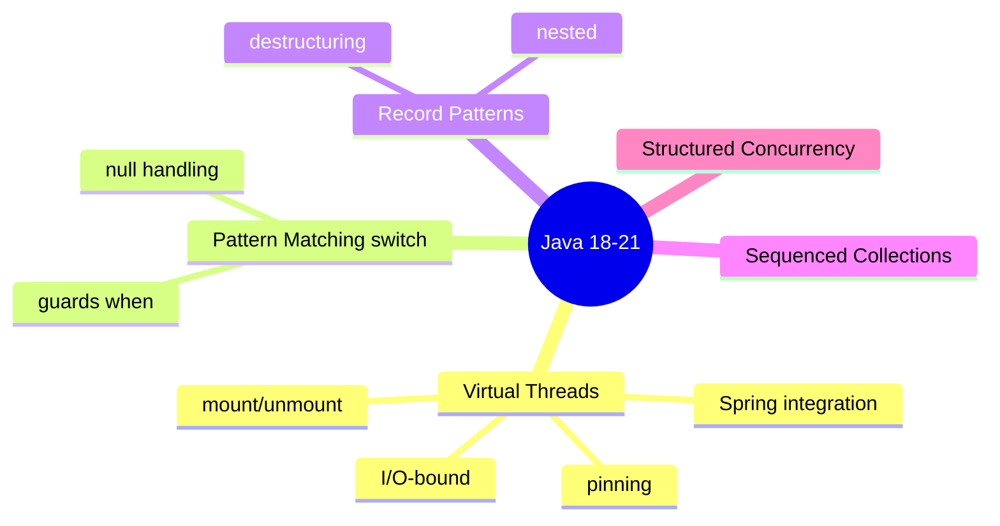
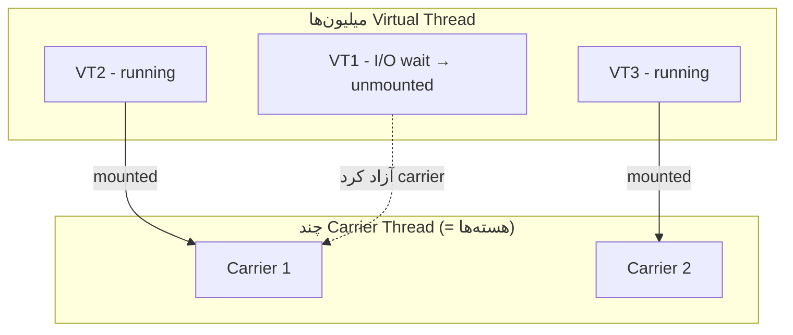
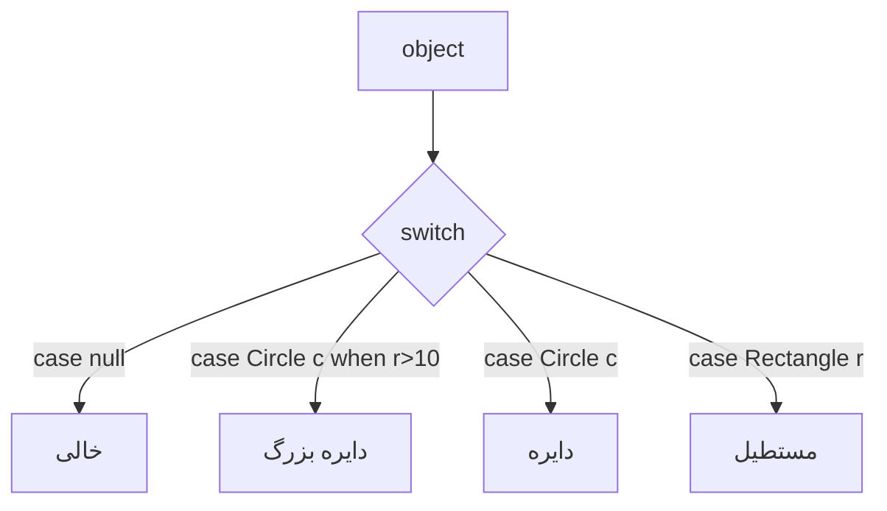
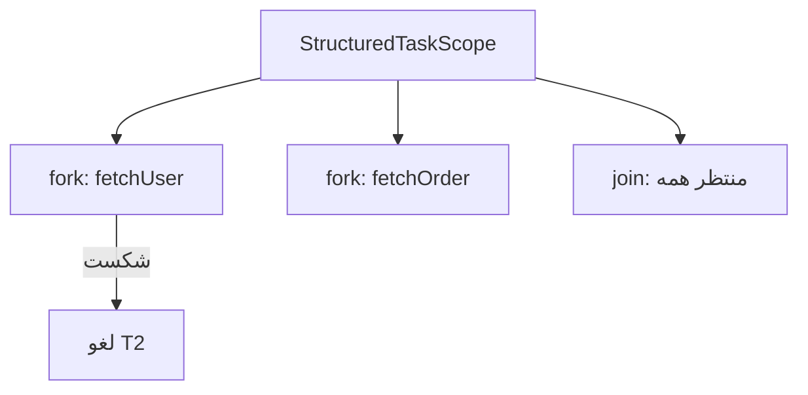

# Java 18–21 — Virtual Threads, Pattern Matching, Record Patterns

> Java 21 (LTS) با Virtual Threads انقلابی در concurrency برای I/O ایجاد کرد. پرتکرارترین موضوع مصاحبه‌های مدرن. این فایل با دیاگرام و مثال‌های متعدد گسترش یافته.

## فهرست
- [نقشه‌ی ذهنی](#نقشه‌ی-ذهنی)
- [📖 مفاهیم](#-مفاهیم)
- [🎯 سوالات مصاحبه](#-سوالات-مصاحبه)
- [⚠️ اشتباهات رایج](#️-اشتباهات-رایج)
- [🔗 ارتباط با سایر مفاهیم](#-ارتباط-با-سایر-مفاهیم)

---

## نقشه‌ی ذهنی



---

## 📖 مفاهیم

### Virtual Threads (Project Loom — Java 21 final)

**توضیح:**

تا قبل از Java 21، هر `Thread` در Java یک thread سیستم‌عامل (platform thread) بود — سنگین (حدود ۱MB استک)، گران برای ساخت، و محدود به چند هزار عدد. مدل کلاسیک «thread-per-request» با این محدودیت برای بار بالا مناسب نبود.

Virtual Thread یک thread سبک است که توسط JVM مدیریت می‌شود نه OS. میلیون‌ها از آن قابل ساخت‌اند. وقتی یک virtual thread روی عملیات بلاک‌کننده (I/O) منتظر می‌ماند، JVM آن را از platform thread زیرین (carrier) جدا (unmount) می‌کند و carrier را آزاد می‌کند. وقتی I/O تمام شد، دوباره mount می‌شود.



نکته‌ی حیاتی: virtual threads برای **I/O-bound** عالی‌اند اما برای **CPU-bound** هیچ مزیتی ندارند. همچنین `synchronized` می‌تواند «pinning» ایجاد کند — راه‌حل `ReentrantLock`.

**چرا مهم است:**

مدل ساده‌ی thread-per-request دوباره برای throughput بالا قابل‌استفاده می‌شود. در Spring Boot با `spring.threads.virtual.enabled=true` فعال و WebFlux را برای بسیاری موارد غیرضروری می‌کند.

**مثال کد ۱ — ساخت و executor:**

```java
Thread.ofVirtual().start(() -> System.out.println("سلام از virtual thread"));

try (var executor = Executors.newVirtualThreadPerTaskExecutor()) {
    List<Future<String>> futures = IntStream.range(0, 10_000)
        .mapToObj(i -> executor.submit(() -> {
            Thread.sleep(Duration.ofSeconds(1)); // I/O شبیه‌سازی‌شده
            return "task " + i;
        }))
        .toList();
    // ۱۰هزار تسک تقریباً همزمان با چند carrier
}
```

**مثال کد ۲ — pinning و راه‌حل:**

```java
// ❌ pinning: synchronized روی I/O، carrier اشغال می‌ماند
synchronized (lock) { jdbcCall(); }

// ✅ ReentrantLock اجازه‌ی unmount می‌دهد
lock.lock();
try { jdbcCall(); } finally { lock.unlock(); }
```

**نکات کلیدی:**

- virtual threads برای I/O-bound است نه CPU-bound.
- `synchronized` روی I/O می‌تواند pinning ایجاد کند؛ `ReentrantLock` استفاده کنید.
- pool کردن virtual threads بی‌معناست؛ per-task استفاده کنید.

---

### Pattern Matching for switch (Java 21 final)

**توضیح:**

switch می‌تواند بر اساس **نوع** match کند. با sealed types، exhaustiveness تضمین می‌شود. می‌توان **guard** (`when`) و `null` صریح handle کرد.



**مثال کد:**

```java
sealed interface Shape permits Circle, Rectangle {}
record Circle(double r) implements Shape {}
record Rectangle(double w, double h) implements Shape {}

static String describe(Object obj) {
    return switch (obj) {
        case null -> "خالی";
        case Circle c when c.r() > 10 -> "دایره‌ی بزرگ"; // guard
        case Circle c -> "دایره";
        case Rectangle r -> "مستطیل";
        default -> "ناشناخته";
    };
}
```

**نکات کلیدی:**

- `when` برای guard شرطی.
- ترتیب caseها مهم است: خاص قبل از عام.
- `null` را می‌توان صریح handle کرد.

---

### Record Patterns (Java 21 final)

**توضیح:**

destructuring (تجزیه) recordها در `instanceof` و `switch`، حتی تو در تو (nested).


**مثال کد:**

```java
record Point(int x, int y) {}
record Line(Point start, Point end) {}

static String describe(Object obj) {
    return switch (obj) {
        case Line(Point(var x1, var y1), Point(var x2, var y2)) ->
            "خط از (%d,%d) تا (%d,%d)".formatted(x1, y1, x2, y2);
        case Point(var x, var y) -> "نقطه (%d,%d)".formatted(x, y);
        default -> "نامشخص";
    };
}
```

**نکات کلیدی:**

- destructuring تو در تو کد را خواناتر می‌کند.
- با sealed + switch ترکیب قدرتمندی می‌سازد.

---

### Sequenced Collections (Java 21)

**توضیح:**

interfaceهای جدید `SequencedCollection`, `SequencedSet`, `SequencedMap` API یکنواخت برای اولین/آخرین عنصر و معکوس می‌دهند: `getFirst()`, `getLast()`, `addFirst()`, `addLast()`, `reversed()`.

**مثال کد:**

```java
SequencedCollection<String> list = new ArrayList<>(List.of("a", "b", "c"));
System.out.println(list.getFirst()); // a
System.out.println(list.getLast());  // c
System.out.println(list.reversed()); // [c, b, a] (view)

SequencedMap<String, Integer> map = new LinkedHashMap<>();
map.putFirst("first", 1);
map.putLast("last", 2);
```

**نکات کلیدی:**

- API یکنواخت برای اولین/آخرین.
- `reversed()` یک view است نه کپی.

---

### Structured Concurrency (Java 21 — preview)

**توضیح:**

چند تسک هم‌زمان مرتبط را به‌عنوان یک واحد مدیریت می‌کند: اگر یکی شکست بخورد، بقیه لغو می‌شوند؛ scope تا اتمام همه منتظر می‌ماند. از thread leak و خطاهای پراکنده جلوگیری می‌کند.



**مثال کد:**

```java
try (var scope = new StructuredTaskScope.ShutdownOnFailure()) {
    Subtask<User> user = scope.fork(() -> fetchUser(id));
    Subtask<Order> order = scope.fork(() -> fetchOrder(id));
    scope.join().throwIfFailed(); // منتظر همه؛ اگر یکی شکست خورد لغو بقیه
    return new Dashboard(user.get(), order.get());
}
```

**نکات کلیدی:**

- خطای یک تسک باعث لغو بقیه می‌شود (fail-fast).
- چرخه‌ی حیات تسک‌ها به scope گره می‌خورد → بدون leak.

---

## 🎯 سوالات مصاحبه

### سوال ۱: Virtual Threads چه مشکلی حل می‌کنند و کِی مناسب‌اند؟

**سطح:** Senior / Lead
**تکرار:** خیلی زیاد

**جواب کامل:**

مشکل: platform threadها گران و محدودند، پس thread-per-request برای بار بالای I/O مقیاس نمی‌گرفت و توسعه‌دهندگان به async/reactive پیچیده پناه می‌بردند. Virtual threads thread سبک مدیریت‌شده توسط JVM هستند؛ هنگام بلاک شدن روی I/O، carrier آزاد می‌شود و میلیون‌ها از آن ممکن است. کد ساده و خطی (blocking style) با مقیاس async نوشته می‌شود.

مناسب: I/O-bound با concurrency بالا. نامناسب: CPU-bound. نکته: `synchronized` روی بخش بلاک‌کننده می‌تواند pinning ایجاد کند؛ راه‌حل `ReentrantLock`.

**نکته مصاحبه:**

تمایز Lead: pinning، تفاوت I/O/CPU-bound، و اینکه WebFlux را در بسیاری موارد غیرضروری می‌کند. Follow-up: «چرا نباید pool کرد؟»

---

### سوال ۲: تفاوت Virtual Thread و Platform Thread؟

**سطح:** Senior
**تکرار:** زیاد

**جواب کامل:**

Platform thread یک wrapper نازک روی thread OS: ساخت گران، استک ~1MB، تعداد محدود. Virtual thread توسط JVM مدیریت می‌شود: ارزان، استک قابل‌رشد در heap، میلیونی. چند virtual thread روی تعداد کمی carrier multiplexed می‌شوند (mount/unmount). API یکسان است.

**نکته مصاحبه:**

Follow-up: «scheduler چیست؟» (ForkJoinPool اختصاصی).

---

### سوال ۳: pinning چیست و چطور جلوگیری می‌کنیم؟

**سطح:** Lead
**تکرار:** متوسط

**جواب کامل:**

pinning وقتی virtual thread نمی‌تواند از carrier unmount شود، پس carrier در طول I/O اشغال می‌ماند و مزیت از بین می‌رود. دلایل: کد بلاک‌کننده داخل `synchronized` یا native method. راه‌حل: `ReentrantLock` به‌جای `synchronized`. رصد با `-Djdk.tracePinnedThreads=full`.

**نکته مصاحبه:**

Lead به ابزار تشخیص و راه‌حل اشاره می‌کند.

---

### سوال ۴: Virtual Threads در برابر Reactive (WebFlux)؟

**سطح:** Lead
**تکرار:** زیاد

**جواب کامل:**

هر دو مشکل مقیاس I/O را حل می‌کنند با مدل ذهنی متفاوت. Reactive با callback/operator و backpressure؛ قدرتمند اما یادگیری سخت، دیباگ دشوار، آلودگی کل stack. Virtual threads کد بلاک‌کننده‌ی ساده را حفظ می‌کنند و stacktrace طبیعی است. برای اکثر CRUD/microservice، virtual threads ساده‌تر و کافی است. Reactive هنوز برای streaming و backpressure واقعی مزیت دارد.

**نکته مصاحبه:**

Lead trade-off را می‌فهمد. Follow-up: «backpressure با virtual threads؟» (Semaphore برای محدود کردن concurrency).

---

### سوال ۵: Record Patterns چه چیزی ساده می‌کنند؟

**سطح:** Senior
**تکرار:** متوسط

**جواب کامل:**

destructuring recordها در switch/instanceof، به‌خصوص تو در تو. componentها مستقیماً bind می‌شوند به‌جای فراخوانی accessor. با sealed types و switch، الگوی data-oriented programming با exhaustiveness می‌سازد.

**نکته مصاحبه:**

Follow-up: «تفاوت با visitor pattern؟» (جایگزین مختصر و type-safe).

---

## ⚠️ اشتباهات رایج

### اشتباه ۱: pool کردن virtual threads

```java
// ❌
ExecutorService pool = Executors.newFixedThreadPool(200);
```

```java
// ✅ per-task
try (var executor = Executors.newVirtualThreadPerTaskExecutor()) { executor.submit(task); }
```

**توضیح:** virtual threads ارزان و یک‌بارمصرف‌اند.

---

### اشتباه ۲: virtual threads برای CPU-bound

```java
// ❌ بدون مزیت
executor.submit(() -> heavyMatrixMultiplication());
```

```java
// ✅
var cpuPool = Executors.newFixedThreadPool(Runtime.getRuntime().availableProcessors());
```

**توضیح:** فقط برای I/O-bound مزیت دارند.

---

### اشتباه ۳: synchronized در مسیر بلاک‌کننده

```java
// ❌ pinning
synchronized (lock) { jdbcCall(); }
```

```java
// ✅
lock.lock(); try { jdbcCall(); } finally { lock.unlock(); }
```

**توضیح:** `synchronized` روی I/O باعث pinning.

---

### اشتباه ۴: case عام قبل از خاص

```java
// ❌ Circle هرگز نمی‌رسد
switch (shape) { case Shape s -> "shape"; case Circle c -> "circle"; }
```

```java
// ✅
switch (shape) { case Circle c -> "circle"; case Shape s -> "shape"; }
```

**توضیح:** ترتیب از خاص به عام.

---

## 🔗 ارتباط با سایر مفاهیم

- Virtual Threads با **Spring Boot (2.2)**، **Concurrency (1.6)**، **Reactive (13.4)**.
- Pattern Matching + Record Patterns + Sealed = data-oriented (با **Design Patterns 5.3**).
- Structured Concurrency با **resilience (15.2)**.
- پایه‌ی تصمیم **MVC vs WebFlux (2.3)**.
