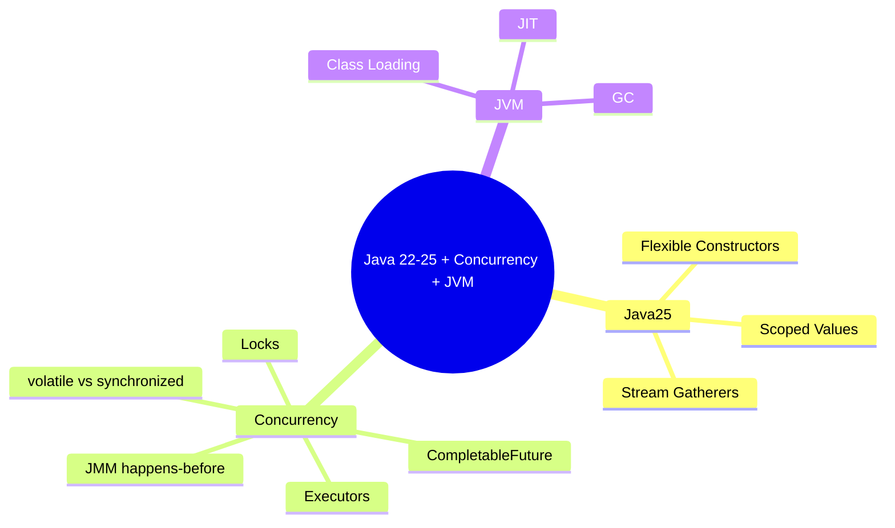
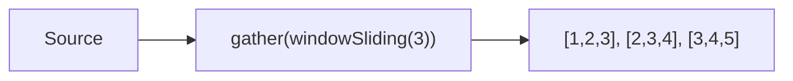
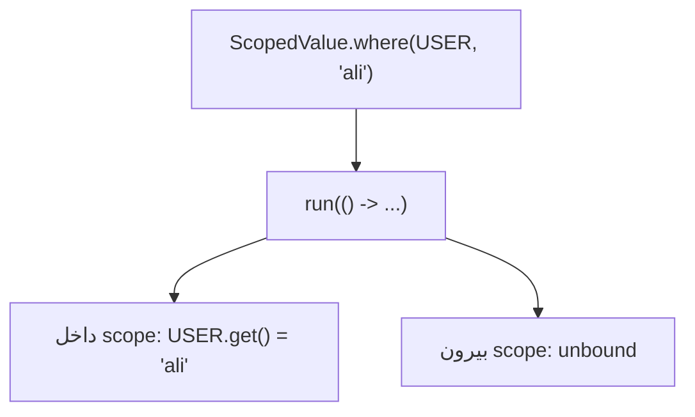
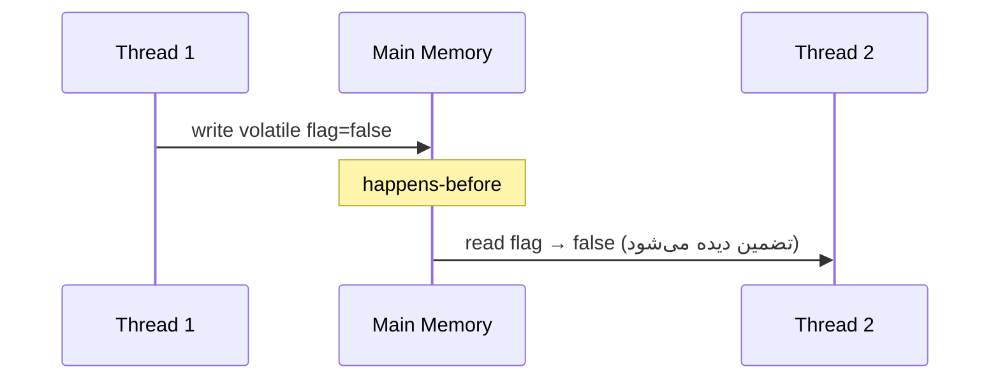
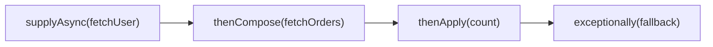
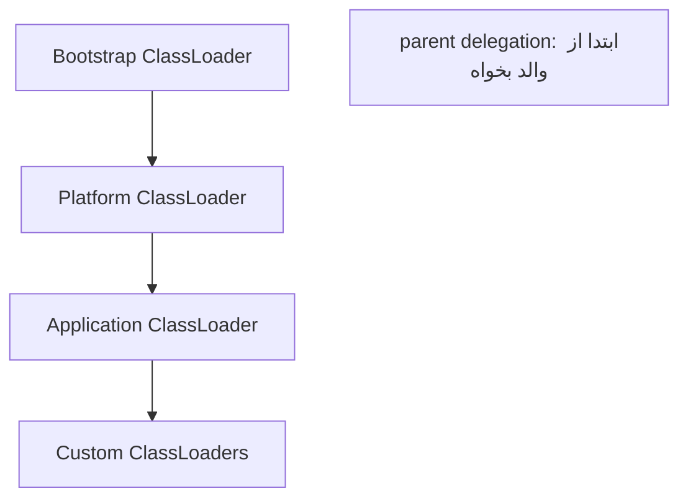

# Java 22–25 + Concurrency عمیق + JVM Internals

> تازه‌ترین ویژگی‌ها (Stream Gatherers، Scoped Values) به‌علاوه‌ی concurrency و JVM internals که قلب سوالات سطح Lead هستند. این فایل با دیاگرام و مثال‌های متعدد گسترش یافته.

## فهرست
- [نقشه‌ی ذهنی](#نقشه‌ی-ذهنی)
- [📖 مفاهیم](#-مفاهیم)
- [🎯 سوالات مصاحبه](#-سوالات-مصاحبه)
- [⚠️ اشتباهات رایج](#️-اشتباهات-رایج)
- [🔗 ارتباط با سایر مفاهیم](#-ارتباط-با-سایر-مفاهیم)

---

## نقشه‌ی ذهنی



---

## 📖 مفاهیم

### Stream Gatherers (Java 24 preview → 25 final)

**توضیح:**

تا قبل از این، عملیات میانی Stream محدود به مجموعه‌ی ثابتی بود. `Stream.gather(Gatherer)` امکان تعریف عملیات میانی **سفارشی و stateful** را می‌دهد — معادل `Collector` اما برای مرحله‌ی میانی.



**مثال کد:**

```java
List<List<Integer>> windows = Stream.of(1, 2, 3, 4, 5)
    .gather(Gatherers.windowSliding(3)).toList(); // [[1,2,3],[2,3,4],[3,4,5]]

List<List<Integer>> fixed = Stream.of(1, 2, 3, 4, 5)
    .gather(Gatherers.windowFixed(2)).toList(); // [[1,2],[3,4],[5]]
```

**نکات کلیدی:**

- Gatherer مکمل Collector است: یکی میانی، دیگری نهایی.
- gathererهای آماده: `windowFixed`, `windowSliding`, `fold`, `scan`, `mapConcurrent`.

---

### Scoped Values (جایگزین ThreadLocal)

**توضیح:**

`ThreadLocal` برای انتقال context استفاده می‌شد اما mutable، با خطر memory leak (به‌خصوص thread pool)، و سنگین برای میلیون‌ها virtual thread بود. `ScopedValue` جایگزین immutable و محدوده‌دار: مقدار فقط در طول یک scope معتبر است و خودکار پاک می‌شود.



**مثال کد:**

```java
private static final ScopedValue<String> USER_ID = ScopedValue.newInstance();

void handleRequest(String userId) {
    ScopedValue.where(USER_ID, userId).run(() -> processOrder());
}
void processOrder() {
    String currentUser = USER_ID.get(); // immutable، فقط در scope
}
```

**نکات کلیدی:**

- immutable و scope-bound → بدون leak، مناسب virtual threads.
- مقدار خودکار در پایان scope پاک می‌شود.

---

### Flexible Constructor Bodies & Module Import (Java 25)

**توضیح:**

پیش از Java 25، `super()`/`this()` باید اولین دستور سازنده می‌بود. **Flexible Constructor Bodies** اجازه می‌دهد قبل از `super()` کد (validation) بنویسید. **Module Import** با `import module java.base;`.

**مثال کد:**

```java
class PositiveInt {
    private final int value;
    PositiveInt(int value) {
        if (value <= 0) throw new IllegalArgumentException(); // قبل از super مجاز شد
        super();
        this.value = value;
    }
}
```

**نکات کلیدی:**

- validation قبل از super از حالت نامعتبر جلوگیری می‌کند.
- Project Leyden روی بهبود startup و memory با AOT تمرکز دارد.

---

### Java Memory Model — happens-before, volatile

**توضیح:**

JMM قوانین visibility و ordering بین threadها را تعریف می‌کند. رابطه‌ی کلیدی **happens-before**: اگر A happens-before B، اثرات A برای B دیده می‌شوند. منابع: unlock `synchronized` → lock بعدی، نوشتن `volatile` → خواندن بعدی، `Thread.start()`/`join()`.

`volatile` **visibility** تضمین می‌کند اما **atomicity** عملیات مرکب را نه (مثل `i++`). برای آن `Atomic` یا lock لازم است.



**مثال کد:**

```java
class Flag {
    private volatile boolean running = true; // مناسب برای flag
    void stop() { running = false; }
    void loop() { while (running) { /* ... */ } }
}
class Counter {
    private final AtomicInteger count = new AtomicInteger();
    void inc() { count.incrementAndGet(); } // atomic، نه volatile
}
```

**نکات کلیدی:**

- volatile = visibility، نه atomicity.
- double-checked locking باید از volatile استفاده کند.
- happens-before پایه‌ی هر استدلال درست concurrency.

---

### Executors, CompletableFuture, Locks

**توضیح:**

`ExecutorService` مدیریت thread pool را از منطق جدا می‌کند. `CompletableFuture` برای ترکیب async: `thenApply`, `thenCompose` (flatMap)، `thenCombine`، `exceptionally`. ابزار هماهنگی: `CountDownLatch`, `CyclicBarrier`, `Semaphore`. Lockها: `ReentrantLock`, `ReadWriteLock`, `StampedLock`.



**مثال کد:**

```java
ExecutorService executor = Executors.newFixedThreadPool(4);
CompletableFuture<String> result = CompletableFuture
    .supplyAsync(() -> fetchUser(id), executor)
    .thenCompose(user -> CompletableFuture.supplyAsync(() -> fetchOrders(user)))
    .thenApply(orders -> "تعداد: " + orders.size())
    .exceptionally(ex -> "خطا: " + ex.getMessage());

Semaphore limiter = new Semaphore(10); // محدود کردن concurrency
void call() throws InterruptedException {
    limiter.acquire();
    try { externalApi(); } finally { limiter.release(); }
}
```

**نکات کلیدی:**

- `thenApply` برای همگام، `thenCompose` برای زنجیره‌ی async.
- exception را با `exceptionally`/`handle` مدیریت کنید.
- `ReentrantLock` را در `finally` آزاد کنید.

---

### JVM Internals — GC, JIT, Class Loading

**توضیح:**

- **Class Loading:** سه classloader با **parent delegation**.
- **GC:** Serial، Parallel، G1 (پیش‌فرض از Java 9)، ZGC/Shenandoah (latency پایین).
- **JIT:** interpreter → C1 → C2 (Tiered). بهینه‌سازی: inlining، escape analysis.



**مثال کد:**

```bash
java -XX:+UseZGC -Xms2g -Xmx2g -Xlog:gc*:file=gc.log MyApp
java -XX:StartFlightRecording=duration=60s,filename=rec.jfr MyApp
```

**نکات کلیدی:**

- `-Xms` = `-Xmx` برای جلوگیری از resize.
- G1 پیش‌فرض متعادل؛ ZGC برای latency بحرانی.
- escape analysis می‌تواند اشیاء را روی stack تخصیص دهد.

---

## 🎯 سوالات مصاحبه

### سوال ۱: تفاوت `volatile` و `synchronized`؟

**سطح:** Senior / Lead
**تکرار:** خیلی زیاد

**جواب کامل:**

`volatile` فقط **visibility** و جلوگیری از reordering برای یک متغیر را تضمین می‌کند؛ atomicity عملیات مرکب را نه (`count++` با volatile همچنان race دارد). `synchronized` هم visibility و هم **mutual exclusion** (atomicity) می‌دهد اما هزینه‌ی lock دارد. قاعده: volatile برای flag/یک‌نوشتن؛ synchronized (یا Atomic) برای عملیات مرکب.

**کد توضیحی:**

```java
volatile boolean ready;     // ✅ flag
volatile int counter;       // ❌ counter++ atomic نیست
AtomicInteger safeCounter;  // ✅
```

**نکته مصاحبه:**

Lead happens-before و چرا volatile برای i++ کافی نیست را توضیح می‌دهد.

---

### سوال ۲: ConcurrentHashMap چطور thread-safe است؟

**سطح:** Senior
**تکرار:** خیلی زیاد

**جواب کامل:**

تا Java 7 از **segment locking** استفاده می‌کرد. از Java 8 به **CAS** روی هر bucket + synchronized روی سر bucket هنگام collision تغییر کرد. خواندن معمولاً بدون lock. binهای بزرگ به درخت قرمز-سیاه تبدیل می‌شوند. برخلاف `synchronizedMap` که کل map را با یک lock می‌پیچد، lock granular دارد. عملیات atomic مثل `compute`, `merge`, `computeIfAbsent`. null نمی‌پذیرد.

**کد توضیحی:**

```java
ConcurrentHashMap<String, Integer> counts = new ConcurrentHashMap<>();
counts.merge("a", 1, Integer::sum); // atomic
```

**نکته مصاحبه:**

Senior به تغییر segment→CAS و عدم پشتیبانی null اشاره می‌کند.

---

### سوال ۳: تفاوت `thenApply` و `thenCompose`؟

**سطح:** Senior
**تکرار:** زیاد

**جواب کامل:**

`thenApply(fn)` خروجی را با تابع **همگام** تبدیل می‌کند (`CF<T>` → `CF<R>`). `thenCompose(fn)` برای زنجیره کردن عملیات **async دیگر** است؛ `fn` خودش `CF<R>` برمی‌گرداند و flatten می‌شود (مثل `flatMap`). استفاده‌ی اشتباه `thenApply` با تابع async به `CF<CF<R>>` منجر می‌شود.

**کد توضیحی:**

```java
cf.thenApply(user -> user.name());                  // sync
cf.thenCompose(user -> fetchOrdersAsync(user.id())); // async
```

**نکته مصاحبه:**

Follow-up: «اگر thenApply با تابع async استفاده کنی؟» (نوع تو در تو).

---

### سوال ۴: GC چطور کار می‌کند و memory leak را چطور پیدا می‌کنی؟

**سطح:** Lead
**تکرار:** زیاد

**جواب کامل:**

GC اشیاء unreachable از GC roots را بازیابی می‌کند. اکثر GCها generational: نسل جوان (Minor GC سریع)، نسل پیر (گران‌تر). G1 region-based با هدف pause؛ ZGC concurrent با pause زیر میلی‌ثانیه. memory leak معمولاً نگه‌داری ناخواسته‌ی ارجاع (static collection، listener، ThreadLocal در pool). یافتن: رصد heap → heap dump (jmap/JFR) → تحلیل با MAT (dominator tree).

**نکته مصاحبه:**

Lead فرایند سیستماتیک را شرح می‌دهد. Follow-up: «تفاوت leak با high allocation rate؟»

---

### سوال ۵: parent delegation در class loading چیست؟

**سطح:** Senior
**تکرار:** متوسط

**جواب کامل:**

هر classloader قبل از load کردن، از والد می‌خواهد. تضمین می‌کند کلاس‌های هسته (مثل `String`) همیشه توسط bootstrap load شوند (امنیت)، و از load دوباره و `ClassCastException` بین loaderها جلوگیری می‌کند. application serverها و OSGi گاهی این مدل را برای isolation می‌شکنند.

**نکته مصاحبه:**

Follow-up: «چرا گاهی NoClassDefFoundError بین loaderها؟»

---

### سوال ۶: ThreadPoolExecutor چه پارامترهایی دارد و rejection policy؟

**سطح:** Senior / Lead
**تکرار:** متوسط

**جواب کامل:**

`corePoolSize`, `maximumPoolSize`, `keepAliveTime`, `workQueue`, `RejectedExecutionHandler`. منطق: تا core می‌سازد، سپس صف، اگر صف پر شد تا max، اگر باز هم پر rejection policy (`AbortPolicy` پیش‌فرض، `CallerRunsPolicy`, ...). نکته: با صف نامحدود (`newFixedThreadPool`)، max بی‌اثر و خطر OOM؛ صف کران‌دار + سیاست backpressure توصیه می‌شود.

**نکته مصاحبه:**

Lead به خطر unbounded queue و CallerRunsPolicy اشاره می‌کند.

---

## ⚠️ اشتباهات رایج

### اشتباه ۱: volatile برای شمارنده

```java
// ❌ race condition
volatile int count;
void inc() { count++; }
```

```java
// ✅
AtomicInteger count = new AtomicInteger();
void inc() { count.incrementAndGet(); }
```

**توضیح:** `count++` سه عمل است؛ volatile atomicity نمی‌دهد.

---

### اشتباه ۲: بلعیدن استثنا در CompletableFuture

```java
// ❌ خطا خاموش گم می‌شود
CompletableFuture.supplyAsync(this::risky);
```

```java
// ✅
CompletableFuture.supplyAsync(this::risky)
    .exceptionally(ex -> { log.error("failed", ex); return fallback(); });
```

**توضیح:** بدون `exceptionally`/`join`، استثنا گم می‌شود.

---

### اشتباه ۳: `newFixedThreadPool` با صف نامحدود

```java
// ❌ انباشت تسک → OOM
ExecutorService pool = Executors.newFixedThreadPool(10);
```

```java
// ✅ صف کران‌دار + backpressure
ExecutorService pool = new ThreadPoolExecutor(10, 10, 0L, TimeUnit.MILLISECONDS,
    new ArrayBlockingQueue<>(1000), new ThreadPoolExecutor.CallerRunsPolicy());
```

**توضیح:** صف نامحدود حافظه را بی‌کنترل پر می‌کند.

---

### اشتباه ۴: آزاد نکردن lock در finally

```java
// ❌
lock.lock(); doWork(); lock.unlock();
```

```java
// ✅
lock.lock(); try { doWork(); } finally { lock.unlock(); }
```

**توضیح:** lock باید همیشه در finally آزاد شود.

---

### اشتباه ۵: ThreadLocal بدون remove در pool

```java
// ❌ نشت
threadLocal.set(heavyContext);
```

```java
// ✅
threadLocal.set(heavyContext);
try { process(); } finally { threadLocal.remove(); }
// یا ScopedValue در Java 21+
```

**توضیح:** thread در pool reuse می‌شود؛ بدون remove نشت می‌کند.

---

## 🔗 ارتباط با سایر مفاهیم

- Concurrency با **Virtual Threads (1.5)**، **Reactive (13.4)**، **resilience (15.2)**.
- JMM پایه‌ی **caching (9)** و **distributed lock**.
- JVM Internals با **performance tuning (12.6)**، **Docker memory limits (10.1)**، **monitoring (10.4)**.
- Scoped Values با **distributed tracing (19.3)**.
- Stream Gatherers مکمل **Stream API (1.2)**.
