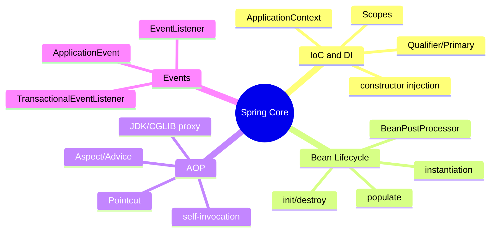
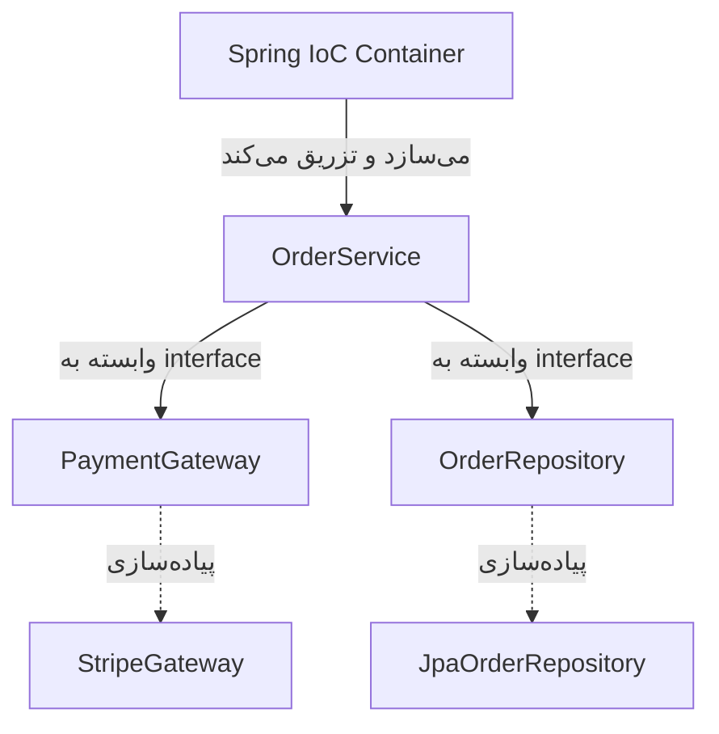
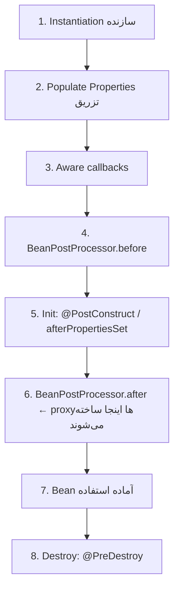
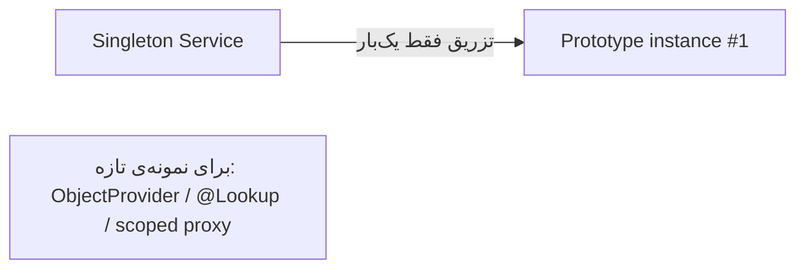
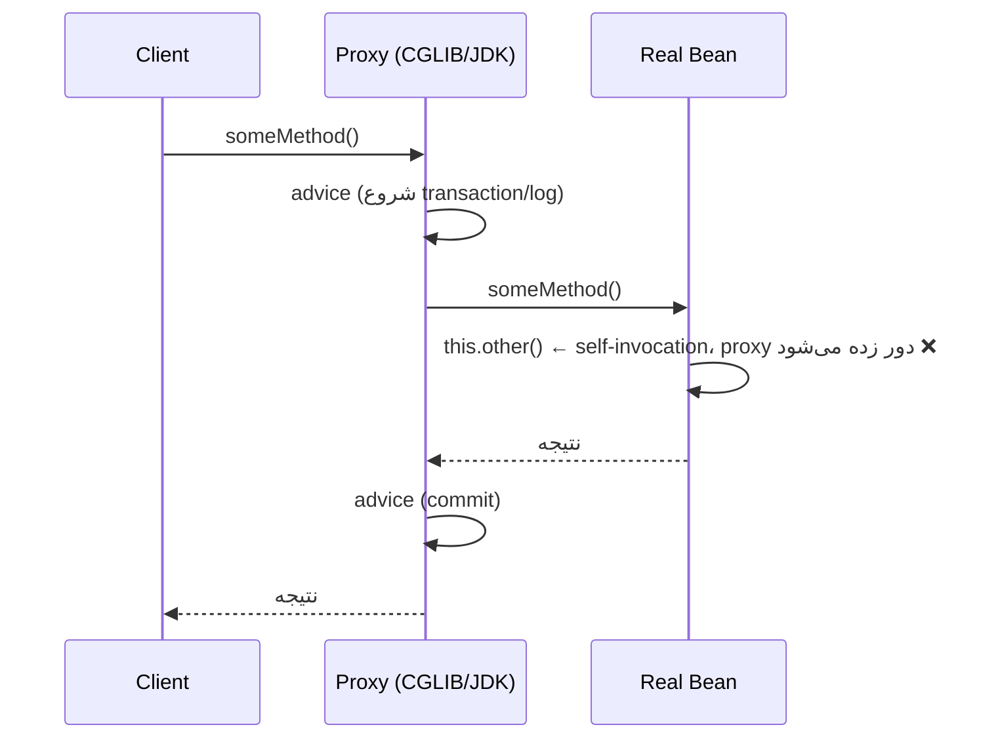
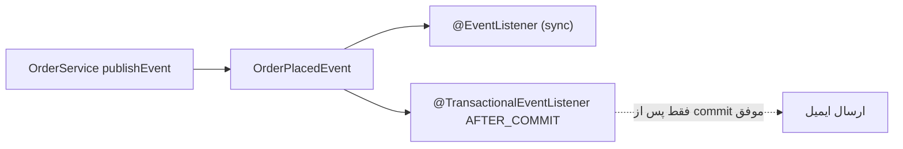

# Spring Core — IoC, DI, AOP, Events

> قلب کل اکوسیستم Spring. هر سوال Spring در نهایت به فهم IoC container و چرخه‌ی حیات bean برمی‌گردد. این فایل با دیاگرام، مثال‌های متعدد و عمق کامل نوشته شده.

## فهرست
- [نقشه‌ی ذهنی](#نقشه‌ی-ذهنی)
- [📖 مفاهیم](#-مفاهیم)
- [🎯 سوالات مصاحبه](#-سوالات-مصاحبه)
- [⚠️ اشتباهات رایج](#️-اشتباهات-رایج)
- [🔗 ارتباط با سایر مفاهیم](#-ارتباط-با-سایر-مفاهیم)

---

## نقشه‌ی ذهنی



---

## 📖 مفاهیم

### IoC & Dependency Injection

**توضیح:**

**Inversion of Control** یعنی به‌جای اینکه کلاس خودش وابستگی‌هایش را بسازد (`new`)، کنترل ساخت و اتصال به یک container سپرده می‌شود. **Dependency Injection** سازوکار عملی IoC است: container وابستگی‌ها را از بیرون تزریق می‌کند. این مستقیماً اصل **Dependency Inversion** (D در SOLID) را پیاده می‌کند.



سه نوع تزریق: constructor (توصیه‌شده)، setter، و field. constructor injection برتر است چون: وابستگی‌ها را `final` و اجباری می‌کند، شیء را کاملاً ساخته‌شده تحویل می‌دهد، تست بدون Spring را ممکن می‌کند، و circular dependency را در زمان راه‌اندازی فاش می‌کند.

`ApplicationContext` نسخه‌ی پیشرفته‌ی `BeanFactory` است: علاوه بر DI، پشتیبانی از event، i18n، AOP، و auto-detection از BeanPostProcessorها.

**چرا مهم است:**

DI تست‌پذیری، انعطاف و کاهش coupling را فراهم می‌کند. کل Spring Boot روی این بنا شده.

**مثال کد ۱ — constructor injection:**

```java
@Service
public class OrderService {
    private final PaymentGateway gateway;
    private final OrderRepository repository;

    // از Spring 4.3 @Autowired روی تک‌سازنده لازم نیست
    public OrderService(PaymentGateway gateway, OrderRepository repository) {
        this.gateway = gateway;       // final → immutable و اجباری
        this.repository = repository;
    }

    public void place(Order order) {
        gateway.charge(order.total());
        repository.save(order);
    }
}
```

**مثال کد ۲ — تست بدون Spring (مزیت constructor injection):**

```java
@Test
void shouldPlaceOrder() {
    PaymentGateway gateway = mock(PaymentGateway.class);
    OrderRepository repo = mock(OrderRepository.class);
    OrderService service = new OrderService(gateway, repo); // بدون Spring context
    service.place(new Order());
    verify(repo).save(any());
}
```

**نکات کلیدی:**

- constructor injection را ترجیح دهید؛ field injection تست را سخت و وابستگی‌ها را پنهان می‌کند.
- ApplicationContext همیشه به‌جای BeanFactory.
- وابستگی‌های `final` تضمین اولیه‌سازی می‌دهند.

---

### Bean Lifecycle

**توضیح:**

چرخه‌ی حیات یک bean:



**BeanPostProcessor** نقطه‌ی توسعه‌ی کلیدی است: AOP، `@Async`، `@Transactional` همگی با wrap کردن bean در proxy در مرحله‌ی `postProcessAfterInitialization` کار می‌کنند. به همین دلیل در `@PostConstruct` هنوز proxy وجود ندارد.

**چرا مهم است:**

درک اینکه proxy کِی ساخته می‌شود، علت مشکل self-invocation را توضیح می‌دهد.

**مثال کد:**

```java
@Component
public class ConnectionManager {
    private Connection connection;

    @PostConstruct
    void init() { connection = openConnection(); } // پس از تزریق

    @PreDestroy
    void cleanup() { connection.close(); } // هنگام shutdown
}
```

**نکات کلیدی:**

- `@PostConstruct` پس از تزریق همه‌ی وابستگی‌ها اجرا می‌شود.
- proxyها در `postProcessAfterInitialization` ساخته می‌شوند → ریشه‌ی مشکل self-invocation.
- `@PreDestroy` برای prototype scope صدا زده نمی‌شود.

---

### Bean Scopes

**توضیح:**

- `singleton` (پیش‌فرض): یک نمونه برای کل container. باید stateless باشد.
- `prototype`: هر بار درخواست، نمونه‌ی جدید. Spring destroy آن را مدیریت نمی‌کند.
- `request`, `session`: مخصوص web.

نکته‌ی کلاسیک: تزریق یک prototype در یک singleton فقط **یک‌بار** نمونه می‌سازد (هنگام ساخت singleton).



**مثال کد:**

```java
@Service
public class ReportService {
    private final ObjectProvider<ReportBuilder> builderProvider; // prototype

    public ReportService(ObjectProvider<ReportBuilder> p) { this.builderProvider = p; }

    public Report build() {
        ReportBuilder builder = builderProvider.getObject(); // نمونه‌ی تازه هر بار
        return builder.build();
    }
}
```

**نکات کلیدی:**

- singleton باید stateless و thread-safe باشد.
- تزریق ساده‌ی prototype در singleton مشکل دارد؛ از `ObjectProvider` استفاده کنید.

---

### Stereotype Annotations & Qualifiers

**توضیح:**

`@Component` پایه است؛ `@Service`, `@Repository`, `@Controller` تخصصی‌سازی معنایی‌اند. `@Repository` علاوه بر معنا، **exception translation** (تبدیل استثناهای JDBC/JPA به `DataAccessException`) را فعال می‌کند.

وقتی چند پیاده‌سازی از یک interface وجود دارد: `@Primary` پیش‌فرض؛ `@Qualifier("name")` انتخاب صریح؛ بدون این‌ها `NoUniqueBeanDefinitionException`.

**مثال کد:**

```java
public interface NotificationSender { void send(String msg); }

@Service @Qualifier("email")
class EmailSender implements NotificationSender { public void send(String m) {} }

@Service @Primary
class SmsSender implements NotificationSender { public void send(String m) {} }

@Service
class AlertService {
    private final NotificationSender sender;
    AlertService(@Qualifier("email") NotificationSender sender) { this.sender = sender; }
}

// تزریق همه‌ی پیاده‌سازی‌ها (Strategy pattern)
@Service
class MultiNotifier {
    private final List<NotificationSender> senders; // Spring همه را تزریق می‌کند
    MultiNotifier(List<NotificationSender> senders) { this.senders = senders; }
}
```

**نکات کلیدی:**

- `@Repository` exception translation می‌دهد.
- برای ابهام از `@Qualifier`/`@Primary` استفاده کنید.
- تزریق `List<Interface>` همه‌ی پیاده‌سازی‌ها را می‌دهد (پایه‌ی Strategy).

---

### Configuration & Profiles

**توضیح:**

`@Configuration` + `@Bean` برای تعریف bean برنامه‌نویسی‌شده (به‌خصوص third-party). `@Value` برای تزریق مقدار. `@Profile` برای محیط‌های مختلف. متدهای `@Bean` در یک `@Configuration` با CGLIB proxy می‌شوند تا فراخوانی bean دیگری همان singleton را برگرداند.

**مثال کد:**

```java
@Configuration
public class AppConfig {
    @Bean
    public RestClient restClient(@Value("${api.base-url}") String baseUrl) {
        return RestClient.builder().baseUrl(baseUrl).build();
    }

    @Bean @Profile("prod")
    public Cache prodCache() { return new RedisCache(); }

    @Bean @Profile("dev")
    public Cache devCache() { return new InMemoryCache(); }
}
```

**نکات کلیدی:**

- `@Bean` برای third-party؛ stereotype برای کد خودتان.
- `@Configuration` با proxy تضمین می‌کند فراخوانی bean همان singleton را برگرداند.

---

### AOP (Aspect-Oriented Programming)

**توضیح:**

AOP منطق عرضی (cross-cutting) مثل logging، transaction، security را از منطق کسب‌وکار جدا می‌کند. مفاهیم: **Aspect**، **Advice** (`@Before`, `@Around`, ...)، **Pointcut**، **JoinPoint**.

Spring AOP مبتنی بر **proxy** است: یا JDK Dynamic Proxy (interface دارد) یا CGLIB (subclassing). دو محدودیت: فقط روی فراخوانی public از بیرون، و **self-invocation** از proxy عبور نمی‌کند.



**چرا مهم است:**

`@Transactional`, `@Cacheable`, `@Async`, Spring Security همه روی AOP بنا شده‌اند.

**مثال کد:**

```java
@Aspect
@Component
public class TimingAspect {
    @Around("@annotation(Timed)") // روی متدهای دارای @Timed
    public Object measure(ProceedingJoinPoint pjp) throws Throwable {
        long start = System.nanoTime();
        try {
            return pjp.proceed(); // اجرای متد اصلی
        } finally {
            long ms = (System.nanoTime() - start) / 1_000_000;
            System.out.println(pjp.getSignature() + " took " + ms + "ms");
        }
    }
}
```

**نکات کلیدی:**

- Spring AOP فقط proxy-based است؛ self-invocation اعمال نمی‌شود.
- JDK proxy برای interface، CGLIB برای class.
- pointcut: `execution(...)`, `within(...)`, `@annotation(...)`.

---

### Events

**توضیح:**

publish/subscribe درون‌برنامه‌ای. `ApplicationEventPublisher.publishEvent()` و `@EventListener`. پیش‌فرض synchronous (همان thread و transaction)؛ با `@Async` غیرهمزمان. `@TransactionalEventListener` رویداد را به فاز transaction گره می‌زند (مثلاً `AFTER_COMMIT`).



**مثال کد:**

```java
public record OrderPlacedEvent(Long orderId) {}

@Service
class OrderService {
    private final ApplicationEventPublisher publisher;
    OrderService(ApplicationEventPublisher publisher) { this.publisher = publisher; }

    @Transactional
    public void place(Order order) {
        // ذخیره...
        publisher.publishEvent(new OrderPlacedEvent(order.getId()));
    }
}

@Component
class EmailNotifier {
    @TransactionalEventListener(phase = TransactionPhase.AFTER_COMMIT)
    void onOrderPlaced(OrderPlacedEvent event) {
        // فقط پس از commit موفق ایمیل بفرست
    }
}
```

**نکات کلیدی:**

- listener پیش‌فرض synchronous است؛ با `@Async` غیرهمزمان کنید.
- `@TransactionalEventListener(AFTER_COMMIT)` از side-effect روی rollback جلوگیری می‌کند.
- برای ارتباط بین سرویس‌ها از message broker استفاده کنید نه event داخلی.

---

## 🎯 سوالات مصاحبه

### سوال ۱: چرا constructor injection بر field injection ترجیح دارد؟

**سطح:** Senior
**تکرار:** خیلی زیاد

**جواب کامل:**

(۱) وابستگی‌ها `final` → immutable و تضمین مقداردهی. (۲) شیء همیشه کامل و معتبر ساخته می‌شود. (۳) تست واحد بدون Spring (`new Service(mock)`)؛ با field injection باید reflection یا context. (۴) وابستگی‌های اجباری در امضای سازنده شفاف‌اند (برخلاف field injection که آن‌ها را پنهان و کلاس را به‌سمت وابستگی زیاد سوق می‌دهد). (۵) circular dependency در زمان راه‌اندازی فاش می‌شود.

**کد توضیحی:**

```java
var service = new OrderService(mock(PaymentGateway.class), mock(OrderRepository.class));
```

**نکته مصاحبه:**

تمایز Senior: immutability، تست‌پذیری، فاش شدن circular dependency.

---

### سوال ۲: مشکل self-invocation در `@Transactional` چیست؟

**سطح:** Senior / Lead
**تکرار:** خیلی زیاد

**جواب کامل:**

`@Transactional` از طریق AOP proxy کار می‌کند. فراخوانی از بیرون از proxy عبور می‌کند و advice اعمال می‌شود. اما فراخوانی متد transactional از **همان کلاس** با `this.method()` مستقیم روی شیء واقعی است و از proxy عبور نمی‌کند — transaction شروع نمی‌شود.

راه‌حل‌ها: (۱) متد را به bean جداگانه منتقل کنید. (۲) self-injection. (۳) `TransactionTemplate`. بهترین معمولاً جداسازی مسئولیت‌هاست.

**کد توضیحی:**

```java
@Service
class OrderService {
    public void process() { save(); } // ❌ self-invocation
    @Transactional public void save() { /* ... */ }
}
```

**نکته مصاحبه:**

Lead به دلیل ریشه‌ای (proxy در BeanPostProcessor) اشاره می‌کند. Follow-up: «چرا متد private هم transactional نمی‌شود؟»

---

### سوال ۳: تفاوت BeanFactory و ApplicationContext؟

**سطح:** Mid / Senior
**تکرار:** متوسط

**جواب کامل:**

`BeanFactory` container پایه با DI و lazy init. `ApplicationContext` superset: eager init پیش‌فرض singletonها (خطاها زود فاش)، event، i18n، resource loading، AOP، و تشخیص خودکار BeanPostProcessor. در عمل همیشه ApplicationContext.

**نکته مصاحبه:**

Follow-up: «BeanFactoryPostProcessor با BeanPostProcessor؟» (اولی روی تعریف، دومی روی نمونه).

---

### سوال ۴: bean lifecycle را شرح بده و proxyها کجا ساخته می‌شوند؟

**سطح:** Senior
**تکرار:** زیاد

**جواب کامل:**

instantiation → تزریق → Aware → postProcessBefore → init (`@PostConstruct`) → postProcessAfter (proxy اینجا) → آماده → destroy. proxyهای AOP در `postProcessAfterInitialization` ساخته می‌شوند؛ یعنی در `@PostConstruct` هنوز proxy نشده — توضیح می‌دهد چرا transaction در `@PostConstruct` بی‌اثر است.

**نکته مصاحبه:**

Senior می‌داند در `@PostConstruct` proxy وجود ندارد.

---

### سوال ۵: تفاوت JDK Dynamic Proxy و CGLIB؟

**سطح:** Senior
**تکرار:** متوسط

**جواب کامل:**

JDK proxy فقط برای interface کار می‌کند. CGLIB با subclassing، بدون نیاز interface اما کلاس/متد نباید `final` باشد. Spring Boot پیش‌فرض CGLIB. به همین دلیل متد/کلاس `final` ممکن proxy نشود و advice اعمال نگردد.

**نکته مصاحبه:**

Follow-up: «چرا متد final در bean transactional کار نمی‌کند؟»

---

### سوال ۶: prototype در singleton چرا یک‌بار ساخته می‌شود؟

**سطح:** Senior
**تکرار:** متوسط

**جواب کامل:**

تزریق فقط یک‌بار هنگام ساخت singleton انجام می‌شود، پس حتی prototype تزریق‌شده همان یک نمونه را نگه می‌دارد. برای نمونه‌ی تازه: `ObjectProvider`, `@Lookup`, یا scoped proxy.

**نکته مصاحبه:**

Follow-up: «scoped proxy چطور حل می‌کند؟»

---

### سوال ۷: `@TransactionalEventListener` چه مشکلی را حل می‌کند؟

**سطح:** Senior
**تکرار:** متوسط

**جواب کامل:**

`@EventListener` معمولی synchronous و در همان transaction اجرا می‌شود. مشکل: اگر یک listener side-effect خارجی (ایمیل، فراخوانی API) داشته باشد و transaction بعداً rollback شود، آن side-effect قابل‌بازگشت نیست. `@TransactionalEventListener(phase = AFTER_COMMIT)` listener را به فاز خاص transaction گره می‌زند، پس فقط پس از commit موفق اجرا می‌شود. فازهای دیگر: BEFORE_COMMIT، AFTER_ROLLBACK، AFTER_COMPLETION.

**نکته مصاحبه:**

Senior به side-effect روی rollback اشاره می‌کند.

---

## ⚠️ اشتباهات رایج

### اشتباه ۱: field injection

```java
// ❌
@Service class OrderService { @Autowired private PaymentGateway gateway; }
```

```java
// ✅
@Service class OrderService {
    private final PaymentGateway gateway;
    OrderService(PaymentGateway gateway) { this.gateway = gateway; }
}
```

**توضیح:** field injection تست را سخت و وابستگی‌ها را پنهان می‌کند.

---

### اشتباه ۲: انتظار transaction از self-invocation

```java
// ❌
public void process() { this.saveInTx(); }
@Transactional public void saveInTx() {}
```

```java
// ✅ متد transactional در bean جدا
public void process() { txService.saveInTx(); }
```

**توضیح:** فراخوانی داخلی از proxy عبور نمی‌کند.

---

### اشتباه ۳: state تغییرپذیر در singleton

```java
// ❌ race condition
@Service class CounterService { private int count; void inc() { count++; } }
```

```java
// ✅
@Service class CounterService {
    private final AtomicInteger count = new AtomicInteger();
    void inc() { count.incrementAndGet(); }
}
```

**توضیح:** singleton بین همه‌ی threadها مشترک است.

---

### اشتباه ۴: event بدون توجه به transaction

```java
// ❌ ایمیل حتی اگر rollback شود
@EventListener void onOrder(OrderPlacedEvent e) { sendEmail(e); }
```

```java
// ✅
@TransactionalEventListener(phase = TransactionPhase.AFTER_COMMIT)
void onOrder(OrderPlacedEvent e) { sendEmail(e); }
```

**توضیح:** listener پیش‌فرض در همان transaction اجرا می‌شود.

---

### اشتباه ۵: متد `@Transactional` با `final`/`private`

```java
// ❌ proxy نمی‌تواند intercept کند
@Transactional private void save() {}
@Transactional public final void update() {}
```

```java
// ✅ public و غیرfinal
@Transactional public void save() {}
```

**توضیح:** CGLIB نمی‌تواند متد final/private را override کند.

---

## 🔗 ارتباط با سایر مفاهیم

- IoC/DI مستقیماً **Dependency Inversion (SOLID 1.1)** را پیاده می‌کند.
- AOP پایه‌ی **`@Transactional` (2.4)**، **`@Cacheable` (9.1)** و **Spring Security (2.5)**.
- Events با **Event-Driven Architecture (6.1)** و الگوی **Outbox**.
- Bean lifecycle با **Spring Boot auto-configuration (2.2)** و **testing (12.5)**.
- proxy/AOP با **Reflection & Dynamic Proxy (12.2)**.
