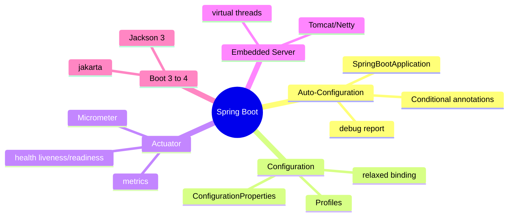
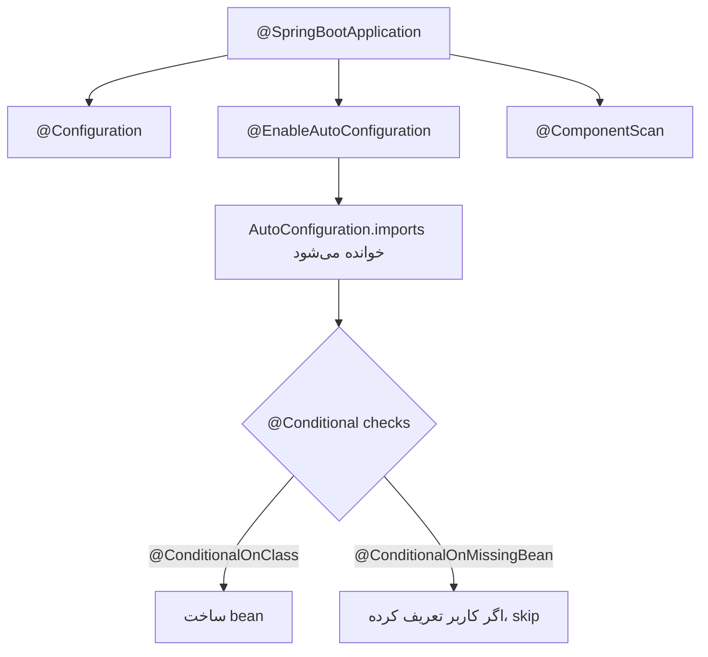
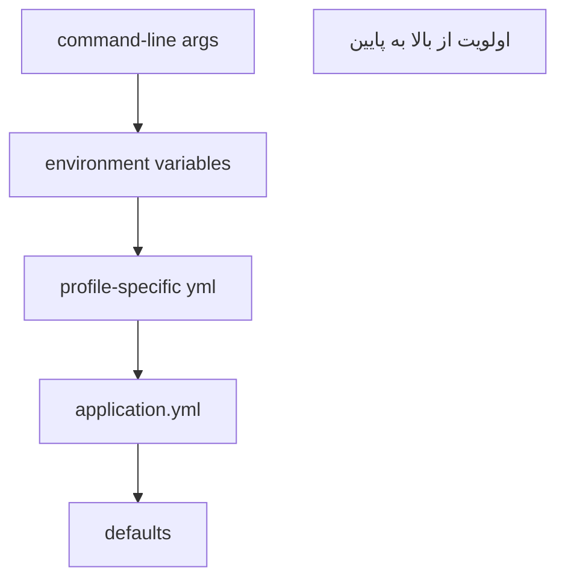
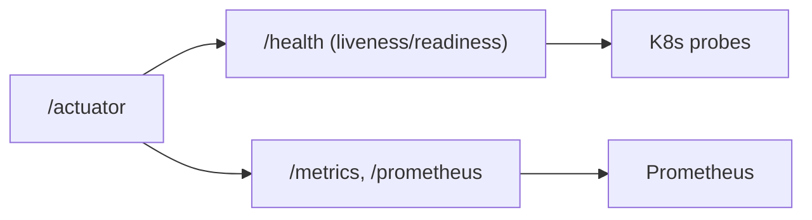

# Spring Boot — Auto-Configuration, Actuator, Boot 4

> Spring Boot سرعت توسعه را با «convention over configuration» متحول کرد. درک auto-configuration تفاوت Senior را نشان می‌دهد. این فایل با دیاگرام و مثال‌های متعدد گسترش یافته.

## فهرست
- [نقشه‌ی ذهنی](#نقشه‌ی-ذهنی)
- [📖 مفاهیم](#-مفاهیم)
- [🎯 سوالات مصاحبه](#-سوالات-مصاحبه)
- [⚠️ اشتباهات رایج](#️-اشتباهات-رایج)
- [🔗 ارتباط با سایر مفاهیم](#-ارتباط-با-سایر-مفاهیم)

---

## نقشه‌ی ذهنی



---

## 📖 مفاهیم

### Auto-Configuration

**توضیح:**

Auto-configuration هسته‌ی جادوی Spring Boot است: بر اساس آنچه در classpath وجود دارد و propertyها، bean‌های مناسب را خودکار می‌سازد. `@SpringBootApplication` ترکیب سه annotation است:



مکانیزم: Spring Boot فایل `META-INF/spring/.../AutoConfiguration.imports` را می‌خواند که لیست کلاس‌های auto-configuration است. هر کدام با `@Conditional`ها کنترل می‌شوند. به همین دلیل می‌توانید هر چیزی را با تعریف bean خودتان override کنید.

**چرا مهم است:**

درک این مکانیزم برای دیباگ «چرا این bean ساخته شد/نشد» و سفارشی‌سازی حیاتی است. با `--debug` گزارش auto-config را می‌بینید.

**مثال کد:**

```java
@AutoConfiguration
@ConditionalOnClass(DataSource.class)         // فقط اگر DataSource در classpath
public class MyDataSourceAutoConfig {
    @Bean
    @ConditionalOnMissingBean                  // فقط اگر کاربر خودش تعریف نکرده
    @ConditionalOnProperty(name = "app.datasource.enabled", havingValue = "true")
    public DataSource dataSource() { return new HikariDataSource(); }
}
```

**نکات کلیدی:**

- `@ConditionalOnMissingBean` مکانیزم اصلی override است.
- `--debug` گزارش کامل شرط‌ها را چاپ می‌کند.
- تعریف کاربر بر auto-config اولویت دارد.

---

### Configuration Management

**توضیح:**

`application.yml`/`.properties` برای تنظیمات. `@ConfigurationProperties` راه type-safe و گروه‌بندی‌شده برای bind کردن propertyها (به‌جای `@Value` پراکنده). Profileها با `spring.profiles.active`.



**مثال کد:**

```java
@ConfigurationProperties(prefix = "app.payment")
@Validated
public record PaymentProperties(
    @NotBlank String apiKey,
    @Positive int timeoutSeconds,
    String currency) {}

// application.yml:
// app:
//   payment:
//     api-key: ${PAYMENT_API_KEY}   # از environment
//     timeout-seconds: 30
```

**نکات کلیدی:**

- `@ConfigurationProperties` بر `@Value` ارجح است.
- اسرار را از environment بگیرید نه hardcode.
- relaxed binding: `api-key`, `apiKey`, `API_KEY` همه map می‌شوند.

---

### Actuator

**توضیح:**

Actuator endpointهای آماده برای مانیتورینگ production می‌دهد: `/health`, `/metrics`, `/info`, `/env`, `/beans`, `/prometheus`. می‌توان custom health indicator ساخت.



**مثال کد:**

```java
@Component
public class PaymentGatewayHealthIndicator implements HealthIndicator {
    private final PaymentGateway gateway;
    public PaymentGatewayHealthIndicator(PaymentGateway g) { this.gateway = g; }

    @Override
    public Health health() {
        return gateway.isReachable()
            ? Health.up().withDetail("latencyMs", gateway.ping()).build()
            : Health.down().withDetail("error", "unreachable").build();
    }
}
```

**نکات کلیدی:**

- در production فقط endpointهای لازم را expose کنید.
- health با liveness/readiness groups به K8s probeها وصل می‌شود.
- Micrometer facade است؛ به Prometheus/Datadog متصل می‌شود.

---

### Embedded Server & Boot 4 Migration

**توضیح:**

Spring Boot سرور را embed می‌کند (Tomcat پیش‌فرض، Netty برای WebFlux). jar خوداتکا با `java -jar`. با Java 21، `spring.threads.virtual.enabled=true`.

**Boot 3→4 Migration:** `javax.*` → `jakarta.*` (بزرگ‌ترین تغییر)، Java 17 minimum، GraalVM Native بهبود، Jackson 3، API Versioning داخلی، JSpecify null safety.

**مثال کد:**

```yaml
server:
  port: 8080
  tomcat:
    threads: { max: 200, min-spare: 10 }
spring:
  threads:
    virtual:
      enabled: true   # Java 21+
```

**نکات کلیدی:**

- jar خوداتکا → مناسب کانتینر.
- بزرگ‌ترین تغییر Boot 4: `javax` → `jakarta`.

---

## 🎯 سوالات مصاحبه

### سوال ۱: `@SpringBootApplication` دقیقاً چه می‌کند؟

**سطح:** Mid / Senior
**تکرار:** خیلی زیاد

**جواب کامل:**

ترکیب سه annotation: `@Configuration` (منبع bean)، `@EnableAutoConfiguration` (auto-config بر اساس classpath)، `@ComponentScan` (اسکن پکیج کلاس اصلی و زیرپکیج‌ها). به همین دلیل قرار دادن کلاس اصلی در پکیج ریشه مهم است.

**نکته مصاحبه:**

Senior به اهمیت محل کلاس اصلی اشاره می‌کند. Follow-up: «component خارج پکیج اصلی؟» (`basePackages`).

---

### سوال ۲: auto-configuration چطور کار می‌کند و چطور override می‌کنی؟

**سطح:** Senior
**تکرار:** زیاد

**جواب کامل:**

`@EnableAutoConfiguration` فایل `AutoConfiguration.imports` را می‌خواند. هر کلاس با `@Conditional`ها کنترل می‌شود. به‌خاطر `@ConditionalOnMissingBean`، تعریف bean خودتان نسخه‌ی خودکار را غیرفعال می‌کند (مکانیزم اصلی override). برای حذف: `spring.autoconfigure.exclude` یا `exclude` در `@SpringBootApplication`. با `--debug` گزارش conditions.

**نکته مصاحبه:**

تمایز Senior: `@ConditionalOnMissingBean` و `--debug`.

---

### سوال ۳: `@ConfigurationProperties` در برابر `@Value`؟

**سطح:** Senior
**تکرار:** متوسط

**جواب کامل:**

`@Value` برای یک مقدار ساده. `@ConfigurationProperties` type-safe، گروهی، با validation، relaxed binding، nested، قابل تست. best practice: `@ConfigurationProperties` با record immutable.

**نکته مصاحبه:**

Follow-up: «relaxed binding چیست؟»

---

### سوال ۴: health check در K8s چطور به Actuator وصل می‌شود؟

**سطح:** Senior / Lead
**تکرار:** متوسط

**جواب کامل:**

Actuator liveness/readiness groups دارد: `/health/liveness` (زنده است؟ اگر نه restart) و `/health/readiness` (آماده‌ی ترافیک؟ اگر نه ترافیک نفرست). به livenessProbe/readinessProbe map می‌شوند. تمایز مهم: liveness نباید به DB وابسته باشد وگرنه قطع DB → restart بی‌مورد؛ readiness می‌تواند وابستگی‌ها را چک کند.

**نکته مصاحبه:**

Lead به خطر وابسته کردن liveness به DB اشاره می‌کند.

---

### سوال ۵: بزرگ‌ترین چالش مهاجرت Boot 2 به 3/4؟

**سطح:** Senior / Lead
**تکرار:** متوسط

**جواب کامل:**

`javax.*` → `jakarta.*` که تقریباً همه‌ی importهای persistence/servlet/validation را تحت تأثیر می‌گذارد و کتابخانه‌های third-party باید نسخه‌ی سازگار داشته باشند. به‌علاوه Java 17 minimum، تغییرات Spring Security، و Jackson 3 در Boot 4. ابزار OpenRewrite برای خودکارسازی.

**نکته مصاحبه:**

Lead به OpenRewrite و مهاجرت تدریجی اشاره می‌کند.

---

## ⚠️ اشتباهات رایج

### اشتباه ۱: expose همه‌ی Actuator endpointها

```yaml
# ❌
management.endpoints.web.exposure.include: "*"
```

```yaml
# ✅
management.endpoints.web.exposure.include: health,info,prometheus
```

**توضیح:** `/env`، `/beans`، `/heapdump` اطلاعات حساس فاش می‌کنند.

---

### اشتباه ۲: hardcode اسرار

```yaml
# ❌
spring.datasource.password: myProdPassword123
```

```yaml
# ✅
spring.datasource.password: ${DB_PASSWORD}
```

**توضیح:** اسرار از environment/Vault.

---

### اشتباه ۳: کلاس اصلی در پکیج عمیق

```java
// ❌ component scan هم‌سطح را نمی‌بیند
package com.example.app.boot;
```

```java
// ✅
package com.example.app;
```

**توضیح:** component scan از پکیج کلاس اصلی شروع می‌شود.

---

### اشتباه ۴: liveness وابسته به DB

```text
❌ قطع DB → restart بی‌مورد pod
✅ DB را در readiness چک کنید نه liveness
```

**توضیح:** liveness باید فقط زنده بودن process را بسنجد.

---

## 🔗 ارتباط با سایر مفاهیم

- Auto-configuration روی **Spring Core (2.1)** (conditional beans).
- Actuator با **Monitoring (10.4)** و **Kubernetes probes (10.2)**.
- Configuration با **12-Factor (15.3)** و **Vault (16.5)**.
- virtual threads با **MVC vs WebFlux (2.3)**.
- Boot 4 با **Java 17+ (1.4)** و **Native Image (GraalVM)**.
